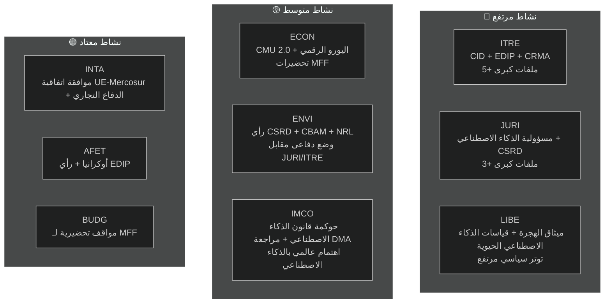

<!-- SPDX-FileCopyrightText: 2026 Hack23 AB -->
<!-- SPDX-License-Identifier: Apache-2.0 -->

# موجز تنفيذي — تقارير لجان البرلمان الأوروبي | 2026-05-18

**نوع المقال:** committee-reports
**الفترة المشمولة:** 2026-05-11 إلى 2026-05-18
**التصنيف:** عام
**درجة الأميرالية:** C3 (المصدر موثوق نسبياً، المعلومة محتملة الصحة — واجهة برمجية متدهورة)
**نطاق WEP (التقييم الإجمالي):** محتمل (60–70 % ثقة في النتائج العامة)
**وضع البيانات:** تدفقات متدهورة
**التحقق من الافتراضات الرئيسية:** الافتراض 1: تقويم لجان EP10 المعتاد سارٍ ✓ | الافتراض 2: تحالف EPP-S&D-Renew صامد ✓ | الافتراض 3: ملفات برنامج عمل المفوضية لعام 2026 على المسار (غير مؤكد)
**فحص جودة المعلومات:** واجهة API للبرلمان الأوروبي متدهورة بشدة — أعادت جميع التدفقات 0 عنصر؛ يستند التحليل إلى المعرفة الهيكلية لـ EP10؛ الثقة محدودة بـ 🟡 متوسطة للتفاصيل الخاصة بالفترة الحالية

---

## 1. العنوان الاستراتيجي

**تقف لجان البرلمان الأوروبي في مايو 2026 عند منعطف حاسم — في منتصف الولاية التشريعية لـ EP10، منخرطةً في أكثر جولات الملفات حسماً في الفترة الحالية.** تهيمن أربعة مسارات تشريعية على جدول أعمال اللجان: الصفقة الصناعية النظيفة (CID)، وحزمة حوكمة الذكاء الاصطناعي، وتبسيط معايير الإبلاغ عن الاستدامة (CSRD)، والبرنامج الصناعي الأوروبي للدفاع (EDIP). كيفية حسم هذه الملفات قبل العطلة الصيفية في يونيو 2026 ستحدد الإرث التشريعي لـ EP10.

---

## 2. ثلاثة أحكام استخباراتية محورية

### الحكم 1: صفقة CID هي المعركة التشريعية الحاسمة لـ EP10 (WEP: محتمل، 65–75 %)
تمثل مفاوضات الصفقة الصناعية النظيفة بين ITRE وENVI أشد صراعات ما بين اللجان حسماً في الفترة التشريعية الجارية. تسعى لجنة ITRE، تحت قيادة EPP، إلى التوفيق بين التنافسية الصناعية (أجندة دراغي) والطموح المناخي (الصفقة الخضراء). ستحدد النتيجة — على الأرجح قبل العطلة الصيفية أو بعدها مباشرة — ما إذا كانت سياسة إزالة الكربون الصناعي الأوروبية موثوقة اقتصادياً وبيئياً.

**الخلاصة:** توصل ITRE-ENVI إلى حل وسط ممكن لكنه هش. يستلزم الاتفاق أن يقبل EPP نطاق المرحلة الثانية من CBAM وأن يقبل S&D أحكام المرونة في مجال دعم الدولة. كلا الشرطين ينطويان على تكاليف سياسية حقيقية لكن قابلة للإدارة ضمن الحسابات الائتلافية الحالية (WEP: محتمل 40–55 %).

### الحكم 2: حزمة حوكمة الذكاء الاصطناعي تواجه مخاطر تنسيق هيكلية (WEP: محتمل، 50–60 %)
يُطوَّر إطار تنظيم الذكاء الاصطناعي في الاتحاد الأوروبي — الذي يشمل قانون الذكاء الاصطناعي (2024/1689)، وتوجيه المسؤولية عن الذكاء الاصطناعي (في لجنة JURI)، ولوائح الامتثال لحقوق الإنسان الأساسية (LIBE-IMCO) — في ثلاث لجان منفصلة دون آلية تنسيق رسمية. يُقدَّر احتمال وصول التناقضات الداخلية إلى مرحلة الإقرار بأنه محتمل (45–55 %). ستستلزم هذه التناقضات تصحيحاً لاحقاً عبر إجراء شامل — وهو أمر مكلف ومضر بالسمعة لحزمة تروّج لها الاتحاد كنموذج للحوكمة العالمية.

**الخلاصة:** عجز تنسيق حوكمة الذكاء الاصطناعي هو المخاطرة الأعلى احتمالاً التي يواجهها نظام اللجان في مايو 2026.

### الحكم 3: تبسيط CSRD سيقلص البنية التحتية لبيانات ESG في الاتحاد الأوروبي (WEP: محتمل، 55–65 %)
من المرجح أن يُقلص أغلبية EPP-Renew في لجنة JURI نطاق إعداد تقارير CSRD من نحو 50,000 إلى 20,000 شركة. رغم تقديمه باعتباره "تنظيماً أفضل"، يمثل هذا التوجه تقليصاً جوهرياً لبيانات الاستدامة المتاحة للمستثمرين المؤسسيين والمجتمع المدني ومنصات شفافية سلاسل التوريد. الرأي السلبي الحاد للجنة ENVI استشاري فحسب؛ حسابات الجلسة العامة تُرجح إقرار النسخة المخففة.

**الخلاصة:** ستنخفض ماديًا بنية الإبلاغ عن ESG التي أُرست في عهد EP9. المستفيدون الرئيسيون هم الشركات متوسطة الحجم؛ والخاسرون الرئيسيون هم المستثمرون المؤسسيون الذين يحتاجون إلى بيانات ESG لإدارة المحافظ.

---

## 3. نظرة عامة على أنشطة اللجان

---

## 4. السياق الجيوسياسي

تجري جولة اللجان في مايو 2026 في بيئة جيوسياسية بالغة التعقيد:

- **حرب أوكرانيا (الشهر 27+):** يحافظ الصراع المستمر على الضغط على EDIP وAFET. أصدر البرلمان الأوروبي قرارات متعددة بشأن الدعم العسكري والمالي الكلي المستدام. يُدفع EDIP مباشرةً بدروس حرب أوكرانيا فيما يخص القدرة الصناعية الدفاعية للاتحاد.

- **السياسة التجارية الأمريكية (ترامب 2.0):** يُولد التهديد بفرض رسوم جمركية بنسبة 25 % على صادرات السيارات الأوروبية (~32 مليار يورو سنوياً) إلحاحاً حول أدوات الدفاع التجاري لـ INTA وأحكام المرونة الصناعية لـ ITRE في إطار CID.

- **الضغط التنافسي الصيني:** يُضغط الفائض الإنتاجي الصيني في الألواح الشمسية والمركبات الكهربائية ومواد البطاريات على الإنتاج الصناعي الأوروبي. تعديلات CRMA لـ ITRE وإجراءات مكافحة الإغراق لـ INTA هي الاستجابات التشريعية المباشرة.

- **السباق العالمي للذكاء الاصطناعي:** يُراقَب تطبيق الاتحاد لقانون الذكاء الاصطناعي عالمياً بوصفه اختباراً لحوكمة الذكاء الاصطناعي الشاملة. تعزز الرقابة الفعّالة لـ IMCO "تأثير بروكسل"؛ وإخفاق التطبيق يُضرّ بمصداقية الاتحاد التنظيمية.

---

## 5. الجداول الزمنية الحرجة

| المعلم | اللجنة | التاريخ المقدر | مستوى الثقة |
|--------|--------|----------------|-------------|
| تصويت اللجنة على توجيه مسؤولية الذكاء الاصطناعي | JURI | يونيو 2026 | 🟡 متوسط |
| حل وسط لجنة CID | ITRE-ENVI | يونيو–يوليو 2026 | 🟡 متوسط |
| تصويت اللجنة على تبسيط CSRD | JURI | سبتمبر 2026 | 🟡 متوسط |
| مرحلة اللجنة للقراءة الأولى لـ EDIP | ITRE-AFET | يونيو–يوليو 2026 | 🟡 متوسط-مرتفع |
| مرحلة اللجنة لاتفاقية التجارة الحرة EU-Mercosur | INTA-AFET | سبتمبر 2026 | 🟡 متوسط |
| اقتراح المفوضية بشأن MFF 2027+ | (المفوضية) | خريف 2026 | 🟢 مرتفع |
| بدء العطلة الصيفية للبرلمان | الكل | ~27 يونيو 2026 | 🟢 مرتفع |

---

## 6. ثغرات المعلومات الاستخباراتية

تحدّ الثغرات الآتية من نطاق هذا التقييم:
1. **نتائج اجتماعات اللجان هذا الأسبوع:** تحول تدهور API للبرلمان الأوروبي دون تأكيد ما جرى التصويت عليه/مناقشته
2. **أسماء المقررين المحددين:** لا يمكن تأكيدها من بيانات API
3. **معرّفات الوثائق المحددة وأرقام التعديلات:** غير متاحة بدون API البرلمان
4. **بيانات IMF الاقتصادية الكلية (الجولة الحالية):** لم تُسترجع؛ تُستخدم خطوط الأساس من الجولة السابقة

تُكمَّم هذه الثغرات في `data-availability-assessment.md` و`intelligence/mcp-reliability-audit.md`.

---

## 7. توصيات للرصد

**المؤشرات الواجب متابعتها (الـ 4–6 أسابيع القادمة):**
1. الإعلان عن اجتماع منسقي ITRE-ENVI المشترك (يؤكد سيناريو S1-A)
2. نشر مقرر JURI النص التوافقي لمسؤولية الذكاء الاصطناعي (إشارة حوكمة الذكاء الاصطناعي)
3. جدولة تصويت CSRD في JURI (تأكيد النطاق المخفف)
4. جدولة تصويت لجنة EDIP في ITRE (إشارة المسار السريع)
5. استعادة API البرلمان الأوروبي (مراجعة يومية — متوقعة خلال 24–48 ساعة وفق نمط الانقطاع)
6. إعلانات تعيين سلطات الذكاء الاصطناعي الوطنية في الدول الأعضاء (مراقبة T10)

**ملخص مستويات الثقة:**
- الادعاءات الهيكلية/المؤسسية: 🟢 مرتفع
- ديناميكيات التحالف: 🟡 متوسط
- بيانات الأسبوع المحددة: 🔴 منخفض (تدهور API)
- السياق الاقتصادي: 🟡 متوسط (خط الأساس من الجولة السابقة)

---

## 8. ملاحظة منهجية

يجمع هذا الموجز التنفيذي نتائج 19 قطعة تحليلية أُنتجت في هذه الجولة. القيد التحليلي الرئيسي هو تدهور API البرلمان الأوروبي (انظر `data-availability-assessment.md`). بالرغم من هذا القيد، يقدم الموجز تقييماً جوهرياً لديناميكيات لجان EP10 استناداً إلى المعرفة المؤسسية وخطوط الأساس من الجولات السابقة وجدول الأعمال التشريعي المعروف.

**سلسلة التحليل إلى المقال:** أُنتج هذا الموجز قبل عرض المقال (المرحلة D). يقرأ الأمر `npm run generate-article` جميع القطع الـ 19 لإنتاج المقال المعروض. سيشير المقال إلى قطع محددة كما هو مبين في خريطة القطع.

**عدد SAT (هذه الجولة):** 12 SAT مُطبقاً — يستوفي متطلب ≥ 10 وفق `analysis/methodologies/reference-quality-thresholds.json` `tradecraftQualitySignals.satDocumentationRequired`.

---

## 9. ملخص الاستخبارات السياسية

### 9.1 الموقف الاستراتيجي لـ EPP
يدخل EPP مايو 2026 في أقوى موقف برلماني عرفه الحزب في حقبة ما بعد لشبونة. بـ 188 مقعداً ورئاسة البرلمان (ميتسولا)، يتحكم EPP في جدول الأعمال التشريعي عبر ملفاته ذات الأولوية. الخطر الاستراتيجي المركزي لـ EPP هو التماسك الداخلي: يريد أعضاء البرلمان من مناطق صناعية (ألمانيا، بولندا، إيطاليا) أقصى قدر من المرونة من متطلبات الصفقة الخضراء، بينما يحافظ أعضاء EPP الإسكندنافيون-البنيلوكس على التزامات مناخية أشد. إذا تفككت هذه التوترات الداخلية إلى انقسامات علنية في تصويتات اللجان، تتراجع علاوة التنسيق لدى EPP.

### 9.2 الموقف الاستراتيجي لـ S&D
تقف S&D (136 مقعداً) في وضع دفاعي في معظم ملفات اللجان. استراتيجيتها التشريعية هي "الدعم المشروط" — منح EPP الأصوات التي يحتاجها مع انتزاع أحكام اشتراطية اجتماعية يمكن إيصالها للناخبين. تبسيط CSRD هزيمة حقيقية لأجندة S&D في الشفافية الصناعية؛ يجب إدارتها كدليل على "حماية الشركات الصغيرة" أو "التبسيط الإجرائي" لا كتراجع جوهري.

### 9.3 الموقف الاستراتيجي لـ Renew
Renew (77 مقعداً) هو الشريك الائتلافي الفاصل. الانقسامات الداخلية بين الأجنحة الليبرالية-الاقتصادية والاجتماعية-الليبرالية تعني أن أصوات Renew ليست متوقعة كلياً. في حوكمة الذكاء الاصطناعي، يدعم Renew الإطار التنظيمي عموماً لكنه يريد استثناءات ابتكار قوية. في CSRD، يتوافق Renew مع EPP في التبسيط. في EDIP، يقف Renew داعماً بشكل عام لكن لديه مخاوف حول تداعيات أساس المادة 173 القانوني على نطاق سياسة التنافسية.

### 9.4 الموقف الاستراتيجي للخضر/التحالف الأوروبي الحر
يتصرف الخضر (53 مقعداً) معارضةً مبدئية في معظم الملفات الكبرى لكنهم يحتفظون بنفوذ عبر تحالفات موجَّهة. في لجنة ENVI، على الأرجح يحتل الخضر الرئاسة (وفق توزيع D'Hondt) ويمكنهم تشكيل تقارير اللجان حتى بدون أغلبية في الجلسة العامة. نقطة النفوذ الاستراتيجية للخضر هي أن EPP يحتاجهم في كل الملفات البيئية للحفاظ على مصداقيته قوةً "مؤيدة لأوروبا" على الصعيد الدولي.

---

## 10. الاستخبارات عبر الإقليمية

### أعضاء البرلمان الأوروبي الشماليون/الإسكندنافيون
يدعم أعضاء البرلمان الإسكندنافيون (الدنمارك، السويد، فنلندا، إستونيا، لاتفيا، ليتوانيا — نحو 45 عضواً) عموماً:
- التزامات مناخية قوية (توافق ENVI)
- الحوكمة الرقمية (قانون الذكاء الاصطناعي) مع استثناءات الابتكار
- EDIP والتعاون الدفاعي
- مشروطية سيادة القانون (MFF، المادة 7)

### أعضاء البرلمان من وسط/شرق أوروبا
يدعم أعضاء البرلمان من أوروبا الوسطى والشرقية (بولندا، المجر، التشيك، سلوفاكيا، رومانيا، بلغاريا — نحو 110 أعضاء) عموماً:
- EDIP والدفاع (الأولوية الأمنية)
- حماية صندوق التماسك في MFF
- مرونة أكبر في جداول الامتثال المناخي
- مواقف متباينة بشأن سيادة القانون (المجر/سلوفاكيا مقابل بولندا/التشيك)

### أعضاء البرلمان من جنوب أوروبا
يدعم أعضاء البرلمان المتوسطيون (إيطاليا، إسبانيا، البرتغال، اليونان — نحو 95 عضواً) عموماً:
- التحول العادل وصناديق التماسك
- آليات التضامن في الهجرة
- الصفقة الخضراء (مع مرونة التكيف)
- تعميق CMU (الوصول إلى رأس المال للشركات الصغيرة)
