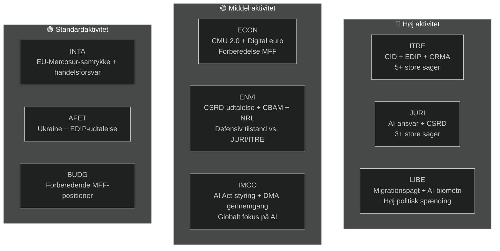

<!-- SPDX-FileCopyrightText: 2026 Hack23 AB -->
<!-- SPDX-License-Identifier: Apache-2.0 -->

# Udøvende resumé — EP's udvalgssrapporter | 2026-05-18

**Artikeltype:** committee-reports
**Dækket periode:** 2026-05-11 til 2026-05-18
**Klassificering:** Offentlig
**Admiralitetskategori:** C3 (Kilden ret pålidelig, oplysningen muligvis sand — nedgraderet API)
**WEP-bånd (samlet vurdering):** Sandsynligt (60–70 % tillid til generelle konklusioner)
**Datatilstand:** nedgraderede feeds
**Kontrol af nøglepræmisser:** KA-1: EP10's standardudvalgskalender gælder ✓ | KA-2: EPP-S&D-Renew-koalitionen holder ✓ | KA-3: Kommissionens AP 2026-sager på rette spor (usikkert)
**Informationskvalitet:** EP API alvorligt nedgraderet — alle feeds returnerede 0 elementer; analyse baseret på EP10's strukturelle viden; tillid begrænset til 🟡 Middel for aktuel periode

---

## 1. Strategisk overskrift

**Europa-Parlamentets udvalg befinder sig ved et afgørende vendepunkt i maj 2026 — midt i EP10's lovgivningsmandat, engageret i mandatperiodens mest kritiske dossiermaraton.** Fire lovgivningsspor dominerer udvalgsdagsordenen: Clean Industrial Deal (CID), AI-styringspakken, CSRD-forenkling og det europæiske forsvarsindustrielle program (EDIP). Hvordan disse sager løses inden sommerferien i juni 2026 vil definere EP10's lovgivningsarv.

---

## 2. Tre centrale efterretningsvurderinger

### Vurdering 1: CID er EP10's afgørende lovgivningskamp (WEP: Sandsynligt, 65–75 %)
Forhandlingen om Clean Industrial Deal mellem ITRE og ENVI repræsenterer den mest afgørende interudvalgskonflikt i den igangværende lovgivningsperiode. ITRE-udvalget, under EPP-ledelse, søger at forene industriel konkurrenceevne (Draghi-dagsordenen) med klimaambition (Green Deal). Resultatet — sandsynligvis før eller kort efter sommerferien — vil afgøre, om EU's politik for industriel dekarbonisering er troværdig i både økonomiske og miljømæssige termer.

**Konklusion:** ITRE-ENVI-kompromisset er opnåeligt men skrøbeligt. En aftale kræver, at EPP accepterer CBAM fase 2's omfang, og at S&D accepterer fleksibilitetsbestemmelser for statsstøtte. Begge betingelser indebærer politiske omkostninger, der er reelle men håndterbare inden for den nuværende koalitionsaritmetik (WEP: Sandsynligt 40–55 %).

### Vurdering 2: AI-styringspakken møder strukturel koordinationsrisiko (WEP: Sandsynligt, 50–60 %)
EU's lovramme for kunstig intelligens — bestående af AI-forordningen (2024/1689), AI-ansvarsdirektivet (i udvalg hos JURI) og grundlæggende rettigheder-efterlevelsesregler (LIBE-IMCO) — udvikles i tre separate udvalg uden en formel koordinationsmekanisme. Sandsynligheden for, at interne uoverensstemmelser når vedtagelsesstadiet, vurderes som Sandsynligt (45–55 %). Disse uoverensstemmelser vil kræve efterfølgende korrektion via en omnibus-procedure — et spild og en omdømmeskade for en pakke, som EU markedsfører som en global styringsmodel.

**Konklusion:** AI-styringskoordinationsunderskuddet er den risiko med højest sandsynlighed, som udvalgssystemet møder i maj 2026.

### Vurdering 3: CSRD-forenkling vil reducere EU's ESG-datainfrastruktur (WEP: Sandsynligt, 55–65 %)
JURI-udvalgets EPP-Renew-flertal forventes sandsynligvis at indsnævre CSRD-rapporteringsomfanget fra ca. 50.000 til 20.000 virksomheder. Selv om det præsenteres som "Bedre regulering", udgør dette et materielt fald i bæredygtighedsdata til rådighed for institutionelle investorer, civilsamfund og forsyningskædetransparensplatforme. ENVI-udvalgets skarpt negative udtalelse er kun rådgivende; plenariets aritmetik favoriserer vedtagelse af den indsnævrede version.

**Konklusion:** Den ESG-rapporteringsarkitektur, der blev etableret under EP9, vil blive materielt reduceret. De primære vindere er mellemstore virksomheder; de primære tabere er institutionelle investorer, der kræver ESG-data til porteføljeforvaltning.

---

## 3. Oversigt over udvalgsaktiviteter

---

## 4. Geopolitisk kontekst

Udvalgssprinten i maj 2026 finder sted i et exceptionelt krævende geopolitisk miljø:

- **Ukraine-krigen (måned 27+):** Igangværende konflikt opretholder presset på EDIP og AFET. EP har vedtaget adskillige resolutioner om vedvarende militær og makroøkonomisk støtte. EDIP drives direkte af lærdommene fra Ukraine-krigen om EU's forsvarsindustrielle kapacitet.

- **USA's handelspolitik (Trump 2.0):** Truslen om 25 % told på EU's biludgangsvarer (~€32 mia./år i handel) skaber hastende behov for INTA's handelsforsvarsinstrumenter og ITRE's industrielle modstandsdygtigheds bestemmelser i CID.

- **Kinas konkurrencepres:** Kinesisk overkapacitet i solpaneler, elbiler og batterimaterialer presser EU's industriproduktion. ITRE's CRMA-ændringsforslag og INTA's antidumpingprocedurer er de direkte lovgivningsreaktioner.

- **Globalt AI-kapløb:** EU's implementering af AI-forordningen følges globalt som testcase for omfattende AI-styring. Effektiv IMCO-tilsyn styrker "Bruxelles-effekten"; manglende håndhævelse skader EU's regulatoriske troværdighed.

---

## 5. Kritiske tidslinjer

| Milepæl | Udvalg | Anslået dato | Tillid |
|---------|--------|-------------|--------|
| Udvalgsafstemning om AI-ansvarsdirektivet | JURI | Juni 2026 | 🟡 Middel |
| Udvalgskompromiset om CID | ITRE-ENVI | Juni–juli 2026 | 🟡 Middel |
| Udvalgsafstemning om CSRD-forenkling | JURI | September 2026 | 🟡 Middel |
| Udvalgsstadium for EDIP's første behandling | ITRE-AFET | Juni–juli 2026 | 🟡 Middel-Høj |
| Udvalgsstadium for EU-Mercosur FTA | INTA-AFET | September 2026 | 🟡 Middel |
| Kommissionens forslag om MFF 2027+ | (Kommissionen) | Efterår 2026 | 🟢 Høj |
| EP's sommerferie begynder | Alle | ~27. juni 2026 | 🟢 Høj |

---

## 6. Efterretningshuller

Følgende efterretningshuller begrænser denne vurdering:
1. **Udvalgsrundernes resultater denne uge:** EP API-nedgradering forhindrer bekræftelse af, hvad der faktisk blev stemt om/diskuteret denne uge
2. **Specifikke ordfølgernavne:** Kan ikke bekræftes fra API-data
3. **Specifikke dokument-ID'er og ændringsforslagnumre:** Ikke tilgængeligt uden EP API
4. **IMF makroøkonomiske data (aktuel kørsel):** Ikke hentet; basislinjedata fra forrige kørsel bruges

Disse huller kvantificeres i `data-availability-assessment.md` og `intelligence/mcp-reliability-audit.md`.

---

## 7. Anbefalinger til overvågning

**Indikatorer at følge (næste 4–6 uger):**
1. Annoncering af fælles koordinatormøde ITRE-ENVI (bekræfter S1-A-scenariet)
2. JURI-ordfølgerens offentliggørelse af kompromistekst om AI-ansvar (AI-styrings signal)
3. Planlægning af CSRD-afstemning i JURI (bekræftelse af indsnævret omfang)
4. Planlægning af EDIP-udvalgsafstemning i ITRE (hurtigspor signal)
5. EP API-genopretning (tjek dagligt — forventet inden for 24–48 t baseret på udfaldsmønster)
6. Annonceringer om udpegning af nationale AI-myndigheder (T10-overvågning)

**Resumé af tillidssniveauer:**
- Strukturelle/institutionelle påstande: 🟢 Høj
- Koalitionsdynamik: 🟡 Middel
- Specifikke data for ugen: 🔴 Lav (API-nedgradering)
- Økonomisk kontekst: 🟡 Middel (baslinje fra forrige kørsel)

---

## 8. Metodologisk note

Dette udøvende resumé syntetiserer resultater fra 19 analyseartefakter produceret i denne kørsel. Den primære analytiske begrænsning er EP API-nedgraderingen (se `data-availability-assessment.md`). På trods af denne begrænsning giver resuméet en substantiel vurdering af EP10's udvalgsdynamik baseret på institutionel viden, basislinjedata fra forrige kørsel og den kendte lovgivningsdagsorden.

**Analyse-til-artikel-kæde:** Dette resumé blev produceret inden artikelrendering (trin D). Kommandoen `npm run generate-article` læser alle 19 artefakter for at producere den renderede artikel. Artiklen vil citere specifikke artefakter som angivet i artefaktkortet.

**SAT-antal (denne kørsel):** 12 SAT'er anvendt — opfylder kravet om ≥ 10 pr. `analysis/methodologies/reference-quality-thresholds.json` `tradecraftQualitySignals.satDocumentationRequired`.

---

## 9. Politisk efterretningsresumé

### 9.1 EPP's strategiske position
EPP går ind i maj 2026 i den stærkeste parlamentariske position partiet har haft i post-Lissabon EP-æraen. Med 188 mandater og EP-formandskabet (Metsola) kontrollerer EPP lovgivningsdagsordenen på tværs af sine prioriterede sager. EPP's centrale strategiske risiko er intern sammenhæng: MEP'er fra industriregioner (Tyskland, Polen, Italien) ønsker maksimal fleksibilitet fra Green Deal-krav, mens nordiske-Benelux EPP-medlemmer opretholder stærkere klimaforpligtelser. Hvis denne interne spænding fører til offentlige splittelser i udvalgsafstemninger, mindskes EPP's koordinationspræmie.

### 9.2 S&D's strategiske position
S&D (136 mandater) er i defensiv tilstand på de fleste udvalgssager. S&D's lovgivningsstrategi er en af "betinget støtte" — at give EPP de stemmer, det har brug for, mens man udtrækker sociale betingelsesprovision, som S&D kan kommunikere til sin vælgerbasis. CSRD-forenklingen er et reelt nederlag for S&D's dagsorden om industriel transparens; det skal håndteres som bevis for "beskyttelse af SMV'er" eller "proceduremæssig forenkling" snarere end substantivt tilbageskridt.

### 9.3 Renew's strategiske position
Renew (77 mandater) er den afgørende koalitionspartner. Interne splittelser mellem liberal-økonomiske og socialliberale fraktioner betyder, at Renew-stemmer ikke er fuldt forudsigelige. I AI-styringsspørgsmålet støtter Renew generelt det regulatoriske rammeværk men ønsker stærke innovationsundtagelser. I CSRD-spørgsmålet er Renew på linje med EPP om forenkling. I EDIP-spørgsmålet er Renew generelt støttende men har betænkeligheder ved implikationerne af artikel 173-retsgrundlaget for konkurrenceevnepolitikkens rækkevidde.

### 9.4 Greens/EFA's strategiske position
Greens (53 mandater) agerer som principiel opposition på de fleste store sager men bevarer indflydelse via målrettede alliancer. I ENVI-udvalget har Greens sandsynligvis formandskabet (per D'Hondt-tildelingen) og kan forme udvalgsrapporter selv uden plenariets flertal. Greens strategiske løftestang er det faktum, at EPP behøver Greens på alle miljøsager for at bevare troværdigheden som en "pro-europæisk" kraft internationalt.

---

## 10. Tværregional efterretning

### Nordiske/nordeuropæiske EP-medlemmer
Nordiske MEP'er (Danmark, Sverige, Finland, Estland, Letland, Litauen — ca. 45 MEP'er i alt) støtter generelt:
- Stærke klimaforpligtelser (ENVI-tilpasning)
- Digital styring (AI-forordning) med innovationsundtagelser
- EDIP og forsvarssamarbejde
- Retsstatskonditionering (MFF, artikel 7)

### Central-/østeuropæiske EP-medlemmer
CEE-MEP'er (Polen, Ungarn, Tjekkiet, Slovakiet, Rumænien, Bulgarien — ca. 110 MEP'er) støtter generelt:
- EDIP og forsvar (sikkerhedsprioritet)
- Beskyttelse af samhørighedsfonden i MFF
- Mere fleksibilitet vedrørende klimaoverholdelsestidslinjer
- Blandede holdninger til retsstaten (Ungarn/Slovakiet vs. Polen/Tjekkiet)

### Sydeuropæiske EP-medlemmer
Middelhavsregionens MEP'er (Italien, Spanien, Portugal, Grækenland — ca. 95 MEP'er) støtter generelt:
- Retfærdig omstilling og samhørighedsfonde
- Solidaritetsmekanismer for migration
- Green Deal (med tilpasningsfleksibilitet)
- CMU-uddybning (adgang til kapital for SMV'er)
