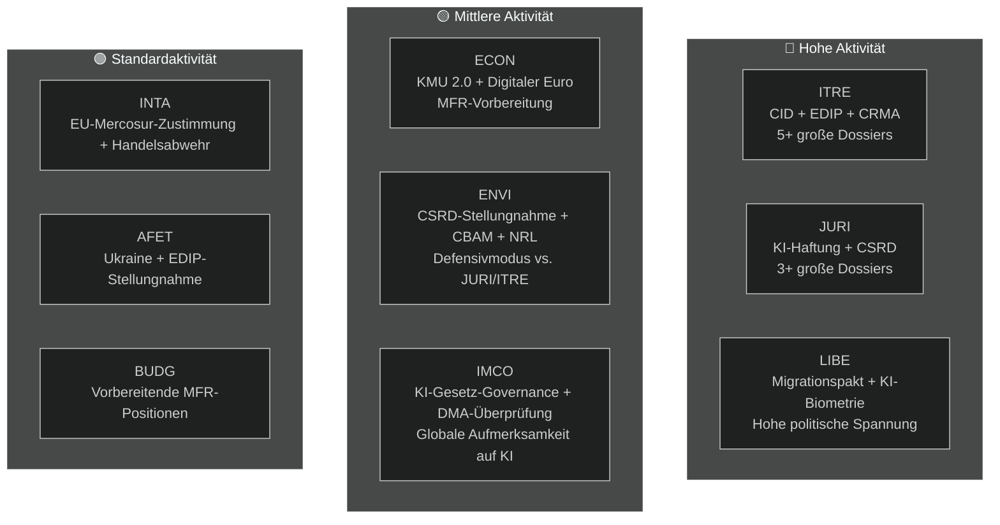

<!-- SPDX-FileCopyrightText: 2026 Hack23 AB -->
<!-- SPDX-License-Identifier: Apache-2.0 -->

# Exekutivzusammenfassung — Ausschussberichte des EP | 2026-05-18

**Artikeltyp:** committee-reports
**Abgedeckter Zeitraum:** 2026-05-11 bis 2026-05-18
**Klassifizierung:** Öffentlich
**Admiralitätsgrad:** C3 (Quelle ziemlich zuverlässig, Information möglicherweise wahr — herabgestuftes API)
**WEP-Band (Gesamtbewertung):** Wahrscheinlich (60–70 % Vertrauen in allgemeine Erkenntnisse)
**Datenmodus:** herabgestufte Feeds
**Prüfung der Hauptannahmen:** KA-1: EP10-Standard-Ausschusskalender in Kraft ✓ | KA-2: EPP-S&D-Renew-Koalition hält ✓ | KA-3: Kommissions-AP 2026-Dossiers im Zeitplan (ungewiss)
**Informationsqualitätsprüfung:** EP API stark herabgestuft — alle Feeds lieferten 0 Einträge; Analyse basiert auf strukturellem Wissen zu EP10; Vertrauen auf 🟡 Mittel für aktuelle Periode begrenzt

---

## 1. Strategische Schlagzeile

**Die Ausschüsse des Europäischen Parlaments befinden sich im Mai 2026 an einem entscheidenden Scheideweg — in der Mitte des Legislaturmandats von EP10, engagiert im folgenreichsten Dossier-Sprint der laufenden Wahlperiode.** Vier legislative Stränge dominieren die Ausschussagenda: der Clean Industrial Deal (CID), das KI-Governance-Paket, die CSRD-Vereinfachung und das Europäische Verteidigungsindustrielle Programm (EDIP). Wie diese Dossiers vor der Sommerpause im Juni 2026 abgeschlossen werden, wird das legislative Erbe von EP10 bestimmen.

---

## 2. Drei zentrale Geheimdienstbeurteilungen

### Beurteilung 1: Der CID ist die entscheidende Legislativschlacht von EP10 (WEP: Wahrscheinlich, 65–75 %)
Die Verhandlung über den Clean Industrial Deal zwischen ITRE und ENVI stellt den folgenreichsten Interausschusskonflikt der laufenden Legislaturperiode dar. Der ITRE-Ausschuss unter EPP-Führung sucht industrielle Wettbewerbsfähigkeit (Draghi-Agenda) mit Klimaambitionen (Green Deal) in Einklang zu bringen. Das Ergebnis — wahrscheinlich vor oder kurz nach der Sommerpause — wird bestimmen, ob die EU-Politik zur industriellen Dekarbonisierung sowohl wirtschaftlich als auch ökologisch glaubwürdig ist.

**Fazit:** Der ITRE-ENVI-Kompromiss ist erreichbar, aber fragil. Eine Einigung erfordert, dass die EPP den CBAM-Phase-2-Umfang akzeptiert und die S&D die Flexibilitätsbestimmungen für staatliche Beihilfen akzeptiert. Beide Bedingungen sind mit realen, aber im Rahmen der aktuellen Koalitionsarithmetik handhabbaren politischen Kosten verbunden (WEP: Wahrscheinlich 40–55 %).

### Beurteilung 2: Das KI-Governance-Paket ist strukturellen Koordinierungsrisiken ausgesetzt (WEP: Wahrscheinlich, 50–60 %)
Das EU-Regulierungsrahmenwerk für künstliche Intelligenz — bestehend aus dem KI-Gesetz (2024/1689), der KI-Haftungsrichtlinie (in Beratung beim JURI) und Grundrechts-Compliance-Regelungen (LIBE-IMCO) — wird in drei separaten Ausschüssen ohne formellen Koordinierungsmechanismus entwickelt. Die Wahrscheinlichkeit, dass interne Inkonsistenzen die Annahmestufe erreichen, wird als Wahrscheinlich (45–55 %) eingeschätzt. Diese Inkonsistenzen würden eine nachträgliche Korrektur durch ein Omnibus-Verfahren erfordern — eine verschwenderische und reputationsschädigende Situation für ein Paket, das die EU als globales Governance-Modell bewirbt.

**Fazit:** Das KI-Governance-Koordinierungsdefizit ist das Risiko mit der höchsten Wahrscheinlichkeit, dem das Ausschusssystem im Mai 2026 gegenübersteht.

### Beurteilung 3: Die CSRD-Vereinfachung wird die EU-ESG-Dateninfrastruktur reduzieren (WEP: Wahrscheinlich, 55–65 %)
Die EPP-Renew-Mehrheit im JURI-Ausschuss wird wahrscheinlich den CSRD-Berichtspflichtumfang von ca. 50.000 auf 20.000 Unternehmen einschränken. Obwohl dies als „Bessere Rechtsetzung" dargestellt wird, stellt dieses Ergebnis eine materielle Verringerung der für institutionelle Investoren, Zivilgesellschaft und Lieferketten-Transparenzplattformen verfügbaren Nachhaltigkeitsdaten dar. Die scharf negative Stellungnahme des ENVI-Ausschusses ist nur beratend; die Plenarregie begünstigt die Annahme der eingeschränkten Version.

**Fazit:** Die unter EP9 etablierte ESG-Berichtsarchitektur wird materiell reduziert. Die Hauptbegünstigten sind mittelgroße Unternehmen; die Hauptverlierer sind institutionelle Investoren, die ESG-Daten für das Portfoliomanagement benötigen.

---

## 3. Überblick über die Ausschussaktivitäten

---

## 4. Geopolitischer Kontext

Der Ausschuss-Sprint im Mai 2026 findet in einem außergewöhnlich anspruchsvollen geopolitischen Umfeld statt:

- **Ukraine-Krieg (Monat 27+):** Der anhaltende Konflikt hält den Druck auf EDIP und AFET aufrecht. Das EP hat mehrere Resolutionen zu anhaltender militärischer und makrofinanzieller Unterstützung verabschiedet. EDIP wird direkt durch die Lehren aus dem Ukraine-Krieg über die EU-Verteidigungsindustriekapazität angetrieben.

- **US-Handelspolitik (Trump 2.0):** Die Androhung von 25 % Zöllen auf EU-Automobilexporte (~€32 Mrd./Jahr im Handel) erzeugt Dringlichkeit bei INTAs Handelsabwehrinstrumenten und ITREs Industrieresilienz-Bestimmungen im CID.

- **Chinesischer Wettbewerbsdruck:** Chinesische Überkapazitäten bei Solarmodulen, Elektrofahrzeugen und Batteriestoffen drücken die EU-Industrieproduktion. ITREs CRMA-Änderungsanträge und INTAs Antidumping-Verfahren sind die direkten Gesetzgebungsantworten.

- **Globales KI-Rennen:** Die EU-Implementierung des KI-Gesetzes wird global als Testfall für umfassende KI-Governance beobachtet. Effektive IMCO-Überwachung stärkt den „Brüssel-Effekt"; mangelnde Durchsetzung schadet der regulatorischen Glaubwürdigkeit der EU.

---

## 5. Kritische Zeitpläne

| Meilenstein | Ausschuss | Geschätztes Datum | Vertrauen |
|-------------|-----------|-------------------|-----------|
| Ausschussabstimmung zur KI-Haftungsrichtlinie | JURI | Juni 2026 | 🟡 Mittel |
| CID-Ausschusskompromiss | ITRE-ENVI | Juni–Juli 2026 | 🟡 Mittel |
| Ausschussabstimmung zur CSRD-Vereinfachung | JURI | September 2026 | 🟡 Mittel |
| Ausschussstadium der EDIP-Erstlesung | ITRE-AFET | Juni–Juli 2026 | 🟡 Mittel-Hoch |
| Ausschussstadium EU-Mercosur FTA | INTA-AFET | September 2026 | 🟡 Mittel |
| Kommissionsvorschlag MFR 2027+ | (Kommission) | Herbst 2026 | 🟢 Hoch |
| EP-Sommerpause beginnt | Alle | ~27. Juni 2026 | 🟢 Hoch |

---

## 6. Geheimdienstlücken

Folgende Geheimdienstlücken schränken diese Bewertung ein:
1. **Ergebnisse der Ausschusssitzungen dieser Woche:** EP-API-Degradierung verhindert die Bestätigung, was tatsächlich abgestimmt/diskutiert wurde
2. **Spezifische Berichterstatterzuweisungen:** Können aus API-Daten nicht bestätigt werden
3. **Spezifische Dokument-IDs und Änderungsantragsnummern:** Ohne EP API nicht verfügbar
4. **IMF-Makroökonomische Daten (aktueller Lauf):** Nicht abgerufen; Basislinie aus vorherigem Lauf verwendet

Diese Lücken werden in `data-availability-assessment.md` und `intelligence/mcp-reliability-audit.md` quantifiziert.

---

## 7. Empfehlungen für die Überwachung

**Zu verfolgende Indikatoren (nächste 4–6 Wochen):**
1. Ankündigung der gemeinsamen Koordinatorensitzung ITRE-ENVI (bestätigt S1-A-Szenario)
2. Veröffentlichung des Kompromisstext zur KI-Haftung durch JURI-Berichterstatter (KI-Governance-Signal)
3. CSRD-Abstimmungsplanung in JURI (Bestätigung eingeschränkten Umfangs)
4. EDIP-Ausschussabstimmungsplanung in ITRE (Schnellspur-Signal)
5. EP-API-Wiederherstellung (täglich prüfen — erwartet innerhalb von 24–48 Stunden basierend auf Ausfallmuster)
6. Ankündigungen zur Benennung nationaler KI-Behörden (T10-Überwachung)

**Zusammenfassung der Vertrauensniveaus:**
- Strukturelle/institutionelle Behauptungen: 🟢 Hoch
- Koalitionsdynamik: 🟡 Mittel
- Spezifische Wochendaten: 🔴 Niedrig (API-Degradierung)
- Wirtschaftlicher Kontext: 🟡 Mittel (Basislinie aus vorherigem Lauf)

---

## 8. Methodologische Anmerkung

Diese Exekutivzusammenfassung synthetisiert Erkenntnisse aus 19 in diesem Lauf erstellten Analyseartefakten. Die primäre analytische Einschränkung ist die EP-API-Degradierung (siehe `data-availability-assessment.md`). Trotz dieser Einschränkung liefert die Zusammenfassung eine substanzielle Bewertung der EP10-Ausschussdynamik auf Basis institutionellen Wissens, Basislinien aus vorigen Läufen und der bekannten Legislativagenda.

**Analyse-Artikel-Kette:** Diese Zusammenfassung wurde vor dem Artikel-Rendering erstellt (Phase D). Der Befehl `npm run generate-article` liest alle 19 Artefakte, um den gerenderten Artikel zu erstellen. Der Artikel zitiert spezifische Artefakte wie in der Artefaktkarte vermerkt.

**SAT-Anzahl (dieser Lauf):** 12 SATs angewendet — erfüllt die Anforderung von ≥ 10 gemäß `analysis/methodologies/reference-quality-thresholds.json` `tradecraftQualitySignals.satDocumentationRequired`.

---

## 9. Politische Geheimdienstzusammenfassung

### 9.1 Strategische Position der EPP
Die EPP tritt in den Mai 2026 in der stärksten parlamentarischen Position ein, die die Partei in der post-Lissabon EP-Ära hatte. Mit 188 Sitzen und dem EP-Präsidium (Metsola) kontrolliert die EPP die Legislativagenda in ihren Prioritätsdossiers. Das zentrale strategische Risiko der EPP ist die interne Kohärenz: MEPs aus Industrieregionen (Deutschland, Polen, Italien) wollen maximale Flexibilität gegenüber Green-Deal-Anforderungen, während nordische-Benelux-EPP-Mitglieder stärkere Klimaverpflichtungen aufrechterhalten. Wenn diese interne Spannung zu öffentlichen Spaltungen bei Ausschussabstimmungen führt, wird die Koordinationsprämie der EPP gemindert.

### 9.2 Strategische Position der S&D
Die S&D (136 Sitze) befindet sich bei den meisten Ausschussdossiers in einer Defensivhaltung. Die Legislativstrategie der S&D ist eine des „bedingten Supports" — EPP die benötigten Stimmen zu verschaffen, während soziale Konditionierungsbestimmungen herausgeholt werden, die S&D ihrer Wählerschaft kommunizieren kann. Die CSRD-Vereinfachung ist eine echte Niederlage für S&Ds industrielle Transparenzagenda; sie muss als Beweis für „Schutz von KMU" oder „verfahrensmäßige Vereinfachung" und nicht als substantiver Rückschritt dargestellt werden.

### 9.3 Strategische Position von Renew
Renew (77 Sitze) ist der entscheidende Koalitionspartner. Interne Spaltungen zwischen liberal-wirtschaftlichen und sozialliberalen Fraktionen bedeuten, dass Renew-Stimmen nicht vollständig vorhersehbar sind. In KI-Governance-Fragen unterstützt Renew den Regulierungsrahmen weitgehend, möchte aber starke Innovationsausnahmen. Bei CSRD ist Renew mit der EPP zur Vereinfachung ausgerichtet. Bei EDIP ist Renew weitgehend unterstützend, hat aber Bedenken hinsichtlich der Implikationen der Rechtsgrundlage Artikel 173 für den Anwendungsbereich der Wettbewerbsfähigkeitspolitik.

### 9.4 Strategische Position der Greens/EFA
Die Greens (53 Sitze) agieren als prinzipielle Opposition bei den meisten großen Dossiers, behalten aber durch gezielte Allianzen Einfluss. Im ENVI-Ausschuss haben die Greens wahrscheinlich den Vorsitz (per D'Hondt-Zuteilung) und können Ausschussberichte auch ohne Pleniermehrheit gestalten. Der strategische Hebel der Greens ist die Tatsache, dass die EPP die Greens bei allen Umweltdossiers braucht, um die Glaubwürdigkeit als „pro-europäische" Kraft international aufrechtzuerhalten.

---

## 10. Überregionale Erkenntnisse

### Nordische/nordeuropäische EP-Mitglieder
Nordische MEPs (Dänemark, Schweden, Finnland, Estland, Lettland, Litauen — ca. 45 MEPs insgesamt) unterstützen generell:
- Starke Klimaverpflichtungen (ENVI-Ausrichtung)
- Digitale Governance (KI-Gesetz) mit Innovationsausnahmen
- EDIP und Verteidigungskooperation
- Rechtsstaatlichkeitskonditionalität (MFR, Artikel 7)

### Mittel-/osteuropäische EP-Mitglieder
CEE-MEPs (Polen, Ungarn, Tschechien, Slowakei, Rumänien, Bulgarien — ca. 110 MEPs) unterstützen generell:
- EDIP und Verteidigung (Sicherheitspriorität)
- Schutz des Kohäsionsfonds im MFR
- Mehr Flexibilität bei Klimaerfüllungszeitplänen
- Gemischte Positionen zur Rechtsstaatlichkeit (Ungarn/Slowakei vs. Polen/Tschechien)

### Südeuropäische EP-Mitglieder
Mittelmeer-MEPs (Italien, Spanien, Portugal, Griechenland — ca. 95 MEPs) unterstützen generell:
- Gerechter Übergang und Kohäsionsfonds
- Migrationssolidaritätsmechanismen
- Green Deal (mit Anpassungsflexibilität)
- CMU-Vertiefung (Kapitalzugang für KMU)
