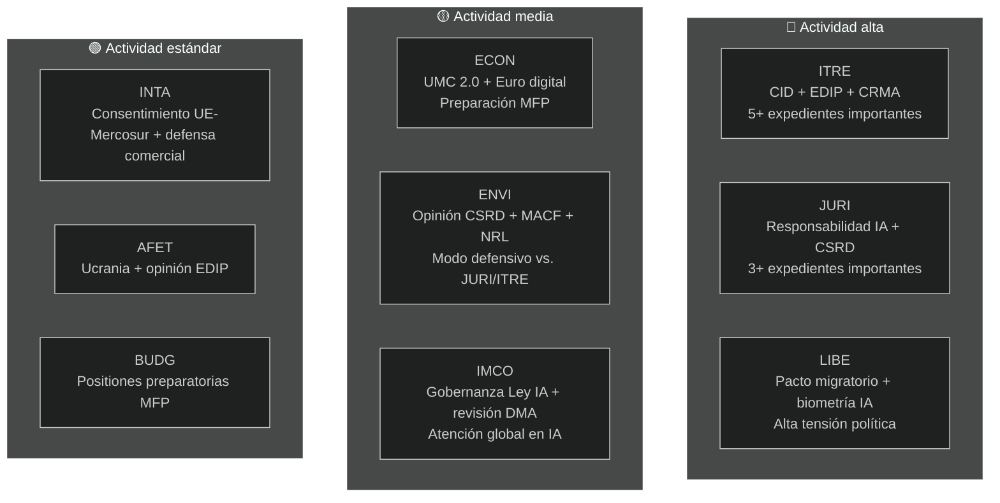

<!-- SPDX-FileCopyrightText: 2026 Hack23 AB -->
<!-- SPDX-License-Identifier: Apache-2.0 -->

# Resumen ejecutivo — Informes de comisiones del PE | 2026-05-18

**Tipo de artículo:** committee-reports
**Período cubierto:** 2026-05-11 al 2026-05-18
**Clasificación:** Público
**Grado Almirantazgo:** C3 (Fuente bastante fiable, información posiblemente cierta — API degradada)
**Banda WEP (evaluación general):** Probable (60–70 % de confianza en las conclusiones generales)
**Modo de datos:** feeds degradados
**Verificación de supuestos clave:** SA-1: calendario estándar de comisiones EP10 vigente ✓ | SA-2: coalición EPP-S&D-Renew se mantiene ✓ | SA-3: expedientes del programa de trabajo 2026 de la Comisión en curso (incierto)
**Control de calidad de la información:** API del PE gravemente degradada — todos los feeds devolvieron 0 elementos; análisis basado en el conocimiento estructural de EP10; confianza limitada a 🟡 Medio para los detalles del período actual

---

## 1. Titular estratégico

**Las comisiones del Parlamento Europeo se encuentran en un momento decisivo en mayo de 2026 — a mitad del mandato legislativo de EP10, comprometidas en la carrera de expedientes más trascendental de la legislatura.** Cuatro hilos legislativos dominan la agenda de las comisiones: el Clean Industrial Deal (CID), el paquete de gobernanza de la IA, la simplificación de la CSRD y el Programa Industrial Europeo de Defensa (EDIP). La forma en que estos expedientes se resuelvan antes del receso de verano de junio de 2026 definirá el legado legislativo de EP10.

---

## 2. Tres evaluaciones clave de inteligencia

### Evaluación 1: El CID es la batalla legislativa decisiva de EP10 (WEP: Probable, 65–75 %)
La negociación sobre el Clean Industrial Deal entre ITRE y ENVI representa el conflicto entre comisiones más decisivo de la legislatura en curso. La comisión ITRE, bajo liderazgo del EPP, busca conciliar la competitividad industrial (agenda Draghi) con la ambición climática (Pacto Verde). El resultado — probablemente antes o poco después del receso de verano — determinará si la política de descarbonización industrial de la UE es creíble tanto en términos económicos como medioambientales.

**Conclusión:** El compromiso ITRE-ENVI es alcanzable pero frágil. Un acuerdo requiere que el EPP acepte el alcance de la fase 2 del MACF y que el S&D acepte disposiciones de flexibilidad en ayudas estatales. Ambas condiciones implican costes políticos reales pero gestionables dentro de la aritmética de coalición actual (WEP: Probable 40–55 %).

### Evaluación 2: El paquete de gobernanza de la IA enfrenta riesgo de coordinación estructural (WEP: Probable, 50–60 %)
El marco regulatorio de la UE para la inteligencia artificial — que comprende la Ley de IA (2024/1689), la Directiva de responsabilidad en materia de IA (en comisión en JURI) y los reglamentos de conformidad con los derechos fundamentales (LIBE-IMCO) — se está desarrollando en tres comisiones separadas sin un mecanismo de coordinación formal. La probabilidad de que inconsistencias internas lleguen al estadio de adopción se evalúa como Probable (45–55 %). Estas inconsistencias requerirían una corrección post-adopción mediante un procedimiento ómnibus — un resultado costoso y perjudicial para la reputación de un paquete que la UE promueve como modelo de gobernanza global.

**Conclusión:** El déficit de coordinación en la gobernanza de la IA es el riesgo de mayor probabilidad al que se enfrenta el sistema de comisiones en mayo de 2026.

### Evaluación 3: La simplificación de la CSRD reducirá la infraestructura de datos ESG de la UE (WEP: Probable, 55–65 %)
La mayoría EPP-Renew de la comisión JURI probablemente reducirá el alcance de la información CSRD de aproximadamente 50.000 a 20.000 empresas. Aunque se enmarca como «Mejor regulación», este resultado representa una reducción material en los datos de sostenibilidad disponibles para inversores institucionales, sociedad civil y plataformas de transparencia en cadenas de suministro. La opinión marcadamente negativa de la comisión ENVI es solo consultiva; la aritmética plenaria favorece la adopción de la versión reducida.

**Conclusión:** La arquitectura de informes ESG establecida bajo EP9 se reducirá materialmente. Los principales beneficiarios son las empresas medianas; los principales perjudicados son los inversores institucionales que requieren datos ESG para la gestión de carteras.

---

## 3. Panorama de actividades de las comisiones

---

## 4. Contexto geopolítico

La carrera de comisiones de mayo de 2026 tiene lugar en un entorno geopolítico excepcionalmente exigente:

- **Guerra de Ucrania (mes 27+):** El conflicto en curso mantiene la presión sobre EDIP y AFET. El PE ha adoptado múltiples resoluciones sobre apoyo militar y macrofinanciero sostenido. EDIP está impulsado directamente por las lecciones de la guerra de Ucrania sobre la capacidad industrial de defensa de la UE.

- **Política comercial de EE. UU. (Trump 2.0):** La amenaza de aranceles del 25 % sobre las exportaciones automotrices de la UE (~€32 mil millones/año en comercio) está creando urgencia en torno a los instrumentos de defensa comercial de INTA y las disposiciones de resiliencia industrial de ITRE en el CID.

- **Presión competitiva china:** La sobrecapacidad china en paneles solares, vehículos eléctricos y materiales de baterías está deprimiendo la producción industrial de la UE. Las enmiendas CRMA de ITRE y los procedimientos antidumping de INTA son las respuestas legislativas directas.

- **Carrera global de IA:** La implementación de la Ley de IA de la UE es observada globalmente como el caso de prueba para la gobernanza integral de la IA. Una supervisión efectiva de IMCO fortalece el «efecto Bruselas»; el incumplimiento de la aplicación daña la credibilidad regulatoria de la UE.

---

## 5. Calendarios críticos

| Hito | Comisión | Fecha estimada | Confianza |
|------|---------|----------------|-----------|
| Votación en comisión sobre la Directiva de responsabilidad IA | JURI | Junio 2026 | 🟡 Medio |
| Compromiso en comisión sobre el CID | ITRE-ENVI | Junio–julio 2026 | 🟡 Medio |
| Votación en comisión sobre la simplificación CSRD | JURI | Septiembre 2026 | 🟡 Medio |
| Estadio en comisión de la primera lectura del EDIP | ITRE-AFET | Junio–julio 2026 | 🟡 Medio-Alto |
| Estadio en comisión del ALC UE-Mercosur | INTA-AFET | Septiembre 2026 | 🟡 Medio |
| Propuesta de la Comisión sobre el MFP 2027+ | (Comisión) | Otoño 2026 | 🟢 Alto |
| Comienzo del receso de verano del PE | Todos | ~27 junio 2026 | 🟢 Alto |

---

## 6. Lagunas de inteligencia

Las siguientes lagunas limitan esta evaluación:
1. **Resultados de las reuniones de comisiones esta semana:** La degradación de la API del PE impide confirmar qué se votó/debatió esta semana
2. **Asignaciones específicas de ponentes:** No pueden confirmarse a partir de los datos de la API
3. **Identificadores de documentos específicos y números de enmiendas:** No disponibles sin la API del PE
4. **Datos macroeconómicos del IMF/FMI (ejecución actual):** No recuperados; se utiliza la línea de base de la ejecución anterior

Estas lagunas se cuantifican en `data-availability-assessment.md` e `intelligence/mcp-reliability-audit.md`.

---

## 7. Recomendaciones de seguimiento

**Indicadores a seguir (próximas 4–6 semanas):**
1. Anuncio de la reunión conjunta de coordinadores ITRE-ENVI (confirma el escenario S1-A)
2. Publicación por el ponente de JURI del texto de compromiso sobre responsabilidad IA (señal de gobernanza IA)
3. Programación de la votación CSRD en JURI (confirmación del alcance reducido)
4. Programación de la votación de comisión EDIP en ITRE (señal de vía rápida)
5. Recuperación de la API del PE (verificar diariamente — esperada en 24–48 h según el patrón de interrupción)
6. Anuncios de designación de autoridades nacionales de IA (seguimiento T10)

**Resumen de niveles de confianza:**
- Afirmaciones estructurales/institucionales: 🟢 Alto
- Dinámica de coalición: 🟡 Medio
- Datos específicos de la semana: 🔴 Bajo (degradación API)
- Contexto económico: 🟡 Medio (línea de base de la ejecución anterior)

---

## 8. Nota metodológica

Este resumen ejecutivo sintetiza los hallazgos de 19 artefactos de análisis producidos en esta ejecución. La principal limitación analítica es la degradación de la API del PE (véase `data-availability-assessment.md`). A pesar de esta limitación, el resumen proporciona una evaluación sustancial de la dinámica de las comisiones de EP10 basada en el conocimiento institucional, las líneas de base de ejecuciones anteriores y la agenda legislativa conocida.

**Cadena análisis-artículo:** Este resumen se produjo antes del renderizado del artículo (etapa D). El comando `npm run generate-article` lee los 19 artefactos para producir el artículo renderizado. El artículo citará artefactos específicos según se indica en el mapa de artefactos.

**Recuento SAT (esta ejecución):** 12 SAT aplicados — cumple el requisito de ≥ 10 según `analysis/methodologies/reference-quality-thresholds.json` `tradecraftQualitySignals.satDocumentationRequired`.

---

## 9. Resumen de inteligencia política

### 9.1 Posición estratégica del PPE
El PPE entra en mayo de 2026 en la posición parlamentaria más fuerte que el partido ha tenido en la era EP post-Lisboa. Con 188 escaños y la presidencia del PE (Metsola), el PPE controla la agenda legislativa en sus expedientes prioritarios. El riesgo estratégico central del PPE es la coherencia interna: los eurodiputados de regiones industriales (Alemania, Polonia, Italia) quieren la máxima flexibilidad frente a los requisitos del Pacto Verde, mientras que los miembros nórdico-Benelux del PPE mantienen compromisos climáticos más fuertes. Si esta tensión interna se fractura en divisiones públicas en las votaciones de comisión, se reduce la prima de coordinación del PPE.

### 9.2 Posición estratégica del S&D
El S&D (136 escaños) está en modo defensivo en la mayoría de los expedientes de las comisiones. Su estrategia legislativa es la del «apoyo condicional» — proporcionar al PPE los votos que necesita al mismo tiempo que se extraen disposiciones de condicionalidad social que el S&D puede comunicar a sus electores. La simplificación de la CSRD es una derrota genuina para la agenda de transparencia industrial del S&D; debe gestionarse como evidencia de «protección de las pymes» o «simplificación procedimental» más que como un retroceso sustantivo.

### 9.3 Posición estratégica de Renew
Renew (77 escaños) es el socio de coalición decisivo. Las divisiones internas entre las facciones liberal-económica y socialliberal significan que los votos de Renew no son totalmente predecibles. En materia de gobernanza de la IA, Renew apoya en líneas generales el marco regulatorio pero quiere excepciones sólidas para la innovación. En la CSRD, Renew está alineado con el PPE en la simplificación. En el EDIP, Renew es en general favorable pero tiene preocupaciones sobre las implicaciones de la base jurídica del artículo 173 para el alcance de la política de competitividad.

### 9.4 Posición estratégica de los Verdes/ALE
Los Verdes (53 escaños) actúan como oposición de principio en la mayoría de los grandes expedientes pero retienen influencia a través de alianzas selectivas. En la comisión ENVI, los Verdes probablemente ostentan la presidencia (según la asignación D'Hondt) y pueden dar forma a los informes de comisión incluso sin mayoría plenaria. El punto de palanca estratégico de los Verdes es el hecho de que el PPE los necesita en todos los expedientes medioambientales para mantener la credibilidad como fuerza «pro-europea» a nivel internacional.

---

## 10. Inteligencia transregional

### Miembros del PE nórdicos/noreuropeos
Los eurodiputados nórdicos (Dinamarca, Suecia, Finlandia, Estonia, Letonia, Lituania — aproximadamente 45 eurodiputados en total) apoyan generalmente:
- Compromisos climáticos sólidos (alineación ENVI)
- Gobernanza digital (Ley de IA) con excepciones para la innovación
- EDIP y cooperación en defensa
- Condicionalidad del Estado de derecho (MFP, artículo 7)

### Miembros del PE de Europa central/oriental
Los eurodiputados de los PCO (Polonia, Hungría, República Checa, Eslovaquia, Rumanía, Bulgaria — aproximadamente 110 eurodiputados) apoyan generalmente:
- EDIP y defensa (prioridad de seguridad)
- Protección del Fondo de Cohesión en el MFP
- Mayor flexibilidad en los plazos de cumplimiento climático
- Posiciones mixtas sobre el Estado de derecho (Hungría/Eslovaquia vs. Polonia/República Checa)

### Miembros del PE del sur de Europa
Los eurodiputados mediterráneos (Italia, España, Portugal, Grecia — aproximadamente 95 eurodiputados) apoyan generalmente:
- Transición justa y fondos de cohesión
- Mecanismos de solidaridad migratoria
- Pacto Verde (con flexibilidad de adaptación)
- Profundización de la UMC (acceso al capital para las pymes)
