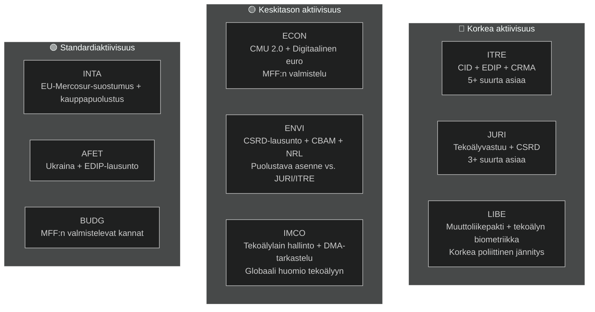

<!-- SPDX-FileCopyrightText: 2026 Hack23 AB -->
<!-- SPDX-License-Identifier: Apache-2.0 -->

# Toimeenpaneva tiivistelmä — EP:n valiokuntaraportit | 2026-05-18

**Artikkelityyppi:** committee-reports
**Kattama ajanjakso:** 2026-05-11–2026-05-18
**Luokittelu:** Julkinen
**Admiraliteettiluokka:** C3 (Lähde melko luotettava, tieto mahdollisesti totta — heikentynyt API)
**WEP-kaista (kokonaisarvio):** Todennäköinen (60–70 % luottamus yleisiin löydöksiin)
**Datatila:** heikentyneet syötteet
**Keskeisten oletusten tarkistus:** KA-1: EP10:n vakiovaliokuntakalenteri voimassa ✓ | KA-2: EPP-S&D-Renew-koalitio pitää ✓ | KA-3: Komission TP 2026 -asiakirjat aikataulussa (epävarma)
**Tietolaadukas:** EP API vakavasti heikentynyt — kaikki syötteet palauttivat 0 kohdetta; analyysi perustuu EP10:n rakenteelliseen tietämykseen; luottamus rajattu 🟡 Keskitaso nykykauden erityistietoihin

---

## 1. Strateginen otsikko

**Euroopan parlamentin valiokunnat ovat toukokuussa 2026 ratkaisevassa käännekohdassa — EP10:n lainsäädäntövaltuuden puolivälissä, kiinni kauden tärkeimmässä asiakirjamaratonissa.** Neljä lainsäädäntökokonaisuutta dominoi valiokuntien esityslistaa: Clean Industrial Deal (CID), tekoälyhallintopaketti, CSRD-yksinkertaistaminen ja Euroopan puolustuspromootteliohjelman (EDIP). Se, miten nämä asiat ratkaistaan ennen kesätaukoa kesäkuussa 2026, määrittelee EP10:n lainsäädännöllisen perinnön.

---

## 2. Kolme keskeistä tiedusteluarviota

### Arvio 1: CID on EP10:n ratkaiseva lainsäädäntötaistelu (WEP: Todennäköinen, 65–75 %)
ITRE:n ja ENVI:n välinen Clean Industrial Deal -neuvottelu edustaa nykyisen lainsäädäntökauden merkittävintä valiokunnan välistä konfliktia. EPP:n johtama ITRE-valiokunta pyrkii sovittamaan yhteen teollisen kilpailukyvyn (Draghi-agenda) ja ilmastoambition (Green Deal). Tulos — todennäköisesti ennen kesätaukoa tai pian sen jälkeen — ratkaisee, onko EU:n teollisen hiilineutraalisuuden politiikka uskottava sekä taloudellisesti että ympäristöllisesti.

**Yhteenveto:** ITRE-ENVI-kompromissi on saavutettavissa mutta hauras. Sopimus edellyttää, että EPP hyväksyy CBAM-vaiheen 2 soveltamisalan ja S&D hyväksyy valtiontukijouston määräykset. Molemmat ehdot sisältävät todellisia mutta hallittavissa olevia poliittisia kustannuksia nykyisessä koalitioaritmetiikassa (WEP: Todennäköinen 40–55 %).

### Arvio 2: Tekoälyhallintopaketti kohtaa rakenteellisen koordinaatioriskin (WEP: Todennäköinen, 50–60 %)
EU:n tekoälysääntelykehys — joka koostuu tekoälyasetuksesta (2024/1689), tekoälyvastuudirektiivistä (valiokunnassa JURI:ssa) ja perusoikeuksien noudattamissäännöksistä (LIBE-IMCO) — kehitetään kolmessa erillisessä valiokunnassa ilman virallista koordinaatiomekanismia. Sisäisten epäjohdonmukaisuuksien hyväksymisvaiheeseen pääsemisen todennäköisyys arvioidaan Todennäköiseksi (45–55 %). Nämä epäjohdonmukaisuudet vaatisivat jälkikäteistä korjausta omnibus-menettelyllä — tuhlaavaa ja mainetta vahingoittavaa paketille, jota EU markkinoi globaaliksi hallintamalliksi.

**Yhteenveto:** Tekoälyhallinnan koordinaatiovaje on korkein todennäköinen riski, jonka valiokuntajärjestelmä kohtaa toukokuussa 2026.

### Arvio 3: CSRD-yksinkertaistaminen heikentää EU:n ESG-tietoinfrastruktuuria (WEP: Todennäköinen, 55–65 %)
JURI-valiokunnan EPP-Renew-enemmistön odotetaan todennäköisesti kaventavan CSRD-raportointivelvollisuuden noin 50 000:sta noin 20 000:een yritykseen. Vaikka se esitetään "Parempana sääntelynä", tämä merkitsee huomattavaa vähennystä institutionaalisille sijoittajille, kansalaisyhteiskunnalle ja toimitusketjun läpinäkyvyysalustoille saatavilla olevissa kestävyystiedoissa. ENVI-valiokunnan jyrkästi kielteinen lausunto on vain neuvoa-antava; täysistunnon aritmeettiikka suosii supistetun version hyväksymistä.

**Yhteenveto:** EP9:n aikana rakennettu ESG-raportointirakenne pienenee olennaisesti. Päähyödynsaajia ovat keskisuuret yritykset; päähäviäjiä ovat institutionaaliset sijoittajat, jotka tarvitsevat ESG-tietoja salkun hallintaan.

---

## 3. Valiokuntien toiminnan yleiskatsaus

---

## 4. Geopoliittinen asiayhteys

Toukokuun 2026 valiokuntamaraton tapahtuu poikkeuksellisen vaativassa geopoliittisessa ympäristössä:

- **Ukrainan sota (kuukausi 27+):** Jatkuva konflikti ylläpitää painetta EDIP:iin ja AFET:iin. EP on hyväksynyt useita päätöslauselmia jatkuvasta sotilaallisesta ja makrotaloudellisesta tuesta. EDIP perustuu suoraan Ukrainan sodan opetuksiin EU:n puolustusalan teollisuuskapasiteetista.

- **USA:n kauppapolitiikka (Trump 2.0):** Uhka 25 %:n tullitariffeihin EU:n autojen viennille (~€32 mrd./vuosi kaupankäynnissä) luo kiireellisyyttä INTA:n kauppapuolustusinstrumenttien ja ITRE:n teollisen kestävyyden CID-säännösten ympärille.

- **Kiinan kilpailupaine:** Kiinalainen ylikapasiteetti aurinkopaneeleissa, sähköautoissa ja akkumateriaaleissa painaa EU:n teollisuustuotantoa. ITRE:n CRMA-muutosehdotukset ja INTA:n polkumyynnin vastaiset menettelyt ovat suoria lainsäädäntövastauksista.

- **Globaali tekoälykilpailu:** EU:n tekoälylain täytäntöönpanoa seurataan maailmanlaajuisesti kattavan tekoälyhallinnan testinä. Tehokas IMCO-valvonta vahvistaa "Bryssel-efektiä"; täytäntöönpanon epäonnistuminen vahingoittaa EU:n sääntelyllistä uskottavuutta.

---

## 5. Kriittiset aikataululinjat

| Virstanpylväs | Valiokunta | Arvioitu päivämäärä | Luottamus |
|---------------|------------|---------------------|-----------|
| Tekoälyvastuudirektiivin valiokuntaäänestys | JURI | Kesäkuu 2026 | 🟡 Keskitaso |
| CID:n valiokuntakompromissi | ITRE-ENVI | Kesä–heinäkuu 2026 | 🟡 Keskitaso |
| CSRD-yksinkertaistamisen valiokuntaäänestys | JURI | Syyskuu 2026 | 🟡 Keskitaso |
| EDIP:n ensimmäisen käsittelyn valiokuntavaihe | ITRE-AFET | Kesä–heinäkuu 2026 | 🟡 Keskitaso–Korkea |
| EU-Mercosur FTA:n valiokuntavaihe | INTA-AFET | Syyskuu 2026 | 🟡 Keskitaso |
| Komission ehdotus MFF 2027+ | (Komissio) | Syksy 2026 | 🟢 Korkea |
| EP:n kesätauko alkaa | Kaikki | ~27. kesäkuuta 2026 | 🟢 Korkea |

---

## 6. Tiedusteluaukot

Seuraavat tiedusteluaukot rajoittavat tätä arviota:
1. **Valiokuntakokouksen tulokset tällä viikolla:** EP API -heikennys estää vahvistamasta, mitä tällä viikolla tosiasiallisesti äänestettiin/keskusteltiin
2. **Tiettyjen esittelijöiden nimet:** Ei voida vahvistaa API-tiedoista
3. **Tietyt asiakirja-tunnukset ja muutosehdotusnumerot:** Ei saatavilla ilman EP API:a
4. **IMF:n makrotaloustieto (nykyinen ajo):** Ei haettu; käytetään edellisen ajon perusviivaa

Nämä aukot kvantifioidaan tiedostoissa `data-availability-assessment.md` ja `intelligence/mcp-reliability-audit.md`.

---

## 7. Suositukset seurantaan

**Seurattavat indikaattorit (seuraavat 4–6 viikkoa):**
1. ITRE-ENVI:n yhteisen koordinaattorikokouksen ilmoitus (vahvistaa S1-A-skenaarion)
2. JURI-esittelijän AI-vastuun kompromissitekstin julkaisu (tekoälyhallintasignaali)
3. CSRD-äänestyksen aikataulutus JURI:ssa (supistetun soveltamisalan vahvistus)
4. EDIP-valiokuntaäänestyksen aikataulutus ITRE:ssä (pikamenettelyn signaali)
5. EP API -toipuminen (tarkista päivittäin — odotettu 24–48 tunnin kuluessa häiriökuvion perusteella)
6. Kansallisten tekoälyviranomaisten nimityksiä koskevat ilmoitukset jäsenvaltioissa (T10-seuranta)

**Luottamustasojen yhteenveto:**
- Rakenteelliset/institutionaaliset väitteet: 🟢 Korkea
- Koalitiodynamiikka: 🟡 Keskitaso
- Viikon erityistiedot: 🔴 Matala (API-heikennys)
- Taloudellinen asiayhteys: 🟡 Keskitaso (edellisen ajon perusviiva)

---

## 8. Metodologinen huomio

Tämä toimeenpaneva tiivistelmä syntetisoi löydöksiä 19 tämän ajon aikana tuotetusta analyysiartefaktista. Ensisijainen analyyttinen rajoitus on EP API -heikennys (ks. `data-availability-assessment.md`). Tästä rajoituksesta huolimatta tiivistelmä tarjoaa sisällöllisen arvion EP10:n valiokuntadynamiikasta institutionaalisen tietämyksen, edellisen ajon perusviivan ja tunnetun lainsäädäntöohjelman perusteella.

**Analyysi-artikkeli-ketju:** Tämä tiivistelmä tuotettiin ennen artikkelin renderöintiä (vaihe D). Komento `npm run generate-article` lukee kaikki 19 artefaktia renderöidyn artikkelin tuottamiseksi. Artikkeli viittaa tiettyihin artefakteihin artefakttikartassa mainitulla tavalla.

**SAT-määrä (tämä ajo):** 12 SAT:ia sovellettu — täyttää ≥ 10 vaatimuksen tiedoston `analysis/methodologies/reference-quality-thresholds.json` `tradecraftQualitySignals.satDocumentationRequired` mukaan.

---

## 9. Poliittinen tiedustelutiivistelmä

### 9.1 EPP:n strateginen asema
EPP astuu toukokuuhun 2026 vahvimmassa parlamentaarisessa asemassaan Lissabonin jälkeisessä EP-aikakaudessa. 188 mandaatin ja EP:n puheenjohtajuuden (Metsola) myötä EPP hallitsee lainsäädäntöohjelmaa prioriteettiasioissaan. EPP:n keskeinen strateginen riski on sisäinen yhtenäisyys: teollisuusalueiden MEP:t (Saksa, Puola, Italia) haluavat maksimaalisen jouston Green Deal -vaatimuksista, kun taas pohjoismaiset-Benelux EPP-jäsenet ylläpitävät vahvempia ilmastositoumuksia. Jos tämä sisäinen jännitys purkautuu julkisiksi jakolinjoiksi valiokuntaäänestyksissä, EPP:n koordinaatiopreemio pienenee.

### 9.2 S&D:n strateginen asema
S&D (136 mandaattia) on puolustavassa asemassa useimmissa valiokunta-asioissa. S&D:n lainsäädäntöstrategia on "ehdollinen tuki" — EPP:lle tarvittavien äänien antaminen samalla kun poimitaan sosiaalisia ehtomääräyksiä, joita S&D voi kommunikoida äänestäjilleen. CSRD-yksinkertaistaminen on aito tappio S&D:n teollisen läpinäkyvyyden agendalle; se on hallittava todisteena "pk-yritysten suojelemisesta" tai "menettelyllisestä yksinkertaistamisesta" eikä substantiivisena taantumana.

### 9.3 Renewin strateginen asema
Renew (77 mandaattia) on ratkaiseva koalitiokumppani. Sisäiset jakolinjat liberaali-taloudellisten ja sosiaaliliberaalien fraktioiden välillä tarkoittavat, että Renewin äänet eivät ole täysin ennustettavissa. Tekoälyhallintakysymyksessä Renew tukee laajasti sääntelykehystä mutta haluaa vahvat innovaatiopoikkeukset. CSRD:n osalta Renew on linjassa EPP:n kanssa yksinkertaistamisen suhteen. EDIP:n osalta Renew on laajasti tukeva mutta epäilee artikla 173:n oikeusperustan vaikutuksia kilpailukykypolitiikan soveltamisalaan.

### 9.4 Vihreät/EFA:n strateginen asema
Vihreät (53 mandaattia) toimivat periaatteellisena oppositiona useimmissa suurissa asioissa mutta säilyttävät vaikutusvaltansa kohdennettujen allianssien kautta. ENVI-valiokunnassa Vihreillä on todennäköisesti puheenjohtajuus (D'Hondt-jaon mukaan), ja ne voivat muotoilla valiokunnan mietintöjä ilman täysistuntojen enemmistöä. Vihreiden strateginen vipuvarsi on se, että EPP tarvitsee Vihreitä kaikissa ympäristöasioissa säilyttääkseen uskottavuutensa "eurooppalaisena" voimana kansainvälisesti.

---

## 10. Poikkialueellinen tiedustelu

### Pohjoismaiset/pohjoisemmat EP-jäsenet
Pohjoismaiset MEP:t (Tanska, Ruotsi, Suomi, Viro, Latvia, Liettua — yhteensä noin 45 MEP:tä) tukevat yleisesti:
- Vahvoja ilmastositoumuksia (ENVI-linjaus)
- Digitaalista hallintoa (tekoälylaki) innovaatiopoikkeuksin
- EDIP:iä ja puolustusyhteistyötä
- Oikeusvaltioehtojen asettamista (MFF, artikla 7)

### Keski-/itäeurooppalaiset EP-jäsenet
CEE-MEP:t (Puola, Unkari, Tšekki, Slovakia, Romania, Bulgaria — noin 110 MEP:tä) tukevat yleisesti:
- EDIP:iä ja puolustusta (turvallisuusprioriteetti)
- Koheesiorahaston suojelua MFF:ssä
- Enemmän joustavuutta ilmastonormien noudattamisen aikatauluissa
- Ristiriitaisia kantoja oikeusvaltiosta (Unkari/Slovakia vs. Puola/Tšekki)

### Eteläeurooppalaiset EP-jäsenet
Välimeren MEP:t (Italia, Espanja, Portugali, Kreikka — noin 95 MEP:tä) tukevat yleisesti:
- Oikeudenmukaista siirtymää ja koheesiorahastoja
- Muuttoliikkeen solidaarisuusmekanismeja
- Green Dealia (sopeutumisjoustomahdollisuuksilla)
- CMU-syventämistä (pk-yritysten pääoman saatavuus)
