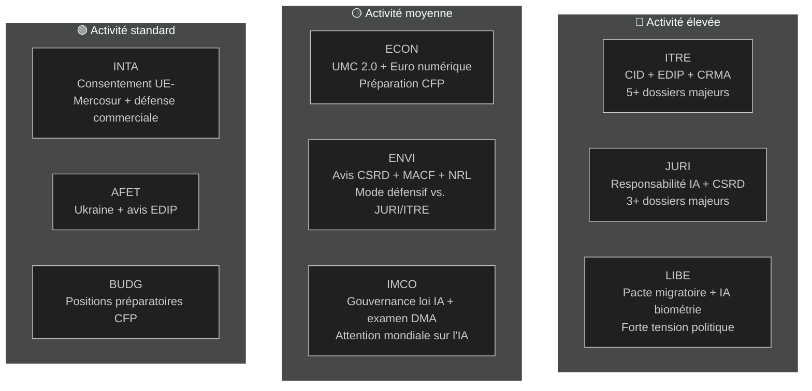

<!-- SPDX-FileCopyrightText: 2026 Hack23 AB -->
<!-- SPDX-License-Identifier: Apache-2.0 -->

# Note de synthèse exécutive — Rapports des commissions du PE | 2026-05-18

**Type d'article :** committee-reports
**Période couverte :** 2026-05-11 au 2026-05-18
**Classification :** Public
**Grade Amirauté :** C3 (Source assez fiable, information possiblement vraie — API dégradée)
**Bande WEP (évaluation globale) :** Probable (60–70 % de confiance dans les conclusions générales)
**Mode données :** flux dégradés
**Vérification des hypothèses clés :** HA-1 : calendrier standard des commissions EP10 en vigueur ✓ | HA-2 : coalition EPP-S&D-Renew tient ✓ | HA-3 : dossiers du programme de travail 2026 de la Commission sur la bonne voie (incertain)
**Contrôle qualité de l'information :** API du PE sévèrement dégradée — tous les flux ont retourné 0 élément ; analyse fondée sur la connaissance structurelle d'EP10 ; confiance plafonnée à 🟡 Moyen pour les spécificités de la période actuelle

---

## 1. Titre stratégique

**Les commissions du Parlement européen se trouvent à un moment charnière en mai 2026 — au milieu du mandat législatif d'EP10, engagées dans le sprint de dossiers le plus décisif de la législature.** Quatre fils législatifs dominent l'agenda des commissions : le Clean Industrial Deal (CID), le paquet de gouvernance de l'IA, la simplification de la CSRD et le Programme industriel européen de défense (EDIP). La façon dont ces dossiers seront réglés avant la pause estivale de juin 2026 définira l'héritage législatif d'EP10.

---

## 2. Trois jugements de renseignement clés

### Jugement 1 : Le CID est la bataille législative décisive d'EP10 (WEP : Probable, 65–75 %)
La négociation sur le Clean Industrial Deal entre l'ITRE et l'ENVI représente le conflit inter-commissions le plus décisif de la législature en cours. La commission ITRE, sous direction EPP, cherche à concilier la compétitivité industrielle (agenda Draghi) avec l'ambition climatique (Pacte vert). Le résultat — probablement avant ou peu après la pause estivale — déterminera si la politique de décarbonation industrielle de l'UE est crédible tant sur le plan économique qu'environnemental.

**Conclusion :** Le compromis ITRE-ENVI est réalisable mais fragile. Un accord exige que l'EPP accepte le périmètre de la phase 2 du MACF et que le S&D accepte des dispositions de flexibilité sur les aides d'État. Les deux conditions impliquent des coûts politiques réels mais gérables dans le cadre de l'arithmétique de coalition actuelle (WEP : Probable 40–55 %).

### Jugement 2 : Le paquet de gouvernance de l'IA fait face à un risque de coordination structurelle (WEP : Probable, 50–60 %)
Le cadre réglementaire de l'UE pour l'intelligence artificielle — comprenant la loi sur l'IA (2024/1689), la directive sur la responsabilité en matière d'IA (en commission à la JURI) et les règlements sur la conformité aux droits fondamentaux (LIBE-IMCO) — est élaboré dans trois commissions séparées sans mécanisme de coordination formel. La probabilité que des incohérences internes atteignent le stade de l'adoption est évaluée comme Probable (45–55 %). Ces incohérences nécessiteraient une correction post-adoption via une procédure omnibus — un résultat coûteux et préjudiciable à la réputation d'un paquet que l'UE promeut comme modèle mondial de gouvernance.

**Conclusion :** Le déficit de coordination en matière de gouvernance de l'IA est le risque à probabilité la plus élevée auquel le système des commissions fait face en mai 2026.

### Jugement 3 : La simplification de la CSRD réduira l'infrastructure de données ESG de l'UE (WEP : Probable, 55–65 %)
La majorité EPP-Renew de la commission JURI devrait probablement réduire le périmètre du reporting CSRD d'environ 50 000 à 20 000 entreprises. Bien que présenté comme une « Meilleure réglementation », ce résultat représente une réduction matérielle des données de durabilité disponibles pour les investisseurs institutionnels, la société civile et les plateformes de transparence des chaînes d'approvisionnement. L'opinion fortement négative de la commission ENVI n'est que consultative ; l'arithmétique plénière favorise l'adoption de la version réduite.

**Conclusion :** L'architecture de reporting ESG établie sous EP9 sera matériellement réduite. Les principaux bénéficiaires sont les entreprises de taille intermédiaire ; les principaux perdants sont les investisseurs institutionnels ayant besoin de données ESG pour la gestion de portefeuille.

---

## 3. Vue d'ensemble des activités des commissions

---

## 4. Contexte géopolitique

Le sprint des commissions de mai 2026 s'inscrit dans un environnement géopolitique exceptionnellement exigeant :

- **Guerre en Ukraine (mois 27+) :** Le conflit en cours maintient la pression sur l'EDIP et l'AFET. Le PE a adopté de multiples résolutions sur le soutien militaire et macrofinancier soutenu. L'EDIP est directement motivé par les leçons de la guerre en Ukraine sur la capacité industrielle de défense de l'UE.

- **Politique commerciale américaine (Trump 2.0) :** La menace de droits de douane de 25 % sur les exportations automobiles de l'UE (~€32 Mrd/an en échanges commerciaux) crée une urgence autour des instruments de défense commerciale de l'INTA et des dispositions de résilience industrielle de l'ITRE dans le CID.

- **Pression concurrentielle chinoise :** La surcapacité chinoise dans les panneaux solaires, les véhicules électriques et les matériaux de batteries déprime la production industrielle de l'UE. Les amendements CRMA de l'ITRE et les procédures antidumping de l'INTA sont les réponses législatives directes.

- **Course mondiale à l'IA :** La mise en œuvre de la loi sur l'IA par l'UE est observée mondialement comme le test pour une gouvernance complète de l'IA. Une surveillance efficace par l'IMCO renforce l'« effet Bruxelles » ; un manque d'application nuit à la crédibilité réglementaire de l'UE.

---

## 5. Calendriers critiques

| Jalon | Commission | Date estimée | Confiance |
|-------|-----------|--------------|-----------|
| Vote en commission sur la directive responsabilité IA | JURI | Juin 2026 | 🟡 Moyen |
| Compromis en commission sur le CID | ITRE-ENVI | Juin–juillet 2026 | 🟡 Moyen |
| Vote en commission sur la simplification CSRD | JURI | Septembre 2026 | 🟡 Moyen |
| Stade en commission pour la première lecture de l'EDIP | ITRE-AFET | Juin–juillet 2026 | 🟡 Moyen-Élevé |
| Stade en commission pour l'ALE UE-Mercosur | INTA-AFET | Septembre 2026 | 🟡 Moyen |
| Proposition de la Commission sur le CFP 2027+ | (Commission) | Automne 2026 | 🟢 Élevé |
| Début de la pause estivale du PE | Tous | ~27 juin 2026 | 🟢 Élevé |

---

## 6. Lacunes de renseignement

Les lacunes suivantes limitent cette évaluation :
1. **Résultats des réunions de commission cette semaine :** La dégradation de l'API du PE empêche de confirmer ce qui a été voté/discuté cette semaine
2. **Noms des rapporteurs spécifiques :** Ne peuvent être confirmés à partir des données API
3. **Identifiants de documents spécifiques et numéros d'amendements :** Non disponibles sans API du PE
4. **Données macroéconomiques IMF/FMI (exécution en cours) :** Non récupérées ; ligne de base de l'exécution précédente utilisée

Ces lacunes sont quantifiées dans `data-availability-assessment.md` et `intelligence/mcp-reliability-audit.md`.

---

## 7. Recommandations de surveillance

**Indicateurs à suivre (4–6 prochaines semaines) :**
1. Annonce de la réunion conjointe des coordinateurs ITRE-ENVI (confirme le scénario S1-A)
2. Publication par le rapporteur JURI du texte de compromis sur la responsabilité IA (signal gouvernance IA)
3. Planification du vote CSRD en JURI (confirmation du périmètre réduit)
4. Planification du vote de commission EDIP en ITRE (signal de procédure accélérée)
5. Rétablissement de l'API du PE (vérifier quotidiennement — prévu dans les 24–48 h selon le schéma de panne)
6. Annonces de désignation des autorités nationales compétentes pour l'IA (surveillance T10)

**Résumé des niveaux de confiance :**
- Affirmations structurelles/institutionnelles : 🟢 Élevé
- Dynamique de coalition : 🟡 Moyen
- Données spécifiques de la semaine : 🔴 Faible (dégradation API)
- Contexte économique : 🟡 Moyen (ligne de base de l'exécution précédente)

---

## 8. Note méthodologique

Cette note de synthèse exécutive synthétise les résultats de 19 artefacts d'analyse produits lors de cette exécution. La principale limitation analytique est la dégradation de l'API du PE (voir `data-availability-assessment.md`). Malgré cette limitation, la note fournit une évaluation substantielle de la dynamique des commissions d'EP10 fondée sur la connaissance institutionnelle, les lignes de base des exécutions précédentes et l'agenda législatif connu.

**Chaîne analyse-article :** Cette note a été produite avant le rendu de l'article (étape D). La commande `npm run generate-article` lit les 19 artefacts pour produire l'article rendu. L'article citera des artefacts spécifiques comme indiqué dans la carte des artefacts.

**Nombre de SAT (cette exécution) :** 12 SAT appliqués — satisfait l'exigence de ≥ 10 selon `analysis/methodologies/reference-quality-thresholds.json` `tradecraftQualitySignals.satDocumentationRequired`.

---

## 9. Résumé du renseignement politique

### 9.1 Position stratégique du PPE
Le PPE entre en mai 2026 dans la position parlementaire la plus solide de son histoire depuis l'ère post-Lisbonne. Avec 188 sièges et la présidence du PE (Metsola), le PPE contrôle l'agenda législatif sur ses dossiers prioritaires. Le principal risque stratégique du PPE est la cohésion interne : les eurodéputés des régions industrielles (Allemagne, Pologne, Italie) veulent une flexibilité maximale vis-à-vis des exigences du Pacte vert, tandis que les membres du PPE nordiques-Benelux maintiennent des engagements climatiques plus forts. Si cette tension interne se fragmente en divisions publiques lors des votes en commission, la prime de coordination du PPE diminue.

### 9.2 Position stratégique du S&D
Le S&D (136 sièges) est en mode défensif sur la plupart des dossiers des commissions. Sa stratégie législative est celle du « soutien conditionnel » — fournir au PPE les votes dont il a besoin tout en obtenant des dispositions de conditionnalité sociale que le S&D peut communiquer à son électorat. La simplification de la CSRD est une réelle défaite pour l'agenda de transparence industrielle du S&D ; elle doit être gérée comme preuve de « protection des PME » ou de « simplification procédurale » plutôt que comme un recul substantif.

### 9.3 Position stratégique de Renew
Renew (77 sièges) est le partenaire de coalition décisif. Les divisions internes entre factions libérales-économiques et sociaux-libérales signifient que les votes Renew ne sont pas entièrement prévisibles. Sur la gouvernance de l'IA, Renew soutient largement le cadre réglementaire mais souhaite de fortes exemptions pour l'innovation. Sur la CSRD, Renew est aligné avec le PPE sur la simplification. Sur l'EDIP, Renew est globalement favorable mais a des préoccupations concernant les implications de la base juridique de l'article 173 pour le périmètre de la politique de compétitivité.

### 9.4 Position stratégique des Verts/ALE
Les Verts (53 sièges) agissent en opposition de principe sur la plupart des grands dossiers mais conservent une influence par le biais d'alliances ciblées. Au sein de la commission ENVI, les Verts détiennent probablement la présidence (selon la répartition D'Hondt) et peuvent façonner les rapports de commission même sans majorité plénière. Le levier stratégique des Verts réside dans le fait que le PPE a besoin des Verts sur tous les dossiers environnementaux pour maintenir sa crédibilité en tant que force « pro-européenne » à l'international.

---

## 10. Renseignement transrégional

### Membres du PE nordiques/nord-européens
Les eurodéputés nordiques (Danemark, Suède, Finlande, Estonie, Lettonie, Lituanie — environ 45 eurodéputés au total) soutiennent généralement :
- Les engagements climatiques forts (alignement ENVI)
- La gouvernance numérique (loi sur l'IA) avec exemptions pour l'innovation
- L'EDIP et la coopération en matière de défense
- La conditionnalité de l'État de droit (CFP, article 7)

### Membres du PE d'Europe centrale/orientale
Les eurodéputés des PECO (Pologne, Hongrie, République tchèque, Slovaquie, Roumanie, Bulgarie — environ 110 eurodéputés) soutiennent généralement :
- L'EDIP et la défense (priorité sécuritaire)
- La protection du Fonds de cohésion dans le CFP
- Plus de flexibilité sur les calendriers de conformité climatique
- Des positions mitigées sur l'État de droit (Hongrie/Slovaquie vs. Pologne/République tchèque)

### Membres du PE d'Europe du Sud
Les eurodéputés méditerranéens (Italie, Espagne, Portugal, Grèce — environ 95 eurodéputés) soutiennent généralement :
- La transition juste et les fonds de cohésion
- Les mécanismes de solidarité migratoire
- Le Pacte vert (avec flexibilité d'adaptation)
- L'approfondissement de l'UMC (accès au capital pour les PME)
