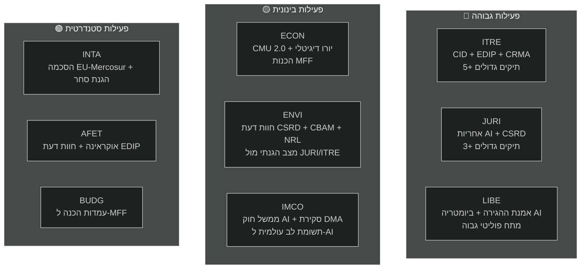

<!-- SPDX-FileCopyrightText: 2026 Hack23 AB -->
<!-- SPDX-License-Identifier: Apache-2.0 -->

# תקציר מנהלים — דוחות ועדות הפרלמנט האירופי | 2026-05-18

**סוג המאמר:** committee-reports
**תקופה מכוסה:** 2026-05-11 עד 2026-05-18
**סיווג:** ציבורי
**דרגת האדמירליות:** C3 (מקור אמין למדי, מידע אפשרי — API מדורדר)
**רצועת WEP (הערכה כוללת):** סביר (60–70 % אמון בממצאים כלליים)
**מצב נתונים:** הזנות מדורדרות
**בדיקת הנחות מפתח:** ה-1: לוח שנה סטנדרטי של ועדות EP10 בתוקף ✓ | ה-2: קואליציית EPP-S&D-Renew מחזיקה ✓ | ה-3: תיקי תוכנית עבודה 2026 של הנציבות במסלול (אי-ודאי)
**בדיקת איכות מידע:** API הפרלמנט האירופי מדורדר קשות — כל ההזנות החזירו 0 פריטים; הניתוח מבוסס על ידע מבני של EP10; אמון מוגבל ל-🟡 בינוני לפרטים הספציפיים של התקופה הנוכחית

---

## 1. כותרת אסטרטגית

**ועדות הפרלמנט האירופי נמצאות במאי 2026 בצומת מכרעת — באמצע ימנדט החקיקה של EP10, שקועות בריצת התיקים המשמעותית ביותר של הקדנציה.** ארבעה מסלולי חקיקה שולטים בסדר יום הוועדות: עסקת התעשייה הנקייה (CID), חבילת הממשל של AI, פישוט ה-CSRD והתוכנית התעשייתית האירופית לביטחון (EDIP). האופן שבו תיקים אלה יסוכמו לפני הפגרה הקיצית של יוני 2026 יגדיר את המורשת החקיקתית של EP10.

---

## 2. שלושה פסקי דין מודיעיניים מרכזיים

### פסק דין 1: ה-CID הוא הקרב החקיקתי המכריע של EP10 (WEP: סביר, 65–75 %)
המשא ומתן על עסקת התעשייה הנקייה בין ITRE ל-ENVI מייצג את הסכסוך הבין-ועדתי המשמעותי ביותר בתקופת החקיקה הנוכחית. ועדת ITRE, תחת הנהגת EPP, מבקשת לגשר בין תחרותיות תעשייתית (אג'נדת דראגי) לשאיפת האקלים (עסקת ירוקה). התוצאה — ככל הנראה לפני הפגרה הקיצית או זמן קצר לאחריה — תקבע אם המדיניות האירופית לדקרבוניזציה תעשייתית אמינה גם מבחינה כלכלית וגם מבחינה סביבתית.

**מסקנה:** הפשרה של ITRE-ENVI ניתנת להשגה אך שברירית. הסכם מחייב את EPP לקבל את היקף CBAM שלב 2 ואת S&D לקבל הוראות גמישות בסיוע מדינה. שני התנאים כרוכים בעלויות פוליטיות אמיתיות אך ניתנות לניהול בתוך אריתמטיקת הקואליציה הנוכחית (WEP: סביר 40–55 %).

### פסק דין 2: חבילת ממשל ה-AI ניצבת בפני סיכון תיאום מבני (WEP: סביר, 50–60 %)
מסגרת הרגולציה של האיחוד האירופי לבינה מלאכותית — הכוללת את חוק ה-AI (2024/1689), את הנחיית האחריות ל-AI (בועדת JURI) ותקנות עמידה בזכויות יסוד (LIBE-IMCO) — מפותחת בשלוש ועדות נפרדות ללא מנגנון תיאום רשמי. הסבירות שחוסרי עקביות פנימיים יגיעו לשלב האישור מוערכת כסבירה (45–55 %). אי-עקביות אלו ידרשו תיקון לאחר האימוץ דרך הליך אומניבוס — תוצאה בזבזנית ופוגעת במוניטין עבור חבילה שהאיחוד מקדם כמודל ממשל עולמי.

**מסקנה:** גירעון תיאום ממשל ה-AI הוא הסיכון עם ההסתברות הגבוהה ביותר שבפניו ניצב מערכת הוועדות במאי 2026.

### פסק דין 3: פישוט CSRD יצמצם את תשתית הנתונים ESG של האיחוד האירופי (WEP: סביר, 55–65 %)
רוב EPP-Renew בוועדת JURI צפוי לצמצם את היקף דיווח ה-CSRD מכ-50,000 ל-20,000 חברות. למרות שזה מוצג כ"רגולציה טובה יותר", תוצאה זו מייצגת קיטון מהותי בנתוני הקיימות הזמינים למשקיעים מוסדיים, לחברה האזרחית ולפלטפורמות שקיפות שרשרות האספקה. עמדת ועדת ENVI השלילית בחריפות היא ייעוצית בלבד; אריתמטיקת המליאה מעדיפה אישור הגרסה המצומצמת.

**מסקנה:** ארכיטקטורת הדיווח ESG שנוצרה תחת EP9 תצטמצם באופן מהותי. המרוויחים העיקריים הם חברות בינוניות; המפסידים העיקריים הם משקיעים מוסדיים הזקוקים לנתוני ESG לניהול תיקים.

---

## 3. סקירת פעילות הוועדות

---

## 4. הקשר גיאופוליטי

ריצת הוועדות של מאי 2026 מתקיימת בסביבה גיאופוליטית תובענית יוצאת דופן:

- **מלחמת אוקראינה (חודש 27+):** הסכסוך המתמשך שומר על לחץ על EDIP ו-AFET. הפרלמנט האירופי אישר מספר החלטות על תמיכה צבאית ומקרו-פיננסית מתמשכת. EDIP מונע ישירות על ידי לקחי מלחמת אוקראינה בנוגע לכושר הייצור הביטחוני-תעשייתי של האיחוד.

- **מדיניות הסחר האמריקנית (טראמפ 2.0):** האיום בהטלת מכסים של 25 % על ייצוא הרכב האירופי (~32 מיליארד אירו/שנה בסחר) יוצר דחיפות סביב כלי הגנת הסחר של INTA והוראות החוסן התעשייתי של ITRE ב-CID.

- **לחץ תחרותי סיני:** עודף הייצור הסיני בפאנלים סולאריים, כלי רכב חשמליים וחומרי סוללות מדכא את הייצור התעשייתי האירופי. תיקוני CRMA של ITRE והליכי האנטי-דמפינג של INTA הם התגובות החקיקתיות הישירות.

- **מרוץ ה-AI העולמי:** יישום חוק ה-AI באיחוד האירופי נצפה ברחבי העולם כמבחן לממשל AI מקיף. פיקוח IMCO אפקטיבי מחזק את "אפקט בריסל"; כישלון אכיפה פוגע באמינות הרגולטורית של האיחוד.

---

## 5. לוחות זמן קריטיים

| אבן דרך | ועדה | תאריך משוער | אמון |
|---------|------|-------------|------|
| הצבעת ועדה על הנחיית אחריות AI | JURI | יוני 2026 | 🟡 בינוני |
| פשרת ועדה בנושא CID | ITRE-ENVI | יוני–יולי 2026 | 🟡 בינוני |
| הצבעת ועדה על פישוט CSRD | JURI | ספטמבר 2026 | 🟡 בינוני |
| שלב ועדה לקריאה ראשונה של EDIP | ITRE-AFET | יוני–יולי 2026 | 🟡 בינוני-גבוה |
| שלב ועדה להסכם FTA EU-Mercosur | INTA-AFET | ספטמבר 2026 | 🟡 בינוני |
| הצעת נציבות MFF 2027+ | (נציבות) | סתיו 2026 | 🟢 גבוה |
| תחילת פגרת קיץ הפרלמנט | הכל | ~27 יוני 2026 | 🟢 גבוה |

---

## 6. פערי מודיעין

הפערים הבאים מגבילים הערכה זו:
1. **תוצאות ישיבות הוועדות השבוע:** דרדור API של הפרלמנט האירופי מונע אישור מה שהוצבע/נדון בפועל
2. **שמות מדווחים ספציפיים:** לא ניתן לאשר מנתוני API
3. **מזהי מסמכים ומספרי תיקונים ספציפיים:** לא זמינים ללא API הפרלמנט
4. **נתוני IMF מאקרו-כלכליים (הריצה הנוכחית):** לא אוחזרו; נעשה שימוש בקו הבסיס של הריצה הקודמת

פערים אלה מכומתים ב-`data-availability-assessment.md` וב-`intelligence/mcp-reliability-audit.md`.

---

## 7. המלצות למעקב

**מדדים לעקוב אחריהם (4–6 שבועות הבאים):**
1. הכרזה על ישיבת רכזים משותפת ITRE-ENVI (מאשר תרחיש S1-A)
2. פרסום טקסט פשרה בנושא אחריות AI על ידי מדווח JURI (אות ממשל AI)
3. תזמון הצבעת CSRD ב-JURI (אישור היקף מצומצם)
4. תזמון הצבעת ועדת EDIP ב-ITRE (אות מסלול מהיר)
5. שיקום API הפרלמנט (בדיקה יומית — צפוי תוך 24–48 שעות לפי תבנית הפסקה)
6. הכרזות מינוי רשויות AI לאומיות (מעקב T10)

**סיכום רמות אמון:**
- טענות מבניות/מוסדיות: 🟢 גבוה
- דינמיקות קואליציה: 🟡 בינוני
- נתונים ספציפיים לשבוע: 🔴 נמוך (דרדור API)
- הקשר כלכלי: 🟡 בינוני (קו בסיס מריצה קודמת)

---

## 8. הערת מתודולוגיה

תקציר מנהלים זה מסנתז ממצאים מ-19 תוצרי ניתוח שיוצרו בריצה זו. המגבלה האנליטית הראשית היא דרדור API הפרלמנט האירופי (ראה `data-availability-assessment.md`). למרות מגבלה זו, התקציר מספק הערכה מהותית של דינמיקות ועדות EP10 המבוססת על ידע מוסדי, קווי בסיס מריצות קודמות ואג'נדת החקיקה הידועה.

**שרשרת ניתוח-למאמר:** תקציר זה הופק לפני עיבוד המאמר (שלב D). הפקודה `npm run generate-article` קוראת את כל 19 התוצרים כדי לייצר את המאמר המעובד. המאמר יצטט תוצרים ספציפיים כמצוין במפת התוצרים.

**ספירת SAT (ריצה זו):** 12 SAT יושמו — עומד בדרישה של ≥ 10 לפי `analysis/methodologies/reference-quality-thresholds.json` `tradecraftQualitySignals.satDocumentationRequired`.

---

## 9. סיכום מודיעין פוליטי

### 9.1 עמדתה האסטרטגית של EPP
EPP נכנסת למאי 2026 במעמד פרלמנטרי החזק ביותר שהיה לה בעידן הפוסט-ליסבון. עם 188 מושבים ונשיאות הפרלמנט (מצולה), EPP שולטת בסדר יום החקיקה בתיקי עדיפותה. הסיכון האסטרטגי המרכזי של EPP הוא לכידות פנימית: חברי פרלמנט מאזורים תעשייתיים (גרמניה, פולין, איטליה) רוצים גמישות מקסימלית מדרישות עסקת ירוקה, בעוד שחברי EPP הסקנדינבים-בנלוקס שומרים על מחויבויות אקלים חזקות יותר. אם מתח פנימי זה יתפרק לפיצולים גלויים בהצבעות ועדות, דמי התיאום של EPP יפחתו.

### 9.2 עמדתה האסטרטגית של S&D
S&D (136 מושבים) נמצאת במצב הגנתי ברוב תיקי הוועדות. אסטרטגיית החקיקה שלה היא "תמיכה מותנית" — לספק ל-EPP את הקולות שהיא צריכה תוך חילוץ הוראות מוסד תנאי חברתיות ש-S&D יכולה לתקשר לבוחריה. פישוט CSRD הוא תבוסה אמיתית לאג'נדת השקיפות התעשייתית של S&D; צריך לנהל אותו כהוכחה ל"הגנה על עסקים קטנים" או "פישוט פרוצדורלי" ולא כנסיגה מהותית.

### 9.3 עמדתה האסטרטגית של Renew
Renew (77 מושבים) הוא שותף הקואליציה המכריע. פיצולים פנימיים בין סיעות ליברליות-כלכליות לסוציאל-ליברליות אומרים שקולות Renew אינם לגמרי צפויים. בממשל AI, Renew תומך במסגרת הרגולטורית בגדול אך רוצה פטורים חזקים מחדשנות. ב-CSRD, Renew מיושר עם EPP בפישוט. ב-EDIP, Renew תומך בגדול אך חושש מהשלכות בסיס החוק של סעיף 173 על היקף מדיניות התחרותיות.

### 9.4 עמדתם האסטרטגית של הירוקים/EFA
הירוקים (53 מושבים) פועלים כאופוזיציה עקרונית ברוב הנושאים הגדולים אך שומרים על השפעה דרך ברית ממוקדות. בוועדת ENVI, הירוקים מחזיקים כנראה בנשיאות (לפי הקצאת D'Hondt) ויכולים לעצב דוחות ועדה גם ללא רוב במליאה. נקודת המנוף האסטרטגי של הירוקים היא ש-EPP זקוקה להם בכל הנושאים הסביבתיים כדי לשמור על האמינות ככוח "פרו-אירופי" בינלאומי.

---

## 10. מודיעין חוצה-אזורי

### חברי הפרלמנט האירופי הצפוניים/הסקנדינביים
חברי פרלמנט סקנדינביים (דנמרק, שוודיה, פינלנד, אסטוניה, לטביה, ליטא — כ-45 חברי פרלמנט בסך הכל) תומכים בדרך כלל ב:
- מחויבויות אקלים חזקות (התאמה ל-ENVI)
- ממשל דיגיטלי (חוק AI) עם פטורי חדשנות
- EDIP ושיתוף פעולה ביטחוני
- מוסד תנאי שלטון חוק (MFF, סעיף 7)

### חברי הפרלמנט האירופי ממרכז/מזרח אירופה
חברי פרלמנט ממרכז ומזרח אירופה (פולין, הונגריה, צ'כיה, סלובקיה, רומניה, בולגריה — כ-110 חברי פרלמנט) תומכים בדרך כלל ב:
- EDIP וביטחון (עדיפות ביטחונית)
- הגנה על קרן הלכידות ב-MFF
- גמישות רבה יותר בלוחות הזמנים לציות לאקלים
- עמדות מעורבות על שלטון חוק (הונגריה/סלובקיה מול פולין/צ'כיה)

### חברי הפרלמנט האירופי מדרום אירופה
חברי פרלמנט מדינות הים התיכון (איטליה, ספרד, פורטוגל, יוון — כ-95 חברי פרלמנט) תומכים בדרך כלל ב:
- מעבר צודק וקרנות לכידות
- מנגנוני סולידריות בהגירה
- עסקת ירוקה (עם גמישות הסתגלות)
- העמקת CMU (גישה להון לעסקים קטנים)
