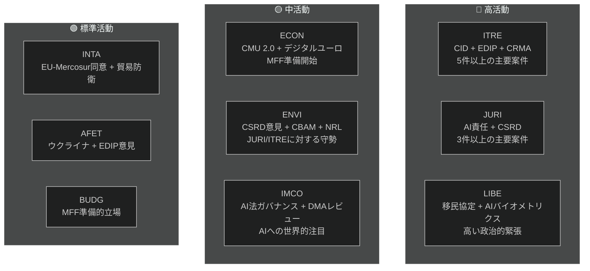

<!-- SPDX-FileCopyrightText: 2026 Hack23 AB -->
<!-- SPDX-License-Identifier: Apache-2.0 -->

# 幹部向け概要 — 欧州議会委員会報告 | 2026-05-18

**記事の種類：** committee-reports
**対象期間：** 2026-05-11 から 2026-05-18
**分類：** 公開
**信頼性評価：** C3（情報源はかなり信頼できる、情報は真実の可能性あり — API劣化）
**WEP帯域（総合評価）：** 可能性あり（一般的な所見への信頼度 60–70 %）
**データモード：** フィード劣化
**主要前提条件の確認：** KA-1：EP10標準委員会カレンダーが有効 ✓ | KA-2：EPP-S&D-Renew連立が維持 ✓ | KA-3：欧州委員会2026年作業計画の案件が軌道上（不確実）
**情報品質確認：** EP APIが著しく劣化 — 全フィードが0件を返却。分析はEP10の構造的知識に基づく。現在期間の詳細については信頼度 🟡 中程度に制限

---

## 1. 戦略的見出し

**欧州議会の委員会は2026年5月、重要な分岐点にある — EP10の立法任期の中間地点で、現任期で最も重要な案件スプリントに取り組んでいる。** 委員会の議題を支配する4つの立法の糸がある：クリーン産業ディール（CID）、AIガバナンス・パッケージ、CSRDの簡素化、欧州防衛産業プログラム（EDIP）。2026年6月の夏季休会前にこれらの案件がどう決着するかが、EP10の立法的遺産を規定する。

---

## 2. 3つの主要情報評価

### 評価1：CIDはEP10の決定的な立法戦争（WEP：可能性あり、65–75 %）
ITREとENVIの間のクリーン産業ディールをめぐる交渉は、現任期で最も重要な委員会間の対立を代表する。EPP主導のITRE委員会は、産業競争力（ドラギ・アジェンダ）と気候野心（グリーンディール）の調和を模索している。その結果 — 夏季休会前後 — が、EUの産業脱炭素化政策が経済的にも環境的にも信頼に足るものかどうかを決定する。

**結論：** ITRE-ENVIの妥協は達成可能だが脆弱だ。合意にはEPPがCBAM第2フェーズの範囲を受け入れ、S&DがEU国家補助の柔軟性条項を受け入れることが必要だ。どちらの条件も現在の連立算術の範囲内では管理可能な政治的コストを伴う（WEP：可能性あり 40–55 %）。

### 評価2：AIガバナンス・パッケージは構造的調整リスクに直面（WEP：可能性あり、50–60 %）
EUの人工知能規制の枠組み — AI法（2024/1689）、AI責任指令（JURI委員会で審議中）、基本権コンプライアンス規則（LIBE-IMCO）からなる — は、正式な調整メカニズムなしに3つの別々の委員会で開発されている。内部の矛盾が採択段階に達する確率は「可能性あり」（45–55 %）と評価される。これらの矛盾は採択後にオムニバス手続きによる修正を必要とし、EUがグローバルなガバナンスモデルとして推進するパッケージにとって無駄であり評判を損なう結果となる。

**結論：** AIガバナンスの調整赤字は、2026年5月に委員会システムが直面するリスクの中で最も確率が高い。

### 評価3：CSRDの簡素化はEUのESGデータインフラを縮小させる（WEP：可能性あり、55–65 %）
JURI委員会のEPP-Renew多数派は、CSRDの報告義務の適用範囲を約50,000社から20,000社に縮小する可能性が高い。「規制改善」として提示されているが、この結果は機関投資家、市民社会、サプライチェーン透明性プラットフォームが利用できる持続可能性データの実質的な削減を意味する。ENVI委員会の強く否定的な意見は諮問的にすぎず、本会議の算術は縮小版の採択を支持する。

**結論：** EP9の下で構築されたESG報告アーキテクチャは実質的に縮小される。主な受益者は中規模企業であり、主な敗者はポートフォリオ管理にESGデータを必要とする機関投資家だ。

---

## 3. 委員会活動概要

---

## 4. 地政学的文脈

2026年5月の委員会スプリントは、異例に厳しい地政学的環境の中で行われる：

- **ウクライナ戦争（27か月以上）：** 継続する紛争がEDIPとAFETへの圧力を維持している。EUは持続的な軍事・マクロ財政支援に関する複数の決議を採択した。EDIPはウクライナ戦争からEUの防衛産業能力に関する教訓によって直接推進されている。

- **米国の通商政策（トランプ2.0）：** EU自動車輸出（約320億ユーロ/年）への25 %関税の脅威は、INTAの貿易防衛手段とITREのCID内の産業強靭性条項に緊急性をもたらしている。

- **中国の競争圧力：** 太陽光パネル、電気自動車、バッテリー材料における中国の過剰生産能力がEUの産業生産を圧迫している。ITREのCRMA改正案とINTAのアンチダンピング手続きが直接的な立法上の対応策だ。

- **グローバルAIレース：** EUのAI法実施は、包括的なAIガバナンスのテストケースとして世界中で注目されている。IMCOによる効果的な監督は「ブリュッセル効果」を強化し、施行の失敗はEUの規制上の信頼性を損なう。

---

## 5. 重要なタイムライン

| マイルストーン | 委員会 | 推定日 | 信頼度 |
|-------------|---------|---------|--------|
| AI責任指令の委員会投票 | JURI | 2026年6月 | 🟡 中 |
| CIDの委員会妥協 | ITRE-ENVI | 2026年6–7月 | 🟡 中 |
| CSRD簡素化の委員会投票 | JURI | 2026年9月 | 🟡 中 |
| EDIPの第一読会委員会段階 | ITRE-AFET | 2026年6–7月 | 🟡 中～高 |
| EU-Mercosur FTAの委員会段階 | INTA-AFET | 2026年9月 | 🟡 中 |
| 欧州委員会のMFF 2027+提案 | （欧州委員会） | 2026年秋 | 🟢 高 |
| EP夏季休会開始 | 全委員会 | 約2026年6月27日 | 🟢 高 |

---

## 6. 情報格差

以下の情報格差がこの評価を制限している：
1. **今週の委員会会議の結果：** EP API劣化により今週実際に投票・議論された内容を確認不可
2. **特定の報告者名の指定：** APIデータから確認不可
3. **特定の文書IDと修正案番号：** EP APIなしには利用不可
4. **IMFのマクロ経済データ（現行ラン）：** 取得されず。前回ランのベースラインを使用

これらの格差は`data-availability-assessment.md`と`intelligence/mcp-reliability-audit.md`で定量化されている。

---

## 7. 監視に関する推奨事項

**追跡すべき指標（今後4–6週間）：**
1. ITRE-ENVIの合同コーディネーター会議の発表（S1-Aシナリオを確認）
2. JURI報告者によるAI責任の妥協案テキストの公表（AIガバナンスのシグナル）
3. JURIでのCSRD投票スケジュール（縮小範囲の確認）
4. ITREでのEDIP委員会投票スケジュール（ファストトラックのシグナル）
5. EP APIの回復（毎日確認 — 障害パターンから24–48時間以内に予想）
6. 加盟国における国家AI当局指定の発表（T10監視）

**信頼度の概要：**
- 構造的・制度的主張：🟢 高
- 連立の力学：🟡 中
- 今週の特定データ：🔴 低（API劣化）
- 経済的文脈：🟡 中（前回ランのベースライン）

---

## 8. 方法論ノート

この幹部向け概要は、このランで作成された19の分析成果物の所見を統合したものだ。主な分析上の制約はEP APIの劣化である（`data-availability-assessment.md`参照）。この制約にもかかわらず、本概要は制度的知識、前回ランのベースライン、既知の立法アジェンダに基づいたEP10の委員会ダイナミクスの実質的な評価を提供する。

**分析から記事への連鎖：** この概要は記事レンダリング（ステージD）の前に作成された。`npm run generate-article`コマンドが19の成果物すべてを読み込んでレンダリングされた記事を作成する。記事は成果物マップに示されるように特定の成果物を引用する。

**SATカウント（このラン）：** 12個のSATを適用 — `analysis/methodologies/reference-quality-thresholds.json`の`tradecraftQualitySignals.satDocumentationRequired`による≥10の要件を満たす。

---

## 9. 政治情報の概要

### 9.1 EPPの戦略的立場
EPPは2026年5月、ポスト・リスボン欧州議会時代において党が持った中で最も強力な議会的立場で入った。188議席と欧州議会議長職（メツォーラ）を持つEPPは、優先案件全体で立法アジェンダをコントロールしている。EPPの中核的な戦略リスクは内部の結束だ：産業地域のMEP（ドイツ、ポーランド、イタリア）はグリーンディールの要件からの最大限の柔軟性を求める一方、北欧・ベネルクスのEPP議員はより強い気候コミットメントを維持している。この内部緊張が委員会投票での公の分裂に発展すれば、EPPの調整プレミアムは低下する。

### 9.2 S&Dの戦略的立場
S&D（136議席）はほとんどの委員会案件で守勢に立っている。S&Dの立法戦略は「条件付き支持」だ — EPPに必要な票を提供しながら、S&Dが有権者に伝えられる社会的条件付き条項を引き出す。CSRDの簡素化はS&Dの産業透明性アジェンダにとって真の敗北であり、実質的な後退としてではなく「中小企業の保護」や「手続き的簡素化」の証拠として管理する必要がある。

### 9.3 Renewの戦略的立場
Renew（77議席）は決定的な連立パートナーだ。リベラル-経済派と社会-リベラル派の間の内部分裂は、Renewの票が完全には予測不可能であることを意味する。AIガバナンスにおいて、Renewは規制の枠組みを概ね支持するが、強力なイノベーション免除を求めている。CSRDにおいては、Renewは簡素化でEPPと歩調を合わせている。EDIPにおいては、Renewは概ね支持的だが、第173条の法的根拠が競争力政策の範囲に与える影響について懸念を持っている。

### 9.4 グリーン/EFAの戦略的立場
グリーン（53議席）はほとんどの主要案件で原則的な野党として行動するが、的を絞った同盟を通じて影響力を維持している。ENVI委員会では、グリーンがおそらく議長職を保持しており（ドント方式の配分による）、本会議の多数派なしに委員会報告書を形成できる。グリーンの戦略的てこ入れポイントは、EPPが国際的に「親ヨーロッパ」勢力としての信頼性を維持するために、すべての環境案件でグリーンを必要とするという事実だ。

---

## 10. 域間情報

### 北欧/北欧州の欧州議会議員
北欧のMEP（デンマーク、スウェーデン、フィンランド、エストニア、ラトビア、リトアニア — 合計約45名）は一般的に以下を支持する：
- 強い気候コミットメント（ENVI整合性）
- デジタルガバナンス（AI法）とイノベーション免除
- EDIPと防衛協力
- 法の支配の条件付け（MFF、第7条）

### 中欧/東欧の欧州議会議員
中東欧のMEP（ポーランド、ハンガリー、チェコ、スロバキア、ルーマニア、ブルガリア — 約110名）は一般的に以下を支持する：
- EDIPと防衛（安全保障の優先事項）
- MFFにおける結束基金の保護
- 気候コンプライアンスのタイムラインに関する柔軟性の向上
- 法の支配に関する複合的な立場（ハンガリー/スロバキア対ポーランド/チェコ）

### 南欧の欧州議会議員
地中海のMEP（イタリア、スペイン、ポルトガル、ギリシャ — 約95名）は一般的に以下を支持する：
- 公正な移行と結束基金
- 移住の連帯メカニズム
- グリーンディール（適応の柔軟性あり）
- CMUの深化（中小企業の資本アクセス）
