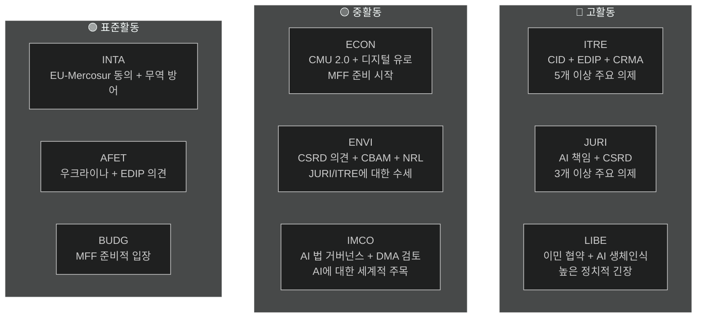

<!-- SPDX-FileCopyrightText: 2026 Hack23 AB -->
<!-- SPDX-License-Identifier: Apache-2.0 -->

# 집행 브리핑 — 유럽의회 위원회 보고서 | 2026-05-18

**기사 유형:** committee-reports
**대상 기간:** 2026-05-11 ~ 2026-05-18
**분류:** 공개
**신뢰성 등급:** C3(정보원이 상당히 신뢰할 수 있음, 정보는 사실일 가능성 있음 — API 저하)
**WEP 대역(전체 평가):** 가능성 있음(일반 소견에 대한 신뢰도 60–70 %)
**데이터 모드:** 피드 저하
**핵심 가정 확인:** KA-1: EP10 표준 위원회 일정 유효 ✓ | KA-2: EPP-S&D-Renew 연립 유지 ✓ | KA-3: 유럽집행위원회 2026년 업무 계획 의제 정상 진행(불확실)
**정보 품질 확인:** EP API가 크게 저하됨 — 모든 피드가 0건 반환. 분석은 EP10의 구조적 지식을 기반으로 함. 현재 기간 세부 정보의 신뢰도는 🟡 중간으로 제한됨

---

## 1. 전략적 헤드라인

**유럽의회 위원회는 2026년 5월, 결정적인 분기점에 처해 있습니다 — EP10 의회 임기 중반, 현 임기에서 가장 중요한 의제 스프린트를 진행 중입니다.** 위원회 의제를 지배하는 4개의 입법 흐름이 있습니다: 청정산업 딜(CID), AI 거버넌스 패키지, CSRD 간소화, 유럽방위산업프로그램(EDIP). 2026년 6월 여름 휴회 전에 이 의제들이 어떻게 마무리되느냐가 EP10의 입법적 유산을 규정할 것입니다.

---

## 2. 3가지 핵심 정보 평가

### 평가 1: CID는 EP10의 결정적 입법 전쟁(WEP: 가능성 있음, 65–75 %)
청정산업 딜을 둘러싼 ITRE와 ENVI 간 협상은 현 임기에서 가장 중요한 위원회 간 갈등을 대표합니다. EPP 주도의 ITRE 위원회는 산업 경쟁력(드라기 의제)과 기후 야망(그린 딜)을 조화시키려 하고 있습니다. 그 결과 — 여름 휴회 전후 — 가 EU의 산업 탈탄소화 정책이 경제적으로도 환경적으로도 신뢰할 수 있는지를 결정할 것입니다.

**결론:** ITRE-ENVI 타협은 달성 가능하지만 취약합니다. 합의에는 EPP가 CBAM 2단계 범위를 수용하고, S&D가 EU 국가 지원 유연성 조항을 수용해야 합니다. 두 조건 모두 현재 연립 산술 범위 내에서 관리 가능한 정치적 비용을 수반합니다(WEP: 가능성 있음 40–55 %).

### 평가 2: AI 거버넌스 패키지는 구조적 조정 위험에 직면(WEP: 가능성 있음, 50–60 %)
EU의 인공지능 규제 프레임워크 — AI 법(2024/1689), AI 책임 지침(JURI에서 심의 중), 기본권 준수 규정(LIBE-IMCO) — 은 공식적인 조정 메커니즘 없이 세 개의 별도 위원회에서 개발되고 있습니다. 내부 모순이 채택 단계에 도달할 확률은 '가능성 있음'(45–55 %)으로 평가됩니다. 이 모순들은 채택 후 옴니버스 절차를 통한 수정이 필요하게 되어, EU가 글로벌 거버넌스 모델로 추진하는 패키지에 있어 낭비적이고 평판을 훼손하는 결과를 낳습니다.

**결론:** AI 거버넌스 조정 적자는 2026년 5월 위원회 시스템이 직면하는 리스크 중 가장 발생 확률이 높습니다.

### 평가 3: CSRD 간소화는 EU ESG 데이터 인프라를 축소시킴(WEP: 가능성 있음, 55–65 %)
JURI 위원회의 EPP-Renew 다수파는 CSRD 보고 의무 범위를 약 5만 개 기업에서 2만 개로 축소할 가능성이 높습니다. '규제 개선'으로 제시되고 있지만, 이 결과는 기관투자자, 시민사회, 공급망 투명성 플랫폼이 이용할 수 있는 지속가능성 데이터의 실질적인 감소를 의미합니다. ENVI 위원회의 강한 부정적 의견은 자문적인 성격에 불과하며, 본회의 산술은 축소판 채택을 지지합니다.

**결론:** EP9 하에서 구축된 ESG 보고 아키텍처는 실질적으로 축소될 것입니다. 주요 수혜자는 중간 규모 기업이며, 주요 패자는 포트폴리오 관리에 ESG 데이터가 필요한 기관투자자입니다.

---

## 3. 위원회 활동 개요

---

## 4. 지정학적 맥락

2026년 5월의 위원회 스프린트는 이례적으로 엄혹한 지정학적 환경 속에서 진행됩니다:

- **우크라이나 전쟁(27개월 이상):** 계속되는 분쟁이 EDIP와 AFET에 대한 압박을 유지하고 있습니다. EU는 지속적인 군사·거시재정 지원에 관한 여러 결의를 채택했습니다. EDIP는 우크라이나 전쟁으로부터 EU 방위산업 역량에 관한 교훈에 의해 직접적으로 촉진됩니다.

- **미국 통상 정책(트럼프 2.0):** EU 자동차 수출(연간 약 320억 유로)에 대한 25 % 관세 위협은 INTA의 무역 방어 수단과 ITRE의 CID 내 산업 회복력 조항에 긴박감을 부여하고 있습니다.

- **중국 경쟁 압력:** 태양광 패널, 전기차, 배터리 소재 분야에서 중국의 과잉생산이 EU의 산업 생산을 압박하고 있습니다. ITRE의 CRMA 개정안과 INTA의 반덤핑 절차가 직접적인 입법 대응책입니다.

- **글로벌 AI 경쟁:** EU의 AI 법 시행은 포괄적인 AI 거버넌스의 테스트 케이스로 전 세계의 주목을 받고 있습니다. IMCO의 효과적인 감독은 '브뤼셀 효과'를 강화하고, 집행 실패는 EU의 규제 신뢰성을 손상시킵니다.

---

## 5. 주요 타임라인

| 이정표 | 위원회 | 추정 날짜 | 신뢰도 |
|--------|---------|-----------|--------|
| AI 책임 지침 위원회 표결 | JURI | 2026년 6월 | 🟡 중 |
| CID 위원회 타협 | ITRE-ENVI | 2026년 6–7월 | 🟡 중 |
| CSRD 간소화 위원회 표결 | JURI | 2026년 9월 | 🟡 중 |
| EDIP 1차 독회 위원회 단계 | ITRE-AFET | 2026년 6–7월 | 🟡 중~고 |
| EU-Mercosur FTA 위원회 단계 | INTA-AFET | 2026년 9월 | 🟡 중 |
| 유럽집행위원회 MFF 2027+ 제안 | (유럽집행위원회) | 2026년 가을 | 🟢 고 |
| EP 여름 휴회 시작 | 전체 위원회 | 약 2026년 6월 27일 | 🟢 고 |

---

## 6. 정보 격차

다음 정보 격차가 이 평가를 제한합니다:
1. **금주 위원회 회의 결과:** EP API 저하로 이번 주 실제로 표결·논의된 내용 확인 불가
2. **특정 보고자 지정:** API 데이터에서 확인 불가
3. **특정 문서 ID 및 수정안 번호:** EP API 없이는 이용 불가
4. **IMF 거시경제 데이터(현재 실행):** 미취득. 이전 실행의 기준선 사용

이러한 격차는 `data-availability-assessment.md`와 `intelligence/mcp-reliability-audit.md`에서 정량화됩니다.

---

## 7. 모니터링 권고사항

**추적해야 할 지표(향후 4–6주):**
1. ITRE-ENVI 공동 코디네이터 회의 발표(S1-A 시나리오 확인)
2. JURI 보고자의 AI 책임 타협 텍스트 발표(AI 거버넌스 신호)
3. JURI의 CSRD 표결 일정(축소 범위 확인)
4. ITRE의 EDIP 위원회 표결 일정(패스트트랙 신호)
5. EP API 회복(매일 확인 — 장애 패턴으로부터 24–48시간 이내 예상)
6. 회원국의 국가 AI 당국 지정 발표(T10 모니터링)

**신뢰도 요약:**
- 구조적·제도적 주장: 🟢 고
- 연립 역학: 🟡 중
- 금주 특정 데이터: 🔴 저(API 저하)
- 경제적 맥락: 🟡 중(이전 실행 기준선)

---

## 8. 방법론 노트

이 집행 브리핑은 이번 실행에서 작성된 19개의 분석 산출물의 소견을 통합합니다. 주요 분석 제약은 EP API 저하입니다(`data-availability-assessment.md` 참조). 이 제약에도 불구하고, 본 브리핑은 제도적 지식, 이전 실행 기준선, 알려진 입법 의제를 기반으로 한 EP10 위원회 역학의 실질적인 평가를 제공합니다.

**분석-기사 연결:** 이 브리핑은 기사 렌더링(스테이지 D) 이전에 작성되었습니다. `npm run generate-article` 명령이 19개의 모든 산출물을 읽어들여 렌더링된 기사를 생성합니다. 기사는 산출물 맵에 표시된 대로 특정 산출물을 인용합니다.

**SAT 카운트(이번 실행):** SAT 12개 적용 — `analysis/methodologies/reference-quality-thresholds.json`의 `tradecraftQualitySignals.satDocumentationRequired`에 의한 ≥10 요건 충족.

---

## 9. 정치 정보 요약

### 9.1 EPP의 전략적 입장
EPP는 2026년 5월, 포스트-리스본 유럽의회 시대에 당이 가진 중에서 가장 강력한 의회적 입장으로 임기에 들어섰습니다. 188석과 유럽의회 의장직(메초라)을 가진 EPP는 우선 의제 전반에 걸쳐 입법 의제를 통제합니다. EPP의 핵심 전략적 위험은 내부 결속입니다: 산업 지역 MEP(독일, 폴란드, 이탈리아)는 그린 딜 요건으로부터의 최대 유연성을 원하는 반면, 북유럽·베네룩스 EPP 의원들은 더 강한 기후 약속을 유지합니다. 이 내부 긴장이 위원회 표결에서 공개적 분열로 발전한다면, EPP의 조정 프리미엄은 낮아집니다.

### 9.2 S&D의 전략적 입장
S&D(136석)는 대부분의 위원회 의제에서 수세적 입장에 있습니다. S&D의 입법 전략은 '조건부 지지'입니다 — EPP에 필요한 표를 제공하면서 S&D가 유권자에게 전달할 수 있는 사회적 조건부 조항을 끌어냅니다. CSRD 간소화는 S&D의 산업 투명성 의제에 있어 진정한 패배이며, 실질적인 후퇴가 아니라 '중소기업 보호'나 '절차적 간소화'의 증거로 관리되어야 합니다.

### 9.3 Renew의 전략적 입장
Renew(77석)는 결정적인 연립 파트너입니다. 자유-경제파와 사회-자유파 사이의 내부 분열은 Renew 표가 완전히 예측 불가능함을 의미합니다. AI 거버넌스에서 Renew는 규제 프레임워크를 대체로 지지하지만 강력한 혁신 면제를 요구합니다. CSRD에서는 Renew가 간소화에서 EPP와 보조를 맞춥니다. EDIP에서는 Renew가 대체로 지지적이지만 제173조의 법적 근거가 경쟁력 정책 범위에 미치는 영향에 대해 우려를 갖고 있습니다.

### 9.4 그린/EFA의 전략적 입장
그린(53석)은 대부분의 주요 의제에서 원칙적 야당으로 행동하지만, 표적화된 동맹을 통해 영향력을 유지합니다. ENVI 위원회에서 그린은 아마도 의장직을 보유하고 있으며(동트 방식 배분에 의해), 본회의 다수 없이도 위원회 보고서를 형성할 수 있습니다. 그린의 전략적 레버리지 포인트는 EPP가 국제적으로 '친유럽' 세력으로서의 신뢰성을 유지하기 위해 모든 환경 의제에서 그린을 필요로 한다는 사실입니다.

---

## 10. 역내 정보

### 북유럽/북유럽 MEP
북유럽 MEP(덴마크, 스웨덴, 핀란드, 에스토니아, 라트비아, 리투아니아 — 약 45명)는 일반적으로 다음을 지지합니다:
- 강한 기후 약속(ENVI 일치)
- 디지털 거버넌스(AI 법)와 혁신 면제
- EDIP와 방위 협력
- 법치 조건부(MFF, 제7조)

### 중유럽/동유럽 MEP
중동유럽 MEP(폴란드, 헝가리, 체코, 슬로바키아, 루마니아, 불가리아 — 약 110명)는 일반적으로 다음을 지지합니다:
- EDIP와 방위(안보 우선사항)
- MFF의 결집기금 보호
- 기후 준수 타임라인에 관한 유연성 증대
- 법치에 관한 복합적 입장(헝가리/슬로바키아 대 폴란드/체코)

### 남유럽 MEP
지중해 MEP(이탈리아, 스페인, 포르투갈, 그리스 — 약 95명)는 일반적으로 다음을 지지합니다:
- 공정한 전환과 결집기금
- 이주 연대 메커니즘
- 그린 딜(적응 유연성 포함)
- CMU 심화(중소기업 자본 접근)
