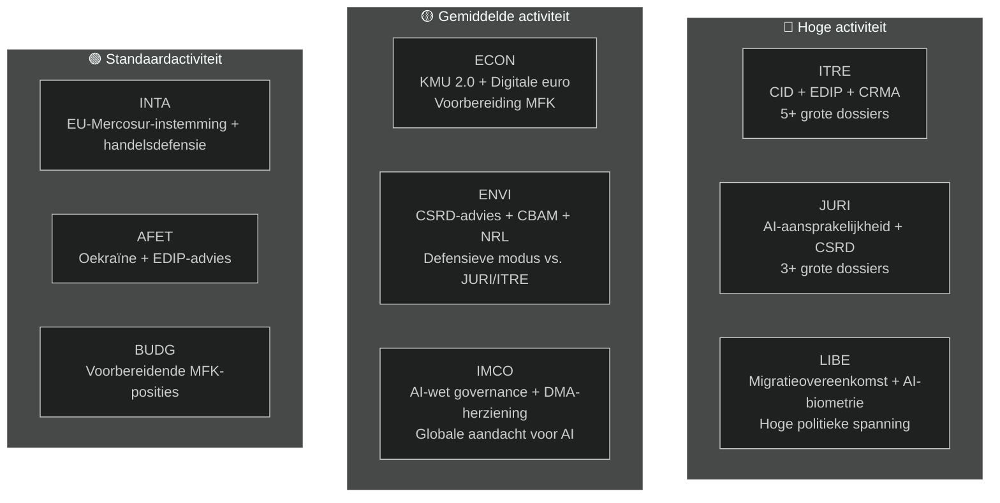

<!-- SPDX-FileCopyrightText: 2026 Hack23 AB -->
<!-- SPDX-License-Identifier: Apache-2.0 -->

# Uitvoerende samenvatting — EP-commissierapporten | 2026-05-18

**Artikeltype:** committee-reports
**Bestreken periode:** 2026-05-11 tot 2026-05-18
**Classificatie:** Openbaar
**Admiraliteitsgraad:** C3 (Bron redelijk betrouwbaar, informatie mogelijk juist — gedegradeerde API)
**WEP-band (algehele beoordeling):** Waarschijnlijk (60–70 % vertrouwen in algemene bevindingen)
**Datamodus:** gedegradeerde feeds
**Controle van kernveronderstellingen:** KA-1: standaard commissiekalender EP10 van kracht ✓ | KA-2: EPP-S&D-Renew-coalitie houdt stand ✓ | KA-3: dossiers werkprogramma 2026 van de Commissie op schema (onzeker)
**Controle informatiekwaliteit:** EP API ernstig gedegradeerd — alle feeds leverden 0 items op; analyse gebaseerd op structurele kennis van EP10; vertrouwen beperkt tot 🟡 Midden voor specifieke gegevens van de huidige periode

---

## 1. Strategische koptekst

**De commissies van het Europees Parlement bevinden zich in mei 2026 op een cruciaal kruispunt — halverwege het wetgevend mandaat van EP10, verwikkeld in de meest bepalende dossiersprint van de zittingsperiode.** Vier wetgevende sporen domineren de commissieagenda: de Clean Industrial Deal (CID), het AI-gouvernancepakket, de CSRD-vereenvoudiging en het Europees Defensie-Industrieel Programma (EDIP). Hoe deze dossiers worden afgerond voor het zomerreces in juni 2026 zal de wetgevende nalatenschap van EP10 bepalen.

---

## 2. Drie centrale inlichtingenbeoordelen

### Beoordeling 1: De CID is de bepalende wetgevingstrijd van EP10 (WEP: Waarschijnlijk, 65–75 %)
De onderhandeling over de Clean Industrial Deal tussen ITRE en ENVI vertegenwoordigt het meest bepalende inter-commissieconflict van de huidige zittingsperiode. De ITRE-commissie, onder EPP-leiding, tracht industriële concurrentiekracht (Draghi-agenda) te verzoenen met klimaatambitie (Green Deal). De uitkomst — waarschijnlijk voor of kort na het zomerreces — zal bepalen of het EU-beleid voor industriële decarbonisatie geloofwaardig is in zowel economische als milieutermen.

**Conclusie:** Het ITRE-ENVI-compromis is haalbaar maar fragiel. Een akkoord vereist dat de EPP de reikwijdte van CBAM fase 2 accepteert en dat S&D flexibiliteitsbepalingen voor staatssteun accepteert. Beide voorwaarden impliceren reële maar beheersbare politieke kosten binnen de huidige coalitie-arithmetiek (WEP: Waarschijnlijk 40–55 %).

### Beoordeling 2: Het AI-gouvernancepakket staat voor structureel coördinatierisico (WEP: Waarschijnlijk, 50–60 %)
Het EU-regelgevend kader voor artificiële intelligentie — bestaande uit de AI-wet (2024/1689), de AI-aansprakelijkheidsrichtlijn (in commissie bij JURI) en grondrechtconformiteitsregelingen (LIBE-IMCO) — wordt ontwikkeld in drie afzonderlijke commissies zonder formeel coördinatiemechanisme. De kans dat interne inconsistenties het aannamestadium bereiken wordt beoordeeld als Waarschijnlijk (45–55 %). Deze inconsistenties zouden een correctie na aanname vereisen via een omnibusprocedure — een verspilling en reputatieschade voor een pakket dat de EU als mondiaal governancemodel promoot.

**Conclusie:** Het AI-gouvernance-coördinatietekort is het risico met de hoogste kans waarvoor het commissiesysteem in mei 2026 staat.

### Beoordeling 3: De CSRD-vereenvoudiging zal de EU-ESG-data-infrastructuur verkleinen (WEP: Waarschijnlijk, 55–65 %)
De EPP-Renew-meerderheid in de JURI-commissie zal de CSRD-rapportagereikwijdte waarschijnlijk terugbrengen van circa 50.000 naar 20.000 bedrijven. Hoewel gepresenteerd als "Betere regelgeving", vertegenwoordigt deze uitkomst een materiële vermindering van de duurzaamheidsgegevens beschikbaar voor institutionele beleggers, het maatschappelijk middenveld en transparantieplatforms voor toeleveringsketens. Het scherp negatieve advies van de ENVI-commissie is slechts raadgevend; de plenaire arithmetiek begunstigt aanname van de ingekorte versie.

**Conclusie:** De ESG-rapportagearchitectuur die onder EP9 werd opgebouwd zal materieel worden verminderd. De voornaamste begunstigden zijn middelgrote bedrijven; de voornaamste verliezers zijn institutionele beleggers die ESG-data nodig hebben voor portefeuillebeheer.

---

## 3. Overzicht commissieactiviteiten

---

## 4. Geopolitieke context

De commissiesprint van mei 2026 vindt plaats in een uitzonderlijk veeleisende geopolitieke omgeving:

- **Oorlog in Oekraïne (maand 27+):** Het voortdurende conflict houdt de druk op EDIP en AFET in stand. Het EP heeft meerdere resoluties aangenomen over aanhoudende militaire en macrofinanciële steun. EDIP wordt rechtstreeks aangedreven door de lessen uit de oorlog in Oekraïne over de Europese defensie-industriële capaciteit.

- **Amerikaans handelsbeleid (Trump 2.0):** De dreiging van 25 % tarieven op EU-auto-uitvoer (~€32 mrd./jaar in handel) creëert urgentie rondom de handelsdefensie-instrumenten van INTA en de industriële veerkrachtsbepalingen van ITRE in de CID.

- **Chinese concurrentiedruk:** Chinese overcapaciteit in zonnepanelen, elektrische voertuigen en batterijmaterialen drukt de EU-industriële productie. De CRMA-amendementen van ITRE en de antidumpingprocedures van INTA zijn de directe wetgevingsreacties.

- **Mondiaal AI-wedloop:** De EU-implementatie van de AI-wet wordt wereldwijd gevolgd als testcase voor uitvoerige AI-governance. Effectief IMCO-toezicht versterkt het "Brussel-effect"; falende handhaving schaadt de regulatoire geloofwaardigheid van de EU.

---

## 5. Kritieke tijdlijnen

| Mijlpaal | Commissie | Geschatte datum | Vertrouwen |
|---------|---------|----------------|-----------|
| Commissiestemming over de AI-aansprakelijkheidsrichtlijn | JURI | Juni 2026 | 🟡 Midden |
| CID-commissiecompromis | ITRE-ENVI | Juni–juli 2026 | 🟡 Midden |
| Commissiestemming over CSRD-vereenvoudiging | JURI | September 2026 | 🟡 Midden |
| Commissiestadium eerste lezing EDIP | ITRE-AFET | Juni–juli 2026 | 🟡 Midden-Hoog |
| Commissiestadium EU-Mercosur HVA | INTA-AFET | September 2026 | 🟡 Midden |
| Commissievoorstel MFK 2027+ | (Commissie) | Najaar 2026 | 🟢 Hoog |
| Begin zomerreces EP | Allen | ~27 juni 2026 | 🟢 Hoog |

---

## 6. Inlichtingenhiaten

De volgende inlichtingenhiaten beperken deze beoordeling:
1. **Uitkomsten commissievergaderingen deze week:** EP API-degradatie verhindert bevestiging van wat deze week daadwerkelijk werd gestemd/besproken
2. **Specifieke rapporteurstoewijzingen:** Kunnen niet worden bevestigd vanuit API-gegevens
3. **Specifieke document-ID's en amendementnummers:** Niet beschikbaar zonder EP API
4. **IMF macro-economische gegevens (huidige run):** Niet opgehaald; basislijn vorige run gebruikt

Deze hiaten worden gekwantificeerd in `data-availability-assessment.md` en `intelligence/mcp-reliability-audit.md`.

---

## 7. Aanbevelingen voor monitoring

**Te volgen indicatoren (komende 4–6 weken):**
1. Aankondiging gezamenlijke coördinatorenvergadering ITRE-ENVI (bevestigt scenario S1-A)
2. Publicatie door JURI-rapporteur van compromistekst over AI-aansprakelijkheid (AI-governance-signaal)
3. Planning CSRD-stemming in JURI (bevestiging ingekorte reikwijdte)
4. Planning EDIP-commissiestemming in ITRE (signal snelle procedure)
5. EP API-herstel (dagelijks controleren — verwacht binnen 24–48 uur op basis van uitvalpatroon)
6. Aankondigingen benoeming nationale AI-autoriteiten (T10-monitoring)

**Samenvatting vertrouwensniveaus:**
- Structurele/institutionele beweringen: 🟢 Hoog
- Coalitiedynamiek: 🟡 Midden
- Specifieke weekgegevens: 🔴 Laag (API-degradatie)
- Economische context: 🟡 Midden (basislijn vorige run)

---

## 8. Methodologische noot

Deze uitvoerende samenvatting synthetiseert bevindingen van 19 analyseartifacten geproduceerd in deze run. De primaire analytische beperking is de EP API-degradatie (zie `data-availability-assessment.md`). Ondanks deze beperking biedt de samenvatting een substantiële beoordeling van de EP10-commissiedynamiek op basis van institutionele kennis, basislijnen van vorige runs en de bekende wetgevingsagenda.

**Analyse-naar-artikel-keten:** Deze samenvatting werd geproduceerd vóór het artikel-renderen (fase D). Het commando `npm run generate-article` leest alle 19 artefacten voor het produceren van het gerenderde artikel. Het artikel zal specifieke artefacten citeren zoals aangegeven in de artefactenkaart.

**SAT-telling (deze run):** 12 SAT's toegepast — voldoet aan de vereiste van ≥ 10 per `analysis/methodologies/reference-quality-thresholds.json` `tradecraftQualitySignals.satDocumentationRequired`.

---

## 9. Politieke inlichtingensamenvatting

### 9.1 Strategische positie EPP
De EPP betreedt mei 2026 in de sterkste parlementaire positie die de partij heeft gehad in het post-Lissabon EP-tijdperk. Met 188 zetels en het EP-voorzitterschap (Metsola) controleert de EPP de wetgevingsagenda op haar prioriteitsdossiers. Het centrale strategische risico van de EPP is interne coherentie: MEP's uit industrieregio's (Duitsland, Polen, Italië) willen maximale flexibiliteit ten opzichte van Green Deal-vereisten, terwijl noordse-Benelux EPP-leden sterkere klimaatverplichtingen handhaven. Als deze interne spanning uiteenspat in openbare splitsingen bij commissiestemmen, vermindert de coördinatiepremie van de EPP.

### 9.2 Strategische positie S&D
De S&D (136 zetels) staat in defensieve modus op de meeste commissiedossiers. De wetgevingsstrategie van S&D is die van "voorwaardelijke steun" — de EPP de benodigde stemmen geven terwijl sociale conditioneringsbepalingen worden bedongen die S&D aan haar kiezers kan communiceren. De CSRD-vereenvoudiging is een echte nederlaag voor S&D's agenda voor industriële transparantie; die moet worden beheerd als bewijs van "bescherming van het mkb" of "procedurele vereenvoudiging" en niet als substantieel terugschreden.

### 9.3 Strategische positie Renew
Renew (77 zetels) is de doorslaggevende coalitiepartner. Interne verdeeldheden tussen liberaal-economische en sociaal-liberale fracties betekenen dat Renew-stemmen niet volledig voorspelbaar zijn. Op het gebied van AI-governance ondersteunt Renew het regelgevend kader in grote lijnen maar wenst sterke innovatie-uitzonderingen. Bij CSRD is Renew gealigneerd met de EPP op vereenvoudiging. Bij EDIP is Renew in grote lijnen ondersteunend maar heeft zorgen over de implicaties van de rechtsgrondslag van artikel 173 voor de reikwijdte van het concurrentievermogenbeleid.

### 9.4 Strategische positie Groenen/EVA
De Groenen (53 zetels) treden op als principiële oppositie bij de meeste grote dossiers maar behouden invloed via gerichte allianties. In de ENVI-commissie hebben de Groenen waarschijnlijk het voorzitterschap (via D'Hondt-toewijzing) en kunnen commissierapporten vormgeven zonder plenaire meerderheid. Het strategische hefboompunt van de Groenen is het feit dat de EPP de Groenen nodig heeft bij alle milieudossiers om de geloofwaardigheid als "pro-Europese" kracht internationaal te handhaven.

---

## 10. Transregionale inlichtingen

### Noordse/Noord-Europese EP-leden
Noordse MEP's (Denemarken, Zweden, Finland, Estland, Letland, Litouwen — circa 45 MEP's in totaal) steunen in het algemeen:
- Sterke klimaatverplichtingen (ENVI-afstemming)
- Digitale governance (AI-wet) met innovatie-uitzonderingen
- EDIP en defensiesamenwerking
- Rechtsstaatconditionering (MFK, artikel 7)

### Midden-/Oost-Europese EP-leden
CEE-MEP's (Polen, Hongarije, Tsjechië, Slowakije, Roemenië, Bulgarije — circa 110 MEP's) steunen in het algemeen:
- EDIP en defensie (veiligheidsprioriteit)
- Bescherming van het Cohesiefonds in het MFK
- Meer flexibiliteit bij klimaatnalevingtijdlijnen
- Gemengde standpunten over de rechtsstaat (Hongarije/Slowakije vs. Polen/Tsjechië)

### Zuid-Europese EP-leden
Middellandse Zee-MEP's (Italië, Spanje, Portugal, Griekenland — circa 95 MEP's) steunen in het algemeen:
- Rechtvaardige transitie en cohesiefondsen
- Solidariteitsmechanismen voor migratie
- Green Deal (met aanpassingsflexibiliteit)
- Verdieping van de KMU (toegang tot kapitaal voor het mkb)
