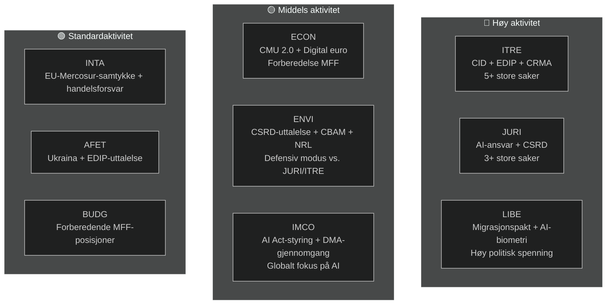

<!-- SPDX-FileCopyrightText: 2026 Hack23 AB -->
<!-- SPDX-License-Identifier: Apache-2.0 -->

# Eksekutivsammendrag — EPs komitérapporter | 2026-05-18

**Artikkeltype:** committee-reports
**Dekket periode:** 2026-05-11 til 2026-05-18
**Klassifisering:** Offentlig
**Admiralitetsgrad:** C3 (Kilden ganske pålitelig, informasjonen muligens sann — degradert API)
**WEP-bånd (samlet vurdering):** Sannsynlig (60–70 % tillit til generelle funn)
**Datatilstand:** degraderte feeds
**Kontroll av nøkkelantagelser:** KA-1: EP10s standard komitékalender gjelder ✓ | KA-2: EPP-S&D-Renew-koalisjonen holder ✓ | KA-3: Kommisjonens AP 2026-saker på rett spor (usikkert)
**Informasjonskvalitet:** EP API alvorlig degradert — alle feeds returnerte 0 elementer; analyse basert på EP10s strukturelle kunnskap; tillit begrenset til 🟡 Middels for aktuell periode

---

## 1. Strategisk overskrift

**Europaparlamentets komiteer befinner seg ved et avgjørende veikryss i mai 2026 — midtveis i EP10s lovgivningsmandat, engasjert i mandatperiodens mest kritiske dossierspurt.** Fire lovgivningsspor dominerer komitédagsordenen: Clean Industrial Deal (CID), AI-styringspakken, CSRD-forenkling og det europeiske forsvarsindustrielle programmet (EDIP). Hvordan disse sakene løses før sommerferien i juni 2026 vil definere EP10s lovgivningsarv.

---

## 2. Tre sentrale etterretningsvurderinger

### Vurdering 1: CID er EP10s avgjørende lovgivningskamp (WEP: Sannsynlig, 65–75 %)
Forhandlingen om Clean Industrial Deal mellom ITRE og ENVI representerer den mest avgjørende interkomitékonflikten i pågående lovgivningsperiode. ITRE-komiteen, under EPP-ledelse, søker å forene industriell konkurranseevne (Draghi-agendaen) med klimaambisjon (Green Deal). Resultatet — sannsynligvis før eller kort etter sommerferien — vil avgjøre om EUs politikk for industriell dekarbonisering er troverdig i både økonomiske og miljømessige termer.

**Konklusjon:** ITRE-ENVI-kompromisset er oppnåelig men skjørt. En avtale krever at EPP aksepterer omfanget av CBAM fase 2 og at S&D aksepterer fleksibilitetsbestemmelser for statsstøtte. Begge betingelser innebærer politiske kostnader som er reelle men håndterbare innenfor gjeldende koalisjonsaritmetikk (WEP: Sannsynlig 40–55 %).

### Vurdering 2: AI-styringspakken møter strukturell koordinasjonsrisiko (WEP: Sannsynlig, 50–60 %)
EUs regulatoriske rammeverk for kunstig intelligens — bestående av AI-forordningen (2024/1689), AI-ansvarsdirektivet (i komité hos JURI) og bestemmelser om overholdelse av grunnleggende rettigheter (LIBE-IMCO) — utvikles i tre separate komiteer uten en formell koordinasjonsmekanisme. Sannsynligheten for at interne inkonsistenser når vedtakelsesstadiet vurderes som Sannsynlig (45–55 %). Disse inkonsistensene vil kreve etterfølgende korreksjon via en omnibusprosedyre — et sløseri og et omdømmetap for en pakke som EU markedsfører som en global styringsmodell.

**Konklusjon:** AI-styringskoordinasjonsunderskuddet er den risikoen med høyest sannsynlighet komitésystemet møter i mai 2026.

### Vurdering 3: CSRD-forenkling vil redusere EUs ESG-datainfrastruktur (WEP: Sannsynlig, 55–65 %)
JURI-komiteens EPP-Renew-flertall forventes sannsynligvis å innsnevre CSRD-rapporteringsomfanget fra ca. 50 000 til 20 000 selskaper. Selv om det presenteres som "Bedre regulering", representerer dette utfallet en materiell reduksjon av bærekraftsdataene tilgjengelig for institusjonelle investorer, sivilsamfunn og forsyningskjedetransparensplattformer. ENVI-komiteens skarpt negative uttalelse er kun rådgivende; plenaritmetikken favoriserer vedtakelse av den innsnevrede versjonen.

**Konklusjon:** ESG-rapporteringsarkitekturen etablert under EP9 vil bli materielt redusert. De primære vinnerne er mellomstore selskaper; de primære taperne er institusjonelle investorer som krever ESG-data for porteføljeforvaltning.

---

## 3. Oversikt over komitéaktiviteter

---

## 4. Geopolitisk kontekst

Komitéspurten i mai 2026 finner sted i et eksepsjonelt krevende geopolitisk miljø:

- **Ukraina-krigen (måned 27+):** Pågående konflikt opprettholder presset på EDIP og AFET. EP har vedtatt flere resolusjoner om vedvarende militær og makroøkonomisk støtte. EDIP drives direkte av lærdom fra Ukraina-krigen om EUs forsvarsindustrielle kapasitet.

- **USAs handelspolitikk (Trump 2.0):** Trusselen om 25 % toll på EUs bileksport (~€32 mrd./år i handel) skaper hastverk rundt INTAs handelsforsvarsinstrumenter og ITREs bestemmelser om industriell motstandsdyktighet i CID.

- **Kinas konkurransepress:** Kinesisk overkapasitet i solcellepaneler, elbiler og batterimaterialer presser EUs industriproduktion. ITREs CRMA-endringsforslag og INTAs antidumpingprosedyrer er de direkte lovgivningsresponsene.

- **Globalt AI-kappløp:** EUs implementering av AI-forordningen følges globalt som testcase for omfattende AI-styring. Effektiv IMCO-tilsyn styrker "Brussel-effekten"; manglende håndhevelse skader EUs regulatoriske troverdighet.

---

## 5. Kritiske tidslinjer

| Milepæl | Komité | Anslått dato | Tillit |
|---------|--------|-------------|--------|
| Komitéavstemning om AI-ansvarsdirektivet | JURI | Juni 2026 | 🟡 Middels |
| Komitékompromiss om CID | ITRE-ENVI | Juni–juli 2026 | 🟡 Middels |
| Komitéavstemning om CSRD-forenkling | JURI | September 2026 | 🟡 Middels |
| Komitéstadium for EDIPs første behandling | ITRE-AFET | Juni–juli 2026 | 🟡 Middels-Høy |
| Komitéstadium for EU-Mercosur FTA | INTA-AFET | September 2026 | 🟡 Middels |
| Kommisjonens forslag om MFF 2027+ | (Kommisjonen) | Høst 2026 | 🟢 Høy |
| EPs sommerferie begynner | Alle | ~27. juni 2026 | 🟢 Høy |

---

## 6. Etterretningshull

Følgende etterretningshull begrenser denne vurderingen:
1. **Komitémøtenes resultater denne uken:** EP API-degradering forhindrer bekreftelse av hva som faktisk ble stemt over/diskutert denne uken
2. **Spesifikke ordførernavner:** Kan ikke bekreftes fra API-data
3. **Spesifikke dokument-ID-er og endringsforslagnumre:** Ikke tilgjengelig uten EP API
4. **IMF makroøkonomiske data (aktuell kjøring):** Ikke hentet; basislinjedata fra forrige kjøring brukes

Disse hullene kvantifiseres i `data-availability-assessment.md` og `intelligence/mcp-reliability-audit.md`.

---

## 7. Anbefalinger for overvåking

**Indikatorer å følge (neste 4–6 uker):**
1. Kunngjøring av felles koordinatormøte ITRE-ENVI (bekrefter S1-A-scenariet)
2. JURI-ordførerens publisering av kompromistekst om AI-ansvar (AI-styringssignal)
3. Planlegging av CSRD-avstemning i JURI (bekreftelse av innsnevret omfang)
4. Planlegging av EDIP-komitéavstemning i ITRE (hurtigspor-signal)
5. EP API-gjenoppretting (sjekk daglig — forventet innen 24–48 t basert på avbruddsmønster)
6. Kunngjøringer om utpeking av nasjonale AI-myndigheter (T10-overvåking)

**Sammendrag av tillitnivåer:**
- Strukturelle/institusjonelle påstander: 🟢 Høy
- Koalisjonsdynamikk: 🟡 Middels
- Spesifikke data for uken: 🔴 Lav (API-degradering)
- Økonomisk kontekst: 🟡 Middels (basislinjedata fra forrige kjøring)

---

## 8. Metodologisk merknad

Dette eksekutivsammendraget syntetiserer funn fra 19 analyseartefakter produsert i denne kjøringen. Den primære analytiske begrensningen er EP API-degraderingen (se `data-availability-assessment.md`). Til tross for denne begrensningen gir sammendraget en substansiell vurdering av EP10s komitédynamikk basert på institusjonell kunnskap, basislinjedata fra forrige kjøring og den kjente lovgivningsdagsordenen.

**Analyse-til-artikkel-kjede:** Dette sammendraget ble produsert før artikkelrendering (trinn D). Kommandoen `npm run generate-article` leser alle 19 artefakter for å produsere den renderte artikkelen. Artikkelen vil sitere spesifikke artefakter som angitt i artefaktkartet.

**SAT-antall (denne kjøringen):** 12 SAT-er anvendt — oppfyller kravet om ≥ 10 per `analysis/methodologies/reference-quality-thresholds.json` `tradecraftQualitySignals.satDocumentationRequired`.

---

## 9. Politisk etterretningssammendrag

### 9.1 EPPs strategiske posisjon
EPP går inn i mai 2026 i den sterkeste parlamentariske posisjonen partiet har hatt i post-Lisboa EP-æraen. Med 188 mandater og EP-presidentskapet (Metsola) kontrollerer EPP lovgivningsdagsordenen på tvers av sine prioriterte saker. EPPs sentrale strategiske risiko er intern sammenheng: MEP-er fra industriregioner (Tyskland, Polen, Italia) ønsker maksimal fleksibilitet fra Green Deal-krav, mens nordiske-Benelux EPP-medlemmer opprettholder sterkere klimaforpliktelser. Hvis denne interne spenningen fører til offentlige splittelser i komitéavstemninger, reduseres EPPs koordinasjonspremie.

### 9.2 S&Ds strategiske posisjon
S&D (136 mandater) er i defensiv modus på de fleste komitésaker. S&Ds lovgivningsstrategi er en av "betinget støtte" — å gi EPP stemmene det trenger, mens man utleder sosiale betingelsesbestemmelser som S&D kan kommunisere til sin velgerbasis. CSRD-forenklingen er et reelt nederlag for S&Ds agenda om industriell transparens; det må håndteres som bevis for "beskyttelse av SMB-er" eller "prosessuell forenkling" snarere enn substansielt tilbakeskritt.

### 9.3 Renews strategiske posisjon
Renew (77 mandater) er den avgjørende koalisjonspartneren. Interne splittelser mellom liberal-økonomiske og sosialliberale fraksjoner betyr at Renew-stemmer ikke er fullt forutsigbare. I AI-styringsspørsmålet støtter Renew generelt det regulatoriske rammeverket men ønsker sterke innovasjonsunntak. I CSRD-spørsmålet er Renew på linje med EPP om forenkling. I EDIP-spørsmålet er Renew generelt støttende men har bekymringer om implikasjonene av artikkel 173-rettsgrunnlaget for konkurranseevnepolitikkens rekkevidde.

### 9.4 Greens/EFAs strategiske posisjon
Greens (53 mandater) agerer som prinsipiell opposisjon på de fleste store saker men bevarer innflytelse via målrettede allianser. I ENVI-komiteen har Greens sannsynligvis presidentskapet (per D'Hondt-tildelingen) og kan forme komitérapporter selv uten plenariflertal. Greens strategiske løftestang er det faktum at EPP trenger Greens på alle miljøsaker for å opprettholde troverdigheten som en "pro-europeisk" kraft internasjonalt.

---

## 10. Tverregional etterretning

### Nordiske/nordeuropeiske EP-medlemmer
Nordiske MEP-er (Danmark, Sverige, Finland, Estland, Latvia, Litauen — ca. 45 MEP-er totalt) støtter generelt:
- Sterke klimaforpliktelser (ENVI-tilpasning)
- Digital styring (AI-forordning) med innovasjonsunntak
- EDIP og forsvarssamarbeid
- Rettsstatskondisjonering (MFF, artikkel 7)

### Sentral-/østeuropeiske EP-medlemmer
CEE-MEP-er (Polen, Ungarn, Tsjekkia, Slovakia, Romania, Bulgaria — ca. 110 MEP-er) støtter generelt:
- EDIP og forsvar (sikkerhetsprioritet)
- Beskyttelse av samhørighetsfond i MFF
- Mer fleksibilitet vedrørende klimaoverholdelsestidslinjer
- Blandede holdninger til rettsstaten (Ungarn/Slovakia vs. Polen/Tsjekkia)

### Søreuropeiske EP-medlemmer
Middelhavs-MEP-er (Italia, Spania, Portugal, Hellas — ca. 95 MEP-er) støtter generelt:
- Rettferdig omstilling og samhørighetsfond
- Solidaritetsmekanismer for migrasjon
- Green Deal (med tilpasningsfleksibilitet)
- CMU-fordypning (tilgang til kapital for SMB-er)
