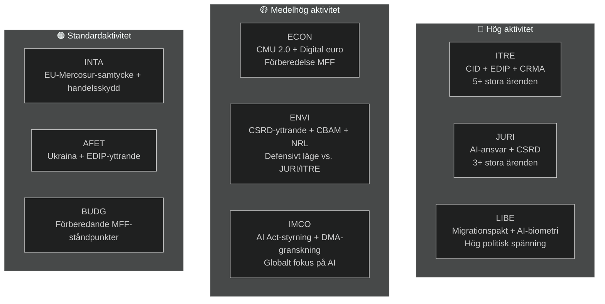

<!-- SPDX-FileCopyrightText: 2026 Hack23 AB -->
<!-- SPDX-License-Identifier: Apache-2.0 -->

# Exekutiv sammanfattning — EP:s utskottsrapporter | 2026-05-18

**Artikeltyp:** committee-reports
**Period:** 2026-05-11 till 2026-05-18
**Klassificering:** Offentlig
**Admiralitetsklass:** C3 (Källan ganska tillförlitlig, information möjligen sann — degraderat API)
**WEP-band (samlad bedömning):** Sannolikt (60–70 % förtroende för allmänna slutsatser)
**Dataläge:** degraderade flöden
**Kontroll av nyckelantagan:** KA-1: EP10:s ordinarie utskottskalender gäller ✓ | KA-2: EPP-S&D-Renew-koalitionen håller ✓ | KA-3: Kommissionens AP 2026-ärenden på spår (osäkert)
**Informationskvalitet:** EP API allvarligt degraderat — alla flöden returnerade 0 poster; analys baserad på EP10:s strukturella kännedom; tillförlit begränsad till 🟡 Medel för aktuell period

---

## 1. Strategisk rubrik

**Europaparlamentets utskott befinner sig vid ett avgörande vägskäl i maj 2026 — mitt i EP10:s lagstiftningsmandat, djupt engagerade i mandatperiodens mest kritiska dossiermaraton.** Fyra lagstiftningsspår dominerar utskottsdagordningen: Clean Industrial Deal (CID), AI-styrningspaketet, CSRD-förenkling och det europeiska försvarsindustriella programmet (EDIP). Hur dessa ärenden löses innan sommaruppehållet i juni 2026 kommer att definiera EP10:s lagstiftningsarv.

---

## 2. Tre centrala underrättelsebedömningar

### Bedömning 1: CID är EP10:s avgörande lagstiftningsstrid (WEP: Sannolikt, 65–75 %)
Förhandlingen om Clean Industrial Deal mellan ITRE och ENVI representerar den mest avgörande interutskottskonflikten under pågående lagstiftningsperiod. Utskottet ITRE, under EPP-ledning, söker förena industriell konkurrenskraft (Draghiagendan) med klimatambition (Green Deal). Resultatet — troligen före eller strax efter sommaruppehållet — kommer att avgöra huruvida EU:s politik för industriell dekarbonisering är trovärdig i både ekonomiska och miljömässiga termer.

**Slutsats:** ITRE-ENVI-kompromissen är uppnåelig men skör. En uppgörelse kräver att EPP accepterar räckvidden för CBAM fas 2 och att S&D accepterar flexibilitetsprovision för statligt stöd. Båda villkoren innebär politiska kostnader som är reella men hanterbara inom den nuvarande koalitionsaritmetiken (WEP: Sannolikt 40–55 %).

### Bedömning 2: AI-styrningspaketet möter strukturell koordinationsrisk (WEP: Sannolikt, 50–60 %)
EU:s regelverk för artificiell intelligens — bestående av AI-förordningen (2024/1689), AI-ansvarsdirektivet (i utskott hos JURI) och bestämmelser om efterlevnad av grundläggande rättigheter (LIBE-IMCO) — utvecklas i tre separata utskott utan formell samordningsmekanism. Sannolikheten att interna inkonsekvenser når antagandesteget bedöms som Sannolikt (45–55 %). Dessa inkonsekvenser skulle kräva korrigering i efterhand via en omnibusprocedur — ett slöseri och en anseendeskada för ett paket som EU marknadsför som global styrningsmodell.

**Slutsats:** Samordningsunderskottet i AI-styrningen är den risk med högst sannolikhet som utskottssystemet möter i maj 2026.

### Bedömning 3: CSRD-förenklingen minskar EU:s ESG-datainfrastruktur (WEP: Sannolikt, 55–65 %)
JURI-utskottets EPP-Renew-majoritet förväntas sannolikt begränsa CSRD-rapporteringsomfattningen från ungefär 50 000 till 20 000 företag. Även om detta framställs som "Bättre reglering" innebär utfallet en materiell minskning av tillgängliga hållbarhetsdata för institutionella investerare, civilsamhälle och leverantörskedjetransparensplattformar. ENVI-utskottets skarpt negativa yttrande är enbart rådgivande; plenieriets arithmetic gynnar antagande av den begränsade versionen.

**Slutsats:** Den ESG-rapporteringsarkitektur som etablerades under EP9 kommer att minska materiellt. Huvudvinnare är medelstora företag; huvudförlorare är institutionella investerare som behöver ESG-data för portföljförvaltning.

---

## 3. Översikt över utskottsverksamhet

---

## 4. Geopolitisk kontext

Utskottsmaratonnet i maj 2026 äger rum i en exceptionellt krävande geopolitisk miljö:

- **Ukrainakriget (månad 27+):** Pågående konflikt upprätthåller trycket på EDIP och AFET. EP har antagit flera resolutioner om fortsatt militärt och makroekonomiskt stöd. EDIP drivs direkt av lärdomar från Ukrainakriget om EU:s försvarsindustriella kapacitet.

- **USA:s handelspolitik (Trump 2.0):** Hotet om 25 % tullar på EU:s fordonsexport (~€32 md/år i handel) skapar brådska kring INTA:s handelsskyddsinstrument och ITRE:s bestämmelser om industriell motståndskraft i CID.

- **Kinas konkurrenstryck:** Kinesisk överkapacitet inom solpaneler, elbilar och batterimaterial pressar EU:s industriproduktion. ITRE:s CRMA-ändringsförslag och INTA:s antidumpingprocedurer är de direkta lagstiftningssvaren.

- **Globalt AI-lopp:** EU:s genomförande av AI-förordningen följs globalt som testfall för heltäckande AI-styrning. Effektiv IMCO-tillsyn stärker "Brysseleffekten"; misslyckad tillämpning skadar EU:s regulatoriska trovärdighet.

---

## 5. Kritiska tidsgränser

| Milstolpe | Utskott | Beräknat datum | Tillförlitlighet |
|-----------|---------|----------------|-----------------|
| Utskottsomröstning om AI-ansvarsdirektivet | JURI | Juni 2026 | 🟡 Medel |
| Utskottskompromiss om CID | ITRE-ENVI | Juni–juli 2026 | 🟡 Medel |
| Utskottsomröstning om CSRD-förenkling | JURI | September 2026 | 🟡 Medel |
| Utskottsstadium för EDIP:s första behandling | ITRE-AFET | Juni–juli 2026 | 🟡 Medel-Hög |
| Utskottsstadium för EU-Mercosur FTA | INTA-AFET | September 2026 | 🟡 Medel |
| Kommissionens förslag om MFF 2027+ | (Kommissionen) | Höst 2026 | 🟢 Hög |
| EP:s sommaruppehåll börjar | Alla | ~27 juni 2026 | 🟢 Hög |

---

## 6. Underrättelseluckor

Följande luckor begränsar denna bedömning:
1. **Utskottsmötenas utfall denna vecka:** EP API-degradering förhindrar bekräftelse av vad som faktiskt omröstades/diskuterades denna vecka
2. **Specifika rapportörnamn:** Kan inte bekräftas från API-data
3. **Specifika dokument-ID och ändringsförslagnummer:** Ej tillgängliga utan EP API
4. **IMF makroekonomiska data (aktuell körning):** Inte hämtade; baslinje från föregående körning används

Dessa luckor kvantifieras i `data-availability-assessment.md` och `intelligence/mcp-reliability-audit.md`.

---

## 7. Rekommendationer för bevakning

**Indikatorer att följa (nästa 4–6 veckor):**
1. Tillkännagivande av gemensamt samordnarmöte ITRE-ENVI (bekräftar S1-A-scenariot)
2. JURI-rapportörens publicering av kompromisstext om AI-ansvar (AI-styrningssignal)
3. Planering av CSRD-omröstning i JURI (bekräftelse av begränsad räckvidd)
4. Planering av EDIP-utskottsomröstning i ITRE (signal om snabbspår)
5. EP API-återhämtning (kontrollera dagligen — förväntad inom 24–48 h baserat på avbrottsmönster)
6. Tillkännagivanden om AI-myndighetsutnämning i medlemsstaterna (T10-bevakning)

**Sammanfattning av tillförlitlighetsnivåer:**
- Strukturella/institutionella påståenden: 🟢 Hög
- Koalitionsdynamik: 🟡 Medel
- Specifika data från veckan: 🔴 Låg (API-degradering)
- Ekonomisk kontext: 🟡 Medel (baslinje från föregående körning)

---

## 8. Metodnotering

Denna exekutiva sammanfattning syntetiserar resultat från 19 analysartefakter producerade i denna körning. Den primära analytiska begränsningen är EP API-degraderingen (se `data-availability-assessment.md`). Trots denna begränsning ger sammanfattningen en substantiell bedömning av EP10:s utskottsdynamik baserad på institutionell kunskap, baslinjer från föregående körning och den kända lagstiftningsdagordningen.

**Analys-till-artikel-kedja:** Denna sammanfattning producerades före artikelrendering (steg D). Kommandot `npm run generate-article` läser alla 19 artefakter för att producera den renderade artikeln. Artikeln kommer att hänvisa till specifika artefakter enligt artefaktkartan.

**SAT-antal (denna körning):** 12 SAT:er tillämpade — uppfyller kravet på ≥ 10 per `analysis/methodologies/reference-quality-thresholds.json` `tradecraftQualitySignals.satDocumentationRequired`.

---

## 9. Politisk underrättelsesammanfattning

### 9.1 EPP:s strategiska position
EPP inträder maj 2026 i den starkaste parlamentariska position partiet haft i post-Lissabon-EP-eran. Med 188 mandat och EP-ordförandeskapet (Metsola) kontrollerar EPP lagstiftningsdagordningen i sina prioriterade ärenden. EPP:s centrala strategiska risk är intern sammanhållning: MEP:ar från industriregioner (Tyskland, Polen, Italien) vill ha maximal flexibilitet från Green Deal-krav, medan nordiska-Benelux EPP-ledamöter upprätthåller starkare klimatåtaganden. Om denna interna spänning leder till offentliga splittringar i utskottsomröstningar minskar EPP:s koordinationspremium.

### 9.2 S&D:s strategiska position
S&D (136 mandat) befinner sig i defensivt läge i de flesta utskottsärenden. S&D:s lagstiftningsstrategi är ett "villkorligt stöd" — att ge EPP de röster som behövs, med sociala konditionalitetsprovision som S&D kan kommunicera till sin väljarbas. CSRD-förenklingen är ett genuint nederlag för S&D:s agenda om industriell transparens; det måste hanteras som bevis för att man skyddar SME:er eller förenklar procedurer snarare än som substantiv tillbakagång.

### 9.3 Renews strategiska position
Renew (77 mandat) är den avgörande koalitionspartnern. Interna splittningar mellan liberal-ekonomiska och socialliberala fraktioner innebär att Renews röster inte är fullt förutsägbara. I AI-styrningsfrågan stödjer Renew i stort sett det regulatoriska ramverket men vill ha starka innovationsundantag. I CSRD-frågan är Renew i linje med EPP om förenkling. I EDIP-frågan är Renew i stort stödjande men har betänkligheter kring rättsgrundsinplikationerna i artikel 173 för politikens räckvidd avseende konkurrenskraft.

### 9.4 Greens/EFA:s strategiska position
Greens (53 mandat) agerar principiell opposition i de flesta stora ärenden men behåller inflytande via riktade allianser. I ENVI-utskottet innehar Greens troligen ordförandeskapet (per D'Hondt-fördelningen) och kan forma utskottsrapporter utan plenieriets majoritet. Greens strategiska hävstång ligger i det faktum att EPP behöver Greens för alla miljöärenden för att behålla trovärdigheten som "pro-europeisk" kraft internationellt.

---

## 10. Tvärsregional underrättelse

### Nordiska EP-ledamöter
Nordiska MEP:ar (Danmark, Sverige, Finland, Estland, Lettland, Litauen — ungefär 45 MEP:ar totalt) stödjer generellt:
- Starka klimatåtaganden (ENVI-inriktning)
- Digital styrning (AI-förordning) med innovationsundantag
- EDIP och försvarssamarbete
- Rättsstatskonditionering (MFF, artikel 7)

### Central-/östeuropeiska EP-ledamöter
CEE-MEP:ar (Polen, Ungern, Tjeckien, Slovakien, Rumänien, Bulgarien — ungefär 110 MEP:ar) stödjer generellt:
- EDIP och försvar (säkerhetsprioritet)
- Skydd av sammanhållningsfonden i MFF
- Mer flexibilitet gällande klimatefterlev nadstidslinjer
- Blandade ståndpunkter om rättsstatliga frågor (Ungern/Slovakien kontra Polen/Tjeckien)

### Sydeuropeiska EP-ledamöter
Medelhavsregionens MEP:ar (Italien, Spanien, Portugal, Grekland — ungefär 95 MEP:ar) stödjer generellt:
- Rättvis omställning och sammanhållningsfonder
- Solidaritetsmekanismer för migration
- Green Deal (med anpassningsflexibilitet)
- Fördjupning av CMU (tillgång till kapital för SME:er)
