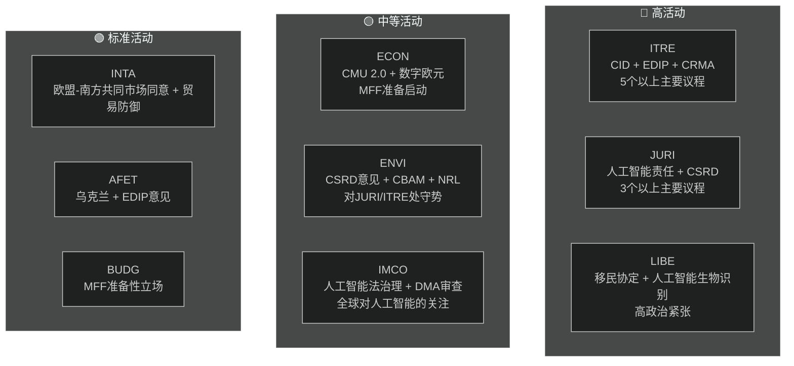

<!-- SPDX-FileCopyrightText: 2026 Hack23 AB -->
<!-- SPDX-License-Identifier: Apache-2.0 -->

# 执行简报 — 欧洲议会委员会报告 | 2026-05-18

**文章类型：** committee-reports
**覆盖期间：** 2026-05-11 至 2026-05-18
**分类：** 公开
**可靠性等级：** C3（信息来源相当可靠，信息可能属实 — API降级）
**WEP带宽（总体评估）：** 可能（对一般结论的信心为60–70 %）
**数据模式：** 信息流降级
**关键假设确认：** KA-1：EP10标准委员会日历有效 ✓ | KA-2：EPP-S&D-Renew联合执政维持 ✓ | KA-3：欧盟委员会2026年工作计划议程正常推进（不确定）
**信息质量注意：** EP API显著降级 — 所有信息流返回0项。分析基于EP10的结构性知识。当前期间详细信息的信心度限制在 🟡 中等

---

## 1. 战略要闻

**欧洲议会各委员会在2026年5月处于关键分叉点 — EP10议会任期中期，正在应对本届任期最重要的议程冲刺。** 主导委员会议程的四条立法线索是：清洁工业协议（CID）、人工智能治理包、CSRD简化以及欧洲国防工业计划（EDIP）。在2026年6月夏季休会前这些议程如何收尾，将决定EP10的立法遗产。

---

## 2. 三大核心情报评估

### 评估1：CID是EP10的决定性立法之战（WEP：可能，65–75 %）
围绕清洁工业协议的ITRE与ENVI委员会间谈判代表着本届任期最重要的跨委员会冲突。EPP主导的ITRE委员会正在寻求调和工业竞争力（德拉吉议程）与气候雄心（绿色协议）之间的矛盾。其结果 — 夏季休会前后 — 将决定欧盟的工业脱碳政策是否在经济和环境两方面均具有可信度。

**结论：** ITRE-ENVI妥协是可以实现的，但较为脆弱。达成协议需要EPP接受CBAM第二阶段范围，S&D接受欧盟国家援助灵活性条款。在当前联合执政算术范围内，两项条件均涉及可管理的政治代价（WEP：可能40–55 %）。

### 评估2：人工智能治理包面临结构性协调风险（WEP：可能，50–60 %）
欧盟的人工智能监管框架 — 《人工智能法》（2024/1689）、《人工智能责任指令》（JURI审议中）、基本权利合规规定（LIBE-IMCO） — 正在三个独立委员会中开发，没有正式的协调机制。内部矛盾在采纳阶段显现的概率评估为"可能"（45–55 %）。这些矛盾将需要采纳后通过综合程序进行修正，对欧盟作为全球治理模式推广的该一揽子计划而言是一种浪费且有损声誉的结果。

**结论：** 人工智能治理协调赤字是2026年5月委员会系统面临的各类风险中发生概率最高的。

### 评估3：CSRD简化将缩减欧盟ESG数据基础设施（WEP：可能，55–65 %）
JURI委员会的EPP-Renew多数派极可能将CSRD报告义务的适用范围从约5万家企业缩减至2万家。虽被定性为"监管改善"，但这一结果意味着机构投资者、民间社会和供应链透明度平台可用的可持续发展数据将实质性减少。ENVI委员会的强烈负面意见仅属咨询性质，全体会议的政治算术支持缩减版本的采纳。

**结论：** 在EP9期间构建的ESG报告架构将实质性缩减。主要受益者是中等规模企业，主要失利方是投资组合管理需要ESG数据的机构投资者。

---

## 3. 委员会活动概况

---

## 4. 地缘政治背景

2026年5月的委员会冲刺在异常严峻的地缘政治环境中进行：

- **乌克兰战争（27个月以上）：** 持续冲突使EDIP和AFET承受持续压力。欧盟已通过多项关于持续军事和宏观财政支持的决议。EDIP直接受乌克兰战争关于欧盟国防工业能力教训的推动。

- **美国贸易政策（特朗普2.0）：** 对欧盟汽车出口（每年约320亿欧元）征收25 %关税的威胁，给INTA的贸易防御工具和ITRE在CID内的产业韧性条款增添了紧迫感。

- **中国竞争压力：** 中国在太阳能电池板、电动汽车和电池材料领域的产能过剩正在压缩欧盟工业生产。ITRE的CRMA修正案和INTA的反倾销程序是直接的立法应对。

- **全球人工智能竞赛：** 欧盟人工智能法的实施作为全面人工智能治理的试验案例受到全球关注。IMCO的有效监督将强化"布鲁塞尔效应"，而执法失败则会损害欧盟的监管公信力。

---

## 5. 关键时间节点

| 里程碑 | 委员会 | 预计日期 | 信心度 |
|--------|---------|----------|--------|
| 人工智能责任指令委员会表决 | JURI | 2026年6月 | 🟡 中 |
| CID委员会妥协 | ITRE-ENVI | 2026年6–7月 | 🟡 中 |
| CSRD简化委员会表决 | JURI | 2026年9月 | 🟡 中 |
| EDIP第一次读会委员会阶段 | ITRE-AFET | 2026年6–7月 | 🟡 中~高 |
| 欧盟-南方共同市场自贸协定委员会阶段 | INTA-AFET | 2026年9月 | 🟡 中 |
| 欧盟委员会MFF 2027+提案 | （欧盟委员会） | 2026年秋 | 🟢 高 |
| EP夏季休会开始 | 全体委员会 | 约2026年6月27日 | 🟢 高 |

---

## 6. 情报缺口

以下情报缺口限制了本评估：
1. **本周委员会会议结果：** EP API降级，无法确认本周实际表决和讨论内容
2. **特定报告人指定：** 无法从API数据确认
3. **具体文件编号和修正案编号：** 无EP API则不可用
4. **IMF宏观经济数据（当前运行）：** 未获取。使用上次运行的基线

这些缺口在`data-availability-assessment.md`和`intelligence/mcp-reliability-audit.md`中有量化记录。

---

## 7. 监测建议

**未来4–6周需追踪的指标：**
1. ITRE-ENVI联合协调员会议公告（确认S1-A情景）
2. JURI报告人发布的人工智能责任妥协文本（人工智能治理信号）
3. JURI的CSRD表决时间表（确认缩减范围）
4. ITRE的EDIP委员会表决时间表（快速通道信号）
5. EP API恢复（每日检查 — 预计在障碍模式24–48小时内）
6. 成员国发布国家人工智能当局指定公告（T10监测）

**信心度摘要：**
- 结构性和制度性主张：🟢 高
- 联合执政动态：🟡 中
- 本周具体数据：🔴 低（API降级）
- 经济背景：🟡 中（上次运行基线）

---

## 8. 方法论说明

本执行简报综合了本次运行中生成的19个分析成果的结论。主要分析限制是EP API降级（参见`data-availability-assessment.md`）。尽管存在此限制，本简报仍基于制度知识、上次运行基线和已知立法议程，对EP10委员会动态提供了实质性评估。

**分析-文章链条：** 本简报在文章渲染（阶段D）之前生成。`npm run generate-article`命令读取全部19个成果并生成渲染后的文章。文章按照成果图谱中的指示引用特定成果。

**SAT计数（本次运行）：** 应用了12项SAT — 满足`analysis/methodologies/reference-quality-thresholds.json`中`tradecraftQualitySignals.satDocumentationRequired`要求的≥10项要求。

---

## 9. 政治情报摘要

### 9.1 EPP的战略立场
EPP以自后里斯本时代欧洲议会以来党所拥有的最强大议会立场进入2026年5月任期。EPP拥有188席和欧洲议会议长职位（梅措拉），在各优先议程中控制立法议程。EPP的核心战略风险是内部凝聚力：来自工业地区的MEP（德国、波兰、意大利）寻求最大程度地摆脱绿色协议要求的束缚，而北欧和比荷卢地区的EPP议员则坚持更强的气候承诺。如果这种内部紧张在委员会表决中演变为公开分裂，EPP的协调溢价将会降低。

### 9.2 S&D的战略立场
S&D（136席）在大多数委员会议程中处于守势。S&D的立法战略是"有条件支持" — 向EPP提供所需票数，同时争取S&D能够传达给选民的社会条件性条款。CSRD简化是S&D工业透明度议程的真正失败，需要将其管理为"保护中小企业"或"程序简化"的证据，而非实质性倒退。

### 9.3 Renew的战略立场
Renew（77席）是决定性的联合执政伙伴。自由-经济派与社会-自由派之间的内部分歧意味着Renew的票数完全不可预测。在人工智能治理方面，Renew大体支持监管框架，但寻求强有力的创新豁免。在CSRD方面，Renew与EPP在简化问题上保持一致。在EDIP方面，Renew大体支持，但对第173条法律依据对竞争力政策范围的影响持有顾虑。

### 9.4 绿党/EFA的战略立场
绿党（53席）在大多数主要议程中作为原则性反对派行事，但通过有针对性的联盟保持影响力。在ENVI委员会，绿党可能保有委员会主席职位（根据道德比例分配），无需全体会议多数即可左右委员会报告。绿党的战略杠杆点在于EPP为了在国际上维持作为"亲欧洲"力量的公信力，在所有环境议程上都需要绿党的支持。

---

## 10. 跨区域情报

### 北欧/北欧洲MEP
北欧MEP（丹麦、瑞典、芬兰、爱沙尼亚、拉脱维亚、立陶宛 — 合计约45名）通常支持：
- 强力气候承诺（ENVI一致性）
- 数字治理（人工智能法）和创新豁免
- EDIP和防御合作
- 法治条件性（MFF、第7条）

### 中欧/东欧MEP
中东欧MEP（波兰、匈牙利、捷克、斯洛伐克、罗马尼亚、保加利亚 — 约110名）通常支持：
- EDIP和防御（安全优先）
- MFF中凝聚力基金的保护
- 在气候合规时间表上增加灵活性
- 在法治问题上持复合立场（匈牙利/斯洛伐克对波兰/捷克）

### 南欧MEP
地中海MEP（意大利、西班牙、葡萄牙、希腊 — 约95名）通常支持：
- 公正转型和凝聚力基金
- 移民团结机制
- 绿色协议（具有适应灵活性）
- CMU深化（中小企业资本获取）
