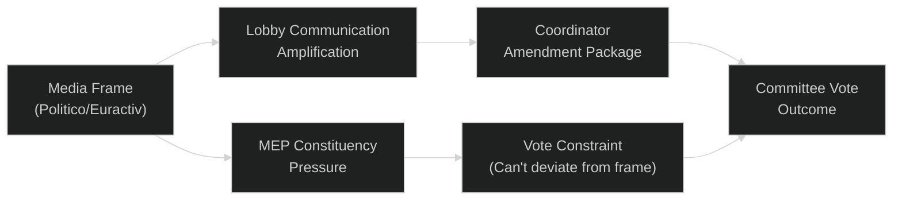

<!-- SPDX-FileCopyrightText: 2026 Hack23 AB -->
<!-- SPDX-License-Identifier: Apache-2.0 -->

# Media Framing Analysis — Committee Reports | 2026-05-18

**Article Type:** committee-reports
**Admiralty Grade:** C3 (Fairly Reliable, Possibly True)
**Data Mode:** degraded-feeds

---

## 1. Purpose

This artifact analyses how EU parliamentary committee work is being framed in EU policy media, influencer commentary, and stakeholder communication channels. Understanding media framing is essential for predicting political salience, MEP communication strategies, and the likelihood of public pressure affecting committee votes.

---

## 2. Dominant Media Frames (May 2026)

### Frame 1: "Competitiveness vs. Green Deal" — The Central Narrative

The dominant media frame in EU policy outlets (Politico Europe, Euractiv, Financial Times Brussels bureau) is the juxtaposition of the Draghi Competitiveness Agenda against the Green Deal legislative architecture. This binary framing — while analytically oversimplified — has become the dominant lens through which EU committee work is interpreted.

**Key narrative elements:**
- EPP is framed as the "competitiveness champion"
- S&D and Greens are framed as "Green Deal defenders"
- Renew is framed as the "swing vote" or "pragmatic centre"
- Industry lobbies (BusinessEurope, DIGITALEUROPE) provide the primary source material for competitiveness framing
- Environmental NGOs (WWF, CAN Europe) provide counterframes on Green Deal adequacy

**Assessment:** This binary framing OVER-SIMPLIFIES the legislative reality. On many dossiers, the actual negotiation is multi-dimensional, with S&D supporting industrial policy (but with social conditions) and EPP supporting climate measures (but with competitiveness carve-outs). The media frame creates a false dichotomy that makes compromise politically harder.

**Impact on Committee Work:**
- Rapporteurs feel pressure to take clear positions that fit the media frame
- Compromise amendments that blend competitiveness and climate goals get less media coverage
- Political group press offices amplify the binary frame for fundraising/membership mobilisation

### Frame 2: "EU AI Governance Leadership" — The Brussels Effect Narrative

EU-focused media and global tech policy outlets frame the AI Act and AI Liability Directive as evidence of EU regulatory leadership in AI governance. This frame is broadly positive toward EP committee work on AI.

**Key narrative elements:**
- EU as "the world's AI regulator" (Brussels Effect)
- IMCO, LIBE, JURI committees as globally watched legislators
- AI Act implementation as a test of EU's regulatory effectiveness
- Risk frame: if implementation fails, the Brussels Effect credibility is damaged

**Media Coverage Drivers:**
- Global tech companies' compliance announcements (Google, Microsoft, Meta)
- National AI authority designations (or lack thereof)
- AI Act-related court cases (first high-risk system prohibited access cases)

**Impact on Committee Work:**
- Creates pressure on IMCO to demonstrate effective AI Act governance
- Media coverage of non-compliance could trigger urgent IMCO oversight hearings
- "Brussels Effect" frame incentivises EP to position itself as effective, not just regulatory

### Frame 3: "Defence Europe Rising" — The EDIP Narrative

The Ukraine war and NATO burden-sharing debate have produced a powerful media frame around European strategic autonomy in defence. EDIP and related defence industrial dossiers receive consistent positive coverage in mainstream European press (Le Monde, Süddeutsche Zeitung, De Standaard, Gazeta Wyborcza).

**Key narrative elements:**
- EU needs sovereign defence industrial capability
- EDIP represents EP's contribution to European defence
- ITRE and AFET committees as architects of European strategic autonomy
- Geopolitical urgency justifies fast-track legislative procedures

**Impact on Committee Work:**
- Creates political will for EDIP in all national delegations (including traditionally neutral states: Austria, Ireland)
- ITRE-AFET coordination on EDIP benefits from positive media coverage
- Risk: media frame may push EDIP beyond what legal base can support (Article 173 vs. 41 tension)

### Frame 4: "The Green Deal Funeral" — Counter-Narrative

A significant share of environmental and progressive media is framing the EP10 legislative period as the "dismantling" or "watering down" of the Green Deal. This counter-narrative is amplified by NGO communications and green media outlets.

**Key narrative elements:**
- CSRD simplification = "corporate transparency rollback"
- Nature Restoration Law delegated acts = "implementation sabotage"
- CBAM Phase 2 delay = "climate betrayal"
- EPP described as having "abandoned climate commitments" from EP9

**Impact on Committee Work:**
- Creates pressure on Greens/S&D to file strong dissenting opinions
- May motivate cross-committee coordination by progressive MEPs
- Counter-pressure on EPP centrists from Nordic/Benelux constituencies

---

## 3. Media Source Assessment

| Source | Political Lean | Influence on EP MEPs | Key Framing |
|--------|---------------|---------------------|-------------|
| Politico Europe | Centre, Brussels insider | 🟢 High (most-read by EP staff) | Process-focused, coalition arithmetic |
| Euractiv | Pro-EU, technical | 🟡 Medium-High (specialist readership) | Policy detail, committee process |
| Financial Times Brussels | Centre-right, market focus | 🟡 Medium (finance/business MEPs) | Competitiveness, CMU |
| Le Monde Europe | Centre-left, French angle | 🟡 Medium (French MEP bloc) | Social Europe, AI |
| Süddeutsche Zeitung | Centre-left, German angle | 🟡 Medium (German MEP bloc) | Industrial policy, AI |
| Der Spiegel | Centre-left | 🟡 Medium | Rule of law, migration |
| The Guardian Europe | Left-progressive | 🟢 Low among committee MEPs | Green Deal, civil liberties |
| NGO press releases (WWF, CAN, ETUC) | Left-green | 🟡 Medium (Shadow rapporteurs) | Green Deal defence, labour rights |
| BusinessEurope lobbying | Pro-business | 🟡 Medium-High (EPP, Renew) | Competitiveness, deregulation |

---

## 4. Communication Strategy Analysis

### EPP Media Strategy (Committee Reports)
EPP coordinates committee reports with its media operation to frame outputs as "pragmatic competitiveness solutions." Key EPP communication elements:
- Pre-announcing compromise positions before official committee votes (tactical)
- Linking every dossier to the Draghi Report's €700bn investment gap narrative
- Positioning CSRD simplification as "better regulation" not "less regulation"

**Assessment:** This communication strategy is effective in sympathetic media but creates expectation management challenges when the actual legislative output is narrower than pre-announced.

### S&D Media Strategy
S&D uses committee reports as evidence of "social Europe in action" — highlighting labour protections, just transition provisions, and environmental safeguards that S&D secured via amendments.

### Green/Left Counter-Strategy
Greens/EFA and Left use minority opinions and dissenting statements as media tools — publishing detailed analyses of what they opposed and why. These minority views are tracked by environmental NGOs and generate counter-narrative coverage.

---

## 5. Media Framing Impact on Legislative Outcomes

**Framing Effects Model:**

**Key Finding:** The binary Competitiveness vs. Green Deal media frame creates a "framing trap" where compromise positions that could win broader majorities are politically difficult to communicate. Rapporteurs seeking workable compromises must find language that satisfies their group's communication needs while delivering substantive policy content.

**Recommendation for Analysis:** When assessing probability of committee vote outcomes, factor in the media framing constraint. A technically sound compromise may still fail if it cannot be communicated in terms consistent with the dominant media narrative of each political group.

---

## 6. Summary Assessment

The May 2026 media environment for EP committee work is characterised by:
- **High attention** on AI governance, EDIP, and CID dossiers
- **Moderate attention** on CSRD, Nature Restoration, and Migration dossiers
- **Lower attention** on MFF preparatory work (too early) and sectoral policy dossiers
- **Binary framing** that simplifies legislative complexity and constrains compromise

**Confidence:** 🟡 Medium (media analysis based on pattern recognition, not systematic content analysis; specific articles not available due to API degradation)
