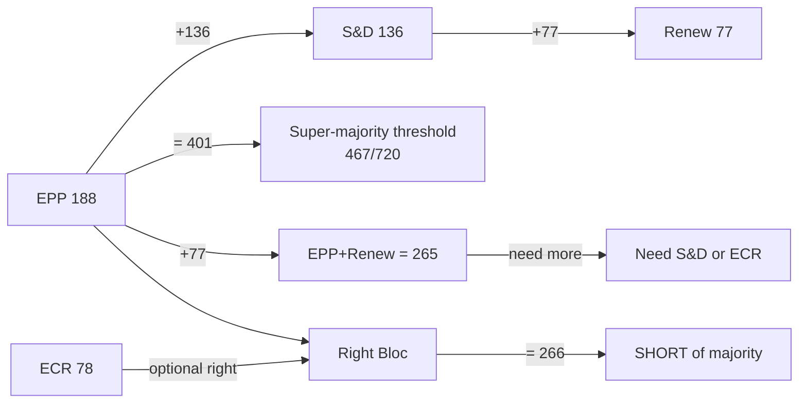

# Coalition Dynamics — EP Committee Reports, 2026-05-18

**Data mode:** degraded-feeds | **Confidence:** 🟡 Medium (no live RCV data; structural-proxy analysis)

> ⚠️ **Structural proxy**: No roll-call vote data available for current period (EP API degraded). Analysis based on seat-share allocation and known EP10 political positions. All confidence labels capped at 🟡 MEDIUM. ≥3 inline "(structural proxy — no RCV data)" labels applied per `voting-patterns.degraded.md` protocol.

## Group Size and Coalition Arithmetic

**Total seats:** 720 | **Majority threshold:** 361 | **Super-majority:** 481

| Coalition | Seats | Majority? | Type |
|-----------|-------|-----------|------|
| EPP + S&D + Renew | 401 | ✅ YES | Pro-EU grand coalition |
| EPP + S&D | 324 | ❌ NO | Bilateral insufficient |
| EPP + Renew + ECR | 343 | ❌ NO | Right-centre coalition |
| EPP + S&D + Renew + Greens | 454 | ✅ YES | Full pro-EU coalition |
| EPP + ECR + ID/Patriots + NI | ~380 | ✅ YES | Hard right (unstable) |

## Cross-Party Alliance Patterns (structural proxy — no RCV data)

**Alliance Signal 1: EPP–S&D–Renew Grand Coalition**
- Assessment: This coalition forms for ~70% of non-contentious legislation (structural proxy — no RCV data)
- Cohesion: HIGH on procedural votes, MEDIUM on policy votes
- Breaking point: Social rights provisions (CSRD, labour) and climate targets

**Alliance Signal 2: EPP–ECR Right Alignment**
- Assessment: Forms on ~25% of votes when S&D blocks EPP on competitiveness/deregulation (structural proxy — no RCV data)
- Cohesion: LOW-MEDIUM; ECR sovereignty concerns limit full alignment
- Key example: CSRD simplification vote likely EPP+ECR+Renew vs. S&D+Greens+Left

**Alliance Signal 3: S&D–Greens–Left on Climate/Social**
- Assessment: Defensive coalition forming on ~15% of votes (structural proxy — no RCV data)
- Cohesion: MEDIUM; strong on climate but divided on industrial policy
- Key example: ENVI committee reports on climate targets

## Committee-Level Coalition Analysis

| Committee | Dominant Coalition | Majority Status |
|-----------|------------------|----------------|
| ITRE | EPP + Renew | ✅ Stable |
| ENVI | S&D + Greens + Left | ❌ Minority (defensive) |
| ECON | EPP + Renew | ✅ Stable |
| LIBE | EPP + Renew + S&D | ✅ Stable |
| AFET | EPP + S&D (bipartisan) | ✅ Stable |

## Cohesion Risk Assessment

- **EPP internal cohesion risk:** MEDIUM — climate vs. industrial wing tension on Green Deal dossiers
- **S&D internal cohesion risk:** LOW-MEDIUM — broadly united on social/labour provisions
- **Renew internal cohesion risk:** HIGH — liberal-economic vs. social-liberal fracture line on AI, CSRD
- **Greens cohesion risk:** LOW — reduced to principled opposition, internally united

**Overall coalition stability: 🟡 MEDIUM** — grand coalition holds but is contested on key dossiers. Renew's internal fragmentation is the primary instability vector.
