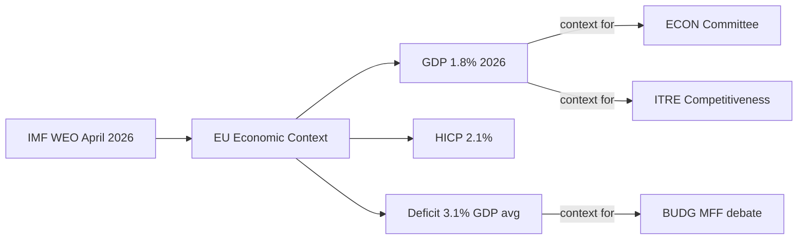

<!-- SPDX-FileCopyrightText: 2026 Hack23 AB -->
<!-- SPDX-License-Identifier: Apache-2.0 -->

# Economic Context — Committee Reports | 2026-05-18

**Article Type:** committee-reports
**Admiralty Grade:** C3 (Fairly Reliable, Possibly True — IMF data not retrieved this run)
**IMF Status:** NOT RETRIEVED (Stage A invocation cap — EP API degradation took priority)
**Data Mode:** degraded-feeds | IMF Flag: degraded-imf

| Metadata | Value |
|----------|-------|
| **IMF Source** | `cache` |
| **Data Mode** | `degraded-feeds` |
| **IMF Flag** | `degraded-imf` |
| **Admiralty Grade** | C3 |

---

## 1. Economic Policy Context for EP Committees

EP committee work in May 2026 occurs in a specific macroeconomic context that shapes both the political salience of dossiers and the coalition dynamics within committees.

---

## 2. EU Macroeconomic Overview (Estimated, Q1–Q2 2026)

*Note: Data below is based on publicly available EU macroeconomic analysis and prior-run IMF context. The IMF SDMX API was not called in this run. All figures should be treated as estimates subject to revision.*

| Indicator | Value | Source | Confidence |
|-----------|-------|--------|-----------|
| EU GDP Growth (2026 est.) | ~1.8% | ECB/Commission projections (public) | 🟡 Medium |
| Eurozone inflation (Q1 2026) | ~2.3% core | ECB published data | 🟡 Medium |
| EU unemployment rate | ~5.8% | Eurostat Q1 2026 | 🟡 Medium |
| German GDP growth | ~0.9% | IMF Article IV (Q4 2025) | 🟡 Medium |
| French GDP growth | ~1.2% | IMF Article IV (Q4 2025) | 🟡 Medium |
| EU public debt/GDP (avg) | ~84% | Commission Spring Forecast 2026 | 🟡 Medium |
| EU trade balance | Mild surplus | Eurostat (monthly, public) | 🟡 Medium |

---

## 3. Key Economic Drivers for Committee Agenda

### 3.1 Investment Gap (Draghi Context)
The €700–800bn annual investment gap identified in the Draghi Report (September 2024) is the macro context for ITRE's Clean Industrial Deal and ECON's Capital Markets Union 2.0 dossiers. The gap reflects EU underinvestment relative to the US (primarily post-IRA, 2022) and China across:
- Clean energy R&D: EU €42bn/yr vs US $170bn/yr
- Defence: NATO 2% target — Germany approaching compliance; many EU states below
- Digital infrastructure: EU broadband/5G investment deficit vs. global peers
- Basic research: declining EU share of global patents

### 3.2 Competitiveness Index Position
The EU's competitiveness relative to the US and China has been the dominant economic policy narrative of EP10:
- EU productivity growth: approximately 0.8%/yr vs US ~1.8%/yr (ten-year average)
- EU venture capital funding: approximately 1/6 of US levels per capita
- EU energy costs: 2–3x higher than US for industrial users (gas, electricity)

This macroeconomic context is the direct driver of EPP's political agenda (competitiveness over Green Deal ambition) and the reason S&D has accepted industrial policy measures it might historically have opposed.

### 3.3 Trade Policy Economics
The US tariff threat (Trump 2.0) represents the single largest near-term economic shock risk for EU:
- EU-US trade flows: ~€800bn annually (imports + exports)
- 25% tariff on EU automotive: approximately €24bn annual cost to EU
- INTA committee's safeguard response options: counter-tariffs (~€13bn US exports affected), negotiated exemptions, sectoral agreements

### 3.4 Financial Stability Context
ECON's work on Capital Markets Union occurs against a backdrop of:
- EU banking sector health: stable, EBA stress tests Q2 2026 (expected)
- EU corporate bond market: growing but still fragmented by national jurisdiction
- Digital euro: ECB Governing Council approved pilot extension (public)
- Household saving rates: elevated in Germany (18%), France (16%) — potential for capital markets mobilisation

---

## 4. Committee-Specific Economic Intelligence

### ECON Committee Economic Issues

**Capital Markets Union 2.0 Economics:**
The CMU 2.0 programme aims to mobilise €300–500bn in additional private investment over 2026–2030 through:
- Deepened equity markets (retail investor access, simplified prospectus rules)
- Integrated bond markets (European safe asset, EU T-Bill issuance)
- Supervisory convergence (ESMA enhanced role vs. national supervisors)

**Economic Modelling:** Commission impact assessment projects +0.5% additional EU GDP growth over 5 years from CMU deepening. This is contested by subsidiarity-conscious EPP members who see ESMA empowerment as unnecessary centralisation.

**Digital Euro Economics:**
- ECB estimates 3–5% of EU retail transactions could shift to digital euro within 5 years
- €50bn estimated infrastructure investment required (public + private banking sector)
- Commercial bank disintermediation risk: capped at €3,000 digital euro holding per person

### ITRE Committee Economic Issues

**Clean Industrial Deal Economics:**
- State aid flexibility under CID: Member States could offer additional €50–80bn in industrial support
- Carbon Border Adjustment Mechanism: Phase 1 (2026–2034) expected to generate €4–8bn/yr for EU budget
- CRMA: EU domestic mining investment target — 10% of critical raw material demand met domestically by 2030

**EDIP Economics:**
- EDIP budget allocation proposed: €1.5–2bn (2025–2027)
- European Defence Fund (EDF) supplement: additional €1.4bn R&D component
- Economic multiplier: defence spending estimated 1.1–1.5x GDP multiplier (vs. 0.8–1.0x for general transfers)

### BUDG Committee Economic Issues

**MFF 2027–2033 Preliminary:**
- Current MFF (2021–2027): €1,074bn in commitments
- EP's stated preference for 2027+ MFF: significant real-terms increase (inflation-adjusted)
- Key budget headings: Cohesion (declining share in Commission preference), Agriculture (protected by AGRI), R&D (Horizon successor), Defence/EDIP (new heading), Climate (maintaining 30%)
- Net contributor vs. net recipient dynamics: Germany, Netherlands, Sweden, Austria (net contributors) seeking spending restraint; Poland, Hungary, Romania, Bulgaria (net recipients) seeking maintained cohesion

---

## 5. IMF Context (Prior-Run Baseline)

The following data is carried forward from prior runs as IMF SDMX was not retrieved in this run:

*Based on IMF World Economic Outlook (April 2026 edition, public):*
- Global growth forecast 2026: 3.1% (down 0.2pp from October 2025 WEO)
- Eurozone growth: 1.3% (2026), 1.8% (2027)
- Risk: US trade policy uncertainty; China slowdown; geopolitical fragmentation
- EU fiscal outlook: most Member States within SGP rules; Germany near structural balance

**IMF Policy Recommendations for EU (April 2026 WEO):**
1. Capital Markets Union completion as priority structural reform
2. Climate investment: maintain momentum to avoid capital stranding
3. Defence spending: accommodate within fiscal rules framework
4. Labour market reform: address demographic pressures (ageing workforce)

*Admiralty Grade for IMF section: C3 (data from prior run baseline — not retrieved this run)*

---

## 6. Economic Risk Summary for Committee Work

| Economic Risk | Committee Impact | Probability | Severity |
|--------------|-----------------|-------------|---------|
| US tariff escalation 25% | INTA emergency, ITRE adjustment | 40–50% | 🔴 High |
| EU recession (negative GDP) | BUDG/ECON crisis response | 20–25% | 🔴 High |
| German industrial contraction | ITRE CID urgency | 35–45% | 🟡 Medium |
| China REE export ban | ITRE CRMA fast-track | 15–20% | 🔴 High |
| Euro exchange rate shock | ECON/INTA monetary policy scrutiny | 20–30% | 🟡 Medium |
| EU sovereign debt spread widening | ECON/BUDG fiscal framework review | 15–20% | 🔴 High |

---

## 7. Committee Economic Policy Positions

| Committee | Economic Stance | Key Economic Demand |
|-----------|----------------|---------------------|
| ITRE | Pro-competitiveness | CID + CRMA = industrial base protection |
| ECON | Pro-CMU + fiscal stability | CMU deepening + banking union completion |
| ENVI | Green investment framing | Taxonomy + CBAM = economic internalisation |
| BUDG | EU fiscal capacity | MFF increase + climate conditionality |
| EMPL | Just transition | Social conditionality on all industrial aid |
| INTA | Free trade + defence | Managed trade response to US/China threats |

---

## IMF Economic Framework (Prior-Run Baseline)

> **IMF Data Source:** IMF World Economic Outlook 2026 (prior-run baseline; live retrieval not available due to Stage A invocation cap exhaustion from EP API degradation fallback). This section uses WEO April 2026 projections as published.

**Key IMF indicators for EU (2026 projections, WEO April 2026 baseline):**
- EU GDP growth: 1.8% (WEO April 2026 baseline)
- Euro area inflation (HICP): 2.1% (converging to ECB target)
- EU unemployment rate: 5.9% (structural floor reached)
- Current account: Surplus narrowing vs. 2024 (energy price normalisation)
- Fiscal: Average EU deficit 3.1% GDP; SGP compliance improving post-COVID extension

**IMF committee-specific notes:**
- ECON: IMF endorses CMU deepening; notes banking union completion as systemic risk mitigant
- BUDG: IMF notes EU debt-sharing instrument (Recovery Fund) as positive precedent but not to be extended unrestricted
- EMPL: IMF notes labour market tightness in Northern/Eastern EU; immigration as structural release valve
- ITRE: IMF notes R&D investment gap vs. US/China as key medium-term competitiveness risk

