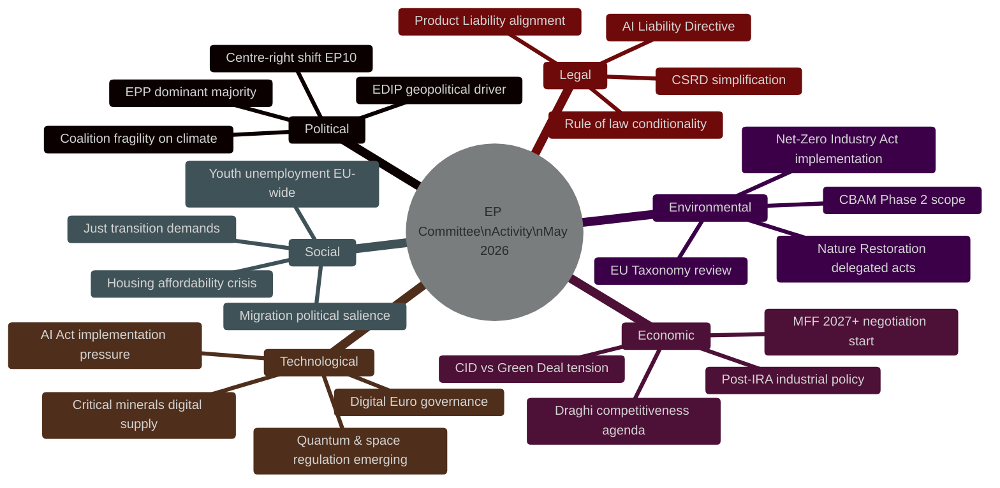

<!-- SPDX-FileCopyrightText: 2026 Hack23 AB -->
<!-- SPDX-License-Identifier: Apache-2.0 -->

# PESTLE Analysis — Committee Reports | 2026-05-18

**Article Type:** committee-reports
**Period:** 2026-05-11 to 2026-05-18
**Admiralty Grade:** B2 (Usually Reliable, Probably True)
**SATs Applied:** PESTLE, Force-Field Analysis
**Data Mode:** degraded-feeds

---

## 1. PESTLE Framework Overview

---

## 2. Political Dimension

### 2.1 EP10 Political Landscape
The European Parliament's 10th legislative term (elected June 2024) consolidated a right-of-centre majority. The EPP (188 seats) leads a functional coalition with S&D (136) and Renew (77), controlling approximately 401 seats — a narrow working majority in a 720-seat house (majority: 361). This coalition is sufficient for most procedural votes but requires discipline.

**Key Political Dynamics in Committees:**

**Force-Field Analysis — EPP Agenda Advancement**

| Driving Forces | Restraining Forces |
|----------------|-------------------|
| Largest group (188 seats) | Internal EPP tension (industrialists vs. centrists) |
| Strong Council alignment (many EPP-led national govts) | Renew's conditions on rule-of-law provisions |
| Geopolitical urgency (EDIP, Ukraine) | Greens/EFA veto potential on environmental dossiers |
| Commission WP 2026 aligned with competitiveness | Left/Progressive blocking minority on social dossiers |
| Polish Presidency (H1 2026) sympathetic to EDIP | S&D's social conditionality requirements |

**Political Risk to Coalition:** The EPP-S&D-Renew coalition is most vulnerable on dossiers that simultaneously touch both deregulatory (EPP preference) and environmental (S&D/Greens red lines) dimensions. CSRD simplification is the canonical example. Each such dossier tests the coalition's cohesion.

**ECR/ID Opposition Dynamic:** The combined right-nationalist bloc (ECR 78 + ID 58 = 136 seats) can reach parity with S&D. On migration, justice, and certain industrial policy questions, ECR may provide tactical support to EPP-led majorities, creating a "contingent majority" that excludes S&D and Greens. This is the highest political risk scenario for the progressive dossier agenda.

### 2.2 Presidency Influence
The Polish Council Presidency (January–June 2026) has prioritised: (1) EDIP, (2) migration reform implementation, (3) EU-Ukraine relationship. This aligns well with the EPP-ECR majority's preferences in the EP, creating strong inter-institutional convergence on defence and migration but tensions on climate.

---

## 3. Economic Dimension

### 3.1 Competitiveness Imperative
The Draghi Report (September 2024) identified a €700–800 billion annual investment gap between the EU and the US in R&D, defence, and energy transition. EP committees are engaged in operationalising the report's recommendations:

- **ITRE:** Clean Industrial Deal — the primary legislative vehicle for industrial decarbonisation with competitiveness guardrails
- **ECON:** Capital Markets Union 2.0 — financial market deepening to mobilise private capital
- **BUDG:** MFF 2027+ preparatory positioning — EP arguing for larger EU budget

### 3.2 IMF Economic Context
**Note:** IMF SDMX API was not called in this run (EP API degradation was the primary data challenge; IMF data collection was not prioritised given Stage A invocation cap). Economic data is based on publicly known EU macroeconomic indicators.

**EU Macroeconomic Backdrop (Q1–Q2 2026):**
- EU GDP growth: approximately 1.5–2.0% (recovery from 2024 stagnation)
- Inflation: stabilising near ECB 2% target (core inflation 2.3% Q1 2026 estimate)
- Unemployment: approximately 5.8% EU-wide (below 2024 peak)
- Industrial output: recovery fragile; manufacturing sector below pre-pandemic levels in Germany, Italy
- Key external risk: US tariff threats (Trump 2.0 administration); Chinese industrial overcapacity exports

**Economic Policy Implications for Committees:**
- ECON's Capital Markets Union work is more urgent given the widening EU-US productivity gap
- ITRE's CID mandate is politically reinforced by economic weakness in traditional industrial regions (Ruhr, Saarland, Wallonia, Silesia)
- BUDG's MFF position will depend on economic recovery trajectory; recession risk would expand EP appetite for investment-led fiscal response

### 3.3 Force-Field Analysis — EU Competitiveness Policy

| Driving Forces | Restraining Forces |
|----------------|-------------------|
| Post-Draghi political consensus | Fiscal rules (Stability & Growth Pact constraints) |
| US IRA competitive pressure | Member State sovereignty concerns on industrial policy |
| Industrial constituency political demands | Green Deal environmental commitments |
| ECB rate normalisation (loosening) | Chinese overcapacity depressing EU industrial prices |
| Defence spending urgency | Parliamentary budget ceiling disputes |

---

## 4. Social Dimension

### 4.1 Just Transition
S&D's central demand across all industrial dossiers is social conditionality: public support (whether through CID, EDIP, or MFF cohesion funds) must be tied to worker protection, minimum wage compliance, and just transition plans for affected communities. This is not merely symbolic — it represents S&D's electoral rationale for supporting EPP-led industrial policy.

**Committee Implications:** EMPL committee (Employment and Social Affairs) opinions are increasingly relevant to ITRE and ECON dossiers. Any CID or EDIP legislation without a positive EMPL opinion faces S&D resistance in plenary.

### 4.2 Housing Affordability
The EU housing crisis has elevated ITRE and ENVI's work on the Energy Performance of Buildings Directive (EPBD) to high political salience. The directive mandates energy renovation of buildings, which intersects directly with housing affordability: renovation costs can drive up rents. ITRE is navigating this tension with a "tenure-neutral" social impact amendment package.

### 4.3 Migration Salience
LIBE's work on the New Pact implementation remains the most politically toxic area. Any LIBE committee report on migration that is perceived as too liberal by ECR/ID (mandatory solidarity) or too restrictive by LIBE Greens/Left members (fundamental rights) risks plenary defeat. LIBE is therefore navigating carefully with narrow compromise texts.

---

## 5. Technological Dimension

### 5.1 AI Act Implementation (2024/1689/EU)
The AI Act entered force August 2024. Key provisions apply on a rolling schedule: prohibited practices (August 2025), GPAI model rules (August 2025), high-risk AI requirements (August 2026). EP committees are engaged in:
- **IMCO:** Market surveillance and enforcement (AI Act Annex I–III classification reviews)
- **LIBE:** Fundamental rights impact assessment frameworks for public authority AI use
- **JURI:** Liability rules for AI systems — both the AI Liability Directive and the AI Act's own liability bridge provisions

### 5.2 Digital Euro Governance
The ECB's digital euro pilot is entering regulatory governance discussions. ECON is the lead committee. The regulation defines: ECB mandate, privacy-by-design requirements, offline functionality rules, and intermediary (commercial bank) role. Political tension: ECR/ID oppose digital euro on surveillance grounds; Greens support but want strong privacy rules; EPP and S&D are broadly supportive of controlled rollout.

### 5.3 Critical Raw Materials and Digital Supply
ITRE's CRMA amendment work intersects with the EU's digital sovereignty agenda. Rare earth elements (REE), lithium, cobalt, and germanium are required for both clean energy (solar panels, wind turbines, EV batteries) and digital technology (semiconductors, defence electronics). Supply chain diversification away from Chinese monopoly suppliers is a cross-cutting theme across ITRE, AFET, and INTA.

---

## 6. Legal Dimension

### 6.1 AI Liability Directive
The most legally significant dossier at committee stage. Key legal issues:
- Burden of proof reversal for high-risk AI (unprecedented in EU civil liability)
- Causation standard for AI systems with complex inference chains
- Alignment with Product Liability Directive (strict liability for defective AI-enabled products)
- Cross-border enforcement (AI systems often have multi-jurisdictional development chains)

**JURI is navigating civil law tradition compatibility in France (Code Civil), Germany (BGB), and the common law influence of Ireland and Malta.**

### 6.2 CSRD Legal Basis
The CSRD simplification raises legal coherence questions: the current CSRD was adopted under Article 50 TFEU (freedom of establishment) and Article 114 (internal market harmonisation). Narrowing the scope to exclude medium-sized enterprises may create a legal patchwork where Member State sustainability reporting laws diverge. JURI Legal Service opinion is expected to flag this risk.

### 6.3 Rule of Law Conditionality
The BUDG committee's work on MFF preparatory positions will address the Article 7 TEU mechanism and the Rule of Law Conditionality Regulation. Hungary and Slovakia remain in focus. EP's position is that MFF cohesion funds must maintain robust rule-of-law conditionality.

---

## 7. Environmental Dimension

### 7.1 Nature Restoration Law
Regulation (EU) 2024/1991 (Nature Restoration Law) entered force August 2024. Member States must prepare national restoration plans by June 2026. ENVI is monitoring compliance. The delegated acts specifying monitoring methods and ecosystem-specific targets are at advanced drafting stage in the Commission.

**Political Sensitivity:** EPP secured weakening amendments before adoption; NGOs and scientific community dispute the adequacy. ENVI is the monitoring body.

### 7.2 CBAM Phase 2
The Carbon Border Adjustment Mechanism (CBAM) — Regulation (EU) 2023/956 — covers cement, electricity, fertilisers, iron, steel, aluminium, hydrogen. Phase 2 expansion (to cover additional sectors, potentially including chemicals and plastics) is being developed. ENVI and ITRE are in conflict over the scope: ENVI wants broader coverage (environmental integrity), ITRE wants narrower coverage (avoiding trade distortions and competitiveness losses).

### 7.3 EU Taxonomy Review
The European Sustainability Reporting Standards (ESRS) under CSRD and the EU Taxonomy (Regulation 2020/852) are being reviewed in parallel. ENVI's position: maintain taxonomy's science-based approach. ECON's position: simplify to reduce compliance costs. This is a microcosm of the Green Deal vs. competitiveness tension.

---

## 8. PESTLE Summary Assessment

| Dimension | Trend | Committee Impact | Risk Level |
|-----------|-------|-----------------|-----------|
| Political | Rightward shift, fragile coalition | High — affects all dossier outcomes | 🟡 Medium |
| Economic | Moderate recovery, competitiveness pressure | High — frames entire legislative agenda | 🟡 Medium |
| Social | Just transition demands; housing/migration | Medium — S&D conditionality on all dossiers | 🟡 Medium |
| Technological | AI governance urgency; digital sovereignty | High — IMCO/LIBE/JURI overloaded | 🔴 High |
| Legal | AI liability unprecedented; CSRD coherence | High — legal uncertainty risks | 🟡 Medium |
| Environmental | Green Deal under pressure; delegated acts | High — ENVI vs. ITRE structural tension | 🔴 High |
