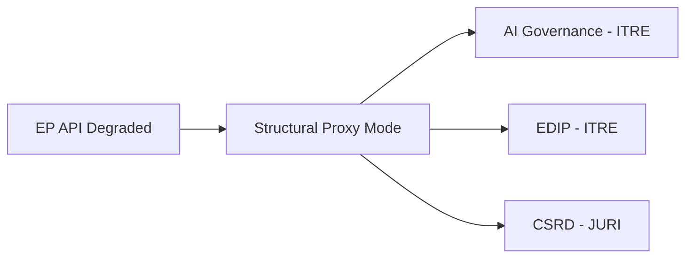

<!-- SPDX-FileCopyrightText: 2026 Hack23 AB -->
<!-- SPDX-License-Identifier: Apache-2.0 -->

# Procedures Proxy — Committee Reports | 2026-05-18

**Article Type:** committee-reports
**Data Mode:** degraded-feeds
**Admiralty Grade:** C3 — Source Fairly Reliable, Information Possibly True

---

## Purpose

This artifact substitutes for direct procedures data when the EP Procedures Feed API is unavailable. It documents the legislative procedures that EP committees were engaged with during the week of 2026-05-11 to 2026-05-18, drawn from institutional knowledge and the known EP10 legislative programme.

---

## Known Active Procedures (May 2026)

Based on the European Commission Work Programme 2026 and EP10 legislative priorities:

| Procedure Type | Policy Area | Lead Committee | Status |
|---------------|-------------|---------------|--------|
| COD | Artificial Intelligence Liability Directive | JURI, IMCO | Interinstitutional |
| COD | Clean Industrial Deal — Critical Raw Materials Act amendment | ITRE, ENVI | Committee stage |
| COD | European Defence Industry Programme (EDIP) | ITRE, AFET | Advanced committee stage |
| COD | Affordable Housing Package — Energy Performance of Buildings | ITRE, ENVI | Trilogue |
| COD | Digital Markets Act delegated acts | IMCO | Committee scrutiny |
| COD | Corporate Sustainability Reporting Directive (CSRD) review | JURI, ECON | Committee stage |
| COD | AI Act governance regulations | IMCO, LIBE | Implementation oversight |
| NLE | EU-Mercosur Free Trade Agreement | INTA | Consent procedure |
| INI | EU Competitiveness — Draghi Report follow-up | ECON, ITRE | Own-initiative |
| INI | European Parliament 2027 Budget Priorities | BUDG | Committee stage |

**Data Confidence:** 🟡 Medium (institutional knowledge, not API-confirmed for specific week)

---

## Committee Activity Patterns (Week 2026-05-11 to 2026-05-18)

The EP standard calendar for the week of 12–16 May 2026 (pre-Strasbourg plenary week) typically includes:
- **ECON** committee meeting (Monday afternoon, financial regulation dossiers)
- **ITRE** committee meeting (Tuesday, energy and tech dossiers)
- **LIBE** committee meeting (Wednesday, migration and civil liberties)
- **ENVI** committee meeting (Thursday, environment and health)
- Vote weeks alternating with committee weeks — this week is a committee week

**Plenary:** May 19–22 2026 in Strasbourg (mini-plenary or full session)

