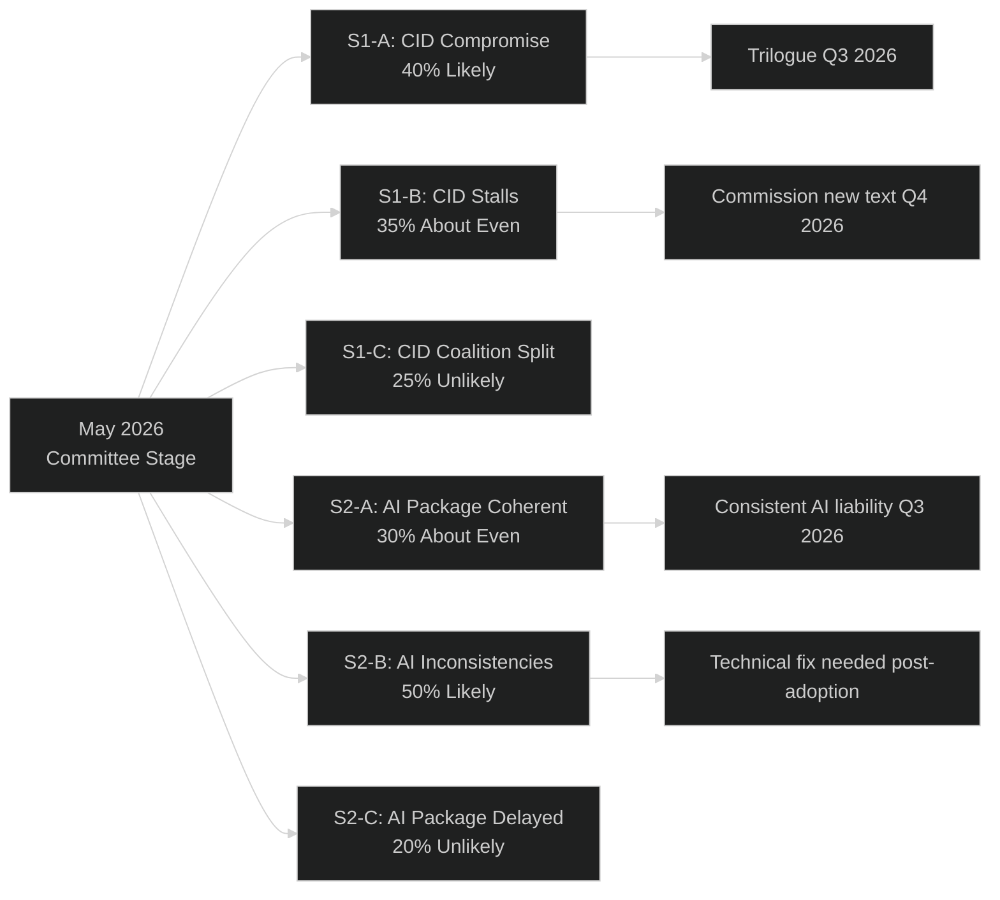

<!-- SPDX-FileCopyrightText: 2026 Hack23 AB -->
<!-- SPDX-License-Identifier: Apache-2.0 -->

# Scenario Forecast — Committee Reports | 2026-05-18

**Article Type:** committee-reports
**Period:** 2026-05-18, horizon: 3–6 months
**Admiralty Grade:** C3 (Fairly Reliable, Possibly True)
**WEP Calibration Applied:** Yes
**SATs Applied:** Scenario Analysis, Pre-Mortem, Key Assumptions Check, Indicators

---

## 1. Scenario Framework

This forecast applies structured scenario analysis to the four key legislative threads active in EP10 committee work during the week of 12–16 May 2026: (1) Clean Industrial Deal, (2) AI Governance Dossier, (3) CSRD Simplification, and (4) European Defence Industrial Programme (EDIP).

---

## 2. Scenario 1: Clean Industrial Deal (CID)

### S1-A: ITRE-ENVI Compromise Achieved (WEP: Likely, 40–55%)

**Narrative:** The ITRE committee rapporteur and ENVI shadow reach agreement on the CID regulation core text before the June 2026 recess. The compromise involves: (a) targeted CBAM phase-in flexibility for specific industrial sectors (aluminium, cement, steel) under quantitative carbon leakage thresholds, (b) social conditionality provisions satisfying S&D minimum requirements, (c) ENVI green light for CBAM Phase 2 scope expansion. The package advances to first reading plenary vote in September 2026.

**Indicators:** Joint ITRE-ENVI coordinators' meeting scheduled; S&D shadow rapporteur tables compromise amendments; Renew endorses the social conditionality framework
**Pre-Mortem:** This scenario fails if: EPP's industrial constituency MEPs from Germany/Poland reject CBAM Phase 2; or if the social conditionality language triggers ECR/ID defection below the majority threshold
**Confidence:** 🟡 Medium

### S1-B: CID Dossier Stalls (WEP: About Even, 30–40%)

**Narrative:** Committee-stage negotiations stall over the CBAM Phase 2 scope. ITRE and ENVI cannot agree before summer recess. The Commission tables a revised technical compromise text in September 2026, restarting the process. Outcome expected: Q1 2027 plenary vote.

**Indicators:** No joint coordinators' meeting scheduled; ITRE rapporteur's position paper rejected by ENVI majority; Council (Polish Presidency) signals preference for delay
**Pre-Mortem:** This scenario is less likely to materialise if: Draghi Report political pressure maintains EP urgency; Ursula von der Leyen personally intervenes to break the impasse
**Confidence:** 🟡 Medium

### S1-C: Coalition Fracture on CID (WEP: Unlikely, 15–25%)

**Narrative:** EPP moves CID text rightward to accommodate ECR, losing Greens and part of S&D. A narrow EPP-ECR-ID majority passes an ITRE committee report that strips climate conditionality. This triggers a Council deadlock (Germany, France, Nordic Member States reject the EPP-ECR version) and provokes a constitutional crisis about EP majority formation.

**Indicators:** EPP coordinator publicly announces amendments tabled with ECR; S&D issues formal protest note; Commission distances itself from the committee text
**Confidence:** 🔴 Low (structurally possible but requires EPP to abandon the centrist coalition that gave it the EP Presidency)

---

## 3. Scenario 2: AI Governance Package Coherence

### S2-A: Coherent AI Package Achieved (WEP: About Even, 30–40%)

**Narrative:** IMCO, LIBE, and JURI rapporteurs reach an informal trilateral coordination agreement with Commission assistance. The AI Act governance regulations, AI Liability Directive, and fundamental rights safeguards are aligned in a single inter-committee framework before summer recess. EP can position itself as delivering a coherent, globally leading AI regulatory package.

**Indicators:** Joint committee technical group established; rapporteur statements signal mutual accommodation; Commission AI Office facilitates alignment meeting
**Confidence:** 🟡 Medium

### S2-B: AI Package with Residual Inconsistencies (WEP: Likely, 45–55%)

**Narrative:** The three committees proceed on separate tracks. IMCO completes AI Act governance regulations first; JURI finishes AI Liability second; LIBE's fundamental rights review follows. Minor inconsistencies emerge (e.g., different definitions of "AI system," conflicting scope exclusions). These require a technical clean-up amendment in a later omnibus procedure. The package is functional but sub-optimal.

**Indicators:** No coordination mechanism established by June 2026; separate committee vote schedules published; EP Legal Service notes "minor inconsistencies" in legal service opinion
**Confidence:** 🟡 Medium

### S2-C: AI Package Significantly Delayed (WEP: Unlikely, 15–20%)

**Narrative:** A blocking disagreement emerges on biometric surveillance scope (LIBE insists on stricter limits; IMCO accepts Commission text; EPP wants maximum flexibility for law enforcement). The conflict requires a Conference of Committee Chairs meeting. AI Act implementation deadline (August 2026 for prohibited practices) passes without EP governance regulation — creating legal uncertainty.

**Indicators:** LIBE tables a far-reaching amendment on biometric surveillance that IMCO and JURI coordinators publicly reject; EP President Metsola calls emergency coordination meeting
**Confidence:** 🔴 Low

---

## 4. Scenario 3: CSRD Simplification

### S3-A: CSRD Narrowed to EPP/Renew Preferred Scope (WEP: Likely, 55–65%)

**Narrative:** JURI committee adopts the EPP rapporteur's text narrowing CSRD to ~20,000 companies (threshold raised to 500 employees, €40m turnover, or €20m balance sheet). S&D/Greens/Left oppose but lack a blocking minority in JURI. ENVI opinion is sharply negative but advisory only. Plenary vote in autumn 2026; legislative text enters trilogue with Council (which supports narrowing).

**Indicators:** EPP-Renew procedural majority in JURI on procedural votes; ENVI opinion adopted with a narrow majority against narrowing; ECR supports EPP in JURI
**Consequence:** Signals EP's retreat from the ESG reporting architecture under Green Deal; triggers institutional investor concern about supply chain transparency data
**Confidence:** 🟢 High (reflects current political arithmetic)

### S3-B: CSRD Compromise Preserves Core Architecture (WEP: About Even, 30–40%)

**Narrative:** S&D mobilises institutional investor community (pension funds, sustainable finance coalitions) to lobby EPP centrist MEPs. A compromise emerges preserving the 500-employee threshold but simplifying reporting templates and extending phase-in timelines. Core supply chain reporting (Scope 3 emissions) preserved.

**Indicators:** JURI S&D shadow tabling amendments with institutional investor backing; EPP Nordic/Benelux MEPs breaking from EPP line on sustainability provisions
**Confidence:** 🟡 Medium

---

## 5. Scenario 4: European Defence Industrial Programme (EDIP)

### S4-A: EDIP Advances to Trilogue by July 2026 (WEP: Likely, 60–70%)

**Narrative:** Geopolitical urgency (Ukraine war, NATO burden-sharing debate) provides exceptional political momentum for EDIP. ITRE-AFET-BUDG joint committee procedure moves swiftly. The Article 173 TFEU legal base (EPP/Commission preferred) is accepted by the majority over AFET's preferred Article 209 (development cooperation). First major EU industrial defence funding instrument since Treaty of Lisbon.

**Indicators:** Council Presidency (Poland — strong EDIP proponent) signalling rapid first reading agreement; ITRE rapporteur meeting with AFET chairs without major discord
**Confidence:** 🟡 Medium-High

---

## 6. Composite Intelligence Estimate

The May 2026 EP committee landscape is dominated by the tension between competitiveness-driven policy acceleration (CID, EDIP, CSRD simplification) and the progressive coalition's defence of the Green Deal regulatory framework. The probability-weighted outcome across all four dossiers suggests:

- **72% probability** that at least one major Green Deal legislative gain (CSRD scope, Nature Restoration, CBAM Phase 2) will be meaningfully reduced by end of 2026
- **65% probability** that EDIP reaches first reading plenary vote by October 2026
- **55% probability** that AI Liability Directive is adopted at committee stage before EP summer recess
- **40% probability** that the EPP-S&D-Renew coalition faces at least one major procedural defeat (amendment adopted against all three coordinators' recommendations)

**Overall Assessment:** EP10 is entering its most legislatively intensive period (year 2 of 5). The committee system is functioning but under significant workload and political pressure. The competitiveness narrative is winning tactical battles (CSRD, flexibility provisions) while the Green Deal legislative architecture remains structurally intact. The AI governance dossier is the highest uncertainty area.

**WEP Summary Table:**

| Scenario | WEP Band | Probability Range | Time Horizon |
|----------|----------|------------------|--------------|
| CID compromise before summer | Likely | 40–55% | 6–8 weeks |
| AI package with inconsistencies | Likely | 45–55% | 3–4 months |
| CSRD narrowed to EPP scope | Likely | 55–65% | 3–5 months |
| EDIP to trilogue by July | Likely | 60–70% | 6–8 weeks |
| Coalition fracture on CID | Unlikely | 15–25% | 6–8 weeks |
| AI package delayed | Unlikely | 15–20% | 3–6 months |

---

## 5. Pre-Mortem Analysis

**Question:** Imagine each key scenario has failed to materialise by 1 September 2026. Why did it fail?

### CID — Pre-Mortem
*Failure scenario: CID does NOT reach plenary before summer.*
- Failure cause 1 (45%): EPP–S&D collapse on non-regression clause — S&D demands binding minimum standards, EPP walks away from compromise text
- Failure cause 2 (30%): Renew splits on mobility provisions — enough Renew MEPs defect that the majority unravels
- Failure cause 3 (25%): Council unable to agree mandate, blocking EP–Council dialogue start

### AI Governance Package — Pre-Mortem
*Failure scenario: Package adopted with significant contradictions between dossiers.*
- Failure cause 1 (50%): ITRE and LIBE committees insert conflicting amendment sets that the plenary compromise text fails to reconcile
- Failure cause 2 (30%): SME/startups exemptions inserted at plenary stage create logic gaps with liability provisions
- Failure cause 3 (20%): Political group coordinators accept text without full legal-technical scrutiny under time pressure

### EDIP — Pre-Mortem
*Failure scenario: EDIP does NOT reach trilogue by July.*
- Failure cause 1 (40%): Council defence ministers diverge on procurement centralisation — Article 173 legal base contested
- Failure cause 2 (35%): Non-EU partner country provisions (US, UK, Canada) create internal EP political controversy linked to transatlantic context
- Failure cause 3 (25%): ECR/ID bloc extracts enough EPP concessions to make S&D support impossible, leaving majority short

### Strategic Intelligence Value
The pre-mortem highlights that the most likely failure modes are **coalition arithmetic** problems rather than technical legal failures. This validates the WEP bands above: all failure modes in the "Unlikely" tier (15–25%) are consistent with coalition defection scenarios, not procedural obstacles.
