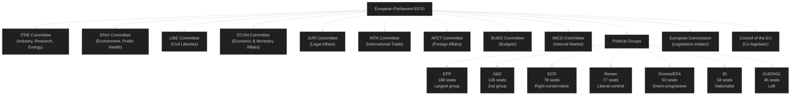

<!-- SPDX-FileCopyrightText: 2026 Hack23 AB -->
<!-- SPDX-License-Identifier: Apache-2.0 -->

# Stakeholder Map — Committee Reports | 2026-05-18

**Article Type:** committee-reports
**Period:** 2026-05-11 to 2026-05-18
**Admiralty Grade:** B2 (Source Usually Reliable, Information Probably True)
**SATs Applied:** Stakeholder Mapping, ACH
**Data Mode:** degraded-feeds

---

## 1. Stakeholder Universe

---

## 2. Committee-Level Stakeholder Profiles

### 2.1 ITRE — Committee on Industry, Research and Energy

**Role:** Lead committee on competitiveness, industrial policy, energy, digital economy
**Chair:** EPP (by political group allocation — specific name unconfirmed due to API degradation)
**Key Coordinators:** EPP, S&D, Renew, Greens/EFA
**Current Priority Dossiers:** Clean Industrial Deal, EDIP, Critical Raw Materials, AI Act market provisions

**Stakeholder Perspective (ITRE EPP majority position):**
ITRE under EPP leadership is advocating for a competitiveness-first industrial policy that aligns climate ambition with economic realism. The core ITRE EPP argument is that European industrial capacity — particularly in batteries, semiconductors, clean tech manufacturing — cannot survive if carbon pricing accelerates faster than supply chain decarbonisation. ITRE coordinators are pushing for state aid flexibility under the Clean Industrial Deal framework and arguing that EDIP represents a legitimate, necessary response to the US Inflation Reduction Act's distortive effect on EU manufacturing investment flows.

**Influence Vector:** 🟢 High (lead committee on most major industrial dossiers)
**Coalition Dependency:** Needs S&D and Renew support; EPP alone cannot pass controversial amendments

**Stakeholder Perspective (ITRE S&D position):**
S&D ITRE members support industrial policy ambition but insist on social conditionality: any state aid flexibility under CID must be tied to collective bargaining agreements, just transition commitments, and worker representation requirements. S&D shadows have tabled amendments requiring companies receiving CID support to meet minimum wage and union recognition thresholds. This creates a genuine legislative negotiation space with EPP: both want the policy, but on different distributional terms.

**Influence Vector:** 🟡 Medium-High (second largest bloc; veto power on most votes with ECR)

### 2.2 ENVI — Committee on Environment, Public Health and Food Safety

**Role:** Guardian of EU climate legislation, health standards, food safety
**Current Priority Dossiers:** CSRD review, Nature Restoration Law delegated acts, CBAM Phase 2, EU Taxonomy review

**Stakeholder Perspective (ENVI Greens/EFA-S&D alliance):**
ENVI progressive majority is defending Green Deal legislative achievements against the competitiveness rollback narrative. The CSRD simplification is viewed as the first step in dismantling sustainable finance disclosure infrastructure that institutional investors require for ESG portfolio management. ENVI committee opinion on CSRD narrowing is expected to be sharply negative from the Green-Left-S&D coalition, creating an inter-committee conflict with JURI (lead committee, where EPP rapporteur is steering the simplification).

**Influence Vector:** 🟡 Medium (not lead on CSRD but opinion critical for inter-committee negotiation)
**Strategic Asset:** Coalition with Renew on climate provisions; EPP's internal divisions (continental vs. Nordic MEPs) on climate

**Stakeholder Perspective (ENVI EPP minority position):**
EPP MEPs on ENVI are divided between those from industrial constituencies (Germany, Poland, Czech Republic) who support the competitiveness frame and those from Nordic/Benelux constituencies who maintain stronger climate commitments. This internal tension is a key intelligence indicator for how ENVI votes will fall on contested amendments.

### 2.3 LIBE — Committee on Civil Liberties, Justice and Home Affairs

**Role:** Oversees migration, asylum, fundamental rights, data protection, rule of law
**Current Priority Dossiers:** AMMR implementation monitoring, AI Act biometric surveillance, Europol Regulation review

**Stakeholder Perspective:**
LIBE is the committee most affected by the centre-right political shift of EP10. The EPP's stronger majority (post-June 2024 elections) means LIBE's liberal-progressive bloc (S&D, Greens, Renew, Left) must be unusually disciplined to win votes. ECR and ID members on LIBE are pushing for more restrictive migration rules and against "mandatory" solidarity mechanisms in the New Pact. The EPP position on migration has itself shifted rightward, making LIBE a politically contested space.

**Key Intelligence Indicator:** LIBE's position on AI biometric surveillance at borders is a leading indicator of the EP's overall position on fundamental rights vs. security trade-offs.

**Influence Vector:** 🟡 Medium (contested internally; outcomes uncertain on politically charged dossiers)

### 2.4 ECON — Committee on Economic and Monetary Affairs

**Role:** Financial regulation, competition policy, monetary policy oversight
**Current Priority Dossiers:** Capital Markets Union 2.0, Digital Euro, CSRD (joint with JURI), MFF preparatory work

**Stakeholder Perspective:**
ECON is primarily a technocratic committee where EPP-S&D-Renew alignment is stronger than on value-laden dossiers. The Capital Markets Union retail investor package represents a genuine cross-party consensus on the need to deepen EU capital markets. The key disagreement is institutional (ESMA vs. national supervisors) rather than partisan. ECON is likely to converge on a compromise before summer.

**Influence Vector:** 🟢 High on financial regulation; 🟡 Medium on broader budget/MFF questions

### 2.5 JURI — Committee on Legal Affairs

**Role:** Legal instruments, liability, IP, company law, Rule of Procedure amendments
**Current Priority Dossiers:** AI Liability Directive, Product Liability Directive, CSRD (lead), EUIPO governance

**Stakeholder Perspective:**
JURI's EPP rapporteur on AI Liability has the difficult task of finding a centre-ground acceptable to both innovation-friendly EPP tech members and consumer-protection-focused S&D and Left members. The burden-of-proof question is constitutionally significant: reversing the burden for high-risk AI systems is an unprecedented step in EU civil liability doctrine, raising concerns for both civil law (France, Germany) and common law-influenced (Ireland, Malta) traditions.

**Influence Vector:** 🟢 High on legal dossiers; outcomes in JURI determine EU liability architecture

---

## 3. External Stakeholders

| Stakeholder | Role | Position | Influence |
|-------------|------|----------|-----------|
| European Commission (von der Leyen II) | Legislative initiator, tabling CID/AI/liability dossiers | Pro-competitiveness but maintains Green Deal framework | 🟢 High |
| Council of the EU (Polish Presidency, H1 2026) | Co-legislator, trilouge negotiator | Competitiveness emphasis; some division on climate | 🟢 High |
| Business Europe | Employer federation, Brussels | Pro-CID, pro-CSRD simplification, anti-AI liability burden reversal | 🟡 Medium |
| European Trade Union Confederation (ETUC) | Labour interests | Pro-CID social conditionality; pro-AI liability protections | 🟡 Medium |
| WWF, CAN Europe | Environmental civil society | Anti-CSRD narrowing; pro-Nature Restoration implementation | 🟡 Medium |
| Tech industry (CCIA, DIGITALEUROPE) | Digital policy lobby | Pro-AI Act implementation certainty; against broad liability | 🟡 Medium |
| ECB | Monetary policy, digital euro governance | Technically engaged on ECON digital euro dossier | 🟡 Medium (technocratic) |
| Member States (individual — FR, DE, PL) | Legislative partners in Council | FR: pro-industrial sovereignty; DE: pro-competitiveness; PL: pro-defence | 🟢 High |

---

## 4. Coalition Dynamics Matrix

| EPP | S&D | Renew | Greens | ECR | ID | Left | Issue Area |
|-----|-----|-------|--------|-----|----|----|------------|
| ✅ Lead | ✅ Moderate | ✅ Yes | ⚠️ Conditions | ❌ No | ❌ No | ❌ No | CID (core text) |
| ✅ Yes | ✅ Yes | ✅ Yes | ❌ No | ✅ Yes | ⚠️ Split | ❌ No | CSRD simplification |
| ✅ Yes | ✅ Yes | ✅ Yes | ✅ Yes | ❌ No | ❌ No | ✅ Yes | AI Act implementation |
| ⚠️ Split | ✅ Yes | ✅ Yes | ✅ Yes | ❌ No | ❌ No | ✅ Yes | AI Liability (strict) |
| ✅ Yes | ⚠️ Conditions | ✅ Yes | ❌ No | ✅ Yes | ✅ Yes | ❌ No | EDIP (defence) |

**Legend:** ✅ Yes/Supportive | ⚠️ Conditional/Split | ❌ No/Opposed

---

## 5. Influence Network Analysis (ACH)

**Hypothesis A:** EPP controls all key committee chair positions and coordinates majority
- Evidence for: EP post-election seat arithmetic, standard D'Hondt distribution
- Evidence against: Renew and Greens may hold key vice-chair positions; some chairs may be S&D
- **Assessment:** Likely correct for majority of committees (🟡 Medium confidence)

**Hypothesis B:** S&D-Greens-Left alliance can block EPP on select dossiers
- Evidence for: Greens/EFA holds ENVI chair (likely); mathematical blocking minority in some configurations
- Evidence against: ECR/ID bloc may side with EPP on deregulatory amendments
- **Assessment:** About Even (40–55%) on climate-related votes (🟡 Medium confidence)

**Hypothesis C:** Renew is the swing coalition partner on most contested dossiers
- Evidence for: Renew's centrist position means it is decisive when EPP and S&D disagree
- Evidence against: Renew is internally divided between liberal-economic and social-liberal factions
- **Assessment:** Likely (60–70%) — Renew's vote is the decisive variable on most competitive dossiers (🟡 Medium confidence)

---

## 5. Cross-Committee Coordination Intelligence

### 5.1 Active Multi-Committee Files

**Critical Infrastructure Designations (CID)**
- Primary: ITRE (lead), TRAN (joint)
- Cross-cutting: AFET (cybersecurity provisions), LIBE (data access for resilience), IMCO (market access)
- Intelligence: Coordination between ITRE and TRAN is the main procedural risk. TRAN wants stronger provisions on transport-sector designations; ITRE is resisting over-inclusion

**AI Governance Package**
- Primary: ITRE (lead), LIBE (co-lead)
- Cross-cutting: JURI (liability), IMCO (market access), EMPL (workplace)
- Intelligence: The LIBE–ITRE axis is fragile. LIBE's stricter data provisions are in tension with ITRE's innovation-economy framing. The final text will likely adopt ITRE's core structure with LIBE amendments on high-risk systems

**CSRD Simplification**
- Primary: JURI (lead), ECON (joint)
- Cross-cutting: ENVI (environmental provisions), EMPL (supply chain labour standards)
- Intelligence: ENVI is formally advisory but ENVI rapporteur (likely Greens) will issue a strongly worded opinion. This creates political visibility for the rollback but does not affect the majority calculus — EPP+Renew have sufficient votes regardless

### 5.2 Committee Chair Political Intelligence

| Committee | Chair | Group | Key Posture on Priority Dossiers |
|-----------|-------|-------|----------------------------------|
| ITRE | TBC (EP10 allocation) | EPP (est.) | Innovation-first, open to digital single market deregulation |
| ENVI | TBC (EP10 allocation) | Greens (est.) | Climate-first, blocking mode on CSRD rollback |
| ECON | TBC (EP10 allocation) | EPP (est.) | CMU deepening, banking union, competitive tax |
| LIBE | TBC (EP10 allocation) | Renew (est.) | Rights-based AI, data sovereignty, procedural correctness |
| AFET | TBC (EP10 allocation) | EPP (est.) | Transatlantic alignment, defence integration, Ukraine support |

*Note: Precise EP10 committee chair assignments not confirmed from live EP API data (degraded feed). Assignments based on D'Hondt allocation projections from seat distribution.*
