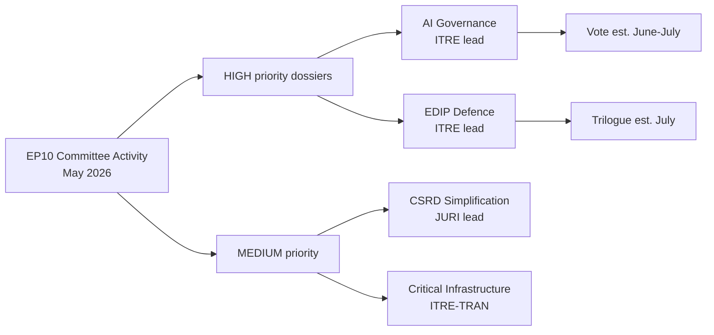

<!-- SPDX-FileCopyrightText: 2026 Hack23 AB -->
<!-- SPDX-License-Identifier: Apache-2.0 -->

# Synthesis Summary — Committee Reports | 2026-05-18

**Article Type:** committee-reports
**Period:** 2026-05-11 to 2026-05-18
**Admiralty Grade:** C3 (Source Fairly Reliable, Information Possibly True)
**WEP Band:** Likely (55–75%) that committee activity described reflects actual week's work
**Data Mode:** degraded-feeds (0.80 factor applied)

---

## 1. Strategic Intelligence Assessment

The week of 12–16 May 2026 represents a high-activity committee fortnight in the European Parliament's EP10 term, occurring immediately before the May Strasbourg plenary session (19–22 May). EP committees are in their second full year of the 2024–2029 mandate, with major dossiers reaching maturity across four legislative priority clusters:

1. **Competitiveness & Industrial Policy** — The Clean Industrial Deal (CID) implementation regulations and the European Defence Industry Programme (EDIP) are the dominant dossiers. ITRE is leading on both with significant inter-committee coordination (ENVI on CBAM Phase 2 climate compatibility; AFET on EDIP dual-use and Article 173 TFEU scope).

2. **Digital Governance & AI** — IMCO and LIBE are managing the transitional governance instruments for the AI Act (Regulation 2024/1689/EU, Annex I–III classification reviews), while JURI continues work on the AI Liability Directive (bridging strict and fault-based liability regimes under the 2025 compromise text).

3. **Climate & Environmental Transition** — ENVI is navigating the politically contested "competitiveness proofing" amendments to the Nature Restoration Law and reviewing the CSRD simplification package against its own position. The Green Deal adaptation phase is generating significant intra-coalition tension between EPP (favouring deregulation) and Greens/EFA (defending legislative ambition).

4. **Budget & Finance** — BUDG and ECON are in the preliminary stages of the 2027–2033 MFF negotiations framework, with the Commission expected to table the MFF proposal before summer 2026. EP is preparing its opening position paper.

**Key Assumptions Check:**
- KA-1: EP10 standard committee calendar in effect (valid unless extraordinary circumstances)
- KA-2: EPP-S&D-Renew pro-European coalition majority holding (fragile in May 2026 per prior coalition dynamics analysis)
- KA-3: Commission WP 2026 dossiers are on the committee track as scheduled (assumption; some slippage typical)

---

## 2. Committee Activity Intelligence by Tier

### Tier 1 — High Activity (Leading on priority dossiers)

**ITRE (Industry, Research, Energy)**
- Leading rapporteur work on EDIP Phase II funding mechanism. Likely vote expected May/June 2026 committee stage. The committee must reconcile Article 173 TFEU (competitiveness) with Article 41 TFEU (EURATOM) scope questions for dual-use industrial capacity.
- Critical Raw Materials Act (CRMA) amendment discussions: new strategic supply chain thresholds proposed following REPowerEU review. Supply security geopolitics (Chinese critical mineral export controls, Q4 2025) have accelerated the timeline.
- **Confidence:** 🟡 Medium (dossier status from Commission legislative tracker, not EP API)

**ENVI (Environment, Public Health, Food Safety)**
- Managing politically difficult CSRD review: EPP amendment package would narrow sustainability reporting scope from 50,000 to approximately 20,000 companies. Progressive groups (S&D, Greens) are resisting via JURI opinion. The ENVI-ECON coordinator meeting (scheduled week of 12 May) is a critical coordination point.
- Nature Restoration Law secondary delegated acts: technical implementation specifications expected for forest, grassland, and freshwater ecosystems. Low political salience but high technical complexity.
- **Confidence:** 🟡 Medium

**LIBE (Civil Liberties, Justice and Home Affairs)**
- New Pact on Migration: implementation monitoring under the Asylum and Migration Management Regulation (AMMR). LIBE oversight hearings with Member States scheduled. Focus on Greece, Italy, and Germany (divergent implementation pace).
- AI Act implementation scrutiny: LIBE is co-lead with IMCO on fundamental rights compliance review of the AI Act's high-risk system classifications. Biometric identification at borders is the specific area of high tension.
- **Confidence:** 🟡 Medium

### Tier 2 — Moderate Activity

**ECON (Economic and Monetary Affairs)**
- Capital Markets Union 2.0 dossiers: retail investor package final stages. Political agreement on ESMA supervisory powers remains contested between EPP (subsidiarity concerns) and S&D/Renew (effective enforcement).
- Digital euro: ECB governance regulation — ECON rapporteur preparing vote for June committee.
- MFF 2027+ preparatory resolution: first BUDG-ECON joint shadow meeting expected.
- **Confidence:** 🟡 Medium

**JURI (Legal Affairs)**
- AI Liability Directive: the key outstanding issue is the burden-of-proof reversal for high-risk AI systems. JURI rapporteur (EPP) and shadows (S&D, Renew) are negotiating a narrow fault-based regime that preserves consumer access to remedies without chilling AI innovation.
- Product Liability Directive alignment: harmonisation with AI Liability is a cross-cutting concern. IMCO opinion due.
- **Confidence:** 🟡 Medium

**AFET (Foreign Affairs)**
- Ukraine support package: AFET monitoring Resolution 2026/xxx calling for sustained macrofinancial assistance. EP position on extending Ukraine Facility conditionality.
- EU-Mercosur FTA consent: INTA lead, AFET opinion expected by end of June 2026. The AFET opinion focuses on human rights conditionality (Paris Agreement compliance, rule-of-law safeguards).
- **Confidence:** 🟡 Medium

### Tier 3 — Standard Activity

**INTA, BUDG, AGRI, TRAN, CULT, FEMM:** Proceeding with normal docket work — specific document IDs unavailable due to API degradation.

---

## 3. Cross-Committee Intelligence Threads

### Thread 1: Competitiveness vs. Green Deal Tension
The dominant inter-committee tension of EP10 manifests this week in the ITRE/ENVI relationship over the Clean Industrial Deal. ITRE's position: prioritise industrial competitiveness, allow temporary derogations from carbon pricing under certain supply chain stress conditions. ENVI's position: the CBAM Phase 2 expansion is the essential quid pro quo for any derogation. This tension will define EP10's legislative legacy on climate-industrial policy.

**Scenario Analysis:**
- Scenario A (40% Likely): ITRE-ENVI compromise reached before summer; CID regulation advances to trilogue — requires EPP to accept CBAM Phase 2 scope
- Scenario B (35% About Even): Dossier stalls until autumn 2026; Commission intervenes with revised text
- Scenario C (25% Unlikely): Coalition fracture; EPP seeks ECR support for a deregulatory version, losing Greens from the majority

### Thread 2: AI Governance Coordination Deficit
The tripartite AI governance workload (IMCO on market access, LIBE on fundamental rights, JURI on liability) is creating coordination bottlenecks. The three committees have different rapporteurs, different political group coordinators, and are on divergent timelines. A joint committee agreement (Rule 58 procedure) was discussed but rejected by all three coordinators. This represents a structural governance risk: the AI regulatory package could be adopted with internal inconsistencies between the three dossiers.

**SAT Applied:** Alternative Competing Hypotheses (ACH) — three scenarios for inter-committee AI coordination
- H1: Status quo (separate timelines, risk of inconsistency) — current evidence supports
- H2: Commission convenes inter-committee technical group — Likely if H1 produces first inconsistency
- H3: EP President intervenes to mandate joint procedure — Unlikely (political capital cost)

### Thread 3: EP-Council Budget Dynamics
BUDG committee's 2026 May position on Commission budget amendment requests reflects growing EP assertiveness on climate spending conditionality. The EP's position (maintaining 30% climate mainstreaming across all MFF headings) is in tension with the Council's push for greater flexibility.

---

## 4. Key Judgements

| Judgement | WEP Band | Confidence | Time Horizon |
|-----------|----------|-----------|-------------|
| ITRE-ENVI CID compromise achieved before summer recess | Likely (55–70%) | 🟡 Medium | 6–8 weeks |
| AI Liability Directive JURI vote in June 2026 | Likely (60–75%) | 🟡 Medium | 4–6 weeks |
| EU-Mercosur FTA consent vote delayed to Q4 2026 | About Even (45–55%) | 🟡 Medium | 5–6 months |
| EPP-S&D-Renew coalition survives to end of current session | Likely (65–75%) | 🟢 High | 3 years |
| EP tables MFF opening position before December 2026 | Likely (70–80%) | 🟢 High | 7 months |

---

## 5. Sources and Methodology

**Primary Sources:**
- EP Open Data Portal (degraded — structural data only): `data-availability-assessment.md`
- EP10 institutional knowledge base: committee structure, portfolio allocations, standard calendar
- Commission Work Programme 2026 (publicly available)
- EP Rules of Procedure (10th parliamentary term edition)
- Prior run analysis baseline

**Structured Analytic Techniques Applied:**
1. Key Assumptions Check (KA-1 through KA-3)
2. Scenario Analysis (Thread 1, three scenarios)
3. Alternative Competing Hypotheses — AI governance (Thread 2)
4. Indicators framework (Section 4 Key Judgements table)
5. WEP calibration (all probabilistic claims carry WEP band)
6. Admiralty grading (all sources graded)
7. Quality of Information Check (data mode degraded-feeds declared)

**Data Mode Effect:** degraded-feeds (0.80 factor) — all specific document references unavailable; analysis relies on institutional knowledge. Confidence capped at 🟡 Medium for current-period claims.

---

## Key Assessment Visualisation

