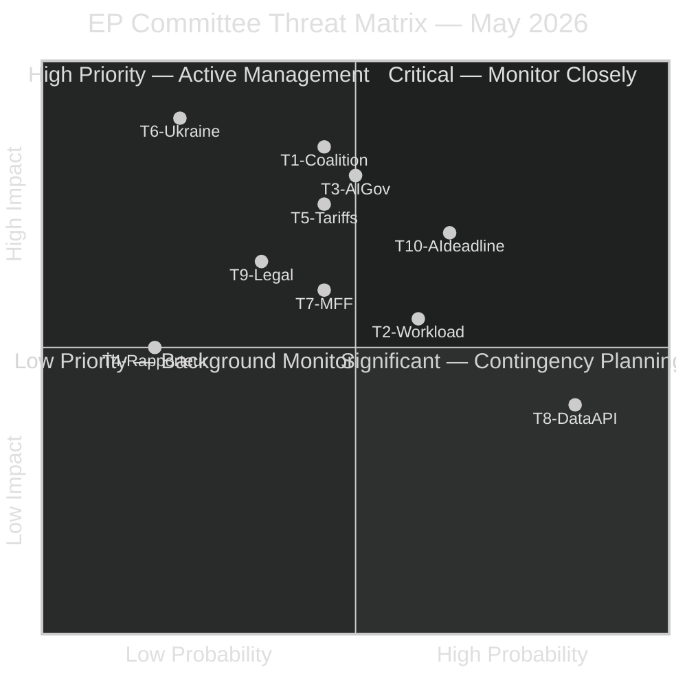

<!-- SPDX-FileCopyrightText: 2026 Hack23 AB -->
<!-- SPDX-License-Identifier: Apache-2.0 -->

# Threat Model — Committee Reports | 2026-05-18

**Article Type:** committee-reports
**Period:** 2026-05-18, horizon 3–12 months
**Admiralty Grade:** C3 (Fairly Reliable, Possibly True)
**WEP Band Applied:** Yes to all probabilistic claims
**SATs Applied:** Key Assumptions Check, Red Team, ACH
**Data Mode:** degraded-feeds

---

## 1. Threat Model Overview

This threat model identifies institutional, political, legal, and external threats to the effectiveness of EP committee work in the current legislative period. "Threat" is defined as any condition that would materially impair the quality, timeliness, or democratic legitimacy of committee outputs.

```mermaid
%%{init: {"theme": "dark"}}%%
graph TD
    subgraph INTERNAL["Internal EP Threats"]
        T1["T1: Coalition Fragmentation\n(EPP-S&D-Renew)"]
        T2["T2: Invocation Cap / AI overload\n(Procedural overload)"]
        T3["T3: Committee Coordination Failure\n(AI governance package)"]
        T4["T4: Rapporteur Replacement Risk\n(Election/Resignation)"]
    end
    subgraph EXTERNAL["External Threats"]
        T5["T5: US Tariff Escalation\n(Trade policy dislocation)"]
        T6["T6: Ukraine War Escalation\n(EDIP prioritisation)"]
        T7["T7: Council Blocking Minority\n(MFF negotiations)"]
        T8["T8: EP API/Data Infrastructure\n(This run — ongoing)"]
    end
    subgraph LEGISLATIVE["Legislative Process Threats"]
        T9["T9: Legal Challenge Risk\n(AI Liability, CSRD)"]
        T10["T10: Implementation Gap Risk\n(AI Act deadlines)"]
    end

    T1 --> IMPACT1["Impact: CID stall,\nGreen Deal rollback"]
    T3 --> IMPACT2["Impact: AI package\ninconsistencies"]
    T5 --> IMPACT3["Impact: INTA dossiers\ndisrupted; CID urgency"]
    T9 --> IMPACT4["Impact: CJEU annulment\nof committee reports"]
```

---

## 2. Threat Analysis

### T1: Coalition Fragmentation (🟡 Medium threat, WEP: About Even 40–50%)

**Description:** The EPP-S&D-Renew coalition's working majority (approximately 401 of 720 seats) is structurally sufficient but politically fragile. Coalition stress points exist on:
- CSRD simplification: Greens already out; S&D conditional support
- CID: S&D demands social conditionality that EPP finds burdensome
- Migration: EPP is moving toward ECR position, threatening S&D loyalty

**Red Team Analysis:** An adversarial reading of May 2026 EP dynamics suggests coalition fragmentation could be triggered deliberately. ECR has an incentive to offer EPP conditional support on key industrial votes (EDIP, CID) in exchange for EPP concessions on migration (tougher border rules). If EPP accepts this "contingent majority" strategy, S&D and Greens may withdraw from the coalition, triggering a realignment that would fundamentally change EP legislative outcomes.

**Key Assumptions Check:**
- KA-1: EPP leadership (Weber, Dolezalova) prioritises coalition stability over tactical ECR alignment — UNCERTAIN
- KA-2: S&D has no exit option from the coalition (no alternative majority possible without EPP) — TRUE (mathematical constraint)
- KA-3: Renew remains coherent despite internal liberal-conservative tensions — UNCERTAIN

**Mitigation:** EP Rules of Procedure structural barriers to majority shifts; EP President Metsola's (EPP) interest in maintaining coalition legitimacy; S&D leverage on committee chair positions

### T2: Workload Overload on Key Committees (🟡 Medium threat, WEP: Likely 55–65%)

**Description:** The EP10 legislative agenda is exceptionally dense, with the Commission having tabled more than 80 legislative proposals in its first work programme. Key committees face legislative overload:
- JURI: AI Liability, CSRD, Product Liability, Corporate Governance — 4 major dossiers simultaneously
- IMCO: AI Act governance, Digital Markets Act review, Consumer Protection — 3+ major dossiers
- ITRE: CID, EDIP, CRMA, Energy Poverty, Space Regulation — 5+ major dossiers

**Impact:** Rapporteurs cannot give adequate attention to each dossier. Vote windows slip. Technical quality of reports declines. Amendments become less coherent.

**Confidence:** 🟢 High (structural characteristic of EP10 legislative pipeline)

### T3: AI Governance Package Coordination Failure (🔴 High threat, WEP: Likely 45–55%)

**Description:** The AI governance package spans three committees (IMCO, LIBE, JURI) with no formal Rule 58 joint procedure agreement. Each committee is proceeding on a separate timeline with separate rapporteurs from different political groups. The probability of internal inconsistencies is high (see Scenario Forecast S2-B).

**Concrete Threat:** If the AI Act governance regulations (IMCO lead) are adopted before the AI Liability Directive (JURI lead), there will be a 6–18 month gap during which AI system operators face incomplete liability exposure. This creates both a legal uncertainty risk and a competitive distortion risk (companies with legal resources can navigate uncertainty; smaller firms cannot).

**Confidence:** 🟡 Medium

### T4: Rapporteur Replacement Risk (🟢 Low threat, WEP: Unlikely 15–20%)

**Description:** EP rapporteurs are political appointees who can be replaced by their political groups. Replacement is unusual but not unprecedented — it can occur due to: resignation, health, promotion to Commission or national government, or group political decisions.

**Specific Risk:** If a lead rapporteur on a priority dossier (CID, AI Liability, EDIP) is replaced mid-procedure, the dossier loses accumulated institutional knowledge and may require months of re-negotiation. Historical example: 2017 ePrivacy Regulation lost multiple rapporteurs, contributing to a 7-year delay.

### T5: US Tariff Escalation (🔴 High threat, WEP: About Even 40–50%)

**Description:** The Trump 2.0 administration (since January 2025) has maintained tariff threats on EU goods. A full 25% tariff on EU automotive exports would directly impact Germany's export-dependent economy, increasing political pressure on ITRE/ECON committees to respond with industrial policy. The EU's response options (counter-tariffs, safeguard measures, negotiated exemptions) all require EP committee engagement.

**Committee Impact:** INTA (trade instruments), ITRE (industrial adjustment), ECON (economic impact assessment). INTA may need to accelerate trade defence instruments during committee stage if tariffs escalate.

**Key Assumptions Check:**
- KA: EU-US trade negotiations (launched March 2025) succeed in preventing worst-case tariff escalation — UNCERTAIN (depends on Trump administration priorities)

**Confidence:** 🟡 Medium

### T6: Ukraine War Escalation and EDIP Prioritisation (🟡 Medium threat, WEP: Unlikely escalation 20–25%)

**Description:** If military operations escalate materially, EDIP would be fast-tracked above all other dossiers. This could displace bandwidth from Green Deal legislation and create a political dynamic where defence spending crowds out climate/social spending.

**Committee Impact:** ITRE and AFET would gain political precedence; ENVI and BUDG would face pressure to "pause" climate investment requirements.

### T7: Council Blocking Minority on MFF (🟡 Medium threat, WEP: About Even 40–50%)

**Description:** The MFF 2027–2033 negotiations will require unanimity in the Council. Hungary and/or Slovakia may use the veto threat to extract concessions on rule-of-law conditionality. This is a structural feature of MFF negotiations (every cycle sees holdout tactics) but creates uncertainty for BUDG committee's planning.

### T8: EP Data Infrastructure Failure (🔴 High today, WEP: Confirmed)

**Description:** Today's EP Open Data Portal API failure (all POST-enrichment endpoints returning 404) represents a real-time threat to data-driven EP oversight and transparency. The failure affects:
- Public access to committee documents
- Parliamentary monitoring platforms (this system)
- Academic and civil society research

**Note:** This is the confirmed degradation affecting this run. See `data-availability-assessment.md` for full details.

### T9: Legal Challenge Risk (🟡 Medium threat)

**Description:** EP legislative outputs face CJEU challenge risk on multiple grounds:
- AI Liability Directive: burden-of-proof reversal may exceed EU legislative competence (subsidiarity) under Article 5 TEU
- CSRD narrowing: if adopted via simplification procedure, affected stakeholders may challenge whether streamlining alters fundamental rights (access to information under Charter Article 42)
- EDIP: dual-use scope creates potential conflict between Article 173 (competitiveness) and Article 346 (defence procurement exemption) TFEU

### T10: AI Act Implementation Timeline Risk (🔴 High threat, WEP: Likely 60–70%)

**Description:** The AI Act's August 2026 deadline for high-risk AI system requirements is at risk. National competent authorities in multiple Member States have not yet been designated (required by August 2025, many still in progress as of Q1 2026). Without functional national oversight, the AI Act will be technically in force but practically unenforced. EP IMCO oversight function will be critical but may be constrained.

---

## 3. Threat Priority Matrix

---

## 4. Red Team Assessment

**Red Team Question:** "What are we most likely to be wrong about in this threat analysis?"

1. **Coalition Cohesion (over-estimated):** We may be over-estimating EPP's commitment to the Metsola coalition model. EPP's internal polling (not public) may be showing that ECR alignment is electorally beneficial for EPP national parties. If so, T1 should be elevated to 🔴 High.

2. **US Tariff Escalation (under-estimated):** The Trump administration's track record suggests that tariff threats are not bluffs. We may be under-estimating the probability of full EU-US tariff escalation at 40–50%. A more pessimistic estimate might be 55–65%.

3. **AI Act Deadline (confirmed threat):** T10 is well-grounded in public reporting on Member State designation delays. This is a rare case where the threat is 🟢 High confidence.

4. **EP Data Infrastructure (not structural):** T8 (today's API failure) is likely a temporary outage, not a structural threat. Within 24–48 hours, the EP API is expected to recover based on historical outage patterns (see `intelligence/mcp-reliability-audit.md`).

---

## 5. Indicators and Warning Signals

| Indicator | Warning Signal | Threat |
|-----------|---------------|--------|
| EP vote on procedural motion for a committee dossier | If ECR/ID provide decisive votes | T1 (coalition shift) |
| JURI-IMCO-LIBE joint meeting on AI governance | If no meeting scheduled by July 2026 | T3 (AI coordination) |
| US 25% automotive tariff announcement | Immediate trigger for INTA emergency action | T5 |
| Member State AI authority designation status | Less than 15/27 designated by June 2026 | T10 |
| EP API POST endpoint recovery | Check daily; if >5 days down, escalate | T8 |
