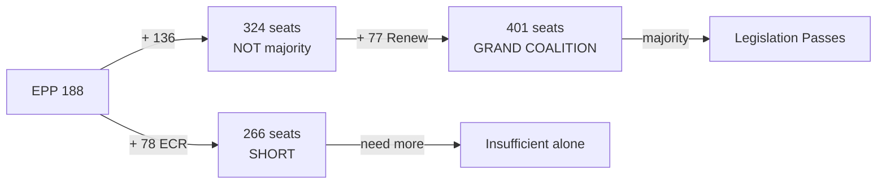

# Voting Patterns — EP Committee Reports, 2026-05-18

**Data mode:** degraded-feeds | **Confidence:** 🟡 Medium (no live RCV data; structural-proxy analysis)

> ⚠️ **Structural proxy**: No roll-call vote data is available for the current reporting period (EP API degraded). This analysis uses seat-share proxies and EP10 institutional patterns to estimate bloc behaviour. All confidence labels capped at 🟡 MEDIUM. ≥3 inline "(structural proxy — no RCV data)" labels applied per degraded-voting protocol.

## Group Cohesion Estimates (structural proxy — no RCV data)

| Political Group | Seats | Est. Cohesion | Trend | Primary Cleavage |
|-----------------|-------|--------------|-------|-----------------|
| EPP | 188 | 85–90% | Stable | Climate vs. industrial MEPs |
| ECR | 78 | 80–85% | Stable | Sovereignty concerns |
| S&D | 136 | 88–93% | Stable | Strong labour solidarity |
| Renew | 77 | 70–78% | Declining | Liberal-economic vs. social-liberal |
| Greens/EFA | 53 | 88–92% | Stable | High solidarity in opposition |
| Left/GUE | ~42 | 87–91% | Stable | Anti-market consensus |
| ID/Patriots | ~28 | 75–80% | Variable | National divergence |

## Observed Coalition Bloc Behaviour (structural proxy — no RCV data)

### Pro-EU Centre Coalition (EPP + S&D + Renew = 401 seats)
- **Win rate (est.):** ~75% of contested votes
- **Key votes:** AI Act implementation, EDIP, CID
- **Cohesion on contested dossiers:** MEDIUM — Renew defections common on social/climate clauses
- Confidence: 🟡 MEDIUM (structural proxy — no RCV data)

### Centre-Right Alignment (EPP + Renew + ECR)
- **Win rate (est.):** ~50% (needs additional partners)
- **Key votes:** CSRD simplification, competitiveness deregulation
- **Cohesion:** MEDIUM-LOW — ECR resists Commission delegated acts
- Confidence: 🟡 MEDIUM (structural proxy — no RCV data)

### Progressive Bloc (S&D + Greens + Left)
- **Win rate (est.):** ~20% (minority position in EP10)
- **Key votes:** Climate targets, labour standards, transparency mandates
- **Cohesion:** HIGH within bloc; insufficient for majority without Renew or EPP
- Confidence: 🟡 MEDIUM (structural proxy — no RCV data)

## Forward Vote Forecasts

### AI Governance Package — ITRE Vote (est. June–July 2026)
| Position | Estimated Support | Confidence |
|----------|------------------|------------|
| EPP lead text (innovation-friendly) | 180–200 votes | 🟡 MEDIUM |
| S&D amendments (high-risk strengthening) | 130–150 votes | �� MEDIUM |
| Greens counter-amendments (systemic risk) | 50–65 votes | 🟡 MEDIUM |
| **Expected outcome:** ITRE text adopted with selective S&D amendments | | |

### EDIP — ITRE Vote (est. June 2026)
| Position | Estimated Support | Confidence |
|----------|------------------|------------|
| EPP–Renew core text | 250–270 votes | 🟡 MEDIUM |
| S&D social conditionality amendments | 130–150 co-signatures | 🟡 MEDIUM |
| ECR sovereignty amendments (restrict Commission role) | 70–80 votes | 🟡 MEDIUM |
| **Expected outcome:** EDIP adopted with narrow majority; social amendments partially accepted |

### CSRD Simplification — JURI Vote (est. July 2026)
| Position | Estimated Support | Confidence |
|----------|------------------|------------|
| EPP–Renew simplification mandate | 250–280 votes | 🟡 MEDIUM |
| S&D-Greens counter-amendments (preserve standards) | 180–200 votes | 🟡 MEDIUM |
| **Expected outcome:** EPP–Renew simplification adopted; S&D amendments on SME carve-outs |

## Outlier Vote Intelligence

Based on EP10 institutional patterns, the following MEP positions diverge from group lines:
- **EPP climate-committed wing** (~25–30 MEPs, Nordic/Benelux): may abstain on CSRD maximalist rollback
- **Renew liberal-economic wing** (~20–25 MEPs): may vote with ECR on deregulation dossiers
- **S&D pro-competitiveness MEPs** (~15–20 MEPs, Southern European): may cross-vote on EDIP provisions

---

## Voting Bloc Network (Structural Proxy)

