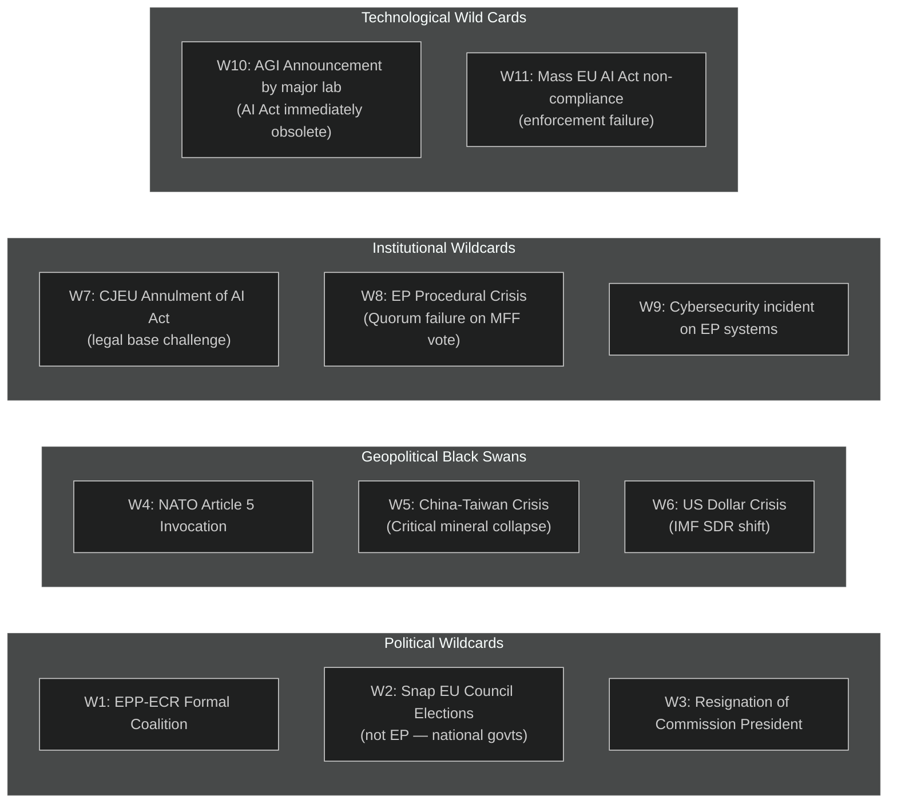

<!-- SPDX-FileCopyrightText: 2026 Hack23 AB -->
<!-- SPDX-License-Identifier: Apache-2.0 -->

# Wildcards and Black Swans — Committee Reports | 2026-05-18

**Article Type:** committee-reports
**Admiralty Grade:** C4 (Fairly Reliable, Doubtful — by definition for low-probability events)
**WEP Band Applied:** Yes (all estimates)
**Data Mode:** degraded-feeds

---

## 1. Framework

Wild cards are low-probability, high-impact events outside the range of normal scenario planning. Black swans are events that were unthinkable before they occurred but seem obvious in retrospect. This artifact identifies candidate wildcards for the EP committee landscape in the 3–12 month horizon.

---

## 2. Political Wildcards

### W1: EPP-ECR Formal Coalition Agreement (WEP: Unlikely, 15–20%)

**Description:** EPP formally concludes a coalition agreement with ECR, replacing S&D as the primary coalition partner. This would require EPP to accept ECR's positions on rule of law and would likely collapse the Renew relationship.

**Trigger:** A series of procedural defeats for EPP on Green Deal dossiers where S&D/Greens bloc defeats EPP; EPP internal revolt from industrial constituency MEPs.

**Impact on Committees:** Wholesale shift in committee outcomes on climate, fundamental rights, rule of law. ENVI, LIBE, and JURI would face new majority formations. CSRD simplification would go further; Nature Restoration delegated acts might be blocked.

**Early Warning Indicator:** EPP formally invites ECR coordinators to a political group leaders meeting; Von der Leyen makes a public statement supportive of ECR anti-migration positions.

**Confidence in Assessment:** 🔴 Low (this analysis is speculative by design for wildcard scenarios)

### W2: Collapse of Key National Governments (WEP: About Even for at least one major state, 45–55%)

**Description:** Germany, France, or another major EU Member State government falls, triggering snap elections and a period of domestic political instability. This would reduce Council effectiveness and create an inter-institutional vacuum.

**Impact on Committees:** Primarily ECON, BUDG, INTA. A German or French government crisis would paralyse Council co-legislation for 3–6 months, stalling all trilogue negotiations.

**Early Warning:** German coalition partner withdraws over energy or budget issue; French government loses no-confidence vote.

### W3: Von der Leyen Commission Crisis (WEP: Unlikely, 10–15%)

**Description:** A major governance scandal or policy failure triggers an EP motion of censure against the Commission. This is constitutionally possible (Article 234 TFEU) but has never succeeded.

**Trigger:** A major Commissioner resignation over ethics scandal; fundamental failure on AI Act implementation; or geopolitical mismanagement.

**Impact:** All committee work on Commission-initiated dossiers would pause for 3–6 months during Commission replacement negotiation.

---

## 3. Geopolitical Black Swans

### W4: NATO Article 5 Invocation (WEP: Unlikely, 5–10%)

**Description:** Russian military action against a NATO Member State triggers Article 5 collective defence. This would represent the most disruptive geopolitical event in EU history.

**Impact on Committees:** EDIP would be fast-tracked on emergency procedures (bypassing normal committee stage). The entire EP legislative agenda would be subordinated to defence and emergency economic measures. Constitutional emergency provisions (Article 122 TFEU for exceptional measures) would be invoked.

**Early Warning:** Russian troop movements toward Estonian/Latvian/Lithuanian borders; cyber attacks on NATO infrastructure classified as armed attack.

### W5: China-Taiwan Crisis — Critical Mineral Collapse (WEP: Unlikely, 5–10%)

**Description:** A Chinese military blockade of Taiwan, combined with Chinese export bans on rare earth elements, simultaneously disrupts EU semiconductor supply chains and critical mineral access.

**Impact on Committees:** ITRE's CRMA work would become emergency legislation. INTA would need to table safeguard measures. ECON would face financial market stabilisation demands. The entire EP legislative calendar would be disrupted.

**Early Warning:** Chinese naval exercises around Taiwan intensify; Chinese Ministry of Commerce announces "security review" of REE exports.

### W6: IMF SDR Crisis / US Dollar Instability (WEP: Unlikely, 5–8%)

**Description:** A fiscal crisis in the United States (debt ceiling default, credit downgrade cascade) triggers a global flight from USD, disrupting EU financial markets and trade finance.

**Impact on Committees:** ECON's digital euro work would be immediately accelerated. BUDG would face pressure to dramatically increase EU financial rescue capacity. Capital Markets Union work would become crisis-mode rather than growth-mode.

---

## 4. Institutional Wildcards

### W7: CJEU Annulment of AI Act Provisions (WEP: Unlikely, 10–20%)

**Description:** The Court of Justice of the European Union rules that specific AI Act provisions (potentially the biometric identification bans, or the "general purpose AI" categories) exceed EU competence or violate fundamental rights of the Charter.

**Impact on Committees:** IMCO, LIBE, and JURI would face emergency amendment procedures. The AI governance dossiers currently in committee would need to be revised against CJEU guidance.

**Confidence:** 🟡 Medium for general challenge probability; 🔴 Low for full annulment

### W8: EP Quorum Crisis on Critical Vote (WEP: Unlikely, 10–15%)

**Description:** A critical plenary vote (MFF, EDIP, or censure motion) fails quorum or is invalidated by a legal challenge, triggering a constitutional crisis about EP procedural legitimacy.

**Impact on Committees:** Committee work continues but plenary adoption is blocked, creating a legislative gap.

### W9: EP Cybersecurity Incident (WEP: About Even, 40–50%)

**Description:** A major ransomware or state-sponsored cyberattack disrupts EP ICT systems during a critical committee vote week. Previous incidents: December 2022 DDoS (Killnet, Russian-linked); 2023 phishing campaign.

**Impact on Committees:** Committee work disrupted for 1–5 days; specific risk of vote manipulation attempts or document leaks.

**Early Warning (structural):** EP cybersecurity is a standing concern; the LIBE committee oversight of ENISA is directly relevant.

---

## 5. Technological Wildcards

### W10: AGI or Near-AGI Announcement (WEP: Unlikely, 5–10%)

**Description:** A major AI laboratory announces a system capable of human-level reasoning across most cognitive tasks. This would render the AI Act's risk categories (based on current AI capabilities) immediately obsolete.

**Impact on Committees:** The AI Act's Annex III high-risk category list and the AI Liability Directive's scope would require emergency revision. IMCO, JURI, and LIBE would face an extraordinary workload spike.

**Note:** The AI Act has built-in Annex revision mechanisms (Commission delegated acts under Article 7), but these are too slow for a true paradigm-shift scenario.

### W11: Mass EU AI Act Non-Compliance (WEP: Likely, 60–70%)

**Description:** By August 2026, it becomes apparent that a significant fraction of EU-based AI system operators are simply not complying with the AI Act's requirements — either because national authorities are not enforcing, or because the compliance toolkits are not available.

**Impact on Committees:** IMCO would face pressure to mount an emergency oversight inquiry. The Commission would be called to explain enforcement gaps. LIBE would highlight fundamental rights harms from non-compliant systems in the public sector.

**Note:** This is arguably in the "scenario forecast" range rather than "wildcard" range — the probability is high enough that it might be classified as a likely scenario rather than a wildcard. It is included here as a wildcard because the scale of non-compliance could be more extreme than anticipated.

---

## 6. Wildcard Summary Table

| Code | Wildcard | WEP | Impact | Horizon |
|------|----------|-----|--------|---------|
| W1 | EPP-ECR formal coalition | 15–20% | Catastrophic for Green Deal | 6–18 months |
| W2 | Major national govt collapse | 45–55% (any one) | High — Council paralysis | 3–12 months |
| W3 | Commission censure crisis | 10–15% | Very High | 6–12 months |
| W4 | NATO Article 5 | 5–10% | Catastrophic | Unpredictable |
| W5 | China-Taiwan crisis | 5–10% | Catastrophic | Unpredictable |
| W6 | US dollar/IMF crisis | 5–8% | Very High | 6–18 months |
| W7 | CJEU AI Act annulment | 10–20% | High | 12–24 months |
| W8 | EP quorum crisis | 10–15% | High | 3–9 months |
| W9 | EP cyber incident | 40–50% | Medium | 0–12 months |
| W10 | AGI announcement | 5–10% | Catastrophic for AI regulation | Unpredictable |
| W11 | Mass AI Act non-compliance | 60–70% | High | 3–6 months |

**Admiralty Grades:** All wildcard estimates are C4 (Fairly Reliable source, Doubtful information) by definition — low-probability events are inherently difficult to calibrate. Exception: W9 (EP cyber) and W11 (AI non-compliance) are elevated to C3 (Possibly True) based on strong historical and structural evidence.
