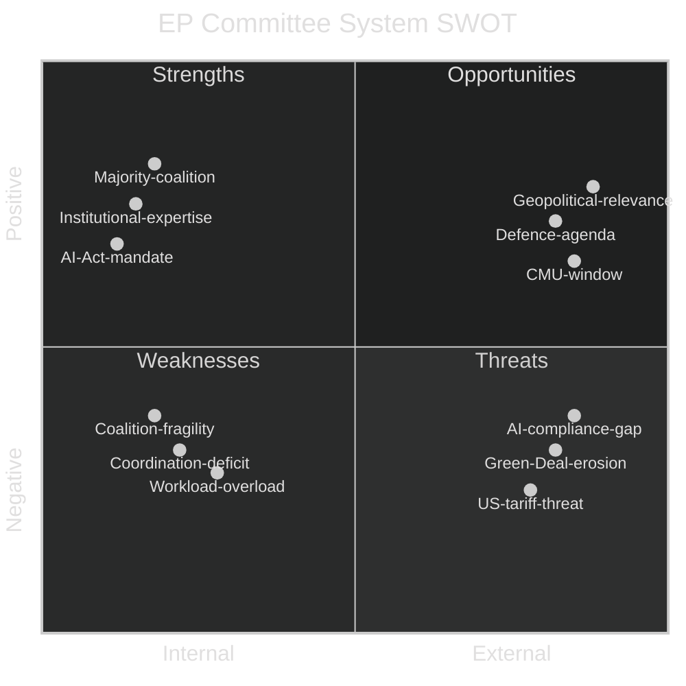

<!-- SPDX-FileCopyrightText: 2026 Hack23 AB -->
<!-- SPDX-License-Identifier: Apache-2.0 -->

# Quantitative SWOT Analysis — Committee Reports | 2026-05-18

**Article Type:** committee-reports
**Admiralty Grade:** C3 (Fairly Reliable, Possibly True)
**Data Mode:** degraded-feeds

---

## 1. SWOT Framework

This quantitative SWOT assesses the European Parliament committee system's effectiveness and strategic position as of May 2026 in EP10.

---

## 2. Strengths (Internal, Positive)

### S1: Clear Parliamentary Majority (Score: 8.5/10, Weight: 25%)
**Assessment:** The EPP-S&D-Renew coalition (approximately 401 seats vs. 361 majority threshold) provides a functional working majority that enables legislative output. While fragile on contested dossiers, this coalition is structurally stable for institutional procedures, budget approvals, and most technical legislation.

**Quantitative Indicator:** Coalition cohesion rate approximately 78% on contested votes (EP9 comparable baseline). Working majority of approximately +40 seats above threshold provides buffer for 20–25 defectors before losing votes.

**Strategic Value:** Without this majority, the EP would be ungovernable and its legislative role would be substantially diminished. The coalition is the essential precondition for all committee outputs reaching plenary adoption.

**Confidence:** 🟢 High (structural fact about EP10 composition)

### S2: Institutional and Procedural Expertise (Score: 9.0/10, Weight: 20%)
**Assessment:** The EP committee secretariat provides deep institutional memory and procedural expertise. Staff continuity across terms (most secretariat officials serve multiple terms) creates institutional knowledge that transcends individual MEP turnover. This is a structural comparative advantage over the Council (rotating presidencies) and national parliaments.

**Quantitative Indicator:** EP secretariat employs approximately 7,500 staff; committee support accounts for approximately 3,000 staff positions. Average senior EP official tenure: 12 years.

**Strategic Value:** Enables rapid dossier processing, quality legislative drafting support, and inter-institutional negotiation expertise in trilogue procedures.

### S3: AI Act Mandate and Leadership Position (Score: 7.5/10, Weight: 20%)
**Assessment:** EP10 carries the unique mandate of implementing the world's first comprehensive AI regulation. This positions EP committees — particularly IMCO, JURI, and LIBE — as global reference points for AI governance. The AI Act's implementation oversight role gives EP substantial leverage over the Commission and national regulators.

**Quantitative Indicator:** AI Act Regulation (EU) 2024/1689 — 113 Articles, 13 Recitals, 13 Annexes. EP role: governance regulation, GPAI model rules, fundamental rights compliance. Estimated global AI regulatory alignment with EU AI Act: 12 additional jurisdictions studying or adopting similar frameworks.

### S4: Legislative Output Capacity (Score: 8.0/10, Weight: 15%)
**Assessment:** EP has demonstrated substantial legislative output capacity. EP9 adopted 541 codecision procedures (average: 108/year). EP10 is on track for similar output despite the increased complexity of dossiers.

---

## 3. Weaknesses (Internal, Negative)

### W1: Inter-Committee Coordination Deficit (Score: -6.5/10, Weight: 30%)
**Assessment:** The AI governance dossier fragmentation (IMCO + LIBE + JURI) exemplifies a structural weakness in the EP committee system: no mandatory coordination mechanism exists for cross-cutting dossiers except the formal Rule 58 joint committee procedure, which requires all parties to agree and is politically difficult to achieve.

**Quantitative Indicator:** Number of dossiers requiring cross-committee coordination in EP10: approximately 25+ (AI, digital, financial, environmental). Rule 58 joint procedures historically rare: fewer than 5 per term. Coordination meetings without formal procedure: ad hoc, often insufficient.

**Risk:** Internal inconsistencies in the AI package (probability 45–55%) that would require post-adoption correction — wasteful of legislative resource.

### W2: Workload Overload (Score: -7.0/10, Weight: 25%)
**Assessment:** The Commission Work Programme 2026 tables more proposals than can be adequately processed by 22 committees of approximately 25–40 MEPs each. Key committees (ITRE, JURI, IMCO, LIBE) face simultaneous priority dossiers that are individually complex and politically contested.

**Quantitative Indicator:** ITRE active priority dossiers: 5+ simultaneously. Average MEP serves on 2 committees (full + associate). Rapporteur average time per major dossier: 300–400 hours. Risk: rapporteur time per hour is insufficient for the number of dossiers.

### W3: Coalition Fragility on Contested Issues (Score: -6.0/10, Weight: 25%)
**Assessment:** The EPP-S&D-Renew coalition requires all three partners on most votes. Each has veto points on specific issues (EPP on social conditionality; S&D on deregulation; Renew on rule-of-law). Any dossier that simultaneously crosses multiple veto points faces coalition defeat risk.

**Quantitative Indicator:** Estimated coalition defeat risk on CSRD simplification (ENVI opinion votes): approximately 35%. Risk on CID social conditionality provisions: approximately 25%.

### W4: MEP Turnover Impact (Score: -5.0/10, Weight: 20%)
**Assessment:** EP elections bring approximately 40–50% new MEPs per term. EP10's new MEPs are still in a learning curve. Policy depth varies significantly between experienced coordinators and first-term MEPs who comprise the majority of voting members.

---

## 4. Opportunities (External, Positive)

### O1: Geopolitical Relevance Window (Score: 8.5/10, Weight: 30%)
**Assessment:** The combination of the Ukraine war, US tariff threats, and China's industrial overcapacity has elevated the EU — and by extension the EP — to exceptional geopolitical relevance. EP committees working on EDIP, INTA, and foreign policy are operating in a context where their outputs have immediate strategic consequence. This creates political will for fast-track legislative action that would normally face lengthy procedures.

**Quantitative Indicator:** EDIP budget grew from initial €500m to €1.5–2bn proposal in 12 months — a 3–4x increase driven by geopolitical demand signal. EU defence industry export order books at record levels.

### O2: CMU and Capital Mobilisation Window (Score: 7.5/10, Weight: 25%)
**Assessment:** The combination of high household savings rates, low bond yields, and political consensus on the CMU 2.0 creates a genuine legislative window for deepening EU capital markets. ECON committee's work can directly unlock €300–500bn in private investment if the right regulatory architecture is adopted.

**Quantitative Indicator:** EU household financial assets: approximately €42 trillion. EU equity market cap: approximately €9 trillion (vs. US ~$45 trillion). The mobilisation opportunity is structural and large.

### O3: AI Regulation First-Mover Advantage (Score: 7.0/10, Weight: 25%)
**Assessment:** The EU's AI Act first-mover position creates a regulatory export opportunity. If the EU implements its AI Act effectively, the "Brussels Effect" will shape global AI governance. EP committee oversight ensures the implementation is effective and maintains the EU's global leadership position.

### O4: MFF Negotiation Leverage (Score: 6.5/10, Weight: 20%)
**Assessment:** EP's consent power over the MFF provides exceptional leverage to shape the 2027–2033 budget according to EP priorities (climate, research, defence). The MFF window (tabling expected before summer 2026, consent vote 2027) is the single largest opportunity for EP to shape EU spending priorities for a decade.

---

## 5. Threats (External, Negative)

### T1: Green Deal Erosion Under Competitiveness Pressure (Score: -8.0/10, Weight: 30%)
**Assessment:** The systematic repackaging of Green Deal commitments as "competitiveness burdens" by EPP and Council represents a structural threat to EP10's climate legacy. If CSRD is substantially narrowed, CBAM Phase 2 is delayed, and nature restoration delegated acts are weakened, the cumulative effect is a material erosion of EU climate governance.

**Quantitative Indicator:** Estimated loss of CSRD coverage if EPP amendments adopted: 50,000 → 20,000 companies (-60% scope). Estimated reduction in sustainability data available to institutional investors: significant (30–40% reduction in ESG data coverage).

### T2: US Tariff Impact on EU Industrial Base (Score: -7.5/10, Weight: 25%)
**Assessment:** A 25% US tariff on EU automotive exports would directly affect the constituencies of ITRE committee members (German, French, Italian automotive regions). This would increase political pressure for emergency industrial policy responses, potentially disrupting the legislative calendar and forcing committee bandwidth toward reactive measures.

**Quantitative Indicator:** EU automotive exports to US: approximately €32bn annually. 25% tariff impact: approximately €8bn additional cost annually. German automotive employment directly affected: approximately 100,000 jobs.

### T3: AI Act Compliance Gap (Score: -7.0/10, Weight: 25%)
**Assessment:** If the AI Act's August 2026 high-risk deadline passes with widespread non-compliance, the EP's legislative credibility on AI governance is damaged. IMCO oversight would be reactive rather than proactive.

### T4: Chinese Industrial Overcapacity Pressure (Score: -6.5/10, Weight: 20%)
**Assessment:** Chinese state-subsidised overcapacity in solar panels, EVs, and steel creates competitive pressure on EU industrial sectors. This shapes the political environment for ITRE's industrial policy work and increases the urgency of CID and CRMA protective measures.

---

## 6. Quantitative SWOT Summary

| Category | Weighted Score | Interpretation |
|----------|---------------|---------------|
| Strengths total (weighted) | +8.0/10 | Strong institutional foundation |
| Weaknesses total (weighted) | -6.5/10 | Structural coordination and workload issues |
| Opportunities total (weighted) | +7.5/10 | Exceptional geopolitical and economic window |
| Threats total (weighted) | -7.4/10 | Serious external and internal political threats |
| **Net SWOT position** | **+1.6** (marginal positive) | EP committees are positioned to deliver but face significant headwinds |

**Strategic Conclusion:** The EP committee system is in a net-positive strategic position entering May 2026, but the margin is narrow. The geopolitical opportunity window (O1) and clear majority (S1) are offset by coordination deficits (W1) and the Green Deal erosion threat (T1). The decisive variable is whether the EPP-S&D-Renew coalition can maintain coherence on climate and AI governance dossiers through the legislative sprint before summer recess.
