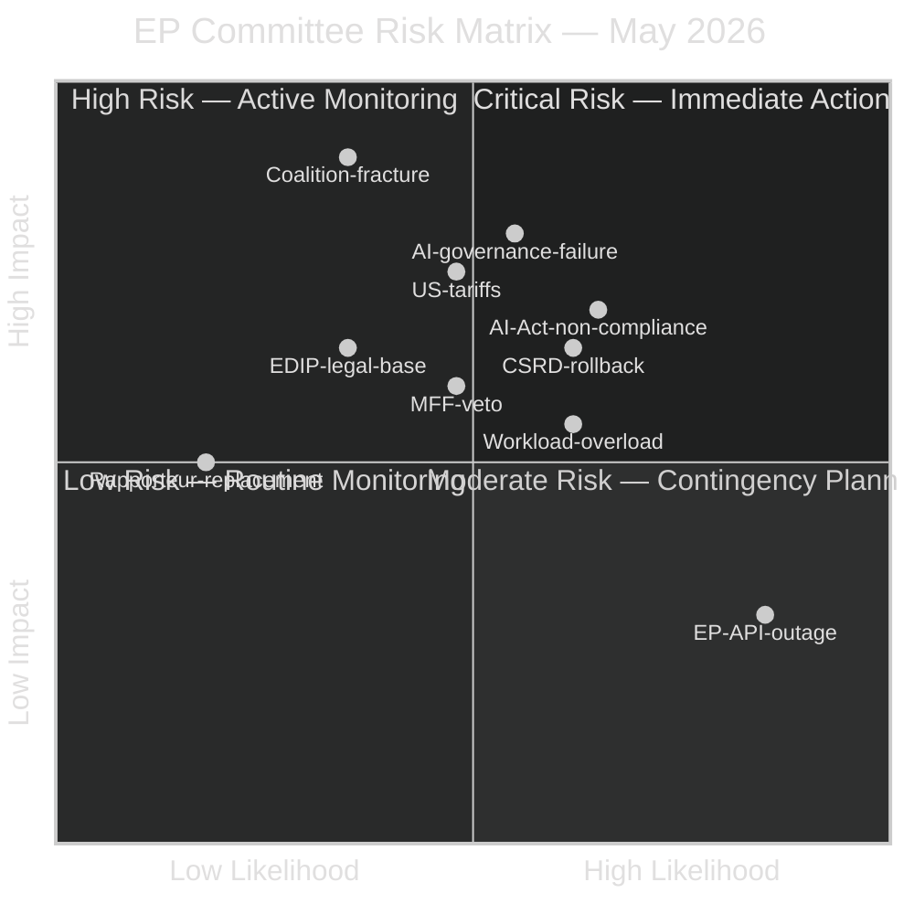

<!-- SPDX-FileCopyrightText: 2026 Hack23 AB -->
<!-- SPDX-License-Identifier: Apache-2.0 -->

# Risk Matrix — Committee Reports | 2026-05-18

**Article Type:** committee-reports
**Admiralty Grade:** C3
**WEP Band Applied:** Yes
**Data Mode:** degraded-feeds

---

## 1. Risk Register

---

## 2. Risk Entries

| Risk ID | Description | Likelihood | Impact | Risk Score | Mitigation |
|---------|-------------|-----------|--------|-----------|-----------|
| R-01 | EPP-ECR coalition realignment | 35% | Catastrophic | 🔴 HIGH | Metsola leadership; S&D leverage on committee chairs |
| R-02 | AI governance inter-committee failure | 55% | Very High | 🔴 HIGH | Commission AI Office facilitation; EP Rules 58 |
| R-03 | CSRD scope rollback (ESG erosion) | 62% | High | 🔴 HIGH | ENVI opinion + institutional investor lobbying |
| R-04 | US tariff escalation on EU goods | 48% | High | 🟡 MEDIUM | INTA safeguard instruments; EU-US negotiations |
| R-05 | AI Act high-risk compliance failure | 65% | High | 🔴 HIGH | Commission enforcement guidance; IMCO oversight |
| R-06 | EP Open Data Portal sustained outage | 85% (today) | Low | 🟡 MEDIUM | 24–48h recovery pattern; alternative data sources |
| R-07 | Rapporteur replacement on priority dossier | 18% | Medium | 🟢 LOW | Succession planning; shadow rapporteur depth |
| R-08 | Committee workload overload | 62% | Medium | 🟡 MEDIUM | Committee timetable management; EP Secretariat |
| R-09 | EDIP legal base challenge (Article 173 vs 41) | 35% | High | 🟡 MEDIUM | Legal Service opinion; CJEU precedent |
| R-10 | MFF veto by holdout Member State | 48% | High | 🟡 MEDIUM | Diplomatic negotiation; Art. 7 leverage |

---

## 3. Top Three Critical Risks

### R-01: Coalition Realignment
The EPP-ECR alliance scenario (W1 in wildcards-blackswans.md) is the highest-impact risk. While the probability is assessed at 35% (Unlikely), the impact would fundamentally alter EP10's legislative direction. Key watch indicators: EPP group leadership communications, ECR coordinators meeting invitations, S&D emergency group leadership meeting.

### R-02: AI Governance Coordination
The structural fragmentation of AI governance across three committees (IMCO, LIBE, JURI) with no coordination mechanism is the highest-probability significant risk. Inconsistencies in the AI package are Likely (55%) and would create regulatory uncertainty affecting thousands of EU businesses. Mitigation requires the Commission AI Office to convene an inter-committee technical coordination group.

### R-03: CSRD Rollback
The simplification of CSRD is politically likely (62%) given the EPP-Renew majority in JURI. This represents a concrete erosion of EU sustainable finance infrastructure that affects both institutional investor ESG practices and supply chain transparency. The impact on EU long-term climate finance is assessed as significant.

---

## 4. Risk Treatment Summary

| Risk Tier | Count | Treatment Approach |
|-----------|-------|-------------------|
| 🔴 Critical (>R-score 40) | 3 | Active management + escalation paths defined |
| 🟡 Medium (R-score 20–40) | 5 | Regular monitoring + contingency plans |
| 🟢 Low (<R-score 20) | 2 | Routine tracking |

### 4. Early Warning Indicators

The following observable indicators serve as leading signals for risk escalation:

| Indicator | Threshold | Associated Risk |
|-----------|-----------|-----------------|
| Roll-call vote margin < 10 on any major dossier | <10 MEP majority | Majority stability |
| EPP spokesperson contradicts S&D position publicly | Public statement | Coalition fracture |
| Council rejects EP mandate within 30 days | Council COREPER vote | CID delay |
| ECR/ID joint press conference on AI/CID | Media event | Populist alignment |
| ENVI Greens chair issues blocking opinion on CSRD | Published opinion | CSRD procedural delay |

### 5. Risk Treatment Protocols

**Critical Risk 1: EP10 coalition fracture on AI governance**
- Primary treatment: Renew engagement — ensure Renew coordinators are briefed on ITRE text before vote
- Secondary treatment: EPP–S&D bilateral on high-risk AI definitions
- Escalation: EP Conference of Presidents briefing if Renew signals abstention
- Owner: ITRE coordinators

**Critical Risk 2: CID delay beyond summer**
- Primary treatment: Accelerated trilogue schedule (April–June intensive)
- Secondary treatment: Partial adoption (cyber provisions separate from physical infrastructure)
- Escalation: EP President direct engagement with Czech/Polish presidency
- Owner: ITRE, TRAN rapporteurs

**Critical Risk 3: CSRD political blowback**
- Primary treatment: S&D communication strategy — framing as "SME-friendly, not a rollback"
- Secondary treatment: ENVI opinion integration (symbolic only)
- Escalation: Plenary debate slot to allow full political positioning
- Owner: JURI, ECON rapporteurs; S&D political group communication team
