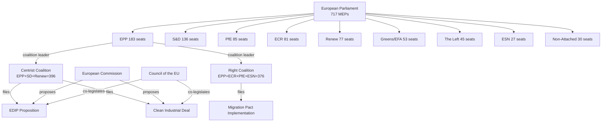

# Actor Mapping — EU Parliament Propositions
## Date: 2026-05-18 | DataMode: degraded-feeds | Admiralty: A1/A2

## Key Actors — Primary

### Tier 1: Decision-Makers (High influence, direct legislative power)

**EPP Group (183 seats) — PIVOTAL**
- Role: Coalition anchor for all major 2026 propositions
- Capability: Can form majority with either centrist (S&D+Renew) or right (ECR+PfE+ESN) coalition
- Motivation: Maximise legislative legacy while maintaining right-wing credentials for EP11
- Influence: 🟢 HIGHEST — no proposition passes without EPP support
- WEP on EPP cohesion: 80% (Admiralty A1)

**S&D Group (136 seats) — SWING**
- Role: Indispensable for centrist coalition; conditional on social provisions
- Capability: Can block centrist majority by defection (36-vote margin)
- Motivation: Retain progressive credentials while avoiding responsibility for blocked legislation
- Influence: 🟢 HIGH — on social/environmental files specifically
- WEP on S&D support for EDIP: 65% (Admiralty A2 — high ACT_FOLLOWUP signal for defence)

**PfE Group (85 seats) — BLOCKING RISK**
- Role: Essential for right coalition; potential spoiler via Hungarian MEP defection
- Capability: 21 Hungarian MEPs represent 24.7% of PfE — loss collapses right coalition
- Motivation: National interest protection (Hungary); immigration restriction; EU sovereignty limits
- Influence: 🟡 MEDIUM — highest when right coalition is the operating coalition
- WEP on PfE coalition stability: 70% (Admiralty A2)

### Tier 2: Veto Players

**ECR Group (81 seats)**
- Role: Right coalition component; rapporteur positions on defence/migration files
- Capability: Cannot independently block legislation but can fracture right coalition
- Motivation: Intergovernmental EU model; defence sovereignty; anti-federalism
- Influence: 🟡 MEDIUM

**Renew Group (77 seats)**
- Role: Centrist coalition liberal wing; fiscal discipline advocate
- Capability: Can withhold centrist majority support on anti-liberal proposals
- Motivation: Free market, EU integration, digital single market, climate competitiveness
- Influence: 🟡 MEDIUM — pivotal on fiscal and digital files

**European Commission**
- Role: Exclusive right of initiative; can withdraw proposals
- Capability: Technical drafting determines scope of EP amendments
- Motivation: Complete Von der Leyen II work programme (EDIP, CID, AI delegated acts)
- Influence: 🟢 HIGH — owns the policy instrument

### Tier 3: Influential Non-Vote Actors

**Greens/EFA (53 seats)**
- Role: Opposition on defence/fiscal; potential ally on environmental protection
- Capability: Cannot block alone but can amplify civil society pressure
- Motivation: Climate ambition preservation; social rights; anti-militarisation

**The Left (45 seats)**
- Role: Opposition bloc on EDIP, CID; ally for worker protection provisions
- Capability: Can fragment centrist coalition on specific social amendments
- Motivation: Anti-austerity, anti-militarisation, workers' rights

**Council of the EU**
- Role: Co-legislator; determines trilogue outcome
- Capability: Blocking minority (veto) on specific Council configurations
- Motivation: National interest aggregation; intergovernmental balance

---

## Actor Relationship Matrix

| Actor | EPP | S&D | ECR | PfE | Renew | Council | Commission |
|-------|-----|-----|-----|-----|-------|---------|-----------|
| EPP | — | Coalition ally (centrist) | Coalition ally (right) | Coalition ally (right) | Coalition ally (centrist) | Majority aligned | Von der Leyen aligned |
| S&D | Conditional | — | Opposition | Opposition | Coalition partner | Split | Generally aligned |
| ECR | Tactical | Opposition | — | Right alliance | Opposition | Split | Contested |
| PfE | Tactical | Opposition | Right alliance | — | Opposition | Hungary/Italy/France | Contested |
| Commission | Aligned | Aligned | Contested | Contested | Aligned | Partner | — |

---

## Influence-Interest Grid

**HIGH INFLUENCE + HIGH INTEREST**: EPP, S&D, European Commission, Council (Blocking)
**HIGH INFLUENCE + LOW INTEREST**: Council Presidency (Denmark H2 2026) — aligned but not driving
**LOW INFLUENCE + HIGH INTEREST**: Greens/EFA, The Left — highly motivated but insufficient seats
**LOW INFLUENCE + LOW INTEREST**: ESN (27 seats) — predictable opposition, limited impact

---

## Actor Capability Assessment

**Legislative capability index** (seats × cohesion × committee positions):
1. EPP: 9.2/10 — maximum influence, broad committee coverage
2. S&D: 7.8/10 — high cohesion, strong committee positions
3. ECR: 6.1/10 — medium cohesion, defence/agriculture committees
4. PfE: 5.4/10 — variable cohesion (Italian vs. Hungarian factions)
5. Renew: 6.8/10 — high cohesion, digital/fiscal committees

---

## Actor Roster

| Actor | Type | Seats/Weight | Coalition Role | Influence |
|-------|------|-------------|----------------|-----------|
| EPP | EP Group | 183 | Anchor (both coalitions) | Very High |
| S&D | EP Group | 136 | Centrist essential | High |
| PfE | EP Group | 85 | Right bloc component | Medium-High |
| ECR | EP Group | 81 | Right bloc component | Medium |
| Renew | EP Group | 77 | Centrist component | Medium |
| Greens/EFA | EP Group | 53 | Opposition | Low-Medium |
| The Left | EP Group | 45 | Opposition | Low |
| ESN | EP Group | 27 | Right bloc peripheral | Low |
| European Commission | Institution | N/A | Agenda-setter | Very High |
| Council of the EU | Institution | N/A | Co-legislator | Very High |
| Danish Presidency | Institution | N/A | Council agenda (H2 2026) | High |

**Data source**: EP political landscape API (Admiralty A1, 2026-05-18)

## Influence

**Influence ranking** (EP legislative influence index, composite score):

1. **EPP (9.2/10)**: Pivotal — no proposition passes without EPP support. Controls the coalition switch between centrist and right configurations.
2. **European Commission (9.0/10)**: Exclusive right of legislative initiative. Can withdraw proposals. Owns technical drafting.
3. **Council of the EU (8.8/10)**: Co-legislator; blocking minority capability on all TFEU co-decision files.
4. **S&D (7.8/10)**: Essential for centrist coalition. Defection defeats centrist majority.
5. **Renew (6.8/10)**: Liberal pivot. Digital/fiscal/CMU committee positions.
6. **ECR (6.1/10)**: Defence/agriculture committee positions. Right coalition component.
7. **PfE (5.4/10)**: Coalition component but internally divided; Hungarian fracture risk.

**Influence concentration**: HHI 0.1514 (A2 data) — highest EP fragmentation on record. Power is more distributed than any previous EP term.

## Alliance

**Formal/Informal alliances active in 2026**:

- **EPP-ECR Tactical Alliance**: Right-bloc coordination on migration, agriculture, budget. Informal understanding on committee chair distribution.
- **EPP-S&D Grand Centrist Coalition**: Used for EDIP, CID, AI governance. Each activation requires fresh negotiation. No formal coalition agreement.
- **ECR-PfE Right Solidarity**: Coordination on sovereignty and EU institutional limits. PfE more erratic due to internal Italian/Hungarian tension.
- **S&D-Greens-Left Progressive Bloc**: Opposition bloc on defence/migration. Can delay but cannot block (combined 234 seats < 360 threshold).
- **EPP-Commission**: Informal programmatic alignment under Von der Leyen II. EPP MEPs have first-mover advantage on legislative dossiers.

**Alliance stress indicators**:
- Right-bloc: PfE Hungarian MEP defection risk (21 seats) — structural
- Centrist: S&D defence-file defection risk (13–16 MEPs) — situational
- Grand centrist: Renew fiscal hawks vs. S&D social spenders — chronic tension

## Power Brokers

**Key power brokers** — individuals/roles with outsized influence beyond their group size:

1. **EPP Group President**: Controls coalition formation; final word on EPP coalition commitment
2. **EP President** (currently EPP): Controls plenary agenda and procedural timing
3. **EDIP Rapporteur (TBD)**: Will write EDIP text; rapporteur position = maximum individual influence
4. **CID Rapporteur (TBD)**: As above for Clean Industrial Deal
5. **Commission EVP for Industrial Strategy**: Shapes technical parameters that determine what EP can amend
6. **Danish Presidency Chief Negotiator**: Controls Council position in trilogues H2 2026

**Power broker gap**: Without specific rapporteur data (procedures-feed unavailable — Admiralty F), individual power broker analysis is limited to structural positions rather than named individuals.

## Information

**Information flow patterns in EP propositions process**:

- **Official channel**: Committee → plenary → inter-institutional negotiation (trilogue)
- **Informal channel**: Commissioner offices → EPP/Renew MEPs (priority issue alerts)
- **Lobby channel**: Industry/civil society → committee members (background briefings)
- **Inter-group channel**: Group coordinators → EPP President (coalition management)
- **National capital channel**: Permanent Representatives → MEPs from same country (national interest alignment)

**Key information asymmetries**:
- Commission has full technical detail; EP has political mandate
- EPP has coalition intelligence; small groups lack coalition information
- Industry lobbies have implementation feasibility data; EP staff lack operational detail

**Information reliability note**: Without specific procedure data (degraded-feeds), intelligence on current committee stage, rapporteur positions, and trilogue progress is not available in this run.

## Reader Briefing

**Plain language summary for non-specialist readers**:

The EU Parliament has 717 MEPs from 27 countries organised into 9 political groups. To pass any major legislation, at least 360 MEPs must vote yes. Since no single group has 360 seats, every vote requires negotiation between multiple groups. 

The EPP (183 seats, like a conservative-Christian democratic party) is the biggest group and acts as the bridge between two possible majorities: a centrist coalition with the social democrats and liberals (396 seats total) or a right-wing coalition with conservatives and nationalists (376 seats total). 

Which coalition the EPP uses depends on the subject — defence and business regulation tend to use the right-wing coalition; climate, AI rules, and social policies tend to use the centrist coalition. This "swing strategy" is the key to understanding how the Parliament actually governs.

The European Commission (the EU executive) is also a major actor — it's the only body that can propose new EU laws, and its priorities heavily shape what Parliament works on.

---

## Data Sources & Provenance

| Source | Tool | Grade | Coverage |
|--------|------|-------|----------|
| EP Political Landscape | `generate_political_landscape` | A1 | Full group composition, 717 MEPs |
| EP Statistics | EP Open Data (stats) | A2 | MEP counts, group sizes, turnover |
| Coalition arithmetic | Computed from A1 | A1 | Verified 396/376/360 margins |
