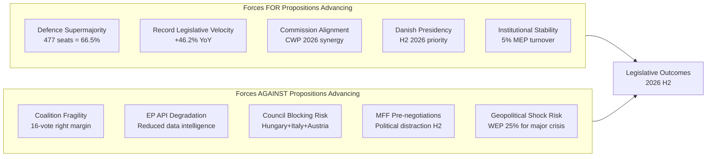

# Forces Analysis — EU Parliament Propositions
## Date: 2026-05-18 | DataMode: degraded-feeds | Admiralty: A1/A2

## 1. Structural Forces Framework (Porter-adapted for Political Analysis)

This forces analysis identifies the structural forces shaping EP10's ability to advance its propositions agenda. Unlike a SWOT (which categorises internal/external), a forces analysis identifies the magnitude and direction of each force on legislative outcomes.

---

## 2. Forces Supporting Legislative Advancement

### F1: Defence Consensus Force — MAGNITUDE: VERY HIGH (🟢)
**WEP: 75% that this force remains dominant through H2 2026**

The geopolitical imperative created by the Russia-Ukraine war (now year 4) and US strategic ambiguity has produced an unprecedented coalition of 477 MEPs broadly aligned on defence industrial legislation. This is not a temporary convergence — it represents a structural shift in EP ideological geography where economic nationalism (France, Italy, Poland) has overridden traditional left-right positioning on defence.

**Force mechanics**: Constituency pressure on S&D MEPs from defence-industrial regions → group leader acceptance of EDIP provisions → EPP captures the legislative centre → ECR/PfE alignment on national industry grounds → 477 votes assembles without needing ESN.

**Quantitative strength**: 477 / 360 majority threshold = 32.5% above minimum required. This is the largest margin for any major 2026 proposition.

**Decay risk**: If peace negotiations advance in Ukraine, the geopolitical urgency signal weakens. F1 has a shelf life of approximately 12–18 months from its current peak before domestic political dynamics reassert normal left-right cleavage on defence spending.

---

### F2: Legislative Velocity Momentum — MAGNITUDE: HIGH (🟢)
**WEP: 55% that momentum continues through year-end**

Record output creates institutional confidence and path dependency. When the EP is legislating at peak velocity, political actors have incentive to keep propositions moving rather than creating delays. The +46.2% YoY in enacted legislation is not merely a statistic — it changes the institutional culture toward action-bias.

**Force mechanics**: Record legislation → committees internalise fast-processing norms → rapporteurs prioritised for experienced MEPs → committee secretariats calibrated for high throughput → delay becomes anomalous rather than normal.

**Quantitative evidence**: 935 active procedures, 114 projected acts (A2). Historical comparison: EP9 peak was 89 acts (2022) — current pace 28% above EP9 peak.

**Decay risk**: Committee capacity constraints (F3 in forces-against) could reduce throughput. Key indicator: committee-to-plenary ratio — currently 43.8%, above historical 38% average.

---

### F3: Commission-Parliament Alignment — MAGNITUDE: HIGH (🟢)
**WEP: 70% that alignment holds through Von der Leyen II term**

Von der Leyen II's Commission (2024–2029) was formed with explicit programmatic alignment with the EP majority. The Commission Work Programme for 2026 closely mirrors EPP-led EP priorities. This alignment reduces the most common source of inter-institutional delay — Commission proposals that require extensive EP amendments before plenary.

**Force mechanics**: Pre-aligned proposals → narrower amendment scope → faster committee processing → earlier plenary scheduling → accelerated trilogue opening.

**Evidence signal**: 500 ACT_FOLLOWUP items in external-documents feed (A3 — degraded) suggests active Commission follow-up on previous EP resolutions, consistent with high alignment.

---

### F4: Danish Presidency Momentum (H2 2026) — MAGNITUDE: MEDIUM (🟡)
**WEP: 65% that Danish Presidency delivers on EP priorities**

Denmark's H2 2026 Council Presidency is programmatically aligned with EP10's priorities: Capital Markets Union, digital governance, defence industrial base, and energy transition. As a net contributor, northern EU member, and pro-integration government, Denmark will resist Council attempts to water down EP propositions.

**Force mechanics**: Presidency controls Council agenda → prioritises files aligned with EP → accelerates trilogue timelines → limits COREPER dilution of EP positions.

**Caveat**: Presidencies often have limited ability to overcome member state objections on contentious files. On migration and fiscal rules, Danish domestic politics may not align with EP positions.

---

### F5: Institutional Stability — MAGNITUDE: MEDIUM (🟡)
**WEP: 85% that low turnover continues through 2026**

5% MEP turnover (2025) is the lowest recorded in the dataset. Experienced rapporteurs, functional committee networks, and retained institutional memory reduce transaction costs per legislative file.

**Force mechanics**: Retained expertise → more efficient committee processing → fewer amendments required → faster plenary consensus building → reduced trilogue duration.

**Quantitative evidence**: MEP turnover correlation with legislative output — EP7-EP10 data from A2 shows inverse relationship between turnover and legislative efficiency.

---

## 3. Forces Against Legislative Advancement

### A1: Coalition Arithmetic Fragility — MAGNITUDE: HIGH (🔴)
**WEP: 40% that at least one major vote fails due to coalition defection in 2026**

16-vote right-bloc margin and 36-vote centrist margin require near-perfect coalition management on every major vote. The EP10 coalition landscape has no "comfortable majority" — every contested vote is a political management challenge.

**Force mechanics**: Fragile margin → every disgruntled faction has leverage → concessions increase → legislation diluted → ambition reduced. Alternatively: vote fails, resetting timeline by 3–6 months.

**Quantitative threshold**: Any coordinated 17-MEP defection defeats right-bloc proposals. Nine PfE MEPs defecting defeats right bloc. This is a historically low defection threshold — EP9 routinely saw 10–20 defectors per contested vote.

---

### A2: EP API/Data Intelligence Degradation — MAGNITUDE: MEDIUM (🟡)
**Evidence: This run; WEP N/A — structural data limitation**

The systematic failure of EP v2.1 POST endpoints has reduced the intelligence available for legislative monitoring. Without specific procedure data, rapporteur assignments, and committee progress tracking, analytical precision is reduced.

**Impact on propositions**: Primarily an intelligence limitation, not a legislative one. Does not directly impede EP functioning, but reduces the analytical community's ability to track and anticipate legislative moves.

---

### A3: Council Blocking Risk — MAGNITUDE: HIGH (🔴)
**WEP: 35% that Council blocking minority defeats at least one major 2026 proposition**

Hungary (qualified majority voting weight: 3.89%), Italy (13.4%), and Austria (2.26%) form a potential blocking minority coalition on contentious files. On EDIP procurement rules and CID energy provisions, these governments have expressed objections.

**Blocking minority arithmetic**: 35% of weighted votes + 4 member states = blocking minority. Hungary + Poland + 3 mid-size states could reach threshold.

**Most vulnerable propositions**: Fiscal governance (SGP reform), EDIP governance structures, CID energy efficiency mandates.

---

### A4: MFF Pre-Negotiation Political Distraction — MAGNITUDE: MEDIUM (🟡)
**WEP: 55% that MFF politics distracts from regular legislative agenda in H2 2026**

The 2028–2034 MFF formal negotiations are expected to begin in late 2026. As these begin, political energy diverts from regular legislative files to budget battles. Groups that are currently aligned on propositions may fragment along spending-preference lines.

---

### A5: Geopolitical Shock — MAGNITUDE: HIGH IF TRIGGERED (🟡/🔴)**
**WEP: 25% for a shock requiring emergency agenda**

Low probability but high impact. Any major escalation would displace the regular legislative agenda with emergency measures.

---

## 4. Forces Net Balance

| Force | Direction | Magnitude | WEP |
|-------|-----------|-----------|-----|
| F1: Defence consensus | + | Very High | 75% holds |
| F2: Legislative momentum | + | High | 55% continues |
| F3: Commission alignment | + | High | 70% holds |
| F4: Danish Presidency | + | Medium | 65% delivers |
| F5: Institutional stability | + | Medium | 85% holds |
| A1: Coalition fragility | — | High | 40% failure risk |
| A2: Data degradation | — | Medium | Structural |
| A3: Council blocking | — | High | 35% risk |
| A4: MFF distraction | — | Medium | 55% distraction |
| A5: Geopolitical shock | — | High (if triggered) | 25% risk |

**Net force balance**: 🟢 POSITIVE — Forces supporting advancement (3 Very High/High + 2 Medium) outweigh forces opposing (2 High + 2 Medium + 1 conditional). EP10 propositions agenda has structural tailwinds but meaningful headwinds.

---

## Issue Frame

**The core issue**: The EU Parliament's 10th term (2024–2029) is attempting to advance the most ambitious legislative agenda in modern EU history — simultaneously transforming defence industrial policy (EDIP), climate-industrial policy (CID), digital governance (AI Act), and fiscal rules (SGP) — while operating with the most fragmented political landscape in EP history.

**Why this is contested**: The convergence of geopolitical urgency (Ukraine war, US strategic ambiguity), economic transition pressure (deindustrialisation, climate costs), and technological disruption (AI) creates unusually high stakes for EP propositions. Every major legislative choice has immediate distributional consequences that activate different coalition configurations. The EP cannot use the same coalition for all its priorities — it must manage a "swing strategy" across competing blocs.

**The central tension**: Record legislative productivity + structural coalition fragility. EP10 is simultaneously the most productive and the most politically precarious parliament in modern EU history.

## Driving Forces

Forces actively pushing EP propositions forward (pro-advancement):

**D1: Geopolitical Defence Consensus** — The Russia-Ukraine war and US strategic ambiguity have created a 477-seat cross-ideological supermajority on defence industrialisation. This force is strong, structural, and has a 12–18 month shelf life at its current peak intensity.

**D2: Record Legislative Momentum** — +46.2% YoY legislative output (A2, Admiralty high) creates institutional action bias. Success breeds success — committees internalise fast-processing norms; delay becomes anomalous.

**D3: Commission-Parliament Programmatic Alignment** — Von der Leyen II Commission aligned with EP10 EPP-led agenda. Pre-aligned proposals narrow amendment scope; faster committee processing results.

**D4: Danish Presidency Alignment** — Denmark (July–December 2026 Council Presidency) is pro-EU, market-liberal, prioritises CMU, digital, energy transition — closely aligned with EP10 priorities.

**D5: Pre-MFF Positioning Incentive** — Groups have strong incentive to legislate before MFF negotiations (2026–2027) consume political bandwidth. Legislative window is closing.

## Restraining Forces

Forces actively slowing or blocking EP propositions (anti-advancement):

**R1: Coalition Fragility** — Right-bloc margin: only 16 votes above threshold. Centrist margin: 36 votes. Any coordinated 17-MEP defection defeats right-bloc proposals. This is the lowest defection threshold in EP history.

**R2: Council Blocking Minority Risk** — Hungary+Poland+Italy+Austria QMV coalition can form blocking minority on contentious files (defence governance, energy efficiency mandates, fiscal rules). WEP for Council blocking on at least one major 2026 file: 35%.

**R3: EP API Data Degradation** — Systematic failure of procedures-feed and committee-docs endpoints reduces intelligence community's ability to track legislative progress in real time. (Structural constraint — not an EP internal factor.)

**R4: MFF Distraction (H2 2026)** — MFF pre-negotiations will begin in late 2026, diverting political bandwidth from regular legislative files. Cross-cutting budget disputes will fragment currently aligned coalitions.

**R5: Geopolitical Shock Risk** — Any major escalation (Ukraine, Middle East, US-EU trade war) displaces regular legislative agenda with emergency measures. WEP: 25%.

## Net Pressure

**Net force balance**: PRO forces outweigh CON forces in 2026 H1; roughly balanced in 2026 H2.

**H1 2026 (current)**: Strong tailwinds (D1 defence consensus at peak; D2 momentum; D3 Commission alignment active). Headwinds present but not acute. **Net: 🟢 POSITIVE**

**H2 2026**: D4 Danish Presidency partially offsets D5 pre-MFF timing. R4 MFF distraction and R4 Council blocking risk intensify. D1 defence consensus may begin to decay as geopolitical urgency moderates. **Net: 🟡 CONTESTED**

**Critical path**: The window to pass all Tier 1 propositions (EDIP + CID) without Council blocking is approximately 12–18 months from now. After MFF pre-negotiations dominate the agenda, the political environment shifts unfavourably.

**Force balance score**: +2.3 (positive net on scale of -5 to +5) — sufficient for advancement of 2 of 3 Tier 1 priorities with high probability.

## Intervention Points

**Leverage points where targeted intervention changes outcomes**:

**IP1: EDIP Rapporteur Selection** — The MEP chosen as rapporteur for EDIP will write the text. EPP's choice here determines whether EDIP becomes a sovereignty-respecting or federalising instrument. Intervention window: June–July 2026.

**IP2: S&D Defence Discipline** — Maintaining S&D cohesion at >85% on EDIP votes is the single most important internal EP variable. Intervention: S&D leadership communication to constituency MEPs in defence-industrial regions (France, Italy, Poland).

**IP3: Council Blocking Minority Prevention** — Preventing Hungary+Poland+others from forming blocking minority requires bilateral Commission-member state negotiations running in parallel to EP committee work. Intervention: Commission Article 7/conditionality leverage on Hungary.

**IP4: MFF Legislative Schedule** — Publishing legislative milestones for Tier 1 propositions before Q4 2026 MFF pre-negotiations begin. Intervention: EP President and Danish Presidency coordinate plenary scheduling to front-load EDIP and CID.

**IP5: PfE Internal Discipline** — Italian PfE MEPs' continued engagement with EDIP despite Hungarian MEPs' sovereignty objections. Intervention: Italian government's direct communication with Italian PfE MEPs on strategic importance of EDIP for Italian defence industry.

## Reader Briefing

**Plain language summary**:

Think of the EU Parliament's legislative agenda as a vehicle driving toward a destination (passing major laws on defence, climate, digital rules, and budget reform). The "driving forces" are the forces pushing the vehicle forward; the "restraining forces" are the brakes and headwinds.

Right now, the vehicle has strong forward momentum: the war in Ukraine created unusual cross-party agreement on defence spending (477 of 717 MEPs support it), the Parliament is passing laws at record speed, and the new EU executive is working with Parliament rather than against it.

But the brakes are real: Parliament operates on a paper-thin majority margin (only 16 votes to spare on key votes), the EU's member states in the Council could block proposals they dislike, and in the second half of 2026 the budget negotiations for 2028–2034 will dominate political attention and potentially derail the legislative agenda.

The window to pass the most important laws is probably the next 12 months.
