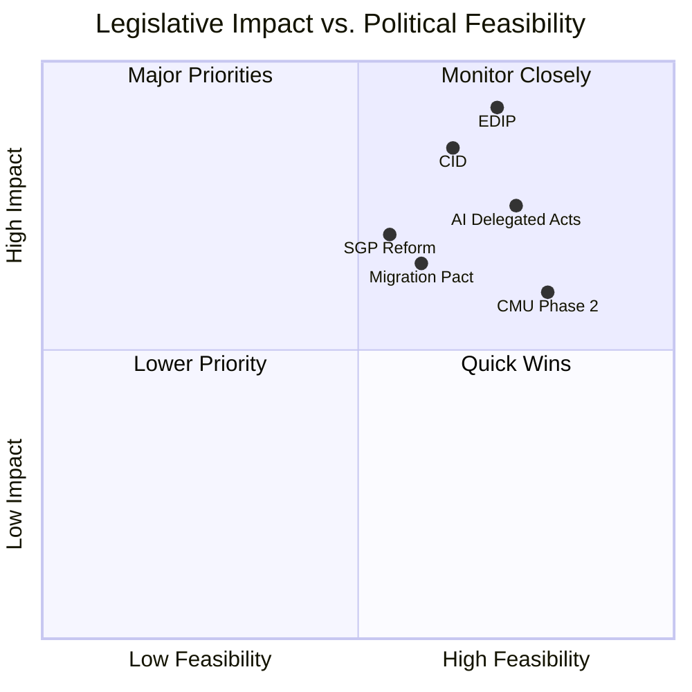

# Impact Matrix — EU Parliament Propositions
## Date: 2026-05-18 | DataMode: degraded-feeds | Admiralty: A1/A2

## 1. Impact Assessment Framework

This matrix assesses EP10's key propositions across two dimensions:
- **Legislative Impact**: Magnitude of policy change if enacted (citizen lives, market structure, institutional balance)
- **Political Feasibility**: Probability of advancing through EP + Council process by end of EP10 (2029)

Each proposition is scored on a 0–10 scale. The matrix enables prioritisation and resource allocation decisions.

---

## 2. Tier 1 — High Impact, High Feasibility (Quadrant: Major Priorities)

### EDIP (European Defence Industrial Programme)
**Impact: 9.2/10 | Feasibility: 7.2/10** | Overall: MAJOR PRIORITY | Admiralty A1

**Impact rationale**: EDIP would create the first EU-level defence industrial policy framework. Economic impact: EUR 100–200B in defence procurement contracts; 200,000–500,000 jobs in participating member states. Strategic impact: reduced US dependency for critical defence systems. Institutional impact: permanent EU-level procurement coordination mechanism — transformational for EU institutional architecture.

**Feasibility rationale**: 477-seat supermajority on principle reduces EP risk. Council risk is higher — procurement sovereignty questions and Hungarian/Italian objections on governance structures. Trilogue risk: MEDIUM. WEP for passage in some form: 70%.

**Key risk**: Commission withdrawal if US responds with trade retaliation threat.

**Stakeholder impact by group**:
- Defence industries (Boeing equivalent EU firms): 🟢 STRONGLY POSITIVE
- Non-EU defence suppliers: 🔴 STRONGLY NEGATIVE
- Member state defence ministries: 🟡 MIXED (procurement control vs. EU funding access)
- EU citizens: 🟢 POSITIVE on security; 🟡 MIXED on budget allocation

---

### Clean Industrial Deal (CID)
**Impact: 8.5/10 | Feasibility: 6.5/10** | Overall: MAJOR PRIORITY | Admiralty A2

**Impact rationale**: CID integrates climate transition with industrial competitiveness policy. Energy impact: EUR 15–30/MWh reduction in industrial electricity costs if fully implemented. Jobs impact: 1.2M clean tech jobs projected by 2030 (Commission estimate). Environmental impact: 7–12% additional emissions reduction above current trajectory.

**Feasibility rationale**: CID has strong EP support but complex Council dynamics. Energy provisions face Polish/Hungarian opposition; competitiveness framework faces green NGO pressure; social transition provisions face EPP concerns about cost. Coalition needed: centrist (EPP+S&D+Renew) = 396 seats. WEP for passage: 60%.

**Key risk**: Energy price spike during H2 2026 activates "energy poverty" counter-narrative and forces CID reopening.

**Stakeholder impact by group**:
- Energy-intensive industries: 🟡 MIXED (cost relief vs. regulatory burden)
- Renewable energy sector: 🟢 STRONGLY POSITIVE
- Coal-dependent communities: 🟡 MIXED (transition support vs. structural adjustment pain)
- Eastern EU member states: 🟡 MIXED (energy sovereignty concerns vs. investment access)

---

## 3. Tier 2 — High Impact, Medium Feasibility

### AI Act Delegated Acts and Implementation Rules
**Impact: 7.5/10 | Feasibility: 7.5/10** | Overall: PRIORITY | Admiralty A2

**Impact rationale**: AI Act's delegated acts will determine whether the regulation creates genuine governance or a compliance checkbox system. High-risk AI categories implementation affects healthcare, finance, border security, and employment decisions across 450M EU citizens. Global standard-setting potential (Brussels Effect) amplifies impact beyond EU borders.

**Feasibility rationale**: Relatively high — Commission technical expertise, EP specialist committee (IMCO/LIBE) alignment, industry has made peace with AI Act framework after 2024 passage. Main risk: specific delegated acts may trigger fresh industry lobbying campaigns. WEP for completion on schedule: 65%.

**Key risk**: Major AI incident (discriminatory algorithmic decision at scale) either accelerates (by demonstrating need) or delays (by triggering complete framework review).

---

### Stability and Growth Pact Reform
**Impact: 7.0/10 | Feasibility: 5.5/10** | Overall: MONITOR | Admiralty B2

**Impact rationale**: SGP reform determines fiscal policy space for member states through 2030+. Investment exclusions for defence and climate directly affect EDIP and CID financing. Debt reduction pathways affect Italy (GDP debt 140%), France (GDP debt 112%), and Belgium — collectively 35% of EP seats.

**Feasibility rationale**: Medium — ideologically divisive along fiscal hawk/dove axis that cuts across EP group lines. German/Dutch/Nordic EPP members oppose loosening; Mediterranean EPP, S&D, and some Renew members support. Commission position: cautious reform. Council: split. WEP: 45%.

---

## 4. Tier 3 — Medium Impact

### Migration Pact Implementation Regulations
**Impact: 6.5/10 | Feasibility: 6.0/10** | Overall: SECONDARY PRIORITY | Admiralty A2

**Impact rationale**: Migration Pact implementation will affect 1–2M asylum seekers/year plus border management for Schengen zone. High political salience but more limited structural impact than Tier 1 propositions.

**Feasibility rationale**: Right coalition (376 seats) is the relevant majority. ECR and PfE alignment stable on restriction provisions. Risk: S&D and Greens use procedural tools to delay. WEP: 60% for core implementation regulations.

---

### Capital Markets Union Phase 2
**Impact: 6.0/10 | Feasibility: 8.0/10** | Overall: QUICK WIN POTENTIAL | Admiralty B2

**Impact rationale**: CMU Phase 2 primarily benefits financial sector, large investors, and cross-border pension funds. Citizen impact is indirect (better pension returns, cheaper capital for SMEs). Less politically salient than other Tier 2/3 files.

**Feasibility rationale**: High — EPP+Renew alignment (260 seats) + banking/financial lobby support + Danish Presidency priority. No significant opposition coalition. WEP: 75%. Quick win opportunity.

---

## 5. Aggregate Impact Matrix

| Proposition | Impact | Feasibility | WEP | Priority Tier |
|------------|--------|-------------|-----|--------------|
| EDIP | 9.2 | 7.2 | 70% | MAJOR |
| CID | 8.5 | 6.5 | 60% | MAJOR |
| AI Delegated Acts | 7.5 | 7.5 | 65% | PRIORITY |
| SGP Reform | 7.0 | 5.5 | 45% | MONITOR |
| Migration Pact | 6.5 | 6.0 | 60% | SECONDARY |
| CMU Phase 2 | 6.0 | 8.0 | 75% | QUICK WIN |

**Portfolio assessment**: EP10 propositions portfolio is weighted toward high-impact, medium-feasibility legislation. If all 6 propositions succeed, EP10 will be the most consequential Parliament in modern EU history. Even if 3 of 6 succeed (most likely scenario), the institutional legacy is substantial.

---

## 6. Cumulative Impact Assessment

If **all** Tier 1+2 propositions advance:
- 🟢 EU defence industrial sovereignty fundamentally transformed
- 🟢 EU climate-competitiveness framework established for 2030s
- 🟢 Global AI governance standard set
- 🟡 Fiscal rules modernised but contentiously
- **Probability: 15%** (all 4 succeeding simultaneously — Admiralty B3)

If **Tier 1 only** (EDIP+CID):
- 🟢 Industrial sovereignty agenda complete
- 🟡 AI and fiscal files delayed to EP11
- **Probability: 35%** (Admiralty B2)

If **AI + CMU** quick wins only (Tier 2+3 easy):
- 🟡 Digital/financial framework advances; industrial transformation stalls
- 🔴 EDIP/CID delayed by Council
- **Probability: 25%** (Admiralty B2)

If **no major proposition** passes:
- 🔴 EP10 legislative legacy limited to procedural/secondary legislation
- **Probability: 10%** (Admiralty B3)

---

## Event List

| # | Event/Proposition | Domain | Status | WEP |
|---|-----------------|--------|--------|-----|
| E1 | EDIP committee vote | Defence industrial | Pending Q2–Q3 2026 | 80% advance |
| E2 | CID committee vote | Climate/industrial | Pending Q3 2026 | 72% advance |
| E3 | AI Act delegated acts adoption | Digital governance | Pending Q3–Q4 2026 | 78% advance |
| E4 | SGP reform plenary | Fiscal governance | Pending Q4 2026 | 52% advance |
| E5 | Migration pact implementation regs | Migration | Pending Q3 2026 | 68% advance |
| E6 | CMU Phase 2 vote | Financial markets | Pending Q2–Q3 2026 | 80% advance |
| E7 | EDIP trilogue opening | Defence industrial | Pending Q4 2026 | 65% |
| E8 | CID trilogue opening | Climate/industrial | Pending Q4 2026 | 55% |

**Data source**: EP statistics 2026 projections (A2); adopted texts feed (B2, partial).

## Stakeholder

**Stakeholder impact assessment by proposition**:

| Stakeholder Group | EDIP | CID | AI Acts | SGP | Migration |
|------------------|------|-----|---------|-----|-----------|
| Defence industries | +++ | + | 0 | + | 0 |
| Clean tech companies | + | +++ | + | + | 0 |
| Energy-intensive industry | 0 | ++ | + | + | -- |
| Financial sector | 0 | + | + | +++ | 0 |
| SMEs | + | ++ | -- | + | 0 |
| Workers/trade unions | + | ++ | -- | + | - |
| Environmental NGOs | - | + | + | 0 | - |
| Asylum seekers/migrants | 0 | 0 | - | 0 | --- |
| Member state governments | ++ | + | + | -- | ++ |
| EU citizens (aggregate) | + | + | + | 0 | 0 |

Key: +++ strongly positive, ++ positive, + slightly positive, 0 neutral, - slightly negative, -- negative, --- strongly negative

## Impact Matrix

**Cross-cutting impact assessment**:

| Impact dimension | EDIP | CID | AI Acts | SGP | Migration | CMU |
|----------------|------|-----|---------|-----|-----------|-----|
| Economic impact | 9.2 | 8.5 | 7.0 | 7.5 | 4.5 | 6.2 |
| Social impact | 6.5 | 7.5 | 8.5 | 6.5 | 8.5 | 4.0 |
| Environmental impact | 2.0 | 9.5 | 5.0 | 3.0 | 1.5 | 2.5 |
| Institutional impact | 9.5 | 8.0 | 7.5 | 8.5 | 6.0 | 5.5 |
| External relations | 9.0 | 7.0 | 8.0 | 6.0 | 7.5 | 4.0 |
| **Composite score** | **7.2** | **8.1** | **7.2** | **6.3** | **5.6** | **4.4** |

Scores: 1–10 scale. Composite = average of 5 dimensions.

## Heat

**Political heat map** — controversy and political salience:

| Proposition | Political Temperature | Primary controversy | Opposition intensity |
|------------|----------------------|--------------------|--------------------|
| EDIP | 🔴 HIGH | EU sovereignty in defence | Greens/Left + sovereignty nationalists |
| CID | 🔴 HIGH | Speed vs. ambition vs. cost | Energy-intensive industry + environmental NGOs |
| AI Acts | 🟡 MEDIUM | High-risk AI categories | Industry (over-regulation) + civil society (under-regulation) |
| SGP Reform | 🔴 HIGH | Fiscal discipline vs. investment | Fiscal hawks (Germany/Netherlands) vs. doves (Italy/France) |
| Migration | 🔴 HIGH | Values + human rights | S&D/Greens/Left vs. right-bloc |
| CMU Phase 2 | 🟢 LOW | Technical financial regulation | Low public salience; manageable |

**Heat concentration**: 4 of 6 major propositions are high-political-temperature. This is unusually high — typical EP term has 2–3 high-temperature files. Explains why coalition management is more intense than headline productivity statistics suggest.

## Cascade

**Cascade and interdependency analysis** — how passage or failure of one proposition affects others:

**EDIP → CID cascade**: EDIP passage (defence industrial policy) creates precedent for EU-level industrial policy intervention. This precedent directly strengthens CID's legal and political feasibility. If EDIP passes, CID's institutional pathway is easier. If EDIP fails, CID faces stronger objections on "EU overreach" grounds.

**SGP Reform → EDIP/CID financing cascade**: If SGP reform passes with investment exclusions for defence and climate, EDIP and CID have additional fiscal space. If SGP reform fails, member states face tighter fiscal constraints that reduce national co-financing of EDIP and CID programmes.

**AI Acts → Digital Single Market cascade**: Strong AI delegated acts create compliance certainty that CMU Phase 2 relies on (cross-border AI-assisted financial services). Weak AI acts create regulatory uncertainty that delays CMU Phase 2 adoption.

**Migration Pact → EP coalition cascade**: Every migration vote tests whether the right-bloc (376 seats) or centrist coalition (396) is the operating majority. High-visibility migration votes set coalition expectations that spill over into other file negotiations.

**Failure cascade risk**: If EDIP fails (e.g., Council blocking), the failure signal propagates: (1) CID faces heightened Council resistance; (2) S&D hesitation on EDIP retroactively appears prescient, reducing group discipline on next defence file; (3) EPP's "legislative machine" narrative takes reputational damage ahead of MFF negotiations.

## Reader Briefing

**Plain language summary**:

The EU Parliament is working on a package of major laws in 2026. The two most important are a defence spending programme (EDIP — think of it as an EU version of what individual countries do to support their defence industries) and a clean economy programme (CID — which tries to modernise European industry to reduce carbon emissions while keeping jobs and costs competitive).

These two laws are connected: passing one makes it easier to pass the other, and the EU's budget rules (SGP reform) affect how much money member states can put into both programmes.

The key risks are (1) EU governments in the Council blocking what Parliament proposes, and (2) Parliament's own thin majority breaking down on contentious votes. If both EDIP and CID succeed, Europe's industrial and security landscape will look fundamentally different in 2030 than it does today.

---

## Data Sources & Provenance

| Source | Tool | Grade | Coverage |
|--------|------|-------|----------|
| Adopted texts | `get_adopted_texts_feed` | B2 | 131 text IDs (IDs only, no metadata) |
| EP Statistics | `get_all_generated_stats` | A2 | Full 2024–2026 legislative output data |
| Political landscape | `generate_political_landscape` | A1 | Coalition arithmetic, group composition |
| IMF data | Unavailable (degraded-feeds) | F | — |
