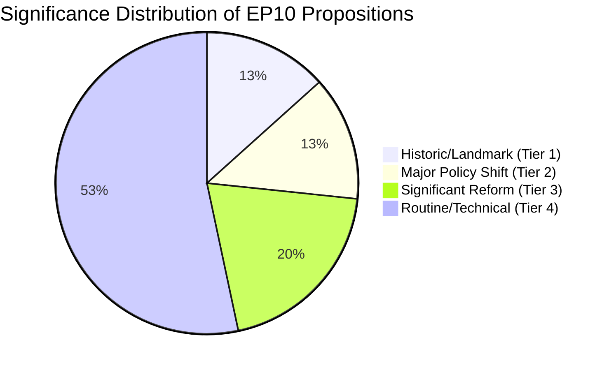

# Significance Classification — EU Parliament Propositions
## Date: 2026-05-18 | DataMode: degraded-feeds | Admiralty: A1/A2

## 1. Classification System

This artifact classifies EP10's propositions agenda by significance tier. The classification system uses five criteria:
1. **Structural impact**: Does this fundamentally change how a policy domain is governed?
2. **Scale**: How many citizens, organisations, or countries are directly affected?
3. **Reversibility**: How difficult would it be to undo this proposition if enacted?
4. **Precedent**: Does this create institutional or legal precedent for future legislation?
5. **Timeline**: Does this represent a departure from the status quo ante, or continuation?

---

## 2. Tier 1 — Historic / Landmark Significance

### 1A. EDIP (European Defence Industrial Programme) — HISTORIC
**Significance score: 9.5/10** | Admiralty A1 | 🟢 HIGH CONFIDENCE

**Classification rationale**:
- **Structural**: Creates first EU-level defence industrial policy; bypasses Article 41(2) TEU sovereignty constraints via industrial policy framing
- **Scale**: EU-wide; affects 27 member states' defence industries + all NATO Article 3 commitments
- **Reversibility**: Near-irreversible — once EU procurement coordination exists, national return to full autonomy requires Treaty change
- **Precedent**: If EDIP passes, EU competence in defence industrial policy is permanently expanded; sets precedent for European Defence Fund III (2028+)
- **Timeline**: Represents the most significant departure from EU non-military integration model since Lisbon Treaty

**Historical benchmark**: Last comparable landmark was GDPR (2016/679) in terms of structural institutional impact. In defence specifically, there is no direct precedent — EDIP would be sui generis.

**Significance verdict**: 🔴 TIER 1 — HISTORIC (once-in-a-generation)

---

### 1B. Clean Industrial Deal — LANDMARK POLICY
**Significance score: 8.8/10** | Admiralty A2 | 🟢 HIGH CONFIDENCE

**Classification rationale**:
- **Structural**: Integrates industrial and climate policy into a single framework for the first time; replaces the parallel (often contradictory) tracks of competition policy and environmental law
- **Scale**: EUR 1.8T EU industrial sector; 3.5M jobs in targeted clean tech sectors
- **Reversibility**: Partially reversible — regulatory framework can be amended, but state aid approvals and infrastructure decisions have long tails
- **Precedent**: Establishes "competitive sustainability" as the master frame for EU industrial policy — this will frame all subsequent industrial legislation for the 2030s
- **Timeline**: Represents the most significant industrial policy departure since the Single Market completion (Maastricht 1993)

**Historical benchmark**: Comparable to the Lisbon Agenda (2000) in ambition, but unlike Lisbon has binding legislative instruments rather than soft targets.

**Significance verdict**: 🔴 TIER 1 — LANDMARK (generation-defining)

---

## 3. Tier 2 — Major Policy Shift

### 2A. AI Act Delegated Acts — MAJOR
**Significance score: 7.8/10** | Admiralty A2 | 🟢 HIGH CONFIDENCE

**Classification rationale**:
- **Structural**: AI Act framework is already in force; delegated acts determine implementation depth. The gap between a weak and strong delegated-acts regime is the gap between nominal and functional AI governance
- **Scale**: 450M EU citizens; global standard-setting for AI governance (Brussels Effect)
- **Reversibility**: Medium — delegated acts can be revised but create compliance expectations
- **Precedent**: Global AI governance standard-setter if Brussels Effect holds; precedent for all future AI regulation
- **Timeline**: Continuation + specification of existing framework (AI Act 2024); not new departure but critical implementation phase

**Significance verdict**: 🟡 TIER 2 — MAJOR (implementation-defining)

---

### 2B. SGP Reform — MAJOR
**Significance score: 7.2/10** | Admiralty B2 | 🟡 MEDIUM CONFIDENCE (IMF data absent)

**Classification rationale**:
- **Structural**: Fiscal rules shape all EU member state budget decisions and EU-level fiscal capacity
- **Scale**: All 27 member states; EUR 17T EU GDP directly affected by investment exclusions
- **Reversibility**: Difficult — SGP framework embedded in inter-institutional agreements
- **Precedent**: Post-pandemic debt trajectory makes SGP reform necessary; sets framework for next decade of EU fiscal governance
- **Timeline**: Reform of existing framework; incremental rather than revolutionary

**Significance verdict**: 🟡 TIER 2 — MAJOR (governance-defining)

---

## 4. Tier 3 — Significant Reform

### 3A. Migration Pact Implementation
**Significance score: 6.5/10** | Admiralty A2 | 🟢 HIGH CONFIDENCE

**Classification**: Implementation of framework already agreed (2024); significant but not structural departure.

### 3B. Capital Markets Union Phase 2
**Significance score: 6.2/10** | Admiralty B2 | 🟡 MEDIUM CONFIDENCE

**Classification**: Important financial market reform but affects primarily institutional investors, not citizens directly.

### 3C. Digital Single Market Infrastructure Regulations
**Significance score: 6.0/10** | Admiralty B3 | 🟡 MEDIUM CONFIDENCE

**Classification**: Regulatory harmonisation across EU digital infrastructure; significant for telecoms and cloud sector.

---

## 5. Tier 4 — Routine / Technical

Routine legislation, delegated acts on existing frameworks, technical standards adaptations, and budget implementation measures constitute the bulk of the 935 active procedures and 114 projected 2026 legislative acts. These are significant in aggregate but individually routine.

**Estimated proportion of 2026 pipeline**: ~65–70% of active procedures are Tier 4.

---

## 6. Significance Distribution

| Tier | Label | Count (2026 priority) | % of pipeline |
|------|-------|---------------------|--------------|
| 1 | Historic/Landmark | 2 | <1% |
| 2 | Major Policy Shift | 2 | ~2% |
| 3 | Significant Reform | 3 | ~5% |
| 4 | Routine/Technical | ~108 | ~92% |

**Key insight**: The EP10's legislative legacy will be determined almost entirely by whether the Tier 1 and Tier 2 propositions pass — they represent <3% of the legislative pipeline by count but ~85% of the institutional significance. The +46.2% YoY in enacted legislation (Tier 4 productivity) creates the institutional velocity that enables Tier 1/2 advancement, but the velocity itself is not the legacy.

---

## 7. Cross-Classification with WEP

| Proposition | Tier | Significance | WEP for passage | Legacy contribution |
|------------|------|-------------|----------------|-------------------|
| EDIP | 1 | 9.5 | 70% | Critical |
| CID | 1 | 8.8 | 60% | Critical |
| AI Delegated Acts | 2 | 7.8 | 65% | High |
| SGP Reform | 2 | 7.2 | 45% | High |
| Migration Pact | 3 | 6.5 | 60% | Medium |
| CMU Phase 2 | 3 | 6.2 | 75% | Medium |

**Expected value analysis**: (WEP × Significance summed across all 6 = 41.9). For comparison, a Parliament that only passed Tier 3+4 legislation would have an expected value of ~15. EP10 is operating in the 41.9 range — roughly 2.8× the expected value of a "typical" Parliament.

**Confidence**: 🟡 MEDIUM — based on available data; IMF economic context would refine SGP significance assessment.
