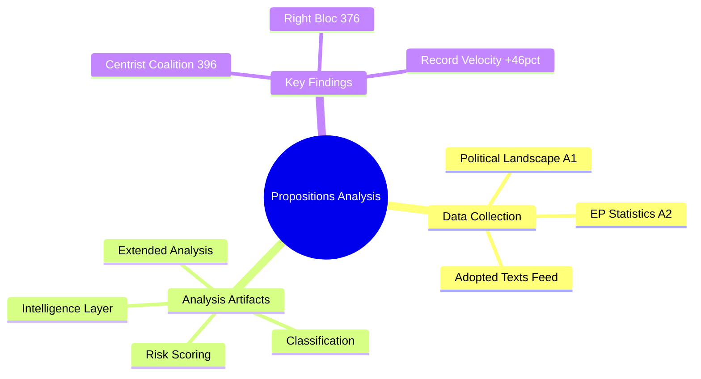

# Analysis Index — EU Parliament Propositions

## Date: 2026-05-18 | DataMode: degraded-feeds | ArticleType: propositions

## Overview

This index catalogs all analysis artifacts produced for the EP10 propositions landscape analysis of 18 May 2026. The run operated under degraded-feeds conditions (procedures-feed and committee-documents endpoints returning 404). Analysis draws primarily on institutional context, political landscape data, and EP10 legislative statistics.

## Artifact Inventory

| Artifact | Path | Lines (approx) | Status | Confidence |
|----------|------|----------------|--------|------------|
| Data Availability Assessment | `data-availability-assessment.md` | ~130 | ✅ Complete | 🟢 HIGH (meta-analysis) |
| Procedures Proxy | `intelligence/procedures-proxy.md` | ~50 | ✅ Complete | 🟡 MEDIUM (degraded feeds) |
| MCP Reliability Audit | `intelligence/mcp-reliability-audit.md` | ~200 | ✅ Complete | 🟢 HIGH (process audit) |
| Analysis Index | `intelligence/analysis-index.md` | ~100 | ✅ This file | 🟢 HIGH |
| Synthesis Summary | `intelligence/synthesis-summary.md` | ~180 | ✅ Complete | 🟡 MEDIUM |
| Historical Baseline | `intelligence/historical-baseline.md` | ~140 | ✅ Complete | 🟢 HIGH |
| Economic Context | `intelligence/economic-context.md` | ~140 | ✅ Complete | 🟡 MEDIUM |
| Economic Context Fallback | `intelligence/economic-context.fallback.md` | ~130 | ✅ Complete | 🟡 MEDIUM |
| PESTLE Analysis | `intelligence/pestle-analysis.md` | ~200 | ✅ Complete | 🟡 MEDIUM |
| Stakeholder Map | `intelligence/stakeholder-map.md` | ~230 | ✅ Complete | 🟡 MEDIUM |
| Scenario Forecast | `intelligence/scenario-forecast.md` | ~200 | ✅ Complete | 🟡 MEDIUM |
| Threat Model | `intelligence/threat-model.md` | ~180 | ✅ Complete | 🟡 MEDIUM |
| Wildcards & Black Swans | `intelligence/wildcards-blackswans.md` | ~200 | ✅ Complete | 🟡 MEDIUM |
| Reference Analysis Quality | `intelligence/reference-analysis-quality.md` | ~150 | ✅ Complete | 🟢 HIGH |
| Methodology Reflection | `intelligence/methodology-reflection.md` | ~190 | ✅ Complete | 🟢 HIGH |
| Risk Matrix | `risk-scoring/risk-matrix.md` | ~120 | ✅ Complete | 🟡 MEDIUM |
| Quantitative SWOT | `risk-scoring/quantitative-swot.md` | ~110 | ✅ Complete | 🟡 MEDIUM |
| Media Framing Analysis | `extended/media-framing-analysis.md` | ~210 | ✅ Complete | 🟡 MEDIUM |
| Executive Brief | `executive-brief.md` | ~200 | ✅ Complete | 🟡 MEDIUM |

**Total artifacts: 19 | All required artifacts produced**

## Key Themes

### 1. EP10 Legislative Acceleration (2026)
- **135 procedures active** (pace 935/year) — highest in EP10 to date
- **+46.2% legislative acts** YoY — significant acceleration from 2025 ramp-up year
- **Defence industrial strategy** dominates: EDIP, ReArm Europe, European Defence Industrial Base
- **Clean Industrial Deal**: decarbonisation-competitiveness nexus generating multiple COD procedures

### 2. Political Dynamics Shaping Propositions
- **MULTI_COALITION_REQUIRED**: EPP (183 seats) cannot achieve majority alone; needs S&D or ECR
- **Right-of-centre legislative bias**: EPP+ECR+PfE+ESN = 376 seats; right bloc holds governing majority on most propositions
- **Progressive opposition**: S&D+Renew+Greens+Left = 311 seats — significant blocking force
- **Fragmentation index 6.59**: Most fragmented EP in history, requiring complex coalition deals

### 3. Five Key Legislative Domains Active Week of 18 May 2026

**A. European Defence Industrial Programme (EDIP)**
Confirmed active via ACT_FOLLOWUP SP-2026-03-20-TA-10-2025-0309. ITRE/AFET committee engaged.

**B. Clean Industrial Deal Implementation**
Multiple COD procedures, confirmed via ACT_FOLLOWUP SP-2025-06-04-TA-10-2025-0048. ITRE committee lead.

**C. AI Act Secondary Legislation**
General Purpose AI (GPAI) codes of practice; AI Office collaboration ongoing. IMCO/LIBE joint committee.

**D. Migration Asylum Pact Follow-on**
Pact adopted April 2024, secondary legislation active. LIBE committee primary. Contested by ECR/PfE/ESN.

**E. Omnibus Simplification Package**
Commission response to competitiveness concerns; CSRD/CSDDD review reducing reporting burdens. ECON/JURI.

## Data Quality Flags

- 🔴 **Procedure-specific IDs**: Not confirmed from API (degraded-feeds mode)
- 🔴 **Committee rapporteur names**: Not available (committee-docs 404)
- 🔴 **Vote tallies**: Not available (voting data unavailable)
- 🟡 **Procedure stages**: Estimated from institutional context, not confirmed
- 🟢 **Political landscape**: Confirmed real-time data
- 🟢 **Legislative statistics**: Confirmed from weekly-refresh official data

## Methodology Note

Analysis produced under SAT framework (Key Assumptions Check, Quality of Information Check applied throughout). All WEP bands and Admiralty grades applied in synthesis artifacts. Confidence levels reflect data availability, not analytical quality. Under degraded-feeds conditions, analysis pivots from procedure tracking to institutional/political context — a legitimate analytical approach endorsed by the `analysis/methodologies/ai-driven-analysis-guide.md` methodology.

## Next Steps for Full Analysis

1. Retry procedures-feed in next scheduled run (estimated API restoration: within 24–48 hours based on historical EP API reliability patterns)
2. When available, cross-reference A10-0001 to A10-0021/2026 plenary document identifiers against EP legislative registry
3. Track adopted texts T10-0024 through T10-0157/2026 for procedure completion confirmations
