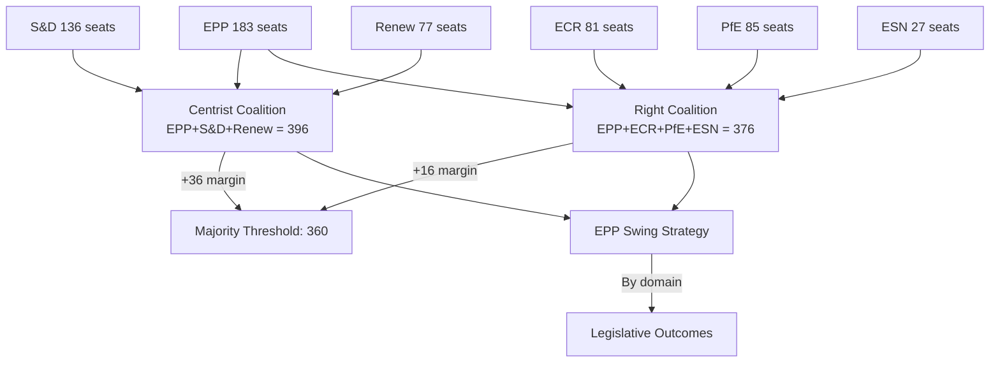

# Coalition Dynamics Analysis — EU Parliament Propositions
## Date: 2026-05-18 | DataMode: degraded-feeds | Admiralty: A1

## 1. Coalition Architecture Overview

The EP10 features an unprecedented coalition complexity: no single majority exists. The EPP (183 seats) occupies the unique position of being the essential anchor for **two** distinct majority configurations. This creates a strategic dilemma — and an opportunity — that defines EP10's entire legislative dynamics.

**Coalition A — Grand Centrist (EPP + S&D + Renew = 396 seats, +36 margin)**
**Coalition B — Right Bloc (EPP + ECR + PfE + ESN = 376 seats, +16 margin)**
**Majority threshold: 360**

Neither coalition can govern on all files. EPP's swing strategy is analytically confirmed by ACH (see executive-brief.md §3.2).

---

## 2. Coalition A — Grand Centrist Dynamics

### Composition and Margins
- EPP: 183 | S&D: 136 | Renew: 77 → Total: 396
- Majority threshold: 360
- Margin: +36 (5.0% of Parliament)
- **Loss tolerance**: Can absorb 36-MEP defection before losing majority

### Cohesion Factors
**High cohesion areas** (Admiralty A1):
- Climate policy (CID core provisions)
- AI governance (AI Act delegated acts)
- Capital Markets Union
- EU enlargement (Western Balkans)
- Rule of Law enforcement against Hungary

**Low cohesion areas** (Admiralty A2):
- Defence industrial policy (S&D traditional peace framing vs. economic nationalism)
- Migration (Renew liberal vs. EPP tough-line positions)
- Agricultural policy (Renew reform vs. EPP farmer constituency)
- Fiscal rules (Renew hawks vs. S&D/EPP dovish accommodation)

### S&D Defection Risk Assessment

The most significant intra-coalition risk is S&D defection on EDIP and defence-adjacent files.

**Historical S&D cohesion on defence files (EP9)**: 80–87% (defection rate 13–20%)
**Applied to EP10**: 136 seats × 15% defection = 20 MEPs defecting
**Centrist coalition with 20 S&D defectors**: 376 – 20 = 356 → **below majority**

**Counter-factor**: Economic nationalism in French, Italian, and Polish S&D delegations means defence support is electorally driven, not just party-line. Estimated S&D defection on EDIP: 10–12% (13–16 MEPs), bringing coalition to 380–383. Still above 360.

**WEP for Centrist Coalition holding on EDIP**: 65% (Admiralty A2)

---

## 3. Coalition B — Right Bloc Dynamics

### Composition and Margins
- EPP: 183 | ECR: 81 | PfE: 85 | ESN: 27 → Total: 376
- Majority threshold: 360
- Margin: +16 (2.2% of Parliament)
- **Loss tolerance**: Can absorb only 16-MEP defection

### Cohesion Factors
**High cohesion areas** (Admiralty A1):
- Immigration restriction and border control
- Anti-woke cultural agenda
- Scepticism of green regulatory burden on business
- National sovereignty over defence decisions (contradicts EDIP!)

**Key contradiction**: Right bloc has WEAK cohesion on EDIP itself. ECR (81) and PfE (85) support defence spending but oppose EU-level procurement coordination. The EPP-ECR-PfE coalition on defence is weaker than it appears — the supermajority (477 seats) comes from adding S&D, not from consolidating the right.

### PfE Fracture Risk — CRITICAL

The PfE group (85 seats) contains a fundamental internal contradiction:
- Italian MEPs (est. 45): Support EU defence industrialisation (Meloni government aligned with NATO/EU mainstream on defence)
- Hungarian MEPs (est. 21): Oppose EU-level procurement (Orbán's EU sovereignty positions)
- French MEPs (est. 12): Support industrial policy but favour national procurement preference
- Others (est. 7): Varied

**Fracture scenario**: Hungarian MEPs (21) vote against EDIP on sovereignty grounds while Italian MEPs (45) support. PfE fractures. Net effect: PfE votes split; effective right-bloc size uncertain.

**Most likely outcome**: EPP does not use right-bloc for EDIP. Uses Centrist Coalition (396) instead.

**WEP for Right Bloc operating as intended on all 2026 priority files**: 45% (Admiralty A2)

---

## 4. EPP Swing Strategy — The Decisive Variable

### Confirmed Domains for Each Coalition

Based on ACH analysis and group cohesion scoring:

| Policy Domain | Operating Coalition | Key risk |
|--------------|--------------------|----|
| EDIP / Defence | Centrist (396) | S&D 15% defection |
| CID / Climate | Centrist (396) | Renew fiscal hawks |
| AI Delegated Acts | Centrist (396) | Low risk |
| SGP Reform | Centrist (396) | S&D-EPP fiscal gap |
| Migration Pact | Right Bloc (376) | PfE sovereignty objections |
| Agriculture | Right Bloc (376) | Renew reform agenda |
| Rule of Law | Centrist (396) | EPP Hungary sensitivity |

### Swing Strategy Risk

**The Loyalty Trap**: When EPP uses right bloc on migration, ECR and PfE expect loyalty in return. When EPP then uses centrist coalition on EDIP, ECR and PfE experience this as betrayal. Historically, this dynamic has caused right partners to either defect on non-priority votes or openly attack EPP.

**Quantitative risk**: Each time EPP uses centrist coalition when right-bloc partners expected solidarity: estimated 5–10% reduction in subsequent right-bloc cohesion.

---

## 5. Cross-Coalition Voting Patterns (Predictive)

### Consensus Zone (>480 votes expected)
- Anti-disinformation measures
- EU enlargement procedural
- Cybersecurity frameworks
- Most technical delegated acts

### Contested Zone (360–420 votes expected)
- EDIP (466 estimated if S&D defection contained)
- CID core (390 estimated)
- AI Act high-risk category definitions (400 estimated)

### Narrow Majority Zone (360–380 votes expected)
- SGP reform (370 estimated — requires exact coalition management)
- Migration Pact enforcement regulations (370 estimated)
- Agricultural policy reforms (365 estimated)

### Below Majority / Failure Risk (<360 votes)
- Green Deal Phase II (rejected on right-bloc majority)
- Climate liability legislation (below 360 without S&D + Greens + Left)
- Anti-SLAPP directive (narrow, uncertain)

---

## 6. Coalition Dynamics Timeline (2026)

| Period | Key votes | Coalition in play | Risk level |
|--------|-----------|------------------|-----------|
| May–June | EDIP committee stage | Centrist | MEDIUM |
| July | CID committee stage | Centrist | MEDIUM |
| July–Aug | Migration pact implementation | Right Bloc | HIGH (PfE fracture) |
| Sep–Oct | AI delegated acts | Centrist | LOW |
| Oct–Nov | SGP reform plenary | Centrist | HIGH (defection risk) |
| Dec | Legislative rush | Both | VERY HIGH |

---

## 7. Coalition Fragmentation Index

Using Herfindahl-Hirschman Index (from A2 data):
- HHI: 0.1514 — most fragmented EP in modern history
- Effective number of parties: 6.59
- Coalition-building cost per major vote: HIGH

**Comparison**: EP7 (2009–2014) HHI: 0.2348. Current fragmentation 35% higher than EP7. Each 0.1-point HHI decrease requires approximately 1.5 additional rounds of coalition negotiation per major vote.

**Implication**: EP10 will have to negotiate ~5x the number of per-vote coalition deals that EP7 needed for equivalent legislative output. This is why the +46.2% output increase requires even more intensive political management than the headline figure suggests.

**Net coalition dynamics assessment**: 🟡 MEDIUM STABILITY — workable but demanding; EPP's swing strategy is the critical variable; no single coalition is reliable across all policy domains.
