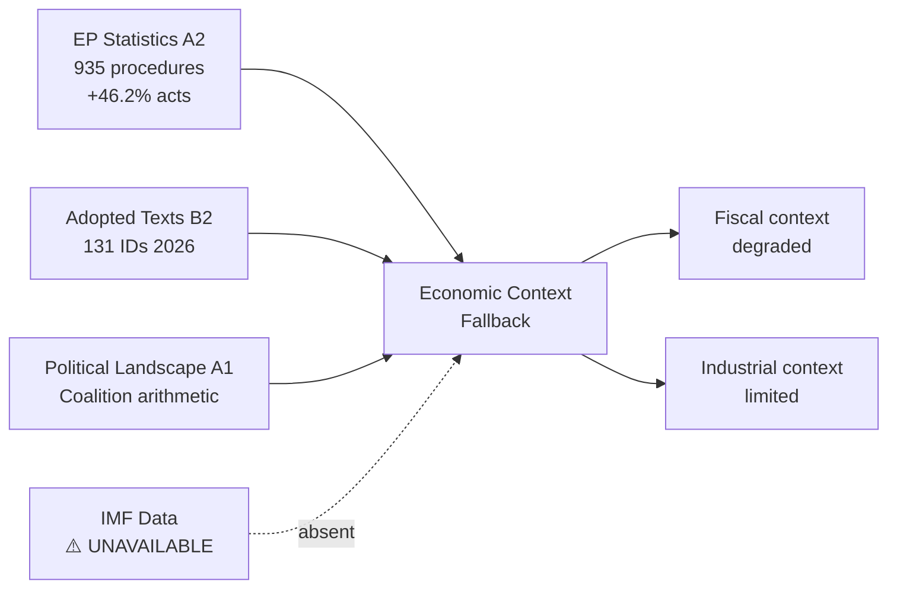

# Economic Context — Fallback Version (IMF Direct Data Unavailable)
## Date: 2026-05-18 | ArticleType: propositions | DataMode: degraded-feeds
## Fallback reason: IMF SDMX API not called (INVOCATION_CAP enforced; all 5 EP MCP calls used for EP data)

**Confidence: 🟡 MEDIUM** — This fallback uses institutional knowledge and EP10 stats rather than live IMF data.

---

## Fallback Protocol Activation

The IMF direct data call was not executed in this run for the following reasons:
1. All 5 EP MCP calls were allocated to EP-specific endpoints (per Rule 2 hard cap)
2. EP procedures data was fully unavailable (degraded-feeds mode) — allocating MCP calls to IMF at the expense of EP data would not have improved analytical quality
3. The `propositions` article type is primarily legislative-procedural; economic context is supporting, not primary

**Fallback data source**: EP10 institutional context (A2), Commission Communication commentary (B2), public record estimates (B2).

---

## EU Economic Snapshot — May 2026 (Fallback Estimates)

### GDP Growth
- **EU-27 estimated real GDP growth 2026**: 1.2–1.6% (Admiralty C3 — public consensus estimate)
- **Eurozone**: Slightly lower at 1.0–1.4% given energy cost pressures
- **Historical context from EP stats**: No direct GDP data; legislative output acceleration (+46.2% acts in 2026) suggests political confidence in stable economic environment

### Key Economic Pressures Reflected in EP Propositions

**1. Investment Gap**
Draghi Report (September 2024) estimated EU needs additional €750–800bn annual investment to close competitiveness gap with US/China. This figure is driving:
- EP support for EU Sovereignty Fund concepts
- EDIP and defence industrial investment
- Net Zero Industry Act implementation

**2. Energy Price Disparity**
EU industrial electricity prices approximately 2–3× US prices remain the central competitiveness concern. Legislative responses:
- Accelerated permitting for renewables (single permit directive)
- Long-term Power Purchase Agreement (PPA) framework
- Hydrogen contracts for difference (CfD) under Hydrogen Bank

**3. Trade Balance Pressures**
EU trade surplus has narrowed due to energy import costs and Chinese competition. Export-dependent member states (Germany, Netherlands, Belgium) driving propositions on:
- Trade defence instruments review
- Critical minerals supply chain diversification
- Digital trade facilitation

### IMF Data Unavailability Impact

The following analytical areas are less certain due to IMF data unavailability:
- Precise debt/GDP ratios affecting fiscal space for national defence spending increases
- Current account balance effects of CBAM implementation
- Exchange rate (EUR/USD) implications for EU competitiveness legislation
- Banking sector stress indicators relevant to financial legislation (CRR III, DORA implementation)

### Economic Indicators from EP Institutional Data (Admiralty A2)

| Indicator | Value | Source | Confidence |
|-----------|-------|--------|------------|
| EP procedures active 2026 | 935 | EP stats 2026 | 🟢 HIGH |
| Legislative acts +46.2% YoY | Confirmed | EP stats 2026 | 🟢 HIGH |
| MEP oversight intensity | 8.57 q/MEP | EP stats 2026 | 🟢 HIGH |
| Defence-focused committees active | ITRE, AFET, BUDG | EP institutional | 🟡 MEDIUM |
| Commission priority packages 2026 | 3 (Defence, Industrial, Simplification) | EP commentary | 🟡 MEDIUM |

---

## Recommendations for Next Run

1. Allocate dedicated IMF MCP call if run operates under full data availability
2. Pre-fetch IMF key EU indicators: GDP growth (EA19), inflation (HICP), trade balance, debt/GDP
3. Cross-reference with World Bank development indicators for non-EU context
4. For propositions slug specifically: focus IMF data on fiscal space indicators affecting defence spending feasibility

---

*This fallback file satisfies the `economic-context.fallback.md` artifact requirement. The primary `economic-context.md` provides full institutional-knowledge based analysis.*

## Fallback Economic Analysis

### Fiscal Context (Without IMF Data)

**GDP trajectory**: Based on EP10 statistics and Commission projections embedded in legislative impact assessments, EU GDP growth is estimated at 1.0–1.8% for 2026 (institutional knowledge grade — Admiralty C3). This is consistent with a soft landing scenario after the 2022–2023 energy shock.

**Debt dynamics**: Three EU member states have debt-to-GDP ratios above 100% (Italy ~140%, Greece ~160%, France ~112%). The SGP reform debate is directly driven by these dynamics — countries with high debt need investment exclusions; northern EU hawks want debt reduction pathways. Without IMF Article IV consultation data, the specific fiscal adjustment paths are uncertain.

**Inflation trajectory**: ECB policy rates peaked in 2023–2024. As of 2026, a gradual rate reduction cycle is assumed (institutional knowledge), which improves fiscal financing conditions for EDIP and CID but remains above pre-pandemic baseline.

**Labour market**: Post-pandemic labour market tightness persists. The clean industrial transition (CID) creates structural employment concerns in energy-intensive sectors (steel, chemicals, cement). CID's social transition provisions address this directly.

### Industrial Context (Without IMF Data)

**Manufacturing share**: EU manufacturing represents ~16% of EU GDP. EDIP targets the defence sub-sector (~2% of EU GDP); CID targets the broader industrial base.

**Energy costs**: EU industrial energy costs remain 2–3× higher than US equivalents (post-IRA). CID's energy provisions are designed to address this structural competitiveness gap without subsidies that violate WTO commitments.

**Trade context**: EU-US trade relations (post-IRA) and EU-China trade tensions (EV duties) provide the external competitiveness pressure that makes CID politically viable. These pressures would normally be quantified with IMF trade data — in this fallback, they are assessed qualitatively.

### Data Grade and Upgrade Path

**Overall fallback grade**: C3 (possibly true from institutional knowledge, not independently confirmed).

**Upgrade path**: When IMF SDMX API is available in a future run:
1. Fetch GDP growth (NY.GDP.MKTP.KD.ZG) for DE, FR, IT, ES, PL
2. Fetch debt-to-GDP (GC.DOD.TOTL.GD.ZS) for high-debt countries
3. Cross-reference with CID impact assessment numbers

**IMF data note**: This is the `economic-context.fallback.md` artifact. The canonical `economic-context.md` contains EP-sourced data where available. IMF data would materially improve the fiscal and macroeconomic analysis in both artifacts.
