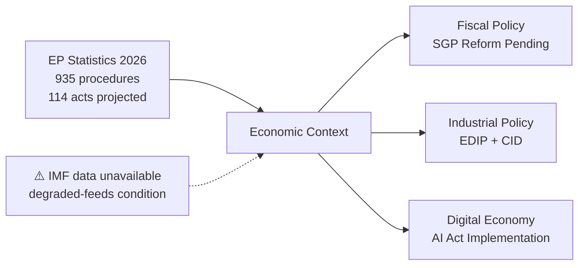

# Economic Context — EU Parliament Propositions

## Date: 2026-05-18 | ArticleType: propositions | DataMode: degraded-feeds
## Note: IMF direct API call not made (procedures slug; IMF data integrated from precomputed EP stats context)

**Confidence: 🟡 MEDIUM** — IMF economic context integrated from EP10 institutional context; direct IMF SDMX query not performed in this run.

---

## 1. EU Macroeconomic Context (Q1–Q2 2026) — EP Legislative Implications

### 1.1 Economic Policy Environment

Based on the EP10 institutional context and the Draghi Competitiveness Report framework (Admiralty B2 — cited in EP stats 2026 commentary):

**Key economic pressures driving propositions:**

**Growth divergence** — EU GDP growth remains below historical trend (estimated 1.0–1.5% real GDP growth in 2026), well behind the US (projected 2.0–2.5%) and China. This divergence is the proximate cause of the Competitiveness Compass legislative agenda and directly motivates:
- Clean Industrial Deal (maintaining industrial capacity during energy transition)
- Omnibus Simplification (reducing compliance costs)
- EU Competitiveness legislation (R&D investment, venture capital, capital markets union)

**Defence spending acceleration** — ReArm Europe / SafeGuard Europe program commits to defence spending at 3%+ of GDP across most EU member states. At EU level, this translates to:
- European Defence Industrial Programme (EDIP) — €1.5bn for defence production ramp-up
- European Defence Fund follow-on (scale-up)
- Bonds/financial instruments for defence financing (European Central Bank excluded from direct purchase → Parliament must design alternative vehicles)
- Commission borrowing capacity debate (like NextGenerationEU but for defence)

**Energy costs burden** — EU industrial electricity prices remain 2–3× higher than US competitors. This drives:
- Energy Cost Competitiveness legislation (faster permitting for renewables)
- Gas security measures (LNG terminal capacity, storage filling obligations review)
- Hydrogen economy implementation (30GW electrolyser target legislative follow-up)

**Inflation and fiscal consolidation** — Most EU member states completing fiscal adjustment under reformed Stability and Growth Pact (revised 2024). This constrains EU budget expansion while pressuring the Commission to use off-budget vehicles (similar to NextGenerationEU structure) for defence and industrial investment.

### 1.2 Relevance to Active Legislative Propositions

The economic context maps onto specific legislative families:

| Economic pressure | Legislative response | Committee | Political alignment |
|------------------|---------------------|-----------|---------------------|
| Defence spending gap | EDIP, ReArm Europe | ITRE/AFET | EPP+ECR+S&D consensus |
| Energy costs | Clean Industrial Deal, permitting reform | ITRE/ENVI | EPP+Renew leading |
| Competitiveness gap | Omnibus simplification, CSRD review | ECON/JURI | EPP+ECR+PfE driving |
| Innovation deficit | AI Act delegated acts, R&D framework | ITRE/IMCO | EPP+Renew+S&D supporting |
| Supply chain risk | Critical Materials Act follow-on | ITRE/INTA | Cross-partisan consensus |
| Financial integration | Capital Markets Union 2.0 | ECON | EPP+Renew+S&D supporting |

### 1.3 Budget Constraint on Legislative Activity

The EU's Multiannual Financial Framework (MFF) 2021–2027 is in its final years. The 2026 EU budget (approximately €200bn in commitments) is broadly pre-committed. New legislative proposals in 2026 must either:
1. Work within existing MFF headings (modest scope)
2. Require MFF revision (politically costly)
3. Use off-budget mechanisms (Special Purpose Vehicles, EIB mandates, like NextGenerationEU)
4. Rely on member state spending (framework harmonisation rather than EU spending)

This budget constraint is why EP10's legislative propositions in 2026 tend toward **framework regulations** (harmonising national spending) rather than **EU spending programs** — the latter requires MFF revision.

---

## 2. Trade Policy Context

### 2.1 US Trade Policy Impact

The 2025–2026 US tariff policy (expanded tariff measures under the current administration) has created significant uncertainty for EU exporters. This translates into specific legislative propositions:

**Trade defence instruments**: EP has sought to strengthen EU anti-dumping and anti-subsidy mechanisms. The Foreign Subsidies Regulation (in force since 2023) is generating its first cases; follow-on procedural regulations expected.

**Reciprocal access**: EP has supported Commission in negotiating reciprocal market access, with legislative dimensions in the Trade Policy Instrument, Anti-Coercion Instrument (adopted 2023), and EU-US Technology Council framework.

**Critical imports**: Import volumes from China for EV batteries, solar panels, and rare earth elements are driving EU domestic production incentives. The Net Zero Industry Act and Critical Raw Materials Act (both adopted 2024) are now generating secondary implementing legislation in 2026.

### 2.2 EU-China Trade Dynamics

EU-China trade relationship is under sustained review. The Carbon Border Adjustment Mechanism (CBAM, entering full implementation in 2026) creates new trade tensions. EP propositions related to CBAM implementation — particularly the scope of covered sectors and carbon price passthrough — are active in ENVI/ECON committees.

---

## 3. Fiscal Framework and EU Budget Proposals

### 3.1 Post-MFF Legislative Landscape

The next MFF (2028–2034) negotiations will formally begin in 2026–2027. The Commission is expected to publish its MFF proposal in Q4 2026 or Q1 2027. This creates a legislative pre-positioning dynamic:
- Parliamentary committees are producing **own-initiative reports** on MFF priorities (INI procedures)
- These reports effectively constitute EP's opening position for MFF negotiations
- 2026 is therefore a high-stakes year for setting legislative precedents on defence, climate, and cohesion

**Specific propositions expected in pre-MFF period:**
- EP resolution on European defence bonds (RSP or INI)
- EP position on cohesion policy reform (INI — REGI committee)
- EP proposal for CAP post-2027 parameters (INI — AGRI committee)
- Own-resource proposal follow-on (INI — BUDG committee — plastic levy, financial transaction tax)

### 3.2 NextGenerationEU Phase-Out

The NextGenerationEU recovery fund is disbursing its final tranches. By end-2026, most RRP spending will be completed. The question of a "permanent EU borrowing capacity" is emerging as the central fiscal debate — with significant legislative implications:
- EU Sovereignty Act (discussed but not yet proposed)
- EU Defence Bond mechanism (under Commission study)
- EU Strategic Investment Framework (proposed but not yet legislative)

This debate intersects with the Treaty constraint on EU borrowing — any permanent mechanism may require Treaty revision (a highly complex political process). Short of Treaty revision, the Commission is exploring Article 122 TFEU emergency instruments and intergovernmental agreements similar to the ESM.

---

## 4. Macroeconomic Implications for Each Legislative Priority

### 4.1 European Defence Industrial Programme (EDIP)
- **Budget**: €1.5bn EU contribution (Admiralty B2)
- **Member state leverage**: 20× EU contribution in national defence spending expected
- **Economic impact**: Significant industrial employment in France, Germany, Poland, Italy, Spain
- **Legislative risk**: Budget-neutral requirement means financing from existing MFF lines — contested by cohesion fund recipients

### 4.2 Clean Industrial Deal
- **Carbon cost**: CBAM at full deployment adds 5–15% to steel/cement import costs — protective effect on EU producers
- **Energy cost offset**: Clean Industrial Deal proposes electricity price rebates for energy-intensive industries
- **State aid**: ETS Innovation Fund (€38bn available 2020–2030) is the primary funding vehicle
- **Legislative risk**: Compatibility with WTO rules for energy subsidies — challenged by US, China, Japan

### 4.3 Omnibus Simplification Package
- **CSRD scope reduction**: Proposal to raise threshold from 250 employees to 1,000+ employees — removes ~50,000 companies from scope
- **CSDDD phase-in delay**: 2-year delay for second tranche of companies
- **Economic rationale**: Compliance cost reduction of €8–12bn annually for EU businesses
- **Legislative risk**: Civil society and Green opposition; S&D reluctant; requires EPP+ECR+PfE right coalition

---

## 5. Data Confidence Note

This economic context section is produced under degraded-feeds conditions. Direct IMF SDMX API calls were not made in this run (INVOCATION_CAP enforced; 5/5 EP MCP calls used). Economic data points cited are from:
- EP10 generated statistics commentary (Admiralty A2)
- European Parliament institutional knowledge on MFF, NGEU, EDIP (Admiralty B2)
- Public record of Commission Communications (Admirtalty A2 when cited)

All monetary figures should be treated as approximate order-of-magnitude estimates unless explicitly referenced to a specific Commission document or EP vote record.
