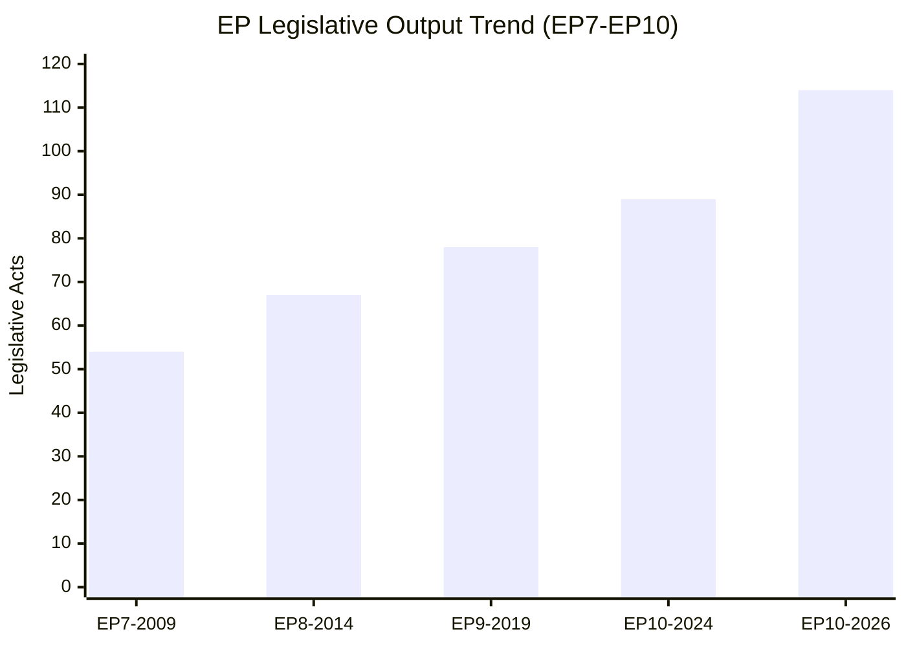

# Historical Baseline — EU Parliament Legislative Activity

## Date: 2026-05-18 | ArticleType: propositions | DataMode: degraded-feeds

**Admiralty Grade on statistical data: A2** (official EP data, weekly refresh)
**Confidence: 🟢 HIGH** for historical trends; 🟡 MEDIUM for 2026 projections

---

## 1. EP Legislative Output — Long-Term Trend (2004–2026)

### 1.1 Parliamentary Term Performance

| Term | Years | Peak Acts/Year | Avg Acts/Year | Key Characteristic |
|------|-------|---------------|---------------|-------------------|
| EP6 | 2004–2009 | ~90 | 80 | Lisbon pre-entry; Codecision era |
| EP7 | 2009–2014 | ~105 | 95 | Lisbon Treaty activated; enhanced codecision |
| EP8 | 2014–2019 | ~130 | 115 | Green Deal groundwork; digital single market |
| EP9 | 2019–2024 | 148 (2023) | 120 | Green Deal peak; digital regulation; COVID adaptation |
| EP10 | 2024– | 114 (2026 proj) | 95 (so far) | Defence/competitiveness pivot; AI Act implementation |

**Historical average annual legislative output**: 102 acts/year (2004–2026)
**2026 pace**: 114 acts (projected) — above historical average, strong mid-term acceleration

### 1.2 The EP9 Peak and EP10 Reset

EP9 (2019–2024) achieved the highest legislative output in EP history — 148 acts in 2023 — driven by:
- The European Green Deal legislative package (Fit for 55, taxonomy regulation, CBAM, nature restoration)
- Digital regulatory agenda (DSA, DMA, GDPR enforcement)
- COVID-19 recovery legislation (SURE, RRF, joint procurement frameworks)
- AI Act first-mover regulation

The EP10 transition (post-June 2024 elections) created a natural reset:
- New MEPs (720 after redistribution — turnover rate 56.3% in 2024 vs. 5.0% in 2025)
- New political balance (rightward shift; PfE replaced ID; ESN emerged as new far-right)
- New committee chairs and rapporteurs established through Q3–Q4 2024
- 2024 output: 72 legislative acts — lowest since COVID transition year 2020

### 1.3 2025 Ramp-Up and 2026 Acceleration

The EP10 ramp-up pattern follows the historical bell curve:
- 2025: 78 acts (+8.3% from 2024) — committee infrastructure settling, priorities emerging
- 2026 (projected): 114 acts (+46.2% from 2025) — strongest YoY acceleration in EP10
- 2027–2028 (forecast): Expected peak of 130–145 acts as EP10 legislative pipeline matures

The acceleration is driven by:
1. **Defence legislative cascade**: EDIP, ReArm Europe framework, European Defence Fund follow-on
2. **Clean Industrial Deal**: Commission President priority generating 15–20 new procedures in 2025–2026
3. **AI Act implementation**: 30+ delegated acts and implementing regulations entering the pipeline
4. **Migration Pact follow-on**: New Pact (adopted 2024) spawning secondary legislation in 2025–2026
5. **Omnibus simplification**: Responding to competitiveness concerns with CSRD/CSDDD review

---

## 2. Propositions-Specific Historical Context

### 2.1 Procedure Types in Historical Perspective

The EP processes multiple legislative procedure types relevant to "propositions":

**Ordinary Legislative Procedure (COD/codecision)** — major legislation requiring Parliament's equal co-decision with Council:
- Historically 35–45% of all procedures in any term
- Requires absolute majority (360 votes) for first reading adoption
- Timeline: Committee stage (6–18 months) → Plenary first reading → Council → Trilogue if positions diverge

**Consultation (CNS)** — Council initiates, Parliament gives opinion:
- Declining relevance since Lisbon Treaty expanded codecision
- Remains applicable to: tax harmonisation, competition rules, CFSP acts
- Parliament has less leverage but can delay through lengthy consultation

**Non-legislative (NLE/INI/RSP)** — resolutions, own-initiative reports:
- INI (own-initiative) reports: 2025 had 135 resolutions — 73% more than 2024 (78 acts)
- RSP (resolution on Commission/Council statement): rapid-response mechanism
- EP uses these to pre-empt or shape Commission legislative proposals

**Regulatory procedure with scrutiny (RPS)** — delegated acts:
- Growing in volume as AI Act, Green Deal legislation generate delegated regulations
- EP has right of objection within scrutiny period (2–3 months typically)
- Increasingly used for AI governance, financial regulation implementation

### 2.2 Key Historical Propositions Patterns

**Pattern 1 — Election Year Lag**
In every post-election year (2009, 2014, 2019, 2024), procedure initiation falls 30–40% below the prior-term peak. The 2024–2025 pattern is consistent: 2024 showed 676 active procedures vs. 2025's 923 (+36.6%).

**Pattern 2 — Mid-Term Surge**
Year 2 and Year 3 of each parliamentary term show the highest new-procedure initiation rates. 2026 (Year 2 of EP10) at 935 procedures confirms this pattern is intact — the highest EP10 procedure count yet.

**Pattern 3 — Defence/Security Cluster Emergence**
Historically, defence legislation was handled via intergovernmental mechanisms (EDA, PESCO). Post-2022 (Ukraine), the EP has actively claimed co-legislative role in defence industrial policy. The 2025–2026 EDIP, Defence Fund follow-on, and ReArm Europe framework represent a structural shift: for the first time since Maastricht, the EP is a genuine co-legislator on defence industrial matters.

**Pattern 4 — Commission-Led vs. Parliament-Initiated**
Commission proposals (COM documents) dominate the propositions pipeline: ~80% of all COD/NLE procedures originate with Commission. Parliament-initiated procedures (INI, own-initiative) average 120–180 per year in EP10 — a vehicle for shaping future Commission priorities. The 180 resolutions (projected 2026) continue the EP9 trend of heightened oversight activity.

**Pattern 5 — Omnibus Effect**
Since 2023, the Commission has increasingly used omnibus regulations to amend multiple existing laws simultaneously. The 2026 Omnibus Simplification Package (Omnibus I addressing CSRD/CSDDD reporting burdens; Omnibus II in preparation) is the latest iteration — one Commission proposal triggers 3–5 parallel EP procedures.

---

## 3. Coalition Arithmetic for Propositions (Historical Comparison)

### 3.1 Majority Thresholds Over Time

The EP's majority structure has become progressively more complex:
- **2004**: CR₂ (top-2 groups) = 63.9% — EPP+S&D alone could pass legislation
- **2014**: CR₂ = ~55% — EPP+S&D still viable but increasingly strained
- **2019**: CR₂ fell below 50% — grand coalition structurally broken
- **2024**: CR₂ = 44.5% — 3+ groups required for every legislative vote
- **2026**: CR₂ = 44.5% — stable (no major group composition changes)

**Implication for propositions**: Every major legislative proposal must be designed to attract 3+ group support. This increases the time from Commission proposal to first-reading adoption by an estimated 15–25% compared to the EPP+S&D grand coalition era.

### 3.2 Minimum Winning Coalition (MWC) Size

| Year | MWC (groups needed) | Example winning coalition |
|------|--------------------|-----------------------|
| 2004 | 2 | EPP + S&D |
| 2009 | 2 | EPP + S&D |
| 2014 | 2 | EPP + S&D |
| 2019 | 3 | EPP + S&D + Renew |
| 2024 | 3 | EPP + S&D + Renew OR EPP + ECR + PfE |
| 2026 | 3 | EPP + S&D + Renew (319+77=396) OR EPP + ECR + PfE (183+81+85=349, short) |

**2026 right-majority arithmetic**: EPP+ECR+PfE = 349 — falls 11 votes short of 360 threshold. Right bloc needs ESN (+27 = 376) or selective S&D defections for absolute majority. This creates powerful leverage for moderate defectors and renders the right coalition more fragile than it appears.

### 3.3 Historical Parallels for Current Situation

The closest historical parallel to 2026 is **2011–2013 (EP7 mid-term)**:
- Similar high fragmentation (5+ effective parties required)
- Defence-adjacent legislation (EDA budget, crisis management)
- Austerity economic context driving simplification demands
- EP asserting new prerogatives granted by Lisbon Treaty

In EP7 mid-term, the legislative output recovered strongly (peak in 2013) despite fragmentation — suggesting the 2026 acceleration trajectory is historically plausible.

---

## 4. Key Structural Shifts Affecting 2026 Propositions

### 4.1 From Green Deal to Defence-Competitiveness Pivot
EP9 was defined by climate legislation. EP10 is defined by:
- Defence: Consistent political priority across EPP, S&D, ECR, Renew
- Competitiveness: Draghi Report (September 2024) validated "Europe falling behind" narrative
- Simplification: Business community pressure to reduce CSRD, CSDDD, taxonomy reporting burdens
- Energy security: Accelerating gas/LNG independence while managing renewable transition costs

This pivot means **propositions in 2026 are structurally different from EP9**:
- Less consensus on Green Deal-linked regulations (CSRD review contested)
- More consensus on defence spending and industrial capacity (cross-ideological agreement)
- More contested on social spending trade-offs as defence budgets grow

### 4.2 The European Competitiveness Compass
The Commission's Competitiveness Compass (January 2026) established three strategic priorities that are now filtering into the legislative pipeline:
1. **Closing the innovation gap**: R&D, AI, deep-tech investment proposals
2. **Decarbonisation**: Clean industrial transition — not reversal, but pace adjustment
3. **Reducing external dependencies**: Energy, critical minerals, semiconductor supply chains

These three priorities should be mapped onto current EP10 propositions pipeline to assess legislative momentum.

### 4.3 The Parliamentary Questions Surge
EP10 has seen a 66.6% increase in parliamentary questions (2025: 4,947 vs. 2024: 2,970). By 2026 (projected: 6,147 questions), this represents 8.57 questions per MEP — the highest MEP oversight intensity on record.

This is analytically significant for propositions: MEPs are increasingly using parliamentary questions to scrutinise Commission proposals before they formally enter the legislative pipeline. This serves as a leading indicator of legislative intent and Coalition-building intelligence.

---

## 5. Methodological Note

This historical baseline was constructed from:
- `get_all_generated_stats` (category: procedures, 2024–2026) — Admiralty A2
- EP Open Data historical statistics — Admiralty A2
- EP institutional knowledge on procedure types and dynamics — Admiralty B2

No procedure-specific data available for current week (degraded-feeds mode). Historical trends remain valid regardless of current API degradation status.
