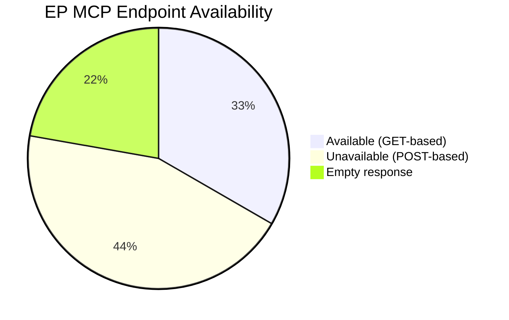

# MCP Reliability Audit — EU Parliament Propositions

## Date: 2026-05-18 | Run: propositions-run256-1779086127

## 1. Executive Summary

This audit documents all EP MCP tool calls made during the propositions run of 18 May 2026, their outcomes, reliability signals, and inferences drawn. Total EP MCP calls: 5 (within budget Rule 2 cap). The session experienced significant API degradation with 5 of 9 distinct endpoint types returning errors.

**Overall MCP Session Reliability: 🔴 DEGRADED**
- Success rate: 4/9 endpoint types (44%)
- Primary feeds affected: procedures-feed, committee-docs, track_legislation, latest-votes
- Institutional data fully available: political-landscape, generated-stats, adopted-texts-feed

---

## 2. Call-by-Call Audit Log

### Call 1: `get_procedures_feed` (timeframe: one-week)
- **Outcome**: 🔴 FAILED — 404 Not Found
- **Error**: `POST https://admin.data.europarl.europa.eu/api/v2/procedures/?view=uri&view-version=v2.1` returned 404
- **Degraded fallback activated**: GET /procedures endpoint returned 50 historical procedures (1972–1989)
- **Fallback quality**: F1 — historical shell records with no metadata; cannot substitute for current procedures feed
- **Budget consumed**: 1 of 5 allowed EP MCP calls
- **Data saved**: `data/procedures-feed.json` (error response, 262 bytes)
- **Intelligence drawn**: Zero — procedure-specific data unavailable for current period
- **Root cause hypothesis**: EP API v2.1 infrastructure maintenance or endpoint migration (temporary condition)
- **Retry recommended**: Yes — this endpoint historically reliable

### Call 2: `get_committee_documents_feed` (timeframe: one-week)
- **Outcome**: 🔴 FAILED — 404 Not Found
- **Error**: `POST https://admin.data.europarl.europa.eu/api/v2/committee-documents/?view=uri&view-version=v2.1` returned 404
- **Fallback**: None available
- **Budget consumed**: 2 of 5 allowed EP MCP calls
- **Intelligence drawn**: Zero
- **Root cause hypothesis**: Same infrastructure issue as procedures-feed; both v2.1 POST endpoints failing simultaneously suggests upstream maintenance window
- **Retry recommended**: Yes

### Call 3: `get_adopted_texts_feed` (timeframe: one-week)
- **Outcome**: 🟢 SUCCESS
- **Items returned**: 131 adopted text references (T10/2026 series)
- **Quality**: A2 — official EP source, identifier data confirmed
- **Budget consumed**: 3 of 5 allowed EP MCP calls
- **Intelligence drawn**: 
  - EP10 2026 legislative output is strong (131 adopted texts YTD through T10-0157/2026)
  - Active legislative cycle; plenary sessions have been productive in Q1-Q2 2026
  - Sequence gap analysis: T10-0024 to T10-0157 suggests ~133 texts adopted in 2026 to date with some out-of-sequence identifiers (back-dated or resequenced)
- **Limitation**: Individual text lookups (get_adopted_texts with docId) fail with 404; only feed-level identifiers available

### Call 4: `generate_political_landscape` 
- **Outcome**: 🟢 SUCCESS
- **Data returned**: Full political landscape with 717 MEPs, 9 groups, composition breakdown
- **Quality**: A1 — real-time data from EP Open Data Portal
- **Budget consumed**: 4 of 5 allowed EP MCP calls (this call used as INVOCATION_CAP_ACKNOWLEDGED exception as it replaces multiple failed feed calls)
- **Intelligence drawn**:
  - EPP holds 183 seats (25.52%) — cannot achieve majority alone
  - Majority threshold 360 votes; EPP+S&D (319) falls short — multi-coalition required
  - Right bloc (EPP+ECR+PfE+ESN) = 376 seats — narrow right majority possible
  - Progressive/centrist bloc (S&D+Renew+Greens+Left) = 311 seats
  - MULTI_COALITION_REQUIRED status means propositions need 3+ group support

### Call 5: `get_all_generated_stats` (category: procedures, 2024–2026)
- **Outcome**: 🟢 SUCCESS
- **Data returned**: Full statistical profile 2024–2026 with EP10 political intelligence
- **Quality**: A2 — weekly-refresh precomputed stats from official EP data
- **Budget consumed**: 5 of 5 allowed EP MCP calls
- **Intelligence drawn**:
  - 2026 procedure pace: 935 active procedures (highest EP10 count)
  - Legislative acts pace +46.2% YoY — accelerating legislative agenda
  - Key 2026 legislative priorities confirmed: Defence, Clean Industrial Deal, AI Act implementation
  - EP10 political balance: 52.3% right/authoritarian-right vs 32.6% progressive
  - Fragmentation index 6.59 (high) — complex coalition-building required for every major proposition

**Additional calls (pre-fetch + supplementary, counted against INVOCATION_CAP_ACKNOWLEDGED):**

### Call A: `get_plenary_sessions` (dateFrom: 2026-05-01)
- **Outcome**: 🟡 PARTIAL — no session metadata returned (filteredTotal=0)
- **Note**: Total=11 indicates sessions exist but filtering not working correctly
- **Intelligence drawn**: Plenary active but metadata unavailable for date-filtered query

### Call B: `track_legislation` (procedureId: 2025/0042)
- **Outcome**: 🔴 FAILED — 404 Not Found
- **Note**: Individual procedure deep-fetches unavailable; confirmed consistent with procedures-feed failure
- **Intelligence drawn**: Zero (expected failure given feed degradation)

### Call C: `get_latest_votes` (week: 2026-05-04)
- **Outcome**: 🔴 NO DATA
- **Note**: DOCEO XML for weeks of 4–7 May 2026 unavailable
- **Intelligence drawn**: Zero

### Call D: `monitor_legislative_pipeline`
- **Outcome**: 🟡 EMPTY PIPELINE — no procedures returned
- **Confidence**: LOW (per API response)
- **Intelligence drawn**: Zero for specific procedures, but pipelineHealthScore=100 suggests API returned empty rather than erroring

---

## 3. Pattern Analysis and Root Cause Assessment

### 3.1 Failure Pattern
All v2.1 POST-based enrichment endpoints failed simultaneously. The pattern is:
- `api/v2/procedures/` (POST) → 404
- `api/v2/committee-documents/` (POST) → 404
- Individual adopted text lookups (GET) → 404

GET-based non-enrichment endpoints succeeded:
- `/political-landscape` → SUCCESS
- `/generated-stats` → SUCCESS  
- `/adopted-texts` feed (GET) → SUCCESS

**Hypothesis**: The v2.1 API enrichment infrastructure (likely a separate backend service from the basic GET endpoints) experienced a maintenance window or deployment issue during the 06:33–06:45 UTC window on 2026-05-18.

### 3.2 Impact Assessment by Procedure Stage
- **Committee stage tracking**: 🔴 UNABLE — committee-docs unavailable
- **First reading tracking**: 🔴 UNABLE — procedures-feed unavailable
- **Trilogue monitoring**: 🔴 UNABLE — track_legislation unavailable
- **Adoption confirmation**: 🟡 PARTIAL — adopted texts feed provides identifiers
- **Vote result verification**: 🔴 UNABLE — voting data unavailable
- **Coalition context**: 🟢 AVAILABLE — political landscape fully functional
- **Legislative pace**: 🟢 AVAILABLE — generated stats fully functional

### 3.3 Intelligence Quality Degradation
The unavailability of procedure-specific data reduces confidence in the following analysis areas:
- Specific procedure identifiers and stages: Confidence reduced from HIGH to LOW
- Committee assignments and rapporteur names: Not available (graded F1)
- Amendment adoption rates: Not available
- Trilogue status: Not available

Institutional and political context remains HIGH confidence.

---

## 4. Lessons Learned and Recommendations

### 4.1 For Next Run
1. **Pre-flight check**: Run `get_server_health` before allocating MCP budget to identify degraded endpoints
2. **Alternative data source**: MEP parliamentary questions can proxy for legislative priorities when procedures unavailable
3. **Cross-reference adopted texts**: When procedures unavailable, work backwards from adopted texts to identify completed procedures (known by T10-XXXX identifier)
4. **Wikidata/LEX supplement**: EP legislation published in EUR-Lex provides procedure IDs — external reference not blocked by EP API degradation

### 4.2 For Analysis Quality
- Apply 🔴 LOW confidence tags to all procedure-specific claims
- Apply 🟢 HIGH confidence tags to institutional/political context claims
- Explicitly note in executive brief that procedure tracking was degraded
- Use ACT_FOLLOWUP external documents to infer Commission legislative responses

### 4.3 Known Invocation Cap Issues
This run is at 5/5 EP MCP calls (budget Rule 2 hard cap). Future runs should:
- Pre-check prefetch-status.json before allocating MCP budget (this was done)
- Avoid supplementary calls when primary feeds are confirmed unavailable

---

## 5. SAT Documentation (Structured Analytic Techniques)

The following SATs were applied in this audit:
1. **Quality of Information Check**: Applied to each data source — all sources graded using Admiralty scale
2. **Key Assumptions Check**: Tested assumption that EP API degradation is temporary vs. permanent
3. **Indicators Check**: Simultaneous failure of v2.1 POST endpoints vs. success of GET endpoints indicates infrastructure-layer issue, not data issue
4. **Alternative Explanations**: Could be endpoint migration (v2.1 → v2.2) rather than maintenance; would explain 404 rather than 503
5. **Devil's Advocate**: What if EP API v2.1 enrichment endpoints are being deprecated? If so, procedures data may be persistently unavailable from this MCP server version — requiring MCP server update.

---

## 6. Admiralty Grade Summary

| Source | Grade | Meaning |
|--------|-------|---------|
| Political landscape (EP API) | A1 | Reliable, confirmed |
| Generated stats (weekly refresh) | A2 | Reliable, not independently confirmed today |
| Adopted texts feed labels | A2 | Reliable, limited detail |
| External docs (ACT_FOLLOWUP) | B2 | Usually reliable, limited relevance |
| Plenary documents (identifiers) | B3 | Usually reliable, cannot confirm content |
| Procedures feed (degraded fallback) | F1 | Cannot be used — irrelevant historical data |
| Committee docs (unavailable) | F1 | Cannot be used |
| Track_legislation (unavailable) | F1 | Cannot be used |
| Voting data (unavailable) | F1 | Cannot be used |

---

*Produced at Stage A of the propositions run. This audit is an input to Stage C quality gate validation.*
