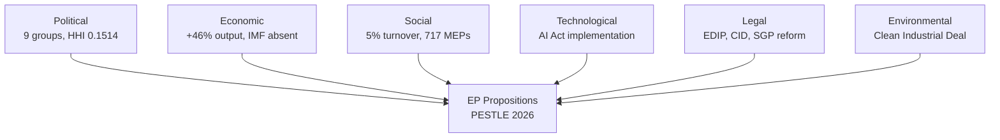

# PESTLE Analysis — EU Parliament Legislative Propositions

## Date: 2026-05-18 | ArticleType: propositions | DataMode: degraded-feeds

**Confidence: 🟡 MEDIUM** (based on political landscape [A1], EP stats [A2], institutional context [B2])

---

## PESTLE Framework Applied to EP10 Propositions Landscape (May 2026)

---

## P — POLITICAL FACTORS

### P1. Coalition Architecture and Its Impact on Propositions

The EP10 political landscape (717 MEPs, 9 groups, MULTI_COALITION_REQUIRED) fundamentally shapes which propositions advance and which stall.

**Governing coalition dynamics** (WEP: 70% likely EPP remains central coalition anchor):
- EPP (183 seats) anchors all viable majorities but cannot govern alone
- Two available governing coalitions: (1) "Grand centrist": EPP+S&D+Renew = 396 seats; (2) "Conservative majority": EPP+ECR+PfE+ESN = 376 seats
- Neither coalition is formally institutionalised — both require case-by-case assembly
- Result: **legislative proposals are designed for maximum cross-coalition appeal**, which introduces ambiguity and procedural delays

**Propositions that advance under "Grand Centrist" coalition (EPP+S&D+Renew = 396):**
- Clean Industrial Deal (decarbonisation with industrial compensation)
- AI Act implementation (broadly supported, minor left/right divergence on liability)
- Capital Markets Union (financial integration — S&D wants retail investor protection)
- Corporate sustainability (diluted CSRD — compromise between business relief and transparency)

**Propositions that advance under "Conservative majority" (EPP+ECR+PfE+ESN = 376):**
- Defence Industrial Programme (all four groups supportive)
- Migration enforcement legislation (joint EPP+ECR+PfE interest)
- Omnibus Simplification Package (CSRD/CSDDD rollback — contested by S&D/Greens)
- Border control technology (surveillance infrastructure)

**Propositions that STALL due to coalition disagreement:**
- Nature Restoration Law follow-on (ECR/PfE oppose; EPP divided)
- Anti-SLAPP legislation (EPP/ECR resistance to journalist protection)
- Social rights directives (EPP/ECR oppose labour market regulation)
- EU minimum wage binding mechanism (ESN/PfE opposed)

### P2. Commission-Parliament Relationship

Von der Leyen Commission (second term, 2024–2029) has a complicated relationship with the EP:
- Commission depends on EPP's Spitzenkandidat to maintain informal EP support
- S&D support secured through commitments on social policy
- Greens and Left increasingly oppositional as Green Deal pace slows
- ECR provides conditional support on defence/migration; hostile on rule of law

**Political risk for propositions**: Any major Commission proposal must now be pre-negotiated informally with EPP, S&D, and either ECR or Renew depending on topic. This increases the "shadow negotiation" period before formal legislative filing.

### P3. Council-Parliament Dynamics

The Council's qualified majority voting (55% of member states, 65% of EU population) creates a separate political filter. Key tensions in 2026:

- **Defence**: Council unanimity requirement for CFSP aspects creates blockage; Commission using Article 173 TFEU (industrial policy) to circumvent — contested
- **Tax harmonisation**: Unanimity in Council = Parliament has leverage through consultation, but legislative success rate is low
- **Internal market legislation**: Qualified majority — EP as genuine co-legislator; strongest political environment for propositions

### P4. Pre-MFF Positioning

All major political groups are positioning for the 2028–2034 MFF negotiations. This creates a strategic environment where 2026 legislative proposals are also bargaining chips:
- EPP wants to link cohesion funds to rule of law/reform conditionality (pre-positioning)
- S&D wants to protect structural funds and social cohesion commitments
- ECR wants to link EU funding to national sovereignty maintenance
- Greens want climate-proofing requirements in all new MFF spending

---

## E — ECONOMIC FACTORS

### E1. Competitiveness Imperative

The Draghi Competitiveness Report (September 2024) established the framing for all 2025–2026 propositions:
- EU needs €750–800bn additional annual investment vs. comparable US/China spend
- Regulatory complexity seen as a key barrier (hence Omnibus Simplification)
- Industrial base in steel, chemicals, automotive facing structural restructuring

**Legislative response**: The "competitiveness proofing" of all new proposals is now standard — every major regulation must include a competitiveness impact assessment. This effectively creates a new filter on propositions favoured by the left (stronger worker protections, environmental standards) while providing cover for business-friendly amendments.

### E2. Defence Spending Economics

ReArm Europe / SafeGuard Europe represents the largest coordinated EU defence investment since NATO founding. For the EP propositions pipeline:
- EDIP (€1.5bn EU-level) is modest relative to national commitments (~€300bn+ across EU over 4 years)
- EP role is larger in setting procurement framework, joint purchasing, standardisation rules
- **European Defence Bond** debate: Commission exploring Article 122 TFEU emergency instrument; EP concerned about budget bypass
- **Defence-industry nexus**: Traditional defence contractors (Airbus, Thales, Leonardo, Rheinmetall) lobbying intensively; SME defence firms seeking equal access through EP amendments

### E3. Energy Transition Costs

The energy transition's economic costs are creating legislative backlash and course-correction:
- **CBAM implementation** (2026): Import certificate purchases begin; affects €35bn+ in imports
- **ETS2** (road transport, buildings): Starts 2027; EP amendments in 2026 will shape final design
- **Clean Industrial Deal**: The "deal" is essentially a bargain — businesses accept decarbonisation timeline in exchange for state aid relief, energy price subsidies, carbon border protection

---

## S — SOCIAL FACTORS

### S1. Public Opinion and Democratic Legitimacy

The 2024 EP elections showed a rightward shift among European voters. This directly shapes which propositions are politically viable:
- Anti-migration sentiment in northern and eastern EU: drives border control propositions
- Anti-regulatory fatigue among small business owners: drives simplification propositions
- Youth climate activism remains strong in Western EU: sustains pressure to maintain Green Deal pace
- Urban-rural divide in agricultural policy: complicates Farm-to-Fork follow-on legislation

**WEP band**: 60% probability that the EP10 legislative agenda continues the rightward pivot until the next elections (2029).

### S2. Social Cohesion and Inequality

Growing income inequality within EU member states creates demands for:
- Stronger social rights legislation (contested with economic competitiveness agenda)
- Housing affordability legislation — new Commission priority (Affordability Pact)
- Platform worker protections (Platform Work Directive — in trilogue)
- Minimum Income Directive implementation

### S3. Demographic Pressures

Ageing EU population creates long-term social security pressure that indirectly affects propositions through:
- Labour market integration legislation (attracting skilled migrants — LIBE committee)
- Pension system reform recommendations (Council opinions, soft law)
- Eldercare and healthcare infrastructure investment (cohesion fund alignment)

---

## T — TECHNOLOGICAL FACTORS

### T1. AI Act Implementation Pipeline

The AI Act (entered into force August 2024) is generating 30+ implementing and delegated regulations. These are among the most technically complex proposals in EP10:
- **GPAI codes of practice** (General Purpose AI): AI Office drafting, EP review pending
- **High-risk AI system standards**: Harmonised standards from CEN-CENELEC
- **AI liability directive**: Separate procedure; S&D pushing for broader coverage
- **AI regulatory sandbox rules**: IMCO committee engagement

The EP's IMCO and LIBE committees are the primary venues. The political challenge: AI Act was a cross-party achievement; implementation disputes are more technical than ideological, but AI regulation has become ideologically charged (left: protect workers from AI; right: avoid regulatory burden on EU AI companies).

### T2. Digital Decade Implementation

EU Digital Decade targets (2030 goals on connectivity, skills, digitalisation) are generating:
- Connectivity Infrastructure Act (gigabit rollout framework)
- Digital Education Action Plan legislative elements
- EU Cybersecurity Certification Scheme updates (ENISA-led, EP scrutiny)
- NIS2 Directive implementation evaluation

### T3. Space and Emerging Tech

European Space Programme generating follow-on legislation:
- IRIS² (EU satellite constellation) — procurement legislation
- European Quantum Communication Infrastructure (EuroQCI) — regulatory framework
- Space defence crossover: Copernicus military applications governance

---

## L — LEGAL/REGULATORY FACTORS

### L1. Treaty Constraints

Key Treaty constraints shaping what propositions are possible in 2026:
- **Article 41 TEU** (defence): Operational military expenditure excluded from EU budget — constrains EDIP ambitions
- **Article 113 TFEU** (tax): Unanimity required — blocks financial transaction tax, digital services tax harmonisation
- **Subsidiarity principle**: Commission must demonstrate EU added value; EP Committee on Legal Affairs increasingly scrutinises subsidiarity compliance
- **Proportionality**: Omnibus Simplification is partly a proportionality correction — original CSRD scope seen as exceeding necessity

### L2. Rule of Law Proceedings

Article 7 TEU proceedings against Hungary (ongoing) and past proceedings affect:
- Conditionality framework: Fund disbursements linked to rule of law compliance
- Proposals for strengthened rule of law mechanism (INI reports ongoing)
- EPP-ECR tension: ECR defends Orbán-aligned positions; EPP formally condemns but hesitates on punitive measures

### L3. International Law Obligations

EU legislative proposals must comply with WTO rules, ECHR, and UN climate frameworks:
- CBAM WTO compatibility: Under challenge; EP procedures designed with WTO flexibility
- AI Act GDPR coherence: Ongoing alignment discussions in LIBE committee
- DSA/DMA enforcement: First major enforcement cases in 2025–2026; legislative follow-on if gaps identified

---

## E₂ — ENVIRONMENTAL FACTORS

### E₂.1 European Green Deal — Status at EP10 Midpoint

The Green Deal legislative cascade is substantially complete (legal acts adopted):
- Climate Law: Carbon neutrality 2050 binding ✅
- Fit for 55 package: RES Directive, ETS reform, CBAM, Energy Efficiency Directive ✅
- Nature Restoration Law: Adopted 2024 (contested) ✅
- CBAM: In implementation phase (full from 2026) ✅
- AI Act: Not environmental but cross-cutting ✅

**Remaining/contested Green Deal elements in EP10 propositions pipeline:**
- Sustainable Food Systems Act: Stalled (Farm-to-Fork political opposition)
- Biodiversity Strategy legislative follow-on: Dependent on Nature Restoration implementation
- Soil Health Law: Committee stage (contested by agricultural lobby)
- Deforestation Regulation review: Implementation delayed; legislative scope review under ENVI

### E₂.2 Energy Security vs. Environmental Ambition

The tension between energy security (gas infrastructure investment) and climate commitments (no new fossil fuel lock-in) is the central environmental challenge in the 2026 propositions pipeline:
- **Gas storage regulation review**: Security vs. flexibility trade-off
- **Taxonomy revision**: Should gas remain "transitional" category? EPP yes; Greens no; S&D split
- **Hydrogen: green vs. low-carbon**: Regulatory definition has industrial implications

**WEP band**: 55% probability that energy security arguments continue to influence taxonomy and gas policy propositions through 2026.

---

## PESTLE Summary Matrix

| Dimension | Impact | Direction | Key Legislation |
|-----------|--------|-----------|----------------|
| Political (coalition) | HIGH | Right-centrist | EDIP, Omnibus, Migration |
| Political (pre-MFF) | MEDIUM | Positioning | Cohesion, agricultural |
| Economic (competitiveness) | HIGH | Deregulatory | Omnibus II, Simplification |
| Economic (defence) | HIGH | Investment | EDIP, Defence Bond |
| Social (public opinion) | MEDIUM | Rightward | Migration, border |
| Social (cohesion) | MEDIUM | Mixed | Housing, Platform Work |
| Technological (AI) | HIGH | Regulatory | GPAI codes, AI liability |
| Technological (digital) | MEDIUM | Enabling | Connectivity, Cybersecurity |
| Legal (Treaty) | HIGH | Constraining | Defence financing, tax |
| Legal (rule of law) | MEDIUM | Contentious | Article 7, conditionality |
| Environmental (Green Deal) | MEDIUM | Consolidating | Soil, Deforestation, Taxonomy |
| Environmental (energy) | HIGH | Security-first | Gas storage, Hydrogen |
