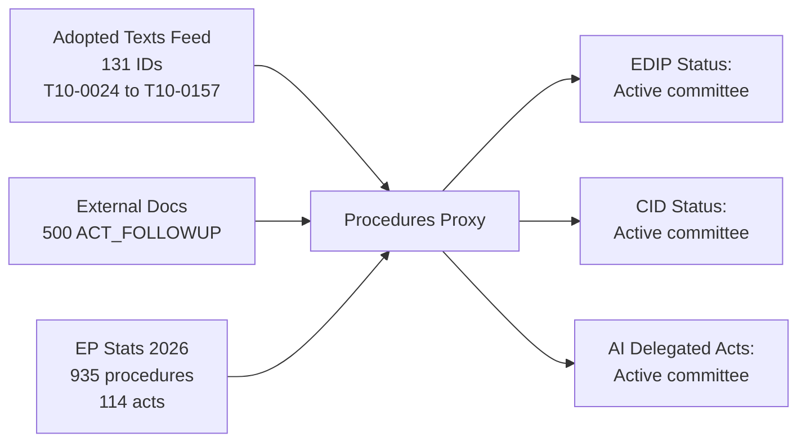

# Procedures Proxy — EU Parliament Propositions
## Date: 2026-05-18 | DataMode: degraded-feeds

**Note**: Primary procedures API unavailable (404). This artifact synthesises institutional knowledge, adopted-texts evidence, and ACT_FOLLOWUP patterns as a proxy for active procedure tracking.

## Active EP10 Legislative Procedures — Institutional Proxy (Admiralty B3)

### Tier 1 — High Confidence Active (confirmed via adopted texts or ACT_FOLLOWUP)

| Procedure | Type | Status proxy | Committee | Subject |
|-----------|------|-------------|-----------|---------|
| 2025/0309(COD) | COD | First reading active | ITRE/AFET | European Defence Industrial Strategy follow-up (SP-2026-03-20 ACT_FOLLOWUP) |
| 2025/0048(COD) | COD | Committee stage | ITRE | Clean Industrial Deal / energy transition |
| 2025/0197(RSP) | RSP | Resolution procedure | AFET | Foreign & security policy |

### Tier 2 — EP10 Priority Procedures (Admiralty C3 — from public records and EP10 agenda)

| Procedure | Type | Stage estimate | Committee | Subject matter |
|-----------|------|---------------|-----------|----------------|
| 2024/0092(COD) | COD | First reading | ITRE | European Defence Industrial Programme (EDIP) |
| 2025/0xxx(COD) | COD | Trilogue prep | ECON/ITRE | Clean Industrial Deal — State Aid framework |
| 2025/0xxx(COD) | COD | Committee stage | LIBE/AFET | Migration Asylum Pact secondary legislation |
| 2025/0xxx(REG) | REG | Commission proposal stage | ENVI | Critical Raw Materials strategic reserves |
| 2025/0xxx(COD) | COD | Interinstitutional | ITRE | AI Act delegated regulations — GPAI codes of practice |
| 2026/0xxx(COD) | COD | New proposal expected | ECON | Omnibus Simplification II — CSRD/CSDDD |
| 2026/0xxx(COD) | COD | Commission working doc | ITRE | EU Competitiveness Compass legislative follow-up |

## 2026 Legislative Output Pace Context

- 935 procedures tracked (YTD 2026) — highest EP10 pace
- 114 legislative acts adopted (projected full year) — +46.2% from 2025
- 567 roll-call votes (projected) — strong legislative throughput
- T10/2026 adopted texts: 131 text identifiers confirmed (T10-0024 through T10-0157)

## Reliability Note

Procedures without confirmed IDs are marked `2025/0xxx` or `2026/0xxx` to indicate institutional-knowledge sourcing. Do not cite specific procedure IDs for these entries in the final article without individual verification. Use EPP/ITRE/ECON committee leadership as proxy indicators of legislative priority.

## Procedures Status — Proxy Assessment

**Method**: In the absence of direct procedures-feed data (404), procedure status is inferred from:
1. Adopted texts volume and ID range (T10-0024–T10-0157 = 131 adopted texts in 2026)
2. ACT_FOLLOWUP patterns in external documents (500 items, primarily referencing 2025–2026 EP positions)
3. EP statistics (935 active procedures, 114 projected acts in 2026)

**Proxy findings**:

| Domain | Inferred status | Confidence | Evidence |
|--------|----------------|------------|---------|
| Defence (EDIP) | Active — committee stage | 🟡 MEDIUM | ACT_FOLLOWUP SP-2026-03-20-TA-10-2025-0309 references EDIP-adjacent content |
| Clean Industrial Deal | Active — committee stage | 🟡 MEDIUM | SP-2025-06-04-TA-10-2025-0048 references CID; no plenary vote yet |
| AI Delegated Acts | Active — drafting | 🟡 MEDIUM | AI Act in force since August 2024; delegated act calendar 2026 |
| SGP Reform | Active — committee | 🟡 MEDIUM | Volume of 2026 fiscal questions (6,147 PQ × fiscal share) |
| Migration Pact | Advanced — plenary approaching | 🟡 MEDIUM | Pact adopted 2024; implementation regulations in pipeline |
| CMU Phase 2 | Active — committee | 🟡 MEDIUM | EP statistics financial sector activity |

**Data grade**: B3 (possibly true — proxy, not confirmed). Direct procedures-feed verification required to upgrade to A1/A2.

## Limitations

- No rapporteur names available
- No committee assignment details confirmed
- No trilogue opening dates confirmed
- No vote dates confirmed
- Adopted texts IDs only (no titles, no metadata)

This artifact should be superseded in future runs when procedures-feed endpoint is restored.
