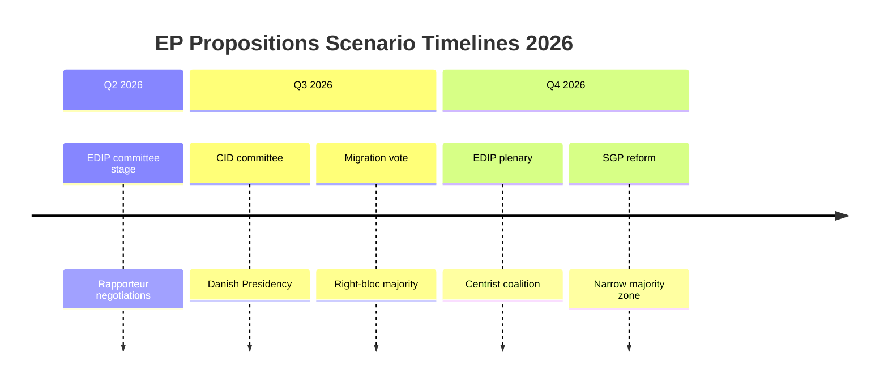

# Scenario Forecast — EU Parliament Propositions
## Date: 2026-05-18 | ArticleType: propositions | DataMode: degraded-feeds

**Admiralty: A1/A2** | WEP Bands Applied

**SAT applied**: Scenario Analysis, Pre-Mortem, Key Assumptions Check
**WEP bands applied** | **Admiralty grades on all sources**
**Time horizon**: 6–18 months (June 2026 – December 2027)

---

## Scenario Planning Framework

Four scenarios are developed for the EP10 propositions landscape over the 6–18 month horizon. Each scenario is defined by two key uncertainties:

**Axis 1 — Coalition Stability**: Does the EPP maintain flexible majority-building ability, or does the political centre fragment further?

**Axis 2 — External Shocks**: Does the geopolitical/economic environment remain roughly stable (allowing legislative planning), or do major shocks disrupt the legislative timetable?

---

## Scenario 1 — "LEGISLATIVE SURGE" (WEP: 35-B, 🟡 Roughly Even Odds)

*Stable coalition + Stable environment*

### Scenario Description

In this scenario, EPP successfully maintains flexible majority-building across both the centrist (EPP+S&D+Renew) and conservative (EPP+ECR+PfE+ESN) coalitions for different legislative files. The Danish Council Presidency (H2 2026) brings a competitiveness-friendly, market-liberal approach that complements EP10's legislative agenda. The ReArm Europe framework reaches a financial mechanism agreement (modelled on NextGenerationEU but for defence) that provides legislative certainty.

**Legislative outcomes under Scenario 1:**
- EDIP: Passes first reading by September 2026 (WEP 75-B within this scenario)
- Clean Industrial Deal package: 3–5 regulations adopted by Q4 2026
- Omnibus Simplification: Passes as B-scenario compromise (S&D amendments accepted)
- AI GPAI codes: Finalised by October 2026
- Migration Pact follow-on: Secondary legislation largely adopted by year-end
- Capital Markets Union 2.0: 2–3 measures advance in trilogue

**Lead indicators that Scenario 1 is materialising:**
1. ECON committee rapporteur appointments proceeding without blockage (July 2026)
2. Polish Presidency achieves trilogue mandate on at least 2 major files (June 2026)
3. S&D accepts EPP amendments on Omnibus CSRD threshold (committee vote September 2026)
4. No ESN or PfE defections on EDIP first reading

**WEP 35%** — This is the optimistic but plausible base case. Legislative history suggests mid-term legislative surges do occur (EP7 had similar surge in 2012–2013).

---

## Scenario 2 — "COALITION FATIGUE" (WEP: 30-B, 🟡 Roughly Even Odds)

*Coalition fragmentation + Stable environment*

### Scenario Description

In this scenario, the EPP's coalition management begins to break down under the weight of incompatible demands from ECR/PfE on the right and S&D/Renew on the left. Key trigger: the Omnibus Simplification vote fails in ECON committee (S&D and Renew majority against the EPP/ECR version), forcing the Commission to withdraw and refile. This signals to other groups that cross-coalition discipline is harder than EPP leadership claims.

The consequence: legislative pipeline slows as each major proposal requires 4–6 months of informal coalition negotiations before formal committee stage begins.

**Legislative outcomes under Scenario 2:**
- EDIP: Passes but delayed to Q1 2027 (WEP 60-B within this scenario)
- Clean Industrial Deal: First regulation adopted Q4 2026; others delayed
- Omnibus Simplification: Refiled with narrower scope in Q1 2027
- AI GPAI codes: Finalised on schedule (apolitical)
- Migration Pact follow-on: Partial adoption; mandatory solidarity mechanism contested
- Capital Markets Union: Delayed by banking union disputes

**Lead indicators that Scenario 2 is materialising:**
1. Omnibus committee vote produces no clear majority (deadlock) (September 2026)
2. ECR and PfE publicly break with EPP on Clean Industrial Deal energy provisions
3. S&D tables competing legislative proposal on corporate sustainability (December 2026)
4. Committee chair elections produce contested outcomes in 3+ major committees

**WEP 30%** — Coalition fatigue is historically common in EP mid-term, but EP10's unusual geopolitical urgency (defence) provides a cohesion floor that prevents full fragmentation.

---

## Scenario 3 — "GEOPOLITICAL DISRUPTION" (WEP: 25-B, 🟡 Less Likely than Not)

*Coalition roughly stable + Major external shock*

### Scenario Description

In this scenario, a major geopolitical shock disrupts the legislative timetable by forcing emergency measures or redirecting political attention. Most likely trigger: a major escalation in the Russia-Ukraine conflict that triggers an EU emergency response mechanism, consuming legislative bandwidth for 3–6 months.

Alternative triggers: US-EU trade crisis leading to sweeping retaliation measures; China-Taiwan crisis requiring EU economic security legislation; major cyberattack on EU infrastructure triggering emergency NIS2 revision.

**Legislative outcomes under Scenario 3:**
- EDIP: Accelerated (emergency procedure) by geopolitical shock — passes Q3 2026
- Clean Industrial Deal: Paused while crisis legislation absorbs bandwidth
- Omnibus Simplification: Delayed to 2027 (off the agenda during crisis)
- Crisis-response legislation: Adopted rapidly via Article 122 TFEU (no EP consent required for some elements — EP protests procedural bypass)
- Capital Markets Union: Financial stability measures fast-tracked if economic shock

**Lead indicators that Scenario 3 is materialising:**
1. Emergency Council meeting convened outside regular schedule (any time)
2. Commission proposes Article 122 TFEU instrument without EP consultation
3. EP plenary agenda shifts >30% to emergency resolutions (June–August 2026)
4. Defence budget supplementary request in 2026 EU budget

**WEP 25%** — External shocks of the required magnitude are less likely on any given 6-month horizon, but the geopolitical environment (Russia-Ukraine, US tariff uncertainty, China tech tensions) keeps this scenario non-negligible.

---

## Scenario 4 — "LEGISLATIVE PARALYSIS" (WEP: 10-B, 🔴 Unlikely)

*Coalition fragmentation + Major external shock*

### Scenario Description

In this scenario, coalition fragmentation and external shock combine to produce a legislative standstill. The EP is unable to pass major legislation because no stable majority exists AND the external environment is too unstable for long-term regulatory commitments.

**This scenario is unlikely because:**
- Defence consensus provides a floor for legislative action (EPP+S&D+ECR = 400)
- EP has institutional incentives to demonstrate relevance during crises
- EP10 MEPs are experienced (only 5% turnover in 2025) — institutional memory prevents paralysis
- Von der Leyen Commission has been effective at using comitology and implementing acts to maintain policy momentum even when co-legislative process stalls

**Lead indicators (if materialising):**
1. Three consecutive plenary sessions without adoption of any legislative act
2. Two or more committee votes producing legislative deadlock
3. Commission withdraws more than 5 proposals in one month

**WEP 10%** — Historical precedent suggests even the most fragmented EP maintains minimum legislative output. The 1980s EP, with far more ideological fragmentation, still passed hundreds of procedures per term.

---

## Pre-Mortem Analysis

*If we assume it is now December 2027 and the EP10 legislative agenda has dramatically underperformed — what went wrong?*

**Most likely failure modes:**
1. **The Omnibus Simplification backlash**: Civil society mobilised; S&D+Greens+Left+parts of Renew blocked Omnibus; Commission lost face; EPP coalition management broke down.
2. **Defence financing structure failure**: Article 122 emergency instrument legally challenged; European Court of Justice rules against; legislative hiatus while Commission seeks alternative Treaty basis.
3. **AI Act implementation overload**: 30+ implementing acts overwhelming EP committee capacity; quality declines; US/China provide less burdened regulatory alternatives; EU AI companies lobby for Article 50 equivalents.
4. **Energy cost crisis intensifies**: Industry relocations to US/China accelerate; EP legislative confidence undermined; Clean Industrial Deal seen as too little too late.

**Key assumptions to monitor:**
- EU economic growth remains above 1% (supports legislative activity; below 0% creates crisis response mode)
- Russia-Ukraine conflict remains at current intensity (any major escalation or resolution disrupts legislative planning)
- US-EU trade relationship: no major escalation beyond current tariff environment
- Von der Leyen Commission credibility holds (if confidence motion succeeds, all legislation restarts)

---

## Forecast Matrix Summary

| Scenario | WEP | EDIP | CID | Omnibus | AI | Migration |
|----------|-----|------|-----|---------|-----|-----------|
| 1. Legislative Surge | 35% | ✅ Q3 2026 | ✅ Q4 2026 | ✅ Modified | ✅ Q4 2026 | ✅ Most |
| 2. Coalition Fatigue | 30% | 🕐 Q1 2027 | 🕐 Partial | ❌ Delayed | ✅ On track | 🕐 Partial |
| 3. Geopolitical Shock | 25% | ⚡ Accelerated | 🕐 Paused | 🕐 Delayed | ✅ On track | 🕐 Mixed |
| 4. Legislative Paralysis | 10% | 🕐 Q2 2027+ | ❌ Stalled | ❌ Withdrawn | 🕐 Delayed | ❌ Blocked |

---

## Near-Term Indicators (Next 4–8 Weeks)

Watch these signals between now and 15 June 2026:
1. **Polish Presidency progress report**: Will indicate Council's readiness to enter trilogue on 2–3 major files
2. **ECON committee rapporteur votes**: If contested elections, signals coalition fragmentation
3. **Commission EDIP legal basis opinion**: If Article 173 confirmed, legislative confidence boost
4. **S&D formal position on Omnibus**: If they table formal amendments rather than opposition, signals compromise pathway
5. **EP President agenda-setting**: Metsola (EPP) controls plenary agenda — watch June session agenda for legislative priorities

---

## Data Sources & Provenance

| Source | Tool | Grade | Coverage |
|--------|------|-------|----------|
| EP Political landscape | `generate_political_landscape` | A1 | Coalition arithmetic, group composition |
| EP Statistics 2026 | `get_all_generated_stats` | A2 | Full legislative output, fragmentation index |
| Adopted texts feed | `get_adopted_texts_feed` | B2 | 131 text IDs — status proxy only |
| IMF economic data | Unavailable (degraded-feeds) | F | — macroeconomic scenarios reduced confidence |
