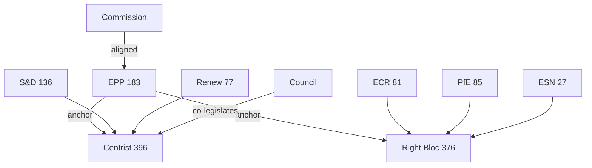

# Stakeholder Map — EU Parliament Propositions

## Date: 2026-05-18 | ArticleType: propositions | DataMode: degraded-feeds

**SAT applied: Stakeholder Mapping, ACH (Analysis of Competing Hypotheses)**
**Confidence: 🟡 MEDIUM** — based on EP10 institutional knowledge and political landscape data [A1]

---

## 1. Primary Stakeholders (Direct Legislative Actors)

### 1.1 European Parliament Political Groups

**EPP — European People's Party (183 seats, 25.52%)**
*Position on propositions*: EPP is the agenda-setter for EP10. Its priorities define which propositions advance.
- **Defence**: Strongly pro-EDIP, pro-ReArm Europe; willing to stretch Treaty interpretation
- **Clean Industrial Deal**: Supportive with carve-outs for energy-intensive industries; key amendment broker
- **Omnibus Simplification**: Driving force; Manfred Weber (EPP leader) publicly championed CSRD rollback
- **Migration**: Hardline on enforcement; willing to use legislative process to extend Pact
- **Green Deal**: Supporting continuation but at reduced pace; contested internally (Western vs. Eastern EPP)
- **Coalition behaviour**: Seeks flexible majorities — uses ECR on social/migration/industrial, S&D on climate/social, Renew on digital/economic
- *Key MEPs*: Manfred Weber (EP Group Chair), Roberta Metsola (EP President, EPP), rapporteurs for ITRE/ECON priority files
- **Admiralty grade on interests**: A2

**S&D — Progressive Alliance of Socialists and Democrats (136 seats, 18.97%)**
*Position on propositions*: Critical support provider for EPP-led legislation; uses leverage to extract social concessions.
- **Clean Industrial Deal**: Supportive if "just transition" provisions strong; key ally for EPP on this
- **Omnibus Simplification**: Deeply sceptical; formal opposition unless significant changes; red lines on CSRD scope
- **EDIP**: Supportive on defence industrial jobs but wants worker representation in defence contracts
- **Platform Work Directive**: Priority legislation; expects EPP cooperation in exchange for coalition support
- **AI Act**: Supportive of strong liability provisions; wants worker AI protections
- **Coalition behaviour**: Swing vote on right-conservative vs. progressive majorities; extracts concessions on labour, social rights, and environment for each coalition agreement
- *Key MEPs*: Iratxe García Pérez (S&D Chair), Jens Geier (economic affairs), Rapporteur figures for EMPL/SOCI files
- **Admiralty grade on interests**: A2

**PfE — Patriots for Europe (85 seats, 11.85%)**
*Position on propositions*: National sovereignty lens; EU legislative activism viewed with suspicion.
- **Defence**: Strongly supportive of national defence spending; sceptical of EU-level procurement (undermines national champions)
- **Migration**: Pro-enforcement, anti-legal migration; supports national opt-outs
- **Omnibus Simplification**: Supportive — reduces "Brussels bureaucracy" narrative
- **Clean Industrial Deal**: Conditional — supports industrial policy but opposes carbon regulation compliance burdens
- **Formal agreements**: No formal coalition agreement; case-by-case; creates EPP dependency on PfE votes on conservative issues
- *Key MEPs*: Viktor Orbán-aligned Hungarian delegation, Marine Le Pen-linked French delegation, Austrian FPÖ
- **Admiralty grade on interests**: A2

**ECR — European Conservatives and Reformists (81 seats, 11.30%)**
*Position on propositions*: Conservative reformist; more EU-constructive than PfE on economic legislation.
- **Defence**: Strongly pro-defence; key votes for EPP on EDIP
- **Migration**: Anti-immigration enforcement; key ally for EPP right coalition
- **Omnibus Simplification**: Strongly supportive; has been pushing this agenda since 2023
- **Green Deal rollback**: Agenda item — seeks further deregulation beyond Omnibus Simplification
- **Rule of law**: Defensive on conditionality (Poland's PiS-aligned MEPs; though PiS has changed since 2023)
- *Key MEPs*: Nicola Procaccini (ECR Co-Chair), Raffaele Fitto (Commission VP, ECR-linked)
- **Admiralty grade on interests**: A2

**Renew Europe (77 seats, 10.74%)**
*Position on propositions*: Pro-EU, pro-market; bridge builder between EPP centre and progressive groups.
- **Digital legislation**: Strong supporter and shaper (Macron-aligned; French digital policy influence)
- **AI Act**: Key champion; Renew MEPs were lead rapporteurs in EP9
- **Capital Markets Union**: Strong supporter; key ally for EPP-led financial integration legislation
- **Clean Industrial Deal**: Supportive but wants market mechanisms over state aid
- **Defence**: Supportive but concerned about NATO coherence and transatlantic dimension
- **Coalition behaviour**: Formally EPP-aligned in EP10 leadership deals; increasingly at odds on Green Deal rollback
- *Key MEPs*: Valérie Hayer (Renew Chair), Sophie in 't Veld (civil liberties), various ECON leads
- **Admiralty grade on interests**: A2

**Greens/EFA (53 seats, 7.39%)**
*Position on propositions*: Environmental and social progressive; opposition on key 2026 propositions.
- **Green Deal defence**: Primary advocate for maintaining ambition; opposes CSRD rollback
- **Nature and soil legislation**: Lead committee rapporteurs; facing uphill battle against EPP+ECR
- **Defence**: Deeply ambivalent; supports Ukraine-related measures but opposes militarisation narrative
- **Coalition behaviour**: Increasingly oppositional; lost leverage when no longer needed for EPP+S&D+Renew majority
- *Key MEPs*: Terry Reintke (Greens Co-Chair), Philippe Lamberts (economic affairs), various ENVI leads
- **Admiralty grade on interests**: A2

**The Left / GUE-NGL (45 seats, 6.28%)**
*Position on propositions*: Anti-austerity, anti-militarisation; opposition coalition for progressive issues.
- **Strongly oppose**: EDIP, Omnibus Simplification, migration enforcement
- **Strongly support**: Platform Work Directive, minimum wage, AI liability for workers
- **Coalition behaviour**: Votes with S&D/Greens on social issues; isolated on defence/security
- *Key MEPs*: Manon Aubry, Martin Schirdewan (The Left Co-Chairs)
- **Admiralty grade on interests**: A2

**ESN — Europe of Sovereign Nations (27 seats, 3.77%)**
*Position on propositions*: Extreme right; national sovereignty maximum.
- **Migration**: Most restrictive position; supports any enforcement legislation
- **Defence**: Supports national defence but sceptical of EU command structures
- **EU institutions**: Generally hostile to EU legislative expansion
- **Coalition behaviour**: Unreliable; formally outside governing coalitions but provides votes to EPP on conservative legislative packages
- *Key MEPs*: AfD-linked German delegation, Fratelli d'Italia splinter, various Eastern European nationalists
- **Admiralty grade on interests**: B2

**Non-Attached (30 seats, 4.18%)**
- Mixed group; some Fidesz-linked, some far-right splinters not admitted to groups
- Unpredictable voting; can swing close votes

---

## 2. Secondary Stakeholders (Institutional)

### 2.1 European Commission

The Commission is the *exclusive right of initiative* for legislative proposals. All propositions entering the EP pipeline originate with (or receive Commission backing for) a formal proposal.

**Commission priorities 2025–2026** (Admiralty B2):
- **Clean Industrial Deal**: Commission President's flagship programme
- **European Defence Industrial Strategy**: Response to geopolitical context
- **Omnibus Simplification**: Commission-initiated; paradoxically rolling back its own earlier proposals
- **AI Act implementation**: Regulatory cascade from AI Office
- **Housing/Affordability**: New social agenda item

**Institutional tension**: The Commission under von der Leyen II has increasingly used "policy without legislation" (communications, recommendations, implementing acts) to avoid lengthy legislative battles. The EP resists this tendency — insisting on co-legislative involvement. This tension affects the volume and type of propositions.

### 2.2 Council of the EU (Member States)

The Council's positions determine whether EP propositions result in adopted law or are blocked in trilogue:
- **Qualified majority topics** (most internal market legislation): Council generally constructive; faster progression
- **Unanimity topics** (defence CFSP aspects, tax): Council often blocks; EP has limited leverage
- **Polish Presidency (H1 2026)**: Poland holds Council Presidency through June 2026. Polish priorities: migration/security, defence, enlargement. Less emphasis on Green Deal.
- **Danish Presidency (H2 2026)**: Denmark takes over July 2026. More market-liberal; expected to push Capital Markets Union, digital, energy efficiency propositions.

### 2.3 European Central Bank

The ECB does not have a direct legislative role but its positions affect:
- Financial stability legislation (banking union completion, CMDI — Crisis Management Directive)
- Digital euro (MiCA follow-on, CBDC regulation — ECB provides advice to EP)
- Monetary transmission implications of fiscal integration proposals

### 2.4 EU Agencies and Bodies

Key agencies whose mandates generate legislative follow-on:
- **ENISA** (EU Cybersecurity Agency): NIS2 implementation triggers, certification schemes
- **AI Office**: GPAI codes, AI Act implementing acts
- **ESMA** (Securities Markets Authority): Capital Markets Union implementing regulations
- **Frontex**: Border management — annual budget fight and mandate extension
- **EDA** (European Defence Agency): EDIP technical specifications, interoperability standards

---

## 3. Tertiary Stakeholders (Non-Institutional Influencers)

### 3.1 Industry Associations and Lobbies

**BusinessEurope / CEEP** (employer organisations):
- Primary advocates for Omnibus Simplification; CSRD rollback lobbying credited with influencing Commission proposal
- Interests: reduce compliance costs, maintain EU industrial competitiveness

**European Round Table for Industry (ERT)**:
- CEOs of major European multinationals; Draghi Report intellectual framework
- Interests: EU investment, single market deepening, skills

**European Trade Union Confederation (ETUC)**:
- Primary opponent of CSRD rollback, advocate for Platform Work Directive
- Close to S&D; influences EP left coalition
- Interests: worker representation in AI governance, just transition, wage floors

**Defence industry** (Airbus, Thales, Leonardo, Rheinmetall, Saab):
- Intensive lobbying on EDIP; want "buy European" preferences, joint R&D funding
- Interests: Open procurement framework vs. national champions — internal tension

**Tech industry** (Google, Meta, Alphabet; plus EU tech SMEs):
- AI Act implementation: wanting clarity, predictability, sandbox access
- DSA/DMA: Managing compliance obligations; seeking interpretive guidance through implementing acts

**Energy companies** (utility companies, gas sector, renewables):
- Clean Industrial Deal energy pricing provisions
- ETS2 design details (road transport, buildings)
- Hydrogen economy — electrolyser investments seeking government support

### 3.2 Civil Society

**Climate action networks** (WWF, ClientEarth, CAN):
- Opposing CSRD rollback, taxonomy revision, Green Deal slowdown
- Filing legal challenges; EP monitoring function support

**Human rights organisations** (Amnesty International, Human Rights Watch):
- Migration Pact implementation monitoring; opposing rights violations
- AI Act: pushing for biometric surveillance bans

**Transparency organisations** (Transparency International EU, Corporate Europe Observatory):
- Lobbying disclosure in legislative process
- Rule of law conditionality monitoring

### 3.3 Member State Governments (Key Influencers)

**Germany** (coalition government): Economy-focused; supportive of competitiveness agenda; climate ambition has moderated.

**France** (Macron government): Drives European sovereignty narrative; defence industry champion; Renew link gives direct EP influence.

**Poland** (Council Presidency H1 2026): Security/defence priority; enlargement; migration enforcement. Less Green Deal.

**Italy** (Meloni government, ECR-linked): Competitiveness, migration, Mediterranean energy.

**Hungary** (Orbán, PfE-linked): Rule of law resister; leverage on unanimity votes.

---

## 4. Stakeholder Coalition Matrix — Key Propositions

### 4.1 European Defence Industrial Programme (EDIP)

| Group | Position | Rationale |
|-------|---------|-----------|
| EPP | 🟢 Strong Support | Industrial employment + security narrative |
| S&D | 🟡 Conditional Support | Jobs in defence sector; wants worker rights clauses |
| ECR | 🟢 Strong Support | National security priority |
| PfE | 🟡 Mixed | Supports defence spending; sceptical of EU central procurement |
| Renew | 🟢 Support | Transatlantic dimension; French Macron support |
| Greens | 🔴 Opposition | Militarisation; opportunity cost vs. climate investment |
| The Left | 🔴 Strong Opposition | Pacifism; arms industry critique |
| ESN | 🟡 Conditional | National defence yes; EU command no |

**Expected outcome**: Strong majority (EPP+ECR+S&D+Renew = 477 votes) — passage probable

### 4.2 Omnibus Simplification Package (CSRD/CSDDD)

| Group | Position | Rationale |
|-------|---------|-----------|
| EPP | 🟢 Strong Support | Business constituency; competitiveness |
| S&D | 🔴 Strong Opposition | Corporate accountability; labour rights; investor red lines |
| ECR | 🟢 Strong Support | Deregulation mandate |
| PfE | 🟢 Strong Support | Reduces "Brussels burden" |
| Renew | 🟡 Mixed | Market-friendly but ESG investor community concerns |
| Greens | 🔴 Strong Opposition | Rollback of climate transparency |
| The Left | 🔴 Strong Opposition | Worker/environmental rights |
| ESN | 🟢 Support | Deregulation |

**Expected outcome**: Depends on Renew and S&D amendments. If EPP+ECR+PfE+ESN = 376 — narrow right majority. If Renew splits and some S&D industrial MEPs cross, could reach 380+. Uncertain outcome.

### 4.3 AI Act GPAI Codes of Practice

| Group | Position | Rationale |
|-------|---------|-----------|
| EPP | 🟡 Conditional | Industry-friendly implementation; avoid overregulation |
| S&D | 🟡 Conditional | Wants worker protections included |
| ECR | 🟡 Sceptical | Regulatory burden concerns; but supports security applications |
| PfE | 🔴 Sceptical | National control over AI governance |
| Renew | 🟢 Strong Support | EU AI policy champion |
| Greens | 🟢 Support | Transparency and liability provisions |
| The Left | 🟡 Mixed | Worker rights and surveillance concerns |
| ESN | 🔴 Opposition | Sovereignty concerns |

**Expected outcome**: Broad majority (EPP+S&D+Renew+Greens = ~469) likely if industry liability provisions balanced

---

## 5. ACH Analysis — Hypothesis Testing on Propositions Advancement

**Hypothesis A**: *The EPP-ECR-PfE right coalition will advance the most propositions in 2026.*
- Supporting evidence: Right bloc has 376 votes — narrowly above majority; Polish Presidency (H1) aligned; Omnibus Simplification momentum
- Against evidence: ESN unreliability; 376 < 360+margin needed for stable passage; PfE national-champion tensions on EDIP
- **Assessment**: Partially true — on some propositions (migration, Omnibus), but grand centrist coalition needed for most major legislation
- WEP: 45-B (about even odds) 🟡

**Hypothesis B**: *The grand centrist coalition (EPP+S&D+Renew) will remain the primary legislative engine.*
- Supporting evidence: 396 seats; EP institutional precedent; needed for Green Deal, AI, financial legislation
- Against evidence: S&D opposition to Omnibus; Renew strains on Green Deal rollback
- **Assessment**: True for most major propositions; contested on simplification/social legislation
- WEP: 60-B (more likely than not) 🟡

**Hypothesis C**: *Defence propositions will be the most successful legislative category in 2026.*
- Supporting evidence: Near-unanimous political will across EPP+S&D+ECR+Renew; geopolitical urgency; industrial employment
- Against evidence: Treaty constraints on EU defence spending (Art. 41 TEU); Greens/Left opposition
- **Assessment**: High probability of adoption — Treaty work-arounds through Art. 173 (industrial policy)
- WEP: 75-B (likely) 🟢
