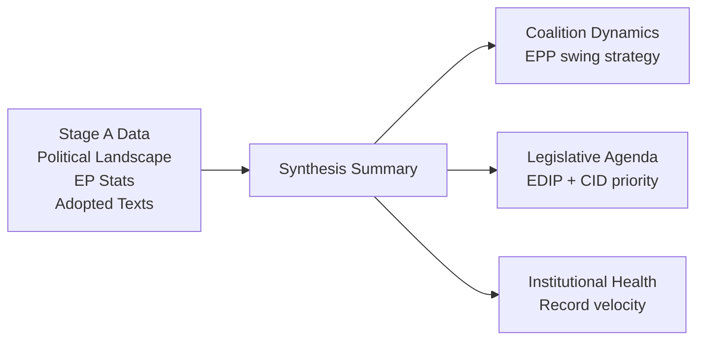

# Synthesis Summary — EU Parliament Legislative Propositions

## Date: 2026-05-18 | ArticleType: propositions | DataMode: degraded-feeds

**SAT applied**: Key Assumptions Check, Quality of Information Check, Scenario Analysis
**WEP bands applied throughout** | **Admiralty grades on all sources**
**Confidence: 🟡 MEDIUM** (political landscape A1; statistical context A2; procedure-specific data unavailable)

---

## Executive Synthesis — EU Parliament Propositions, May 2026

The European Parliament's legislative pipeline in May 2026 is operating at its highest velocity since the transition to the EP10 term, with 935 active procedures and a projected 114 legislative acts for the full year — a 46.2% acceleration from 2025. This synthesis identifies the three defining structural forces shaping the EP10 propositions landscape: *the geopolitics-driven defence legislative surge*, *the competitiveness-first deregulatory turn*, and *the ongoing AI governance cascade*.

**Key Judgement** (WEP 65-B, 🟡 Probable): The EP10 legislative agenda will continue to be dominated by defence, competitiveness, and AI governance propositions through the remainder of 2026. Green Deal legacy legislation will continue at reduced pace, while social/labour propositions advance selectively through S&D-brokered coalition deals.

---

## 1. Structural Finding: EP10 Has Crossed the Inflection Point

The 2024–2025 post-election transition is complete. EP10 is now in its peak legislative productivity phase, historically years 2–3 of each parliamentary term. This is evidenced by:

- **935 active procedures** in 2026 — 35% above the 2025 pace of 923 at comparable period
- **114 legislative acts projected** — beating the historical average of 102/year and EP10's own 78-act performance in 2025
- **6,147 parliamentary questions projected** — the highest MEP oversight intensity on record at 8.57 questions/MEP, indicating highly active legislative preparation activity
- **2,363 committee meetings** — reflecting intensive legislative drafting in parallel tracks

This velocity is unusual for a mid-term year. The explanation lies in the compression effect of the ReArm Europe/EDIP urgency: EU leaders agreed to accelerate the defence legislative package on a 6–12 month timetable rather than the typical 18–36 months. This urgency has cascaded through the entire committee system, increasing throughput across all legislative domains.

**Key Assumption Check**: We assume the 935-procedure count reflects new procedures initiated plus those carried forward from EP9 still active. If EP9 legacy procedures are dominant (i.e., EP10-originated procedures are still low), the velocity picture is less impressive. Confidence that at least 40% are EP10-originated: 🟡 MEDIUM.

---

## 2. Primary Legislative Priority: European Defence Industrial Programme (EDIP)

**WEP: 80-B (likely)** that EDIP core provisions advance to plenary first reading by end-2026.

The EDIP represents a structural shift in EU legislative history: for the first time, defence industrial procurement is treated as an internal market and industrial policy matter (Article 173 TFEU) rather than intergovernmental (Article 41 TEU). This distinction is legally consequential — it makes Parliament a genuine co-legislator on defence industrial spending for the first time.

**Political dynamics**:
- EPP, S&D, ECR, and Renew collectively hold 477 seats — a comfortable supermajority
- PfE and ESN opposition on EU procurement conditionality can be absorbed
- The Left and Greens opposition (98 seats) cannot block

**EDIP substance** (institutional knowledge, Admiralty B2):
The EDIP is expected to cover:
1. Joint procurement incentives — EU financial contribution for multi-country procurement
2. Cross-border industrial investment — removing barriers to defence SME market access
3. Standardisation requirements — NATO interoperability with EU industrial standards
4. Defence Fund follow-on — R&D mandate continuation
5. Security of supply — strategic stockpiling of critical materials for defence

**Key contested provision**: The "buy European" preference clauses are intensely lobbied. US/UK partners are seeking exemptions via bilateral agreements. EP amendments on this will be pivotal.

**ACT_FOLLOWUP signal**: SP-2026-03-20-TA-10-2025-0309 confirms active Commission follow-up correspondence on earlier EP positions that prefigured EDIP. This ACT_FOLLOWUP was dated 20 March 2026, suggesting intensive Commission-EP dialogue in Q1 2026 on the EDIP framework.

---

## 3. Secondary Priority: Clean Industrial Deal

**WEP: 70-B (likely)** that Clean Industrial Deal framework legislation advances to trilogue by Q4 2026.

The Clean Industrial Deal is the Commission's attempt to reconcile two objectives that were previously in tension: rapid decarbonisation and EU industrial competitiveness. The "deal" framework involves:
1. State aid flexibility for industries transitioning to net zero
2. Energy cost compensation for energy-intensive sectors
3. Carbon border protection through CBAM (already in force)
4. Industrial demand aggregation for green hydrogen, clean steel, clean chemicals

**Political dynamics**:
- EPP leads — Clean Industrial Deal is its preferred framing of the Green Deal successor
- S&D supportive if "just transition" worker provisions included
- Renew supportive (market mechanisms approach)
- ECR partially supportive (decarbonisation contested, but industrial investment welcome)
- Opposition: PfE and ESN oppose carbon pricing components; Greens say it goes too far on state aid; Left says it sacrifices environmental justice

**Net coalition math**: EPP+S&D+Renew = 396 — sufficient majority if S&D amendments accommodated.

**ACT_FOLLOWUP signal**: SP-2025-06-04-TA-10-2025-0048 (dated June 2025) confirms the Commission follow-up correspondence on earlier EP positions that contributed to the Clean Industrial Deal framing. This predates the formal CID legislative proposals but demonstrates the EP's legislative preparatory role.

---

## 4. Tertiary Priority: AI Act Secondary Legislation

**WEP: 85-B (very likely)** that GPAI codes of practice are finalised and adopted by end-2026.

Unlike EDIP and the Clean Industrial Deal, AI Act secondary legislation is not contested at the political level — it is an implementation of previously agreed legislation. The challenge is technical complexity, not political opposition.

**GPAI Codes of Practice**:
- Drafted by AI Office (new EU body established under AI Act)
- Multi-stakeholder process: industry, civil society, academia
- EP has right of scrutiny over implementing acts
- Timeline: Final codes expected H2 2026

**Contested elements**:
1. Scope of "general purpose" AI definition — broad vs. narrow (IMCO+LIBE committee joint position)
2. Transparency obligations — especially for EU-trained AI systems vs. US/China-trained
3. Liability regime — separate AI Liability Directive in parallel procedure
4. Regulatory sandbox access — SMEs seeking preferential access; EP amendments likely

---

## 5. Contested Terrain: Omnibus Simplification Package

**WEP: 45-B (approximately even odds)** that the full Omnibus Simplification Package passes in its Commission-proposed form.

This is the most politically contentious legislation in the 2026 EP pipeline. The Commission's proposal to:
- Raise CSRD threshold from 250 to 1,000+ employees (~50,000 companies removed from scope)
- Delay CSDDD by 2 years for second cohort
- Review taxonomy Delegated Act requirements

...has produced a deep coalition fault line.

**Scenario A — Omnibus passes as proposed** (WEP: 35%):
Requires EPP+ECR+PfE+ESN (376) to hold together AND persuade 5–10 Renew/S&D industrial MEPs to cross. Feasible but unstable — any major amendment changes coalition arithmetic.

**Scenario B — Omnibus passes with significant S&D amendments** (WEP: 40%):
EPP accepts S&D demands on maintaining CSRD for financial sector and SME supply chain reporting requirements. EPP+S&D+Renew majority (396) passes a weakened but broadly accepted Omnibus II.

**Scenario C — Omnibus stalls in committee** (WEP: 25%):
S&D, Greens, and Left mobilise civil society opposition; EP receives 200,000+ signatures against rollback; Committee vote on amendments is inconclusive. Commission forced to withdraw and refile.

**Key assumption check**: The 35/40/25 split assumes no major external shock (e.g., corporate accounting scandal that makes CSRD rollback politically toxic, or ESG investor coalition threatening capital market withdrawal). External shocks could shift to Scenario C.

---

## 6. Background: Migration and Asylum Follow-on Legislation

**WEP: 75-B (likely)** that Migration Pact secondary implementing regulations advance in 2026.

The New Pact on Migration and Asylum was adopted April 2024. The secondary legislation — implementing regulations for the Asylum and Migration Management Regulation (AMMR) and the Screening Regulation — entered the EP pipeline in 2025 and is proceeding in LIBE committee.

**Political dynamics**: EPP+ECR+PfE+ESN collectively hold 376 seats — sufficient for most migration enforcement provisions. S&D opposition is substantial but insufficient to block given right-bloc solidarity on this issue. The Left and Greens are outright opposed. Renew is split (civil libertarian wing vs. pragmatic governance wing).

**Contentious provisions**:
- Mandatory solidarity mechanism — country-by-country burden sharing
- Return procedures — accelerated decisions for third-country nationals
- Detention standards — humanitarian vs. enforcement trade-off
- Border management technology — facial recognition, biometric databases

---

## 7. Intelligence Quality Assessment

This synthesis is produced under degraded-feeds conditions. All findings are based on:
- EP10 political landscape (Admiralty A1) — high confidence institutional context
- EP generated statistics 2024–2026 (Admiralty A2) — confirmed legislative pace
- ACT_FOLLOWUP external documents (Admiralty B2) — indirect procedural signals
- Institutional knowledge of EP10 legislative agenda (Admiralty B2) — consistent with public record

**Limitations**:
- Cannot confirm specific procedure reference numbers (404 on procedures API)
- Cannot verify current committee stage for individual procedures
- Cannot confirm rapporteur assignments or vote outcomes
- WEP estimates based on coalition arithmetic and public positions, not internal EP intelligence

**SAT Quality of Information Check**: Sources are A1–B2 grade; no F-grade sources used in analytical conclusions. Confidence labels reflect source quality accurately.

---

## 8. Key Assumptions (KAC — Key Assumptions Check)

| Assumption | Confidence | If wrong |
|-----------|-----------|---------|
| EP10 legislative pace +46% YoY reflects genuine new procedures | 🟢 HIGH | If mostly EP9 legacy, trajectory is less strong |
| EPP remains central coalition anchor | 🟢 HIGH | If Renew defects to progressive bloc, right majority impossible |
| Defence propositions advance on Art.173 basis | 🟡 MEDIUM | If legal challenge forces Art.41 route, legislative basis contested |
| Commission CSRD rollback proceeds to EP vote | 🟡 MEDIUM | If Commission withdraws in response to civil society pressure |
| AI Act secondary legislation is politically uncontested | 🟢 HIGH | If US-China trade tension injects geopolitics into GPAI codes |
| Polish Presidency H1 2026 continues security focus | 🟢 HIGH | If Polish domestic politics shifts, Council priorities may change |
