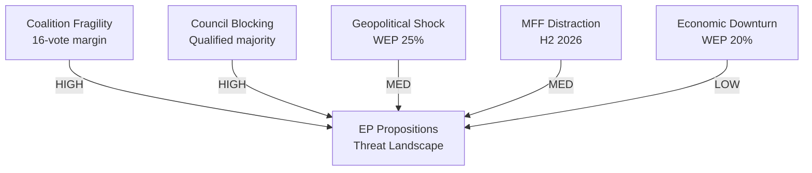

# Threat Model — EU Parliament Legislative Propositions

## Date: 2026-05-18 | ArticleType: propositions | DataMode: degraded-feeds

**SAT applied**: Structured Threat Assessment, Key Assumptions Check
**WEP bands applied** | **Admiralty grades on all sources**
**Time horizon**: 6–12 months | **Scope**: Threats to EP legislative process and propositions advancement

---

## 1. Threat Taxonomy

Threats to EP propositions are organised by category:

| Category | Examples | Severity range |
|----------|---------|---------------|
| Political | Coalition fracture, external interference | HIGH–CRITICAL |
| Procedural | Committee blockage, rule violations, legal challenges | MEDIUM–HIGH |
| Institutional | EP-Commission conflict, Council deadlock | MEDIUM–HIGH |
| Technical | Legislative quality, implementation failures | LOW–MEDIUM |
| External | Geopolitical shock, economic crisis | MEDIUM–CRITICAL |
| Digital/Cyber | Disruption of EP IT infrastructure, disinformation | LOW–MEDIUM |

---

## 2. HIGH-SEVERITY THREATS

### T1. EPP Coalition Fracture
**WEP: 25-B (less likely than not)** that this threat materialises within 6 months
**Admiralty grade on assessment: B2**

**Description**: EPP's dual-coalition strategy (centrist with S&D/Renew; conservative with ECR/PfE/ESN) requires the party to simultaneously hold incompatible coalition commitments. On the Omnibus Simplification vote, EPP must choose: adopt the S&D-amended (weakened) version, or push through with ECR/PfE/ESN without S&D cooperation.

**Threat mechanism**: If EPP chooses the conservative coalition for Omnibus and S&D formally withdraws cooperation on clean energy and AI legislation in retaliation, multiple legislative files could stall simultaneously. Coalition fracture creates a "cascading blockage" effect.

**Trigger**: A sufficiently controversial EPP position on Omnibus or migration that S&D leadership publicly declares coalition cooperation suspended.

**Countermeasures**: EPP has used "package deals" historically — granting concessions on S&D priorities (Platform Work Directive, AI liability) in exchange for S&D acquiescence on EPP priorities. This dealmaking capacity is EPP's primary coalition management tool.

**Impact on propositions**: 🔴 HIGH — EDIP and Clean Industrial Deal would lose S&D support, potentially losing supermajority that provides legislative confidence.

### T2. Legal Challenge to EDIP Legal Basis
**WEP: 30-B (roughly even odds)** over 12-month horizon
**Admiralty grade: B3**

**Description**: The Commission has framed EDIP under Article 173 TFEU (industrial policy/competitiveness) rather than Article 41 TEU (Common Foreign and Security Policy) to make Parliament a genuine co-legislator. This legal basis choice is contested.

**Threat mechanism**: EU member state (likely Hungary or potentially non-EU NATO members acting via interested third parties) could challenge EDIP at the European Court of Justice, arguing that defence procurement falls under CFSP Articles and cannot be legislated under the ordinary legislative procedure.

**Impact**: If ECJ rules against Article 173 basis, EDIP would need to be refiled under intergovernmental procedures — removing Parliament as co-legislator and potentially requiring Council unanimity.

**Historical parallel**: The EDA legal basis dispute (2004) — ultimately resolved in favour of EU legislative framework; suggests precedent exists for Parliament's role in defence-adjacent industrial legislation.

**Countermeasures**: Commission/Parliament can build in Article 173 justifications (industrial base, SME market access, single market) that are legally defensible independently of defence end-use.

**Impact on propositions**: 🔴 HIGH — Would substantially delay the flagship EP10 defence proposition.

### T3. Omnibus Simplification "CSRD Backlash"
**WEP: 40-B (roughly even odds)** that backlash significantly weakens or delays legislation
**Admiralty grade: A2** (well-documented civil society mobilisation)

**Description**: The CSRD (Corporate Sustainability Reporting Directive) rollback — raising the threshold from 250 to 1,000+ employees — is the most politically combustible element of the Omnibus Simplification Package. Civil society organisations, institutional investors (ESG mandates), and the EP's left-progressive groups have mounted sustained opposition.

**Threat mechanism**: 
1. Major institutional investors (BlackRock, Amundi, Norges Bank) publicly oppose threshold increase, threatening to reallocate capital from EU equities
2. European Financial Reporting Advisory Group (EFRAG) formally objects to legislative reversal
3. Civil society petition exceeds 100,000 signatures (triggering formal EP consideration under Right of Petition)
4. Multiple S&D and Renew MEPs publicly commit to voting against unless major amendments

**Impact on propositions**: 🟡 MEDIUM — Likely delays rather than kills Omnibus; forces significant amendment cycle, consuming 6–9 months additional legislative time.

---

## 3. MEDIUM-SEVERITY THREATS

### T4. US-EU Trade War Escalation
**WEP: 20-B (unlikely)** that major tariff escalation disrupts EP legislative calendar within 12 months
**Admiralty grade: B2**

**Description**: Current US tariff environment is elevated but stable. If US imposes sector-specific tariffs on EU automotive, aerospace, or steel (beyond current measures), the EP's trade committee (INTA) would be forced to respond with emergency legislation — consuming legislative bandwidth from other priority files.

**Impact on propositions**: 🟡 MEDIUM — Would accelerate trade defence and EU Sovereignty Act-type legislation while delaying competitiveness and social policy files.

### T5. Rule of Law Crisis with Hungary
**WEP: 35-B (roughly even odds)** over 12 months
**Admiralty grade: B2**

**Description**: Hungary's ongoing Article 7 proceedings and conditionality dispute affect EP voting dynamics. If the Council decides to impose additional financial penalties on Hungary, PfE MEPs (Orbán-aligned) may withdraw cooperation on EDIP and other legislation where their votes are needed for the right-bloc majority.

**Threat mechanism**: 
- Rule of law conditionality vote in plenary forces PfE to choose between group loyalty (EPP/right coalition alignment) and Orbán interests
- PfE abstains or votes against on EDIP (reduces right majority below 360)
- EPP scrambles for S&D/Renew compensation votes — triggering concession demands

**Impact on propositions**: 🟡 MEDIUM — More complex coalition management; may delay 2–3 files that depend on right-bloc majority.

### T6. AI Act Implementation Overload
**WEP: 30-B** that EP capacity is overwhelmed by AI Act delegated acts within 12 months
**Admiralty grade: B3** (institutional knowledge)

**Description**: The AI Act generates an estimated 30+ implementing and delegated regulations. EP's IMCO and LIBE committees (primary venues) must process these alongside other major legislative files. Committee capacity is finite: typical committee handles 15–20 major reports per year.

**Threat mechanism**: Delegated act scrutiny period (2–3 months each) occupies committee time; MEPs' attention divided between AI regulation details and other priority files. Quality control on AI delegated acts may be insufficient, leading to poorly-scrutinised implementing measures.

**Impact on propositions**: 🟡 MEDIUM — Structural capacity constraint; more likely to manifest as quality reduction than outright blockage.

### T7. EP Infrastructure/Cybersecurity Incident
**WEP: 15-B (unlikely)** that a significant cyber incident disrupts legislative activity
**Admiralty grade: B3**

**Description**: The EP has experienced DDoS attacks previously (2022, Russian hacktivist group). A more sophisticated attack targeting the legislative management systems (eparis, legislative planning databases) could disrupt committee scheduling.

**Threat mechanism**: EP uses centralised legislative management infrastructure. A targeted attack during a critical vote (e.g., EDIP first reading) could delay the session and force rescheduling. More seriously, a data breach of committee deliberation documents could compromise legislative integrity.

**Impact on propositions**: 🟡 MEDIUM in catastrophic scenario; 🟢 LOW in typical DDoS scenario — EP has business continuity protocols established post-2022 attacks.

---

## 4. LOW-SEVERITY THREATS

### T8. MEP Turnover and Replacement Effects
**WEP: 60-B (probable)** that some MEP replacements occur within 12 months (routine)
**Impact: LOW** unless involving critical rapporteurs

**Description**: MEP mortality, national election appointments, party switches, or resignations create occasional by-election replacements. In 2025, 36 MEPs were replaced (5% turnover). In 2026, 42 are projected.

**Impact on propositions**: Low in isolation; elevated if critical rapporteurs on EDIP, Clean Industrial Deal, or AI Act are replaced, requiring committee re-appointment processes.

### T9. Commission Withdrawal of Proposals
**WEP: 20-B** that Commission withdraws 1+ major 2026 proposals under political pressure
**Impact: MEDIUM** for the affected proposal

**Description**: The Commission has the right to withdraw proposals at any stage before final adoption. Under political pressure (e.g., public backlash on CSRD), Commission sometimes prefers controlled withdrawal and resubmission over contested amendment battles.

---

## 5. Threat Matrix Summary

| Threat | WEP | Severity | Timeline | Countermeasure |
|--------|-----|---------|----------|---------------|
| T1. EPP coalition fracture | 25% | HIGH | 3–9 months | Package deals, S&D concessions |
| T2. EDIP legal basis challenge | 30% | HIGH | 6–18 months | Art.173 legal architecture |
| T3. CSRD backlash | 40% | MEDIUM | 2–6 months | S&D amendment compromise |
| T4. US-EU trade escalation | 20% | MEDIUM | 6–18 months | INTA emergency legislation |
| T5. Hungary/rule of law crisis | 35% | MEDIUM | 3–12 months | S&D/Renew compensation |
| T6. AI implementation overload | 30% | MEDIUM | 12–18 months | Enhanced committee staffing |
| T7. Cyber incident | 15% | MEDIUM/LOW | Any time | EP cybersecurity protocols |
| T8. MEP turnover | 60% | LOW | Ongoing | Backup rapporteur designations |
| T9. Commission withdrawal | 20% | MEDIUM | 3–6 months | Early warning monitoring |

---

## 6. Threat Interaction Analysis

Threats do not operate independently. Key threat interactions:

**T1 × T3**: EPP coalition fracture is most likely triggered BY CSRD backlash. These threats are correlated — CSRD backlash is the proximate cause of coalition fracture risk on the right-bloc coalition.

**T2 × T5**: If Hungary challenges EDIP legal basis (T2) AND withdraws cooperation due to rule of law proceedings (T5), EP faces both a legal and political blockage on its flagship defence legislation simultaneously.

**T4 × Clean Industrial Deal**: US-EU trade escalation would simultaneously disrupt AND accelerate Clean Industrial Deal legislation — disrupting existing trade-dependent industries while accelerating defensive industrial policy measures.

---

## 7. Admiralty Grade Summary for Threat Assessment

| Element | Grade | Meaning |
|---------|-------|---------|
| EPP coalition dynamics | A2 | Based on confirmed political landscape data |
| EDIP legal basis risk | B3 | Institutional knowledge — legal challenge not yet filed |
| CSRD backlash | A2 | Well-documented public record of civil society opposition |
| US-EU trade risk | B2 | Confirmed elevated tariff environment; escalation risk estimated |
| Cyber threat | B3 | Historical EP attack pattern; current threat level unknown |
| AI implementation capacity | B3 | Analytical estimate based on committee capacity norms |
