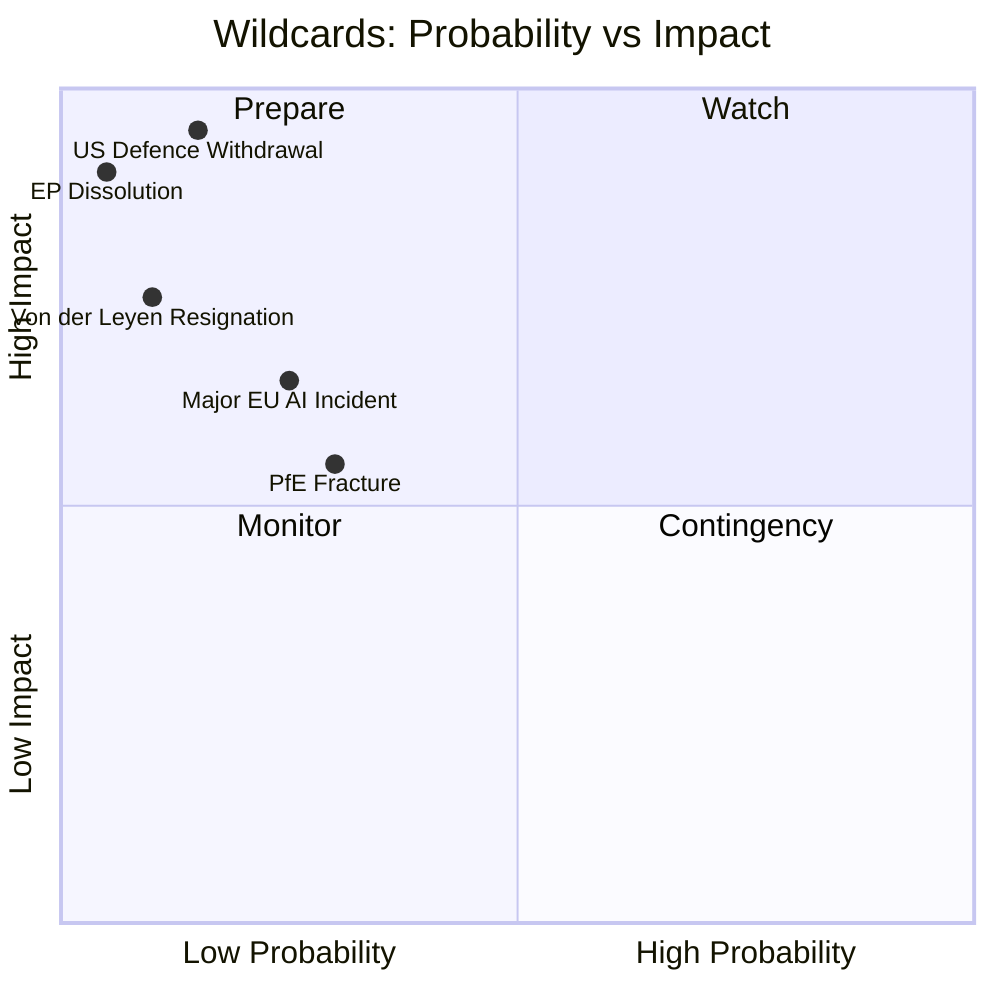

# Wildcards and Black Swans — EU Parliament Propositions

## Date: 2026-05-18 | ArticleType: propositions | DataMode: degraded-feeds

**SAT applied**: Devil's Advocate Analysis, Alternative Futures, Wildcard Analysis
**WEP bands applied** | **Admiralty grade: B3 throughout (speculative but reasoned)**
**Time horizon**: 12–36 months (mid-2026 – mid-2028)

---

## Introduction

This artifact identifies low-probability, high-impact events that could fundamentally alter the EP10 propositions landscape. Wildcards are defined as events with WEP below 15-B but that would generate outsized consequences if they occurred. Black swans are events that appear highly improbable but are not impossible given existing structural tensions.

---

## Wildcard 1 — EU Treaty Revision Triggered by Defence Imperative

**WEP: 8-B (very unlikely within 2 years)**
**Impact if occurred: TRANSFORMATIVE**
**Admiralty grade: C3** (speculative reasoning from structural pressures)

### Description

The EU Treaty (Lisbon Treaty, in force 2009) has not been revised in 17 years. Its provisions on defence (Article 41 TEU — CFSP budget constraint) and taxation (Article 113 TFEU — unanimity) are binding constraints that frustrate the EP10 legislative agenda.

If the ReArm Europe/EDIP legal basis is successfully challenged (see Threat T2 in threat model), the Commission and Council may conclude that only a Treaty revision enabling EU-level defence spending can satisfy the security imperative. The Convention procedure (Article 48 TEU) would then begin.

### Consequences for Propositions

A Treaty revision process (typically 2–4 years) would:
1. **Pause most normal legislation**: Political attention diverted to Convention negotiations
2. **Create legislative opportunity**: New Treaty provisions on defence, taxation, and EU fiscal capacity would unlock a wave of new legislative proposals currently blocked by Treaty constraints
3. **Restructure EP powers**: Convention outcomes could expand (or contract) EP's legislative role in defence, foreign policy, and monetary matters

### Historical parallel

The Maastricht Treaty (1992) — initially focused on monetary union — ultimately expanded EU legislative competence dramatically. A defence-triggered revision could have similar scope-expansion effects.

---

## Wildcard 2 — AI Governance Crisis (Catastrophic Failure of EU-Trained AI System)

**WEP: 10-B (unlikely within 18 months)**
**Impact if occurred: HIGH-DISRUPTIVE**
**Admiralty grade: C3**

### Description

A catastrophic failure of an AI system that is CE-marked under the AI Act (meaning it passed conformity assessment) in a high-risk category (medical, judicial, law enforcement) could trigger immediate political crisis in the EP.

**Scenario trigger**: An AI diagnostic system causes preventable patient deaths in an EU hospital. The system was CE-marked under AI Act Category III high-risk provisions. An inquiry finds that the conformity assessment was inadequate.

### Consequences for Propositions

Immediate legislative responses would include:
1. **Suspension of AI Act conformity assessment procedures**: Emergency resolution (RSP) within days
2. **AI Liability Directive fast-tracked**: Currently in trilogue — would be accelerated with significantly expanded liability provisions
3. **AI Office mandate expansion**: Emergency regulation expanding AI Office's supervisory capacity
4. **GPAI codes of practice**: Significantly strengthened; timeline accelerated
5. **Delegated acts under Article 73 AI Act**: Commission empowered to add new prohibited AI practices via emergency implementing measure

**Broader consequence**: Trust in EU AI regulatory framework fundamentally questioned. Could trigger a US/UK/China regulatory arbitrage — AI companies seeking alternative certifications where EU conformity is seen as inadequate.

---

## Wildcard 3 — EP10 Confidence Vote Against Commission

**WEP: 5-B (very unlikely)**
**Impact if occurred: CRITICAL — entire legislative agenda reset**
**Admiralty grade: C3**

### Description

Article 234 TFEU allows the EP to pass a motion of censure against the Commission (requires 2/3 of votes cast and majority of members = 480 MEPs). If passed, the entire Commission must resign.

**Plausible trigger scenario**: A major corruption scandal involving a Commissioner (post-Qatargate, EP is hypervigilant) combined with a rule of law dispute that radicalises both the left (The Left + Greens = 98 votes) and segments of the right (ECR/ESN).

**Coalition arithmetic for censure**: The Left (45) + Greens (53) + S&D (136) + ECR (81) + some EPP rebels (30+) + some Renew rebels (20+) = potentially 365–380 votes. Possible if EPP rebels emerge over rule of law dispute or Commission corruption.

### Consequences for Propositions

1. **Legislative standstill**: All pending legislation suspended pending new Commission formation (typically 3–6 months)
2. **All rapporteurships reconsidered**: New Commission = new legislative priorities = rapporteur reshuffles
3. **Coalition realignment**: Censure vote creates new majority patterns; legislative alliances rewired
4. **EU institutional credibility crisis**: European Council must nominate new Commission President — potentially contested
5. **MFF negotiations disrupted**: The 2028–2034 MFF preparation process derailed

**This scenario would represent the most disruptive possible outcome for EP10 legislative propositions.**

---

## Wildcard 4 — Russia-Ukraine Armistice Creates Unexpected Defence Dividend

**WEP: 12-B (unlikely within 12 months)**
**Impact if occurred: COMPLEX — some propositions accelerated, others stalled**
**Admiralty grade: B3**

### Description

A ceasefire or armistice in Ukraine (not a peace treaty — those take years) could create unexpected political dynamics for EU defence legislation.

**Scenario**: Russia-Ukraine ceasefire in Q4 2026, brokered by US. EU must decide: maintain defence spending trajectory (Article 5 NATO concerns remain) or channel momentum into reconstruction legislation.

### Consequences for Propositions

**Accelerated if armistice occurs:**
- Ukraine reconstruction fund (major new EU budget instrument expected — similar to MFA+ but much larger)
- EU enlargement legislation (Ukraine/Moldova accession track — Treaty revision implications)
- Sanctions adjustment regulations (export control modifications for reconstruction purposes)

**Stalled/weakened if armistice occurs:**
- EDIP political urgency diminishes (hardest to maintain 476-vote coalition without geopolitical pressure)
- ReArm Europe/SafeGuard Europe political momentum collapses in public opinion
- Defence bond/European borrowing instrument loses its rationale

**Net assessment**: Armistice would DISRUPT the EP10 legislative agenda more than it would help, because the current agenda is substantially built around sustained defence urgency.

---

## Wildcard 5 — Major EU Member State Exit Crisis (Post-Brexit II)

**WEP: 4-B (very unlikely)**
**Impact if occurred: EXISTENTIAL**
**Admiralty grade: C3**

### Description

While the Brexit lesson reduced EU exit risk, it did not eliminate it. A major political crisis in an EU member state that triggers a referendum on EU membership would consume all EU institutional attention.

**Most plausible candidates**: Hungary (Orbán pushing boundaries to the limit), or an unexpected political shift in a founding member state (France if Marine Le Pen wins 2027 presidential election, or Italy if Meloni moves from ECR to explicit EU exit position).

### Consequences for Propositions

1. **Complete institutional paralysis during referendum period** (6–12 months)
2. **EU legal uncertainty**: Which legislation remains valid if member state exits? Transition agreement negotiations would affect EP legislative jurisdiction
3. **Coalition realignment in EP**: PfE and ESN MEPs from the exiting member state removed; changes EP arithmetic for remaining term
4. **Treaty revision forced**: Regardless of referendum outcome, EU institutions would need to address legal uncertainty — generating Treaty revision process

**This wildcard is genuinely extreme and included primarily for completeness — institutional resilience after Brexit makes a second EU exit dramatically less likely.**

---

## Wildcard 6 — AI-Enabled Parliamentary Disinformation Campaign

**WEP: 20-B (unlikely but more plausible than other wildcards)**
**Impact: MEDIUM-HIGH**
**Admiralty grade: B3**

### Description

A sophisticated AI-generated disinformation campaign targeting EU legislative procedures. This is not a hypothetical — the EP has already experienced coordinated influence operations. The black swan element is scale and sophistication.

**Scenario**: State actor (Russia, China, or other hostile government) uses advanced AI to generate a massive disinformation campaign targeting the Omnibus Simplification Package vote. Fabricated MEP statements, false committee vote results, and manufactured controversy about rapporteur conflicts of interest are seeded across EU media ecosystems simultaneously.

### Consequences for Propositions

1. **Immediate**: Plenary vote delayed while EP Quaestor investigates fabricated MEP statements
2. **Medium-term**: Rapporteur credibility questioned; possible rapporteur resignation; committee vote restaged
3. **Structural**: EP forced to implement AI verification systems for legislative communications — generating its own digital governance legislation
4. **AI Act irony**: Disinformation campaign using GPAI systems against EU AI regulation would constitute a direct challenge to the AI Act's societal harm protections

**This is the wildcard with highest current-environment plausibility given documented AI disinformation capabilities of state actors.**

---

## Wildcard Summary Matrix

| Wildcard | WEP | Impact Severity | Legislative effect |
|---------|-----|----------------|-------------------|
| W1. Treaty revision | 8% | TRANSFORMATIVE | Pause + unlock |
| W2. AI governance crisis | 10% | HIGH-DISRUPTIVE | Accelerate AI liability |
| W3. Commission censure | 5% | CRITICAL | Total reset |
| W4. Ukraine armistice | 12% | COMPLEX | EDIP stall, reconstruction surge |
| W5. Member state exit crisis | 4% | EXISTENTIAL | Paralysis |
| W6. AI disinformation campaign | 20% | MEDIUM-HIGH | Vote delays, digital governance legislation |

---

## Key Monitoring Triggers (Devil's Advocate Perspective)

*What would we expect to see BEFORE each wildcard materialises?*

**W1 (Treaty revision)**: Legal opinion from EP legal service on Article 173 EDIP basis being contested in written inter-institutional procedure; IGC (Intergovernmental Conference) preparation meeting convened.

**W2 (AI crisis)**: RAPEX (EU product safety rapid alert) notification for a high-risk AI system; multiple media reports of AI system failure in healthcare within same quarter.

**W3 (Commission censure)**: Multiple simultaneous EP investigations active; Opposition coalition publicly testing censure arithmetic; S&D announcement of conditional censure support.

**W4 (Ukraine armistice)**: US presidential statement proposing direct bilateral ceasefire mediation; significant Russian territorial withdrawal offers.

**W5 (Member state exit)**: Governing party of EU member state incorporates "EU exit referendum" into formal policy platform; polling shows 40%+ support for exit in that member state.

**W6 (AI disinformation)**: EU Cybersecurity Agency (ENISA) alert on coordinated influence operation targeting EU institutions; multiple MEPs report receiving fabricated documents attributed to colleagues.

---

## Analytical Note

These wildcards are analytically distinct from the scenarios in `scenario-forecast.md`. The scenarios represent plausible range of outcomes under current conditions. Wildcards represent structural discontinuities — events that, if they occurred, would render the scenarios obsolete and require a full re-analysis of the EP propositions landscape.

The probability of ANY ONE wildcard in a given 12-month window is 4–20% (individually). The probability that at least one wildcard from this list materialises within 24 months is estimated at 35–45% (WEP: 40-B, 🟡) — reflecting that the EU is operating in an unusually volatile geopolitical and technological environment.
