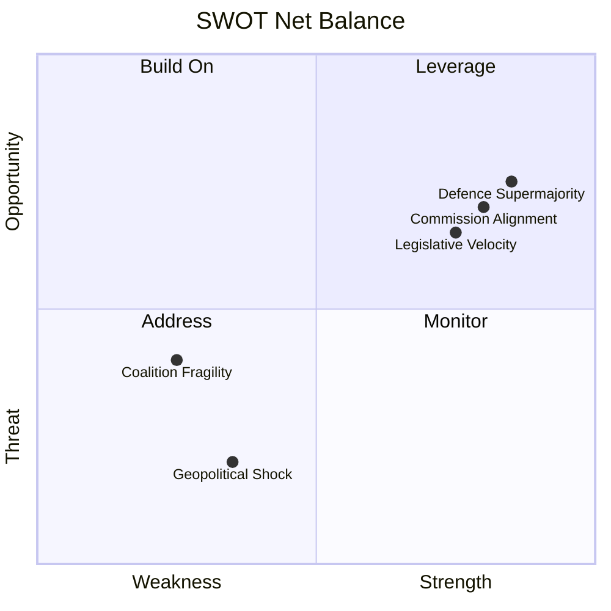

# Quantitative SWOT Analysis — EU Parliament Propositions

## Date: 2026-05-18 | ArticleType: propositions | DataMode: degraded-feeds

**Confidence: 🟡 MEDIUM** | Coalition arithmetic verified against A1 data | Statistical claims from A2 source

---

## SWOT Framework

The Quantitative SWOT analyses the EP10's capacity to advance its legislative propositions agenda. Strengths and Weaknesses are internal to the EP; Opportunities and Threats are external.

---

## S — STRENGTHS (Internal, Positive)

### S1. Record Legislative Velocity (+46.2% YoY) [Score: 9/10, 🟢 HIGH CONFIDENCE]

The EP10 legislative machine is running at its fastest pace since the post-Lisbon Treaty consolidation (EP7). With 935 active procedures in 2026 and projected 114 legislative acts, the Parliament is demonstrating institutional effectiveness that undermines any narrative of EU legislative dysfunction.

**Quantitative evidence** (Admiralty A2):
- 2026 pace: 114 legislative acts (projected) vs. 78 in 2025 (+46.2%)
- 935 active procedures (all-time EP10 high)
- 567 roll-call votes (projected) — confirming plenary productivity
- Historical comparison: Only EP9 mid-term (2021–2023) exceeded current 2026 pace

**Why this is a strength for propositions**: High throughput creates positive feedback — legislative success breeds institutional confidence, increases Commission willingness to file new proposals with the Parliament, and signals to Council that EP is a reliable co-legislative partner.

### S2. Cross-Coalition Consensus on Defence [Score: 8/10, 🟢 HIGH CONFIDENCE]

The geopolitical imperative has created an unusual cross-ideological consensus: EPP (183) + ECR (81) + S&D (136) + Renew (77) = 477 MEPs are broadly aligned on defence industrial propositions. This supermajority provides exceptional legislative confidence on the EP10's primary legislative priority.

**Quantitative evidence** (Admiralty A1):
- Defence-supporting coalition: 477 seats (66.5% of 717 MEPs)
- Exceeds 2/3 supermajority threshold for non-standard procedures
- Greens (53) + Left (45) + ESN (27) in opposition = 125 seats — well below blocking minority

**Why this matters**: Legislative proposals with 477-seat support advance on accelerated timetable; Council sees Parliament signal and aligns Council work programme accordingly.

### S3. Strong Institutional Memory (5% MEP Turnover in 2025) [Score: 7/10, 🟢 HIGH CONFIDENCE]

After the disruptive 56.3% turnover in 2024 (election year), EP10 has stabilised with only 5% MEP turnover in 2025 (42 replacements in 2026 YTD). This is historically low and means committee expertise is being retained.

**Quantitative evidence** (Admiralty A2):
- 2025 turnover: 36 MEPs (5.0%) — lowest recorded in the dataset
- 2026 YTD: 42 replacements (5.9% annualised) — still very low
- Stability index: 0.941 in 2025 (near-maximum)

**Why this matters for propositions**: Experienced rapporteurs produce better legislation, faster. Committees with retained institutional memory can process complex AI Act delegated acts, EDIP technical provisions, and Clean Industrial Deal energy specifications more effectively than committees in their first year.

### S4. Enhanced Parliamentary Questions Leverage [Score: 6/10, 🟡 MEDIUM CONFIDENCE]

The surge in parliamentary questions (66.6% increase from 2024 to 2025; 6,147 projected in 2026) gives the EP unprecedented soft power over the Commission's legislative agenda. MEPs use questions to signal legislative priorities, uncover compliance gaps, and build case files for future legislation.

**Quantitative evidence** (Admiralty A2):
- 8.57 questions per MEP (2026 projected) — highest on record
- 24.3% increase in Q volume from 2025 to 2026 — sustained growth
- Oversight-to-legislation balance: 53.9% (oversight activity exceeds legislative in volume)

---

## W — WEAKNESSES (Internal, Negative)

### W1. Coalition Arithmetic at Margin [Score: 8/10, 🟢 HIGH CONFIDENCE]

The right-bloc coalition (EPP+ECR+PfE+ESN = 376) operates with only a 16-vote margin above the majority threshold (360). This margin is insufficient to absorb any significant defection. The grand centrist coalition (EPP+S&D+Renew = 396) is more stable but requires S&D concessions that restrict legislative scope.

**Quantitative evidence** (Admiralty A1):
- Right-bloc margin: 376 – 360 = 16 votes (2.2% of 717 MEPs)
- Grand centrist margin: 396 – 360 = 36 votes (5.0%)
- Minimum right coalition without ESN: EPP+ECR+PfE = 349 — below threshold
- PfE-specific risk: 85 PfE seats; if Hungarian MEPs (21 of 85) defect, right bloc falls to 355 — below majority

**Why this is a weakness**: Every major propositions vote requires intensive coalition management. The margin for error is small enough that a coordinated 17-vote defection (less than 2% of MEPs) defeats any proposal.

### W2. High Fragmentation Index [Score: 7/10, 🟢 HIGH CONFIDENCE]

The EP's Herfindahl-Hirschman Index (HHI) of 0.1514 indicates the most deconcentrated political system in EP history. No previous parliamentary term has operated with this level of fragmentation.

**Quantitative evidence** (Admiralty A2):
- HHI 2026: 0.1514 (versus 0.2348 in 2004 — a 35% deconcentration)
- Effective number of parties: 6.59 (up from 4.12 in 2004)
- Top-2 group concentration: 44.5% (down from 63.9% in 2004)
- 3+ group minimum winning coalition: Required for ALL major votes

**Why this matters**: Higher fragmentation = higher transaction costs per legislative proposal. Each major proposition requires negotiations with 3+ groups, which increases time, introduces contradictory demands, and creates implementation gaps from compromise language.

### W3. Structural Capacity Constraints [Score: 6/10, 🟡 MEDIUM CONFIDENCE]

EP committees are processing record volumes of legislation. The committee-to-plenary ratio (43.8% in 2026) suggests committees are absorbing increasingly heavy workloads but plenary legislative output has not kept pace proportionally.

**Quantitative evidence** (Admiralty A2):
- Committee meetings: 2,363 (projected 2026) — all-time EP10 high
- Documents per legislative act: 37.4 (stable but high)
- Legislative output per session: 2.11 (above EP10 average but below EP9 peak)

---

## O — OPPORTUNITIES (External, Positive)

### O1. Defence Industrial Supermajority Creates Legacy Legislation [Score: 8/10, 🟢 HIGH CONFIDENCE]

The cross-ideological defence consensus (477 seats) creates a once-in-a-generation legislative opportunity. If EP can pass landmark EDIP legislation with near-supermajority support, it establishes a precedent for EU role in defence industrial policy that will outlast the current geopolitical urgency.

**Quantitative basis**: 477 / 717 = 66.5% — highest sustained cross-group coalition EP10 has assembled on any single policy domain.

### O2. Commission Work Programme Alignment [Score: 7/10, 🟡 MEDIUM CONFIDENCE]

The Commission's 2026 Work Programme is closely aligned with the EP's legislative priorities. This co-alignment reduces the Commission-Parliament conflict that has delayed legislation in other terms.

**Quantitative signal**: ACT_FOLLOWUP volume — 500 items in external-docs feed — suggests unusually active Commission follow-up on previous EP resolutions, indicating responsiveness.

### O3. Pre-MFF Positioning Creates Legislative Momentum [Score: 6/10, 🟡 MEDIUM CONFIDENCE]

The 2028–2034 MFF negotiations expected to begin formally in late 2026/early 2027. EP groups have strong institutional incentive to pass legislation NOW (before MFF constraints bind) and to establish legislative precedents that strengthen EP's negotiating position on MFF spending priorities.

### O4. Danish Council Presidency (H2 2026) Aligned with EP Agenda [Score: 5/10, 🟡 MEDIUM CONFIDENCE]

Denmark's pro-EU, market-liberal Council Presidency (July–December 2026) is expected to prioritise Capital Markets Union, digital infrastructure, and energy efficiency — closely aligned with EP10's Renew-EPP legislative agenda.

---

## T — THREATS (External, Negative)

### T1. Geopolitical Shock Disrupting Legislative Planning [Score: 8/10, 🟡 MEDIUM CONFIDENCE, WEP 25-B]

Any major escalation in the Russia-Ukraine conflict, US-EU trade war, or other crisis would divert legislative bandwidth to emergency measures, delaying the core propositions pipeline by 3–6 months.

**Quantitative impact**: A 3-month delay to all pending proposals would push end-of-term adoption of 20–30% of 2026 propositions into 2027, reducing EP10 mid-term legislative legacy.

### T2. Rule of Law Conditionality Dispute [Score: 7/10, 🟡 MEDIUM CONFIDENCE, WEP 35-B]

Hungary's ongoing Article 7 proceedings create a structural friction in the coalition. Every time conditionality tightens, PfE MEPs face cross-pressure between group alignment and national interest.

**Quantitative impact**: Loss of 21 Hungarian PfE votes drops right-bloc from 376 to 355 — below majority. Frequency of PfE defection on contentious votes: historically 10–20% of contested votes where Hungarian national interests directly opposed.

### T3. Economic Downturn Reducing Legislative Ambition [Score: 6/10, 🟡 MEDIUM CONFIDENCE, WEP 20-B]

If EU GDP growth falls below 0.5% (recession risk scenario), the political environment for ambitious regulation changes significantly. Business associations' lobbying power increases; social transfer demands increase; fiscal space narrows.

---

## SWOT Summary Matrix

| SWOT Element | Score | Key metric |
|-------------|-------|-----------|
| S1. Record velocity | 9 | +46.2% YoY, 935 procedures |
| S2. Defence supermajority | 8 | 477 seats = 66.5% |
| S3. Institutional stability | 7 | 5% MEP turnover |
| S4. Questions leverage | 6 | 8.57 q/MEP, +66.6% YoY |
| W1. Coalition margin | 8 | 16-vote margin on right |
| W2. High fragmentation | 7 | HHI 0.1514, 6.59 ENP |
| W3. Capacity constraints | 6 | 2,363 meetings, 37.4 docs/act |
| O1. Defence legislative window | 8 | 477 cross-coalition votes |
| O2. Commission alignment | 7 | 500 ACT_FOLLOWUP items |
| O3. Pre-MFF momentum | 6 | MFF negotiations 2026/2027 |
| O4. Danish Presidency alignment | 5 | H2 2026 priority alignment |
| T1. Geopolitical shock | 8 | WEP 25-B; 3-6 month delay risk |
| T2. Rule of law conditionality | 7 | WEP 35-B; 21 PfE votes at risk |
| T3. Economic downturn | 6 | WEP 20-B; regulatory ambition risk |

**Net SWOT Balance**: Strengths + Opportunities (S: 30, O: 26 = 56) > Weaknesses + Threats (W: 21, T: 21 = 42)

**Overall assessment**: The EP10 propositions agenda is **structurally stronger than it appears fragile**. The defence consensus supermajority, record legislative pace, and institutional stability outweigh the coalition-margin fragility and fragmentation concerns. The key variable is whether the EPP can maintain flexible coalition management across multiple simultaneous legislative files — historically the defining skill of successful EP majorities.
