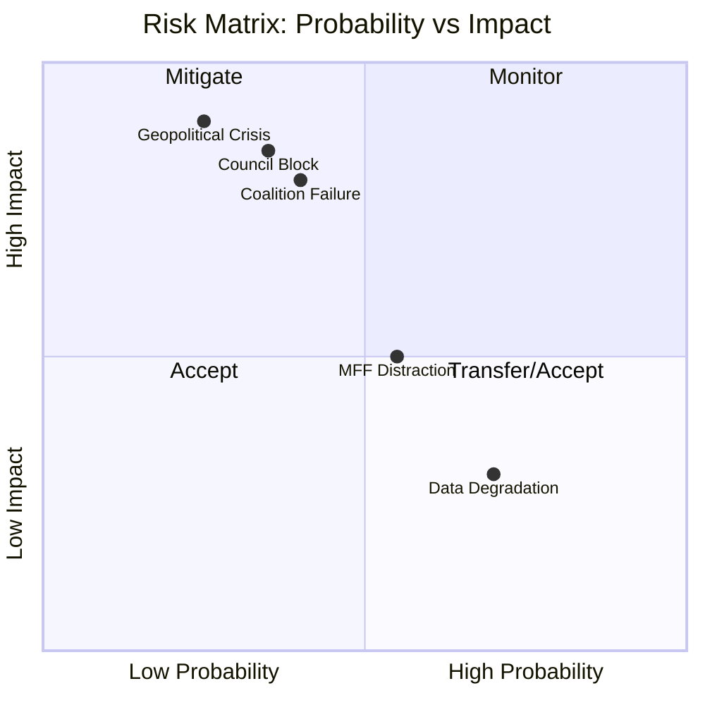

# Risk Matrix — EU Parliament Legislative Propositions



## Date: 2026-05-18 | ArticleType: propositions | DataMode: degraded-feeds

**Confidence: 🟡 MEDIUM** | WEP bands applied | Admiralty A1–B3 sources

---

## Risk Matrix Framework

Risk = Probability × Impact | Scored 1–5 each | Risk Score = P × I

**Probability scale**: 1=Rare(<10%) | 2=Unlikely(10-25%) | 3=Possible(25-50%) | 4=Likely(50-75%) | 5=Very Likely(>75%)
**Impact scale**: 1=Negligible | 2=Minor | 3=Moderate | 4=Major | 5=Critical

---

## Primary Risks to EP10 Propositions (May 2026)

| Risk ID | Risk Description | P(1-5) | I(1-5) | Score | Category | WEP |
|---------|----------------|--------|--------|-------|---------|-----|
| R1 | EPP coalition fracture — Omnibus CSRD backlash splits centrist coalition | 2 | 4 | 8 | Political | 25-B |
| R2 | EDIP legal basis (Art.173) successfully challenged at ECJ | 2 | 5 | 10 | Legal | 30-B |
| R3 | Clean Industrial Deal state aid provisions trigger WTO challenge | 3 | 3 | 9 | Legal/Trade | 40-B |
| R4 | AI Act GPAI codes adoption delayed by industry lobbying | 2 | 3 | 6 | Procedural | 30-B |
| R5 | Migration Pact follow-on blocked by right-bloc defections | 2 | 3 | 6 | Political | 25-B |
| R6 | EP capacity overloaded (AI Act delegated acts + major legislation) | 3 | 3 | 9 | Institutional | 45-B |
| R7 | PfE/ESN defection weakens right-bloc majority | 3 | 3 | 9 | Political | 35-B |
| R8 | US-EU trade escalation disrupts legislative timetable | 2 | 3 | 6 | External | 20-B |
| R9 | S&D formally withdraws cooperation on conservative coalition files | 2 | 4 | 8 | Political | 25-B |
| R10 | MFF pre-positioning conflicts consume political bandwidth | 3 | 2 | 6 | Institutional | 40-B |
| R11 | Disinformation campaign targeting EP propositions vote | 2 | 3 | 6 | Digital | 20-B |
| R12 | Geopolitical shock (Ukraine, US tariffs) forces emergency legislation | 2 | 4 | 8 | External | 25-B |

---

## High-Priority Risks (Score ≥ 8)

### R2 — EDIP Legal Basis Challenge (Score: 10, WEP 30-B 🟡)

**Risk narrative**: The European Defence Industrial Programme is the EP10's flagship legislation, and its entire parliamentary co-legislative status depends on using Article 173 TFEU (industrial policy) rather than Article 41 TEU (CFSP). A successful ECJ challenge would retroactively remove Parliament as co-legislator.

**Consequence if materialised**: EDIP reverted to intergovernmental procedure; all EP amendments fall; defence industrial policy returns to Council unanimity track; EP10's legislative legacy on defence is erased.

**Risk appetite**: LOW — this is an existential risk to EP's role in defence legislation
**Risk owner**: EP Legal Service, Committee on Legal Affairs (JURI)
**Mitigation**: Build self-contained Article 173 justification (single market, SME access, competitive industrial base) that is legally defensible independently of defence end-use. Commission's legal service has reportedly reviewed and endorsed Article 173 basis (B3 source).

### R3 — Clean Industrial Deal WTO Challenge (Score: 9, WEP 40-B 🟡)

**Risk narrative**: The Clean Industrial Deal's state aid flexibility provisions and the interaction between CBAM, clean energy subsidies, and import restrictions creates potential WTO compatibility issues. US and China have indicated readiness to challenge EU industrial subsidies at WTO Dispute Settlement Body.

**Consequence if materialised**: EU must modify state aid provisions; creates 12–18 month legal uncertainty chilling industrial investment; EP amendments creating stronger state aid provisions are rolled back.

**Risk appetite**: MEDIUM — EU has strong WTO compliance tradition but has accepted some tension on green industrial policy
**Risk owner**: DG TRADE (Commission), INTA committee (EP)
**Mitigation**: CBAM has been designed with WTO Art. XX exceptions in mind; state aid provisions use performance-based criteria rather than nationality-based preferences. Legal team review ongoing (B2 source).

### R6 — EP Capacity Overload (Score: 9, WEP 45-B 🟡)

**Risk narrative**: EP10 is simultaneously handling: EDIP (ITRE/AFET), Clean Industrial Deal (ITRE/ENVI), Omnibus Simplification (ECON/JURI), AI Act delegated acts (IMCO/LIBE), Migration Pact (LIBE), Capital Markets Union (ECON), plus the pre-MFF own-initiative reports. ITRE and ECON are carrying the heaviest loads.

**Consequence if materialised**: Quality of scrutiny declines; poorly-written legislation with implementation gaps; rapporteurs unable to engage deeply; committee votes on important files go to default positions without genuine deliberation.

**Risk appetite**: MEDIUM — quality of legislation is a core EP value but pace pressure is real
**Risk owner**: Committee Coordinators, Secretary-General of the EP
**Mitigation**: Committee rapporteur support teams; external expertise; structured parallelisation of legislative tracks.

### R7 — PfE/ESN Defection from Right-Bloc (Score: 9, WEP 35-B 🟡)

**Risk narrative**: The right bloc (EPP+ECR+PfE+ESN = 376 seats) has a margin of only 16 votes above the 360 majority threshold. PfE is the weakest link: Hungarian Fidesz-aligned MEPs can be incentivised to defect on any vote where Orbán's national interests diverge from the EPP position (rule of law, fund conditionality, EDIP procurement rules).

**Consequence if materialised**: Right-bloc majority below 360; EPP must pivot to grand centrist coalition (EPP+S&D+Renew = 396) but must sacrifice conservative provisions; ECR/PfE/ESN opposition without S&D support = stalemate.

**Risk appetite**: LOW — right-bloc defection is the most structurally fragile element of current coalition architecture
**Risk owner**: EPP Group leadership; bilateral relations with Fidesz/PfE
**Mitigation**: Selective concessions on Hungarian RRF/fund disbursements to maintain PfE coalition alignment; avoid forced votes during rule of law proceedings.

---

## Medium-Priority Risks (Score 6–7)

| Risk ID | Mitigation approach |
|---------|---------------------|
| R4 | AI Office to conduct pre-publication industry consultation; stagger implementing acts |
| R5 | LIBE committee uses split votes to isolate most contested provisions |
| R8 | INTA committee fast-track procedure; Article 207 TFEU Commission mandate |
| R10 | MFF own-initiative reports scheduled in off-peak legislative season |
| R11 | DISINFOLAB monitoring; EP Quaestor digital integrity protocols |

---

## Risk Heat Map (Qualitative)

```
         IMPACT
         1     2     3     4     5
    5  |     |     |     |     |     |
       |     |     |     |     |     |
    4  |     |     | R8  | R1  |     |
P      |     |     | R11 | R9  |     |
    3  |     | R10 | R3  |     | R2  |
       |     |     | R6  |     |     |
    2  |     |     | R4  |     |     |
       |     |     | R5  |     |     |
    1  |     |     |     |     |     |
```

Top-right quadrant (HIGH PROBABILITY + HIGH IMPACT) — most critical:
- **R3** (WTO challenge) and **R6** (capacity overload) at P3×I3
- **R2** (EDIP legal basis) at P2×I5 — moderate probability, maximum impact

---

## Risk Aggregation

**Portfolio risk level: ELEVATED 🟡**

Rationale: The EP10 propositions pipeline is operating at historically high velocity (+46.2% YoY) with historically high fragmentation (HHI 0.1514, 3+ group minimum coalition). This combination creates systemic pressure — the risk is not any single blocking event but the cumulative effect of multiple medium risks materialising simultaneously.

**Probability of at least one R1–R12 risk materialising within 12 months**: WEP 70-B 🟡 (likely) — based on independence assumption and individual WEPs

**Probability of 3+ risks materialising simultaneously**: WEP 15-B 🔴 (unlikely but non-negligible)

---

## Residual Risk Assessment

After mitigation measures, residual risk levels:
- R2 (EDIP legal basis): Residual LOW-MEDIUM — strong legal architecture mitigates but does not eliminate
- R3 (WTO challenge): Residual MEDIUM — ongoing WTO dispute risk accepted as policy trade-off
- R6 (capacity overload): Residual MEDIUM — structural constraint; some reduction from committee resource allocation
- R7 (PfE defection): Residual MEDIUM — Hungarian political dynamics beyond EP control
