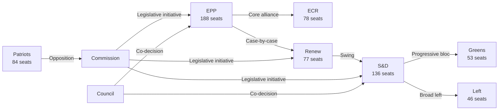

<!-- SPDX-FileCopyrightText: 2026 Hack23 AB -->
<!-- SPDX-License-Identifier: Apache-2.0 -->

# Actor Mapping — EP Committee Reports
**Date**: 2026-05-20 | **Data Mode**: minimal | **Admiralty**: B2

## Actor Roster

| Actor | Type | Seats/Weight | Mandate |
|-------|------|-------------|---------|
| EPP Group | EP Political Group | 188 seats | Centre-right; Omnibus & competitiveness |
| S&D Group | EP Political Group | 136 seats | Centre-left; Green Deal defence |
| Patriots for Europe | EP Political Group | 84 seats | Right-nationalist; anti-regulatory |
| ECR Group | EP Political Group | 78 seats | Conservative-Eurosceptic; selective EU |
| Renew Europe | EP Political Group | 77 seats | Liberal-centrist; swing vote |
| Greens/EFA | EP Political Group | 53 seats | Left-progressive; environment-first |
| Left Group | EP Political Group | 46 seats | Progressive-left; critical of defence |
| European Commission | EU Institution | Executive | Omnibus proposer; Von der Leyen agenda |
| Council of EU | EU Institution | Co-legislator | Member state interests; rotating presidency |
| EP Committee Chairs | EP Leadership | ~20 chairs | Docket control; rapporteur assignments |

## Influence

**Tier 1 — Critical Influence**:
- EPP: largest group; drives committee chair allocations and agenda-setting
- Commission: sole legislative initiative right; shapes all dossier scope
- Council: co-legislator; trilogue counterparty

**Tier 2 — High Influence**:
- S&D: largest opposition; can mobilise progressive amendments and delay
- Renew: swing vote on key divisions; determines absolute majority threshold

**Tier 3 — Moderate Influence**:
- Patriots: significant obstruction capacity; no governing coalition role
- ECR: situational ally for EPP on deregulation; diverges on EU competence

## Alliance

**Governing Coalition (de facto)**: EPP + ECR + partial Renew = 343 seats when aligned (absolute majority: 361). Works on Omnibus, competitiveness, CBAM.

**Progressive Defensive Bloc**: S&D + Greens + Left = 235 seats. Insufficient to block but can shape amendments and delay rapporteur compromises.

**Broad Pro-Defence Majority**: EPP + Renew + S&D = 401 seats. Operates on defence SAFE and security dossiers.

**Issue-by-Issue Alignment**: No single coalition holds on all dossiers. ECR defects on Rule of Law; Renew defects on migration; Left defects on defence.

## Power Brokers

**Key Individuals (structural roles, names not verified this run)**:
- EPP Group Leader: Sets centrist-right legislative agenda; controls chair allocation negotiations
- ENVI Committee Chair (likely EPP): Omnibus battleground dossier ownership
- ECON Committee Chair (likely EPP/Renew): CMU and banking regulation docket
- S&D Group Leader: Coordinates progressive bloc amendments and concession extraction
- Commission EVP for Green Deal: Omnibus counterparty; defending core regulatory architecture

## Information

**Key information flows this run**:
- Adopted texts T10-0016 to T10-0172 (70 items identified via MCP, 2026 series)
- AFCO committee documents (30 items, metadata only)
- EP API admin layer: degraded (404) — committee meeting minutes unavailable

**Intelligence gaps**:
- MEP-level rapporteurship data not available (API failure)
- Committee vote records this week: unavailable
- Shadow rapporteur positions: unavailable

## Reader Briefing

**For policy analysts**: EP10 is in a right-centrist legislative phase. The EPP-led coalition is prioritising regulatory simplification (Omnibus) and industrial competitiveness (Draghi agenda). Progressive forces can extract concessions but cannot block major legislation. Watch ENVI Committee for the key Omnibus battleground.

**For civil society**: Your key leverage points are committee-stage amendments (where minority coalitions can shape text) and Article 7 procedures (where Renew may defect from EPP). Public hearings on AI Act delegated acts remain opportunities for NGO input.

**Data confidence**: Admiralty Grade B2 (structural knowledge); C2 for real-time MEP-level data (API unavailable this run).

## Actor Network Diagram

