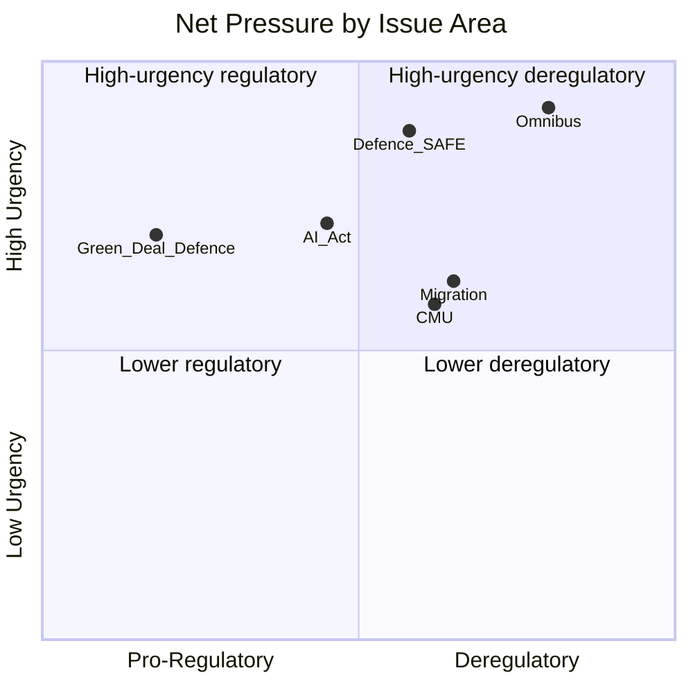

<!-- SPDX-FileCopyrightText: 2026 Hack23 AB -->
<!-- SPDX-License-Identifier: Apache-2.0 -->

# Forces Analysis — EP Committee Reports
**Date**: 2026-05-20 | **Data Mode**: minimal | **Admiralty**: B2

## Issue Frame

The EP committee system in May 2026 is navigating a fundamental tension between the **deregulatory/competitiveness agenda** (Omnibus Package, Draghi Report) and the **regulatory preservation coalition** (Green Deal defenders, civil society). This tension plays out simultaneously across ENVI, ECON, ITRE, AGRI, and JURI committees — creating an unprecedented multi-front legislative battle with limited bandwidth for all involved actors.

The secondary issue frame is **defence integration**: the SAFE instrument's €150 billion commitment creates cross-cutting pressure on fiscal frameworks, industrial policy, and foreign affairs committees while consuming significant political capital across all major groups.

## Driving Forces

| Force | Source | Strength | Time Horizon |
|-------|--------|----------|--------------|
| Omnibus regulatory simplification mandate | Commission + EPP | 🔴 Very Strong | 2026–2027 |
| Competitiveness deficit vs. US/China | External competition | 🔴 Very Strong | Ongoing |
| Defence spending integration (SAFE) | Geopolitical pressure | 🔴 Strong | 2026 |
| AI Act implementation pressure | Tech sector + Commission | 🟠 Strong | 2026–2028 |
| Climate target backlash (post-Green Deal) | Right bloc + some industry | 🟡 Moderate | 2026 |
| Migration policy hardening | Right-wing coalition | 🟡 Moderate | Ongoing |
| Anti-dumping demands (EVs, solar) | European industry | 🟡 Moderate | 2026–2027 |

## Restraining Forces

| Force | Source | Strength | Countervailing |
|-------|--------|----------|---------------|
| Progressive coalition defence of Green Deal | S&D + Greens + Left | 🟡 Moderate | Committee-stage amendments |
| Civil society legal challenges | NGOs, academic networks | 🟡 Moderate | Court of Justice referrals |
| Council heterogeneity | Nordic/Southern splits | 🟡 Moderate | Slows trilogue |
| Fundamental Rights Charter constraints | Legal Services, CJEU | 🟢 Background | AI Act, migration |
| EP small-group procedural rights | ESN, Left minority | 🟢 Lower | Filibuster potential |

## Net Pressure

**Net vector**: Strongly deregulatory-competitiveness in 2026. The Omnibus Package represents the dominant force vector, outweighing the progressive restraining coalition by approximately 2:1 in political seat weight. However:
- Net pressure on SPECIFIC dossiers varies: Greens can win narrow committee votes on discrete amendments
- Defence net pressure: near-unanimous; no significant counterforce

**Resultant**: Expect net legislative output in 2026 to favour regulatory simplification, industrial competitiveness, and defence capacity-building. Climate ambition targets will be defended in form but relaxed in implementation timelines.

## Intervention Points

**High-leverage intervention points for analysts and stakeholders**:

1. **Rapporteur compromise negotiations** (ENVI Omnibus dossier): The rapporteur's draft report is the key intervention window. Shadow rapporteur positions from S&D/Greens can shape the text before committee vote.

2. **Trilogue mandate adoption** (multiple dossiers): EP's negotiating position adopted in plenary is binding on Parliament's trilogists. Last opportunity for majority-building before Council negotiation locks text.

3. **Committee hearing agendas** (AI Act delegated acts): Public hearings provide civil society input opportunity; expert witnesses can shift rapporteur positions.

4. **Group coordinator meetings** (all committees): Unofficial arena where actual compromise positions are negotiated. Key leverage point for lobbying within EP.

5. **Commission review clauses** (CSRD, CBAM): Several Omnibus-affected directives include scheduled Commission reviews. These create future intervention points even after initial votes.

## Reader Briefing

The dominant legislative force in EP10 May 2026 is the deregulatory-competitiveness nexus. Analysts should track ENVI and ECON committee schedules for Omnibus-related votes, AFET/BUDG for defence SAFE progress, and LIBE for AI Act delegated act hearings. The progressive restraining forces remain active but are operating in a defensive posture — seeking to preserve core frameworks while conceding implementation flexibility.
