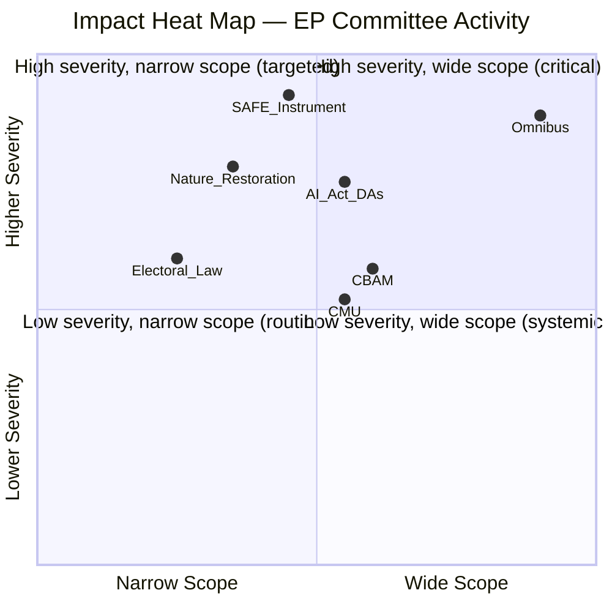

<!-- SPDX-FileCopyrightText: 2026 Hack23 AB -->
<!-- SPDX-License-Identifier: Apache-2.0 -->

# Impact Matrix — EP Committee Reports
**Date**: 2026-05-20 | **Data Mode**: minimal | **Admiralty**: B2

## Event List

Current active legislative events driving committee work (structural knowledge + adopted texts proxy):

1. **Omnibus Package Committee Phase** — ENVI, ECON, AGRI, JURI parallel work on consolidating ~60 EU directives
2. **SAFE Instrument First Reading** — AFET, BUDG, ITRE; €150bn defence allocation
3. **AI Act Delegated Acts** — LIBE, ITRE; technical governance of high-risk AI systems
4. **Nature Restoration Law Review** — ENVI; Commission implementation assessment
5. **CBAM Phase-In Monitoring** — INTA, ENVI; carbon border adjustment mechanism reporting
6. **Electoral Law Reform** — AFCO; harmonised minimum standards for EP elections
7. **CMU Next Phase** — ECON; Capital Markets Union deepening, retail investment
8. **Plenary Week 13–20 May** — Multiple committee reports presented to plenary (specific items unknown due to API outage)

## Stakeholder

| Event | Primary Stakeholders | Secondary Stakeholders | NGO/Civil Society |
|-------|---------------------|----------------------|--------------------|
| Omnibus Package | SMEs, listed companies, ESG data providers | Green finance industry | Environmental NGOs, trade unions |
| SAFE Instrument | Defence contractors, NATO allies | Dual-use tech firms | Peace NGOs, fiscal watchdogs |
| AI Act delegated acts | Big Tech, AI startups | Public services users | Digital rights groups (EDRi) |
| Nature Restoration | Farmers, landowners, local authorities | Tourism, biodiversity research | BirdLife, WWF |
| CBAM | Steel, aluminium, chemicals, fertilizers | Non-EU trading partners | Carbon market observers |
| Electoral Law | Political parties, national election bodies | Citizens, media | Electoral monitoring NGOs |
| CMU | Banks, pension funds, retail investors | Fintech, exchanges | Consumer protection orgs |

## Impact Matrix

| Legislation | Economic | Social | Environmental | Governance | Reversibility |
|-------------|----------|--------|--------------|------------|--------------|
| Omnibus | 🔴 High — reduces compliance costs | 🟡 Mixed — job protection vs. ESG rollback | 🔴 High — weakens sustainability reporting | 🟡 Moderate — less corporate accountability | Low — legislative change required to reverse |
| SAFE | 🔴 High — €150bn fiscal impact | 🟡 Moderate — defence employment | 🟢 Lower — limited direct environmental impact | 🔴 High — EU defence integration step-change | Medium — programme can be scaled back |
| AI Act DAs | 🟠 Significant — regulatory certainty for AI sector | 🟠 Significant — high-risk AI oversight | 🟢 Lower | 🔴 High — precedent-setting governance | Medium — DAs can be revised |
| Nature Restoration | 🟡 Moderate — land use restrictions | 🟡 Moderate — rural community impact | 🔴 High — biodiversity targets | 🟡 Moderate | Very Low — Treaty-linked targets |
| CBAM | 🟡 Moderate — trade flows | 🟢 Lower | 🟠 Significant — emission-price signalling | 🟡 Moderate | Medium — phase-in can be extended |

## Heat

**Highest-impact areas (severity × breadth matrix)**:

*Omnibus is the single highest-impact item: both widest scope and very high severity.*

## Cascade

**Second-order cascade effects**:

1. **Omnibus success → Green Finance cascade**: If Omnibus substantially weakens CSRD/SFDR, EU green bond market loses reporting infrastructure. ESG rating agencies face business model disruption. May trigger Commission review of Taxonomy Regulation.

2. **SAFE adoption → Industrial policy cascade**: €150bn defence commitment triggers competition for industrial base resources. Aerospace/defence sectors expand. Civilian tech-to-defence conversion pressures IP frameworks.

3. **AI Act DAs → Regulatory arbitrage**: If EU AI governance is more stringent than UK/US/Asia, AI startups may relocate. Creates pressure for equivalence agreements and international regulatory coordination.

4. **Nature Restoration rollback → CBD cascade**: If EU implementation slips, global biodiversity targets (Kunming-Montreal Agreement) face credibility risks. Affects EU's international negotiating position on nature.

## Reader Briefing

**Assessment**: May 2026 EP committee activity is dominated by three high-cascade-risk items: the Omnibus Package (widest scope, highest reversibility risk), the SAFE defence instrument (largest fiscal commitment), and AI Act delegated acts (precedent-setting governance). Analysts should track committee vote timelines on these three tracks as the primary indicators of EP10's legislative direction.

*Admiralty Grade B2/C2. Specific event details unverified due to API outage — structural and proxy-based analysis only.*
