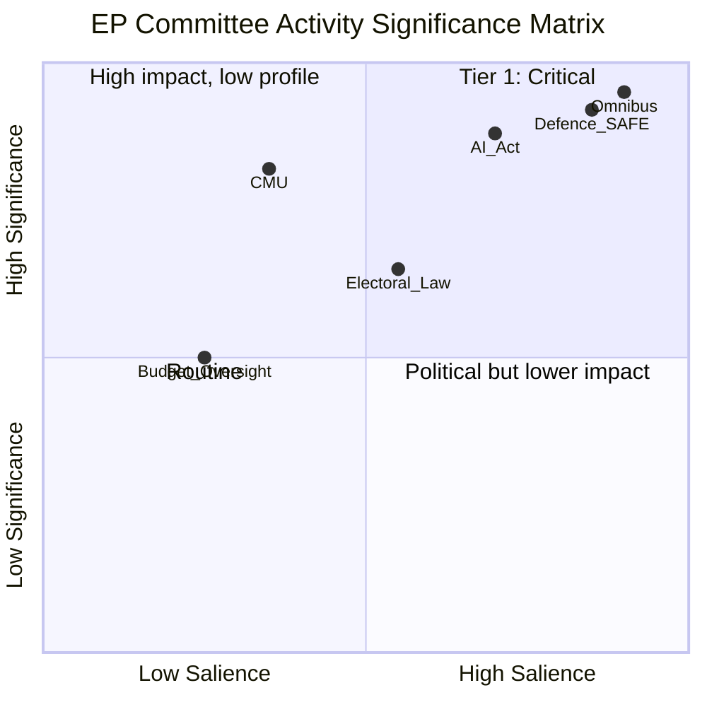

<!-- SPDX-FileCopyrightText: 2026 Hack23 AB -->
<!-- SPDX-License-Identifier: Apache-2.0 -->

# Significance Classification — EP Committee Reports
**Date**: 2026-05-20 | **Data Mode**: minimal

## Classification Framework

EP committee activities are classified on two axes: **legislative significance** (impact on EU law and policy) and **political salience** (degree of public/political attention).

## Tier 1 — High Significance, High Salience

| Activity | Committee | Classification |
|----------|-----------|---------------|
| Omnibus Package negotiations | ENVI, ECON, AGRI | ⭐⭐⭐⭐⭐ Treaty-level impact |
| Defence SAFE instrument | AFET, BUDG, ITRE | ⭐⭐⭐⭐⭐ Historic EU defence step |
| AI Act delegated acts | LIBE, ITRE | ⭐⭐⭐⭐ Implementation-defining |

## Tier 2 — High Significance, Lower Salience

| Activity | Committee | Classification |
|----------|-----------|---------------|
| CMU (Capital Markets Union) reform | ECON | ⭐⭐⭐⭐ Markets infrastructure |
| Digital Services Act review | IMCO, LIBE | ⭐⭐⭐ Platform accountability |
| Electoral law revision | AFCO | ⭐⭐⭐ Democratic structure |

## Tier 3 — Standard Legislative Activity

- Budget implementation oversight
- Agency discharge procedures
- Committee opinions on Commission proposals
- Own-initiative reports (INI/INL)

## Significance Summary

