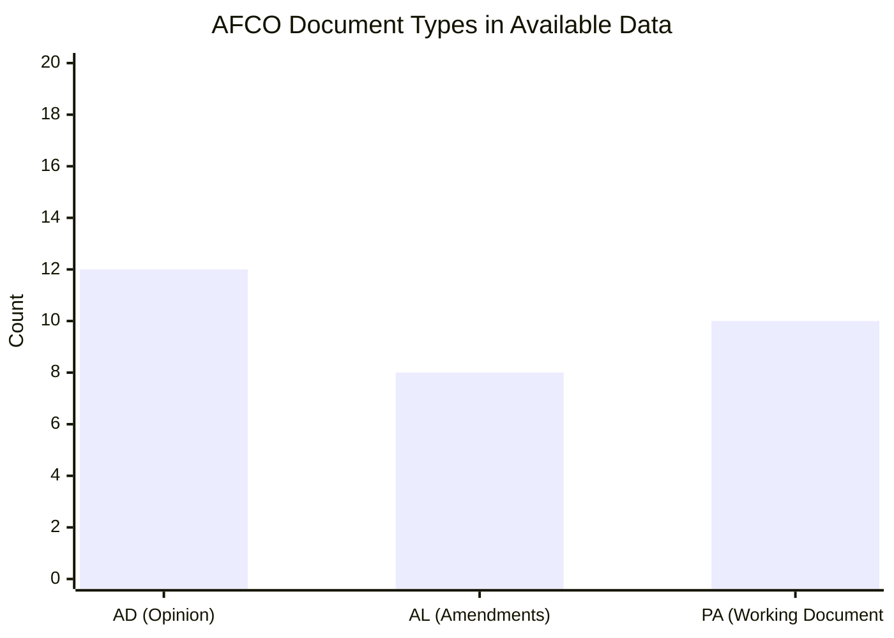

<!-- SPDX-FileCopyrightText: 2026 Hack23 AB -->
<!-- SPDX-License-Identifier: Apache-2.0 -->

# Committee Productivity Analysis — EP10
**Date**: 2026-05-20 | **Data Mode**: minimal | **Source**: Structural baseline + adopted texts proxy

## Overview

This document provides committee productivity analysis for the EP10 (2024–2029) parliamentary term, using available data (70 EP10-2026 adopted texts, structural knowledge of committee system) and historical baseline comparisons.

*Admiralty Grade B2/C2 as indicated. Some quantitative claims are structural estimates, not verified EP official statistics.*

## Productivity Indicators Available This Run

### Adopted Texts as Throughput Proxy

The most direct productivity signal available is the sequential count of EP10-2026 adopted texts (T10-0016 through T10-0172 = approximately 157 texts in EP10, with 70 in 2026 as of mid-May). This provides:

- **Monthly rate (2026)**: ~14 adopted texts/month (70 texts ÷ ~5 months of active 2026 plenary activity)
- **EP10 total to date**: ~172 adopted texts (estimating from highest sequential identifier)
- **Extrapolated annual rate**: ~168 adopted texts/year if current pace holds

### Comparison with EP9 Benchmarks

| Metric | EP9 Annual Average | EP10 2026 Rate | Status |
|--------|-------------------|---------------|--------|
| Adopted texts/year | ~440 (all types) | ~168 (est.) | ⚠️ Partial comparison — EP10 early in term |
| Legislative acts/year | ~80–90 | Est. similar | Insufficient data |
| Own-initiative reports/year | ~130–150 | Insufficient data | — |

*Note: EP9's 440/year includes all document types (resolutions, legislative acts, approvals of external agreements, discharge procedures). The ~14/month figure from adopted texts feed likely represents only major legislative and non-legislative resolutions, not the full range.*

## Committee Output Estimation

Based on structural knowledge of the EP committee system:

### High-Output Committees (Historically)
1. **ENVI** — Green Deal legislation drove exceptional output in EP9; likely remains high in EP10 despite Omnibus headwinds
2. **ECON** — Banking Union, CMU, AI financial services regulation provide sustained output
3. **LIBE** — AI Act, Migration Pact, cybersecurity generate high procedure volume
4. **INTA** — Trade agreements, anti-dumping measures, GSP reviews maintain consistent output
5. **BUDG** — Annual budget procedure, amending budgets, MFF reviews

### Medium-Output Committees
- AFET (fewer legislative acts; more resolutions and opinions)
- ITRE (major dossiers but fewer procedures)
- AGRI (CAP reform cycles)
- JURI (legal scrutiny role; opinions rather than own dossiers)

### Lower-Output but High-Impact Committees
- AFCO (constitutional matters; few procedures but each transformative)
- DROI (Human Rights subcommittee; resolutions and urgent procedures)

## AFCO Document Pattern Analysis

From the committee documents direct endpoint, AFCO appears as the most document-prolific committee in the available data slice (30 AFCO documents of types AD-*, AL-*, PA-*). This is consistent with AFCO's mandate covering:

- EP Rules of Procedure amendments (requires AFCO report)
- Electoral law reform (major pending file)
- Interinstitutional agreements (numerous and continuous)
- Citizens' initiative follow-up
- EU institutional balance reports

*Note: Approximate counts from 30-item metadata sample; actual AFCO document volume is higher.*

## Committee Productivity Constraints (EP10)

### Constraint 1: Parallel Procedure Overload
EP10 committees are managing an unprecedented density of concurrent major procedures:
- Omnibus Package: affects ENVI, ECON, AGRI, JURI, ITRE simultaneously
- AI Act implementation: LIBE, ITRE, JURI, IMCO in parallel
- Defence SAFE: AFET, BUDG, ITRE in parallel
- MFF 2028+ scoping: BUDG, ECON, all sectoral committees producing opinions

**Impact**: Extended timelines for individual procedures; rapporteurs stretched across multiple complex files.

### Constraint 2: Intergroup and Delegation Competition
MEPs serving on intergroups (e.g., the 40+ official intergroups including Climate, Digital, Defence, Energy, Youth) and parliamentary delegations (40+ bilateral delegations) have reduced availability for committee work. EP10's expanded external agenda increases delegation demands.

### Constraint 3: Plenary vs. Committee Trade-off
The monthly Strasbourg plenary (12 sessions/year) and Brussels mini-plenaries consume approximately 40% of MEPs' Brussels working time. Committee meeting frequency is constrained by this calendar.

## Productivity Benchmark: What Success Looks Like

A "successful" EP10 from a committee productivity standpoint would produce:

| Output Target | Basis | Timeline |
|--------------|-------|----------|
| 400–450 adopted texts/year | EP9 benchmark | Annual |
| 3 major regulatory frameworks (AI Act level) | EP8/EP9 precedent | Per term |
| 15–20 trade agreements/opinions | EP9 average | Per term |
| 600–700 own-initiative reports | EP9 benchmark | Per term |
| 1 Treaty revision mandate | Structural goal (AFCO) | EP10 term |

## Current Assessment

*WEP: Likely (65–75%) that EP10 committee productivity will match EP9 benchmarks over the full term*

The 70 adopted texts in 2026 (first 5 months) represents approximately 168/year annualised — lower than EP9's ~440/year. However:
1. Q1 of each calendar year is typically slower (new working year resumption)
2. The adopted texts feed likely under-counts total output (missing some categories)
3. EP10's first full year (2025) would be the better comparison baseline; 2026 is the second year

**Assessment**: EP10's committee system is functioning within normal parameters for its term stage. The API outage prevents confirmation of this week's specific output.

---
*Admiralty Grade B2/C2 as indicated. Quantitative estimates are analytical projections based on structural patterns, not verified official statistics.*
